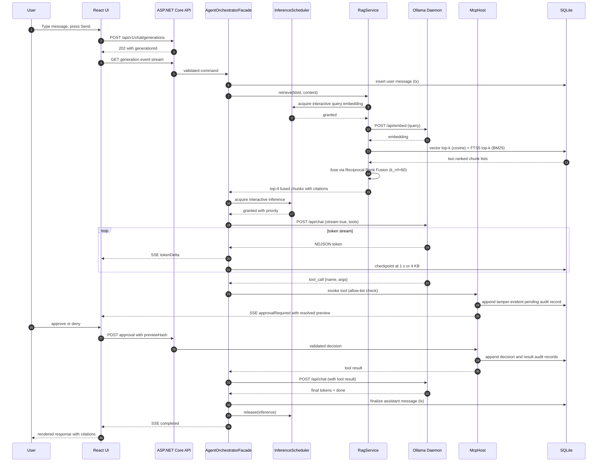
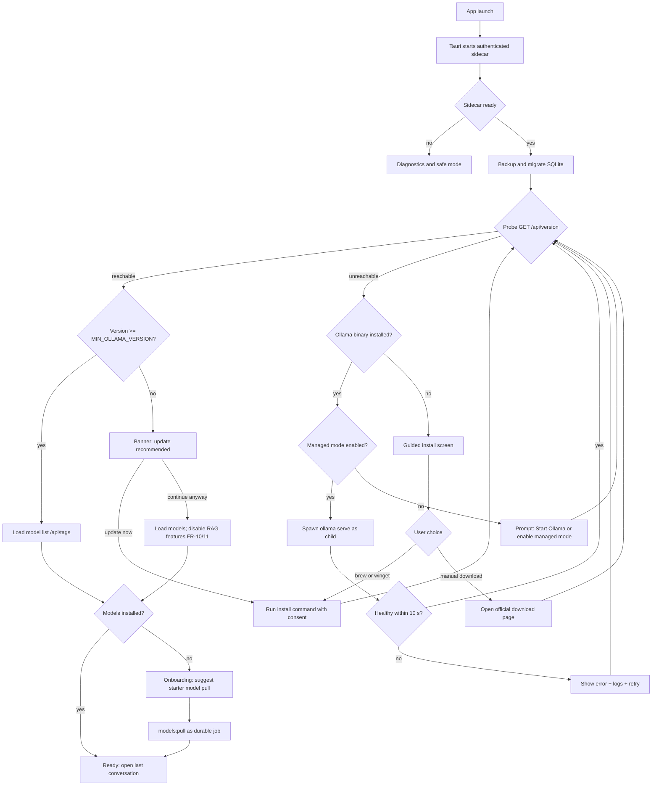
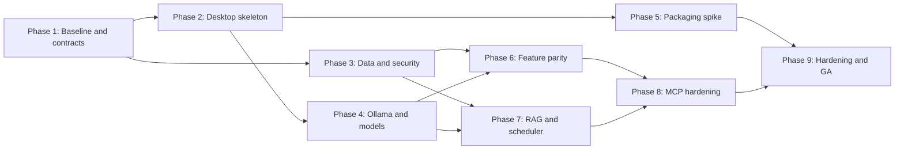

# EminentAI Desktop App Architecture — Local Ollama Runner

Author: Principal Solution Architect · Date: 2026-07-05 · Status: Draft v1.2

---

## 1. Problem statement

### 1.1 Problem
Users who run Ollama models on localhost today interact with them via terminal or ad-hoc web UIs. There is no polished, installable desktop application that (a) discovers and manages locally installed Ollama models, (b) offers the full feature set of a modern AI web app (streaming chat, history, RAG, prompt library, multi-model), and (c) installs manually on macOS and Windows laptops without an app store or fleet-management dependency.

### 1.2 Goal
Ship EminentAI as a cross-platform desktop app that uses the local Ollama daemon (`http://127.0.0.1:11434`), remains offline-capable, and preserves the existing React, ASP.NET Core, agent, connector, observability, voice, image-generation, and job-search capabilities.

### 1.3 Out of scope
Cloud-hosted inference, multi-user server deployment, mobile, Linux packaging (deferred), app-store distribution (manual installers only per requirement).

---

## 2. Assumptions

1. **A1 — Ollama pre-installed or installable:** Ollama may or may not be present; the app must detect it and guide/perform installation. It does not bundle Ollama binaries (license + size trade-off).
2. **A2 — Single user, single machine:** One local user per install; no auth federation. Concurrency is bounded by one laptop's CPU/GPU/RAM.
3. **A3 — Hardware:** Target machines have 8–64 GB RAM; models 1B–70B (quantized). Model memory dominates; app shell overhead is secondary.
4. **A4 — Mostly offline:** Core features work with zero network. Network is needed only for model pulls, plugin/connector installs, and remote MCP servers.
5. **A5 — Manual install:** Distribution is a signed `.dmg` (macOS) and `.exe`/`.msi` (Windows) downloaded and installed by the user. Auto-update is optional and user-controlled.
6. **A6 — Existing investment:** React 19, ASP.NET Core, Clean Architecture, EF Core/SQLite, SSE/SignalR, and Ollama integrations already exist. Reuse is preferred over reimplementation.
7. **A7 — Scale definition:** "Scalable" here means: many conversations (100k+ messages), large RAG corpora (10k+ documents), many models, and an extensible plugin surface — not horizontal server scaling.

---

## 3. Functional requirements

### 3.1 Core chat
- FR-1: Streaming chat with any installed Ollama model (token-by-token, cancellable).
- FR-2: Multi-conversation management: create, rename, pin, archive, delete, full-text search.
- FR-3: Per-conversation system prompt, temperature, context length, and model override.
- FR-4: Regenerate, edit-and-resend, branch a conversation from any message.
- FR-5: Markdown + code rendering, copy-as, export conversation (MD/JSON/PDF).

### 3.2 Model management
- FR-6: List installed models with size, family, quantization, modified date (`/api/tags`).
- FR-7: Pull/delete models from the Ollama registry with progress and resume (`/api/pull`, `/api/delete`).
- FR-8: Show live model status: loaded/unloaded, VRAM/RAM usage (`/api/ps`).
- FR-9: Create custom models from Modelfiles (system prompt + params baked in).

### 3.3 Knowledge / RAG
- FR-10: Attach files (PDF, DOCX, MD, TXT, code) to a conversation or a persistent "Knowledge Base".
- FR-11: Local chunking + embedding (via Ollama embedding models, e.g. `nomic-embed-text`) and vector search; retrieved chunks injected into prompt with citations.

### 3.4 Productivity
- FR-12: Prompt library (reusable templates with variables), global hotkey quick-ask window.
- FR-13: Multi-model compare mode (same prompt fanned out to N models side-by-side).

### 3.5 Settings & extensibility
- FR-14: **Plugins** — sandboxed extensions (custom renderers, tools, exporters) installed from file or URL, with permission prompts.
- FR-15: **MCP connections** — add/remove Model Context Protocol servers (stdio or SSE/HTTP); their tools are exposed to models via tool-calling.
- FR-16: **Connectors** — pre-packaged MCP-based integrations (filesystem, Git, Slack, Google Drive, Jira, browser) toggled per-conversation.
- FR-17: **Apps** — mini-app surfaces rendered by plugins (e.g., diagram viewer, table editor) inside the chat canvas.
- FR-18: General settings: theme, hotkeys, default model/params, Ollama endpoint override, data directory location, telemetry opt-in (default off), backup/restore.

### 3.6 Lifecycle & install
- FR-19: Detect Ollama; if absent, guided install (open download page or run winget/brew command with consent). Optionally start/stop `ollama serve` as a managed child process.
- FR-20: Manual installers: notarized `.dmg` for macOS (arm64 + x64), signed NSIS `.exe` and `.msi` for Windows; documented offline install steps.

---

## 4. Non-functional requirements

1. **NFR-1 Performance:** UI first paint < 2 s cold start; first streamed token latency dominated by Ollama, app overhead < 50 ms per message; 60 fps scroll on 10k-message conversations (virtualized list).
2. **NFR-2 Footprint:** Installer target < 150 MB; desktop host plus sidecar idle RSS target < 250 MB, excluding Ollama and loaded models. These are release gates measured on clean macOS arm64 and Windows x64 machines, not claims about unbuilt artifacts.
3. **NFR-3 Reliability:** No data loss on crash — all writes transactional (SQLite WAL). Chat resumes cleanly after Ollama restart.
4. **NFR-4 Offline-first:** All core paths function with the network disabled.
5. **NFR-5 Privacy:** No content leaves the machine unless the user enables a connector/remote MCP; telemetry opt-in and anonymized.
6. **NFR-6 Security:** Plugin sandboxing, IPC allow-listing, secrets in OS keychain, signed binaries.
7. **NFR-7 Portability:** Single codebase for macOS 13+ and Windows 10 22H2+; Linux-ready design.
8. **NFR-8 Maintainability:** TypeScript contracts generated from OpenAPI, existing Clean Architecture boundaries retained, and >80% unit coverage on critical application services.
9. **NFR-9 Scalability (local):** 100k+ messages, 1M vector chunks with warm-cache retrieval p95 < 200 ms on the reference corpus and hardware, and 50+ installed models. Indexing throughput and retrieval quality are measured outputs, not invented claims.
10. **NFR-10 Resource governance:** interactive inference has priority over background embedding. Under concurrent chat and ingestion, interactive queue wait p95 must remain < 500 ms and first-token latency regression caused by application queueing must remain < 10% against the chat-only baseline. A bounded queue rejects excess background work with a visible retryable status.

---

## 5. HLD (High-Level Design)

### 5.1 Architecture style
A **4-layer local architecture**: (1) a thin **Tauri 2 host** for native lifecycle, secure storage, file dialogs, notifications, updates, and sidecar supervision; (2) the existing **React SPA**; (3) the existing **ASP.NET Core sidecar** containing application and infrastructure services; and (4) external local processes such as Ollama, Whisper, and stdio MCP servers. The renderer never calls Ollama or the filesystem directly. It uses the authenticated loopback API, preserving the existing web contract and avoiding a backend rewrite.

### 5.2 Component overview

```
┌────────────────────────────── EminentAI Desktop ────────────────────────────────┐
│ Tauri host: lifecycle · sidecar supervision · keychain · native permissions    │
│                                      │                                           │
│ React SPA: existing web views and generated API client                          │
└──────────────────────────────────────┼───────────────────────────────────────────┘
                                       │ bearer-authenticated loopback HTTP/SSE
┌──────────────────────────────────────▼───────────────────────────────────────────┐
│ ASP.NET Core sidecar                                                            │
│ Chat · Plan · Agent · Smart routing · Policy · Approvals · Jobs · Observability │
│ EF Core repositories · Ollama/Whisper/MCP adapters · InferenceScheduler         │
└──────────────┬────────────────────┬────────────────────┬─────────────────────────┘
               │                    │                    │
          SQLite + files       Ollama :11434       Whisper and MCP processes
```

### 5.3 Key decision — thin Tauri host with ASP.NET Core sidecar
- **Chosen:** Tauri 2 hosts the existing React build and supervises a self-contained ASP.NET Core sidecar.
- **For:** preserves the repository's application services and EF Core persistence, keeps native-shell footprint small, and retains the browser-hosted web UI as a development surface.
- **Against:** adds a small Rust host and a sidecar startup protocol. Native code remains limited to lifecycle and OS adapters; application logic is not rewritten in Rust.
- **Validation:** record packaged size, cold start, idle RSS, and first-paint p50/p95 on clean macOS arm64 and Windows x64 machines. Generic Electron/Tauri figures are not accepted as product evidence.
- **Rejected:** an Electron main-process rewrite using `better-sqlite3` and direct Ollama calls because it duplicates the current backend and creates migration and feature-parity risk.

### 5.4 Key decision — talk to Ollama directly vs embed inference
- **Chosen: treat Ollama as an external local daemon behind a gateway.** Do not link llama.cpp into the app.
- **For:** users keep their existing models; Ollama owns GPU backends, model lifecycle, and its own updates; app stays small.
- **Against:** dependency on a process the app doesn't own — mitigated by health checks, optional supervised spawn of `ollama serve`, and guided install (FR-19).

### 5.5 Key decision — extensibility is MCP-first
Anything needing external data is expressed as an **MCP server**, not a bespoke plugin API. The bespoke plugin API is limited to UI concerns (renderers, apps, exporters). Trade-off: MCP adds process-management complexity, but buys the existing connector ecosystem and keeps the trust boundary at process level rather than in-process hooks.

### 5.6 Key decision — priority InferenceScheduler for VRAM/RAM contention
- **Risk (added post-review):** a chat request against a loaded 7B model and a concurrent RAG ingestion batch calling `nomic-embed-text` can both compete for the same GPU/RAM. Ollama may evict the chat model to serve the embedding request, producing a multi-second reload spike on the next chat turn — invisible in NFR-1 benchmarks that test each path in isolation.
- **Chosen: a scoped `InferenceScheduler` in the ASP.NET Core sidecar** (6.9) that prioritizes interactive inference over background embedding, bounds both queues, and polls `/api/ps` before admitting a heavy job.
- **For:** no extra process or IPC surface; sits directly in front of ChatService and RagService; degrades gracefully to a short queue instead of an invisible model reload.
- **Against:** adds queueing and cannot preempt an Ollama request already executing. Embedding uses batches of at most 32 chunks; no new background batch starts while interactive work waits.
- **Overload:** when the background queue reaches 100 batches, reject new ingestion with `RESOURCE_QUEUE_FULL`, persist the job as paused, and notify the user.
- **Validation:** measure queue wait, first-token regression, model reloads, OOM failures, and ingestion throughput under concurrent chat and ingestion on 8 GB, 16 GB, and 32 GB reference machines.

---

## 6. LLDs (Low-Level Designs)

### 6.1 Desktop-to-sidecar contract
- On each launch, the host creates a 256-bit session token and protected readiness pipe, then starts the sidecar on `127.0.0.1:0`.
- The sidecar returns `{port, pid, apiVersion, nonce}` through the pipe; the token is never written to disk.
- React uses versioned REST for commands, SSE for generation and job streams, and SignalR only for bidirectional voice.
- OpenAPI is the contract source; generated TypeScript types replace manually duplicated DTOs.
- The API validates bearer token, Tauri origin, request schema, size, rate, and idempotency key.

### 6.2 ChatService
- Builds the prompt: system prompt + retrieved RAG chunks (6.4) + token-budgeted conversation window.
- Calls Ollama `POST /api/chat` with `stream: true`; normalizes NDJSON into SSE events, checkpoints assistant content no more often than every second or 4 KB, and finalizes atomically.
- Tool-calling loop: if the model emits a tool call and the conversation has MCP tools enabled, ChatService dispatches to McpHost, appends the tool result as a message, and re-invokes the model (max 8 iterations, configurable).
- Cancellation: the API cancellation token closes the Ollama stream and marks the message `interrupted`.

### 6.3 ModelService
- Caches `/api/tags` and `/api/ps` (poll every 5 s while the Models screen is visible; on-demand otherwise).
- `pull` runs as a persisted job (see 8.2.9) so progress survives app restart; Ollama layer caching makes re-pull cheap.

### 6.4 RagService
- Ingestion: extract → normalize → chunk (recursive, 512 tokens, 64 overlap) → embed via Ollama `/api/embed` through `InferenceScheduler` (6.9) → store vectors in a `sqlite-vec` virtual table accessed through an infrastructure adapter.
- Query: embed the user message → top-k (k=8) cosine ANN in parallel with an FTS5 BM25 keyword search over the same chunk set.
- **Score fusion (added post-review):** cosine similarity and BM25 are on incomparable scales, so naively summing them biases toward whichever happens to have the larger numeric range. Fuse the two ranked lists with **Reciprocal Rank Fusion** — `score(chunk) = Σ 1 / (k_rrf + rank_i(chunk))` across the vector-rank and FTS-rank lists, `k_rrf = 60` (standard default) — then inject the top 4 fused chunks with `[source:filename#chunk]` markers. RRF needs no score normalization or trained reranker, which fits an offline desktop app with no training pipeline.
- **Validation:** benchmark FTS5-only, vector-only, and RRF using a versioned representative corpus. Report recall@4, MRR@10, retrieval p50/p95, indexing chunks/second, database bytes/vector, and peak RSS. No accuracy improvement is asserted before this test.
- **Trade-off:** `sqlite-vec` in the primary SQLite file minimizes infrastructure and backup complexity. At 1M chunks, or earlier if retrieval misses NFR-9 or vector maintenance blocks chat writes for > 100 ms p95, test a dedicated `vectors.db` before adopting another engine.

### 6.5 McpHost
- Registry of configured servers (8.2.7). Transports: `stdio` (spawned child with explicit env) and streamable HTTP/SSE.
- Lazy-starts stdio servers on first tool use; idle-stops after 10 min. Health: scheduled ping; exponential-backoff restart (max 3, then mark `failed`, surface in UI).
- Tool allow-list per conversation; every invocation and approval decision is logged to `audit_log`; write-capable tools require one-click user approval.
- **Clear-text approval previews (added post-review):** the approval prompt never renders a generic "Allow {tool} to run?" — it renders the fully-resolved invocation (e.g. `git commit -m "feat: added login"`, or the exact file path and byte range for a write) so the user is approving a specific action, not a capability class. Previews are built from the tool's own JSON schema plus the resolved arguments; unresolvable or templated arguments block approval until resolved.
- The audit record stores the resolved preview, canonical arguments, decision, timestamp, result code, and `HMAC-SHA256(previous_entry_hmac || canonical_entry)` using a key held in the OS credential store. This is tamper-evident, not tamper-proof against compromise of the same OS account. Audit retention defaults to 90 days and is configurable.

### 6.6 Extension boundary
- V1 reuses the existing built-in connectors and external MCP processes. Arbitrary in-process desktop plugins are out of scope until a signed bundle format, trust root, capability model, and isolation benchmark are approved.
- Optional UI contributions render only in sandboxed WebViews with a schema-validated message bridge and no direct sidecar token.
- **Trade-off:** MCP-first limits rich UI extensibility, but avoids introducing an unproven executable plugin supply chain into the first desktop release.

### 6.7 Ollama supervisor
- Startup probe: `GET /api/version` (250 ms timeout, 3 retries).
- Not installed → guided install (FR-19): detect platform → offer `brew install ollama` / `winget install Ollama.Ollama` run with consent in a visible shell, or open the official download page.
- Installed but not running → offer "managed mode": spawn `ollama serve` as a child, restart on exit with backoff, stop on app quit only if the app started it (never kill a user-started daemon).
- **Version gate (added post-review):** parse the semver from `/api/version` against a pinned `MIN_OLLAMA_VERSION` (the first release exposing `/api/embed` with batch support). Below minimum → don't fail silently on the first embed call; show a one-time "Update recommended" banner with a managed-upgrade offer (same install path as FR-19) or "continue anyway" with RAG features (FR-10/11) disabled until upgraded.

### 6.8 Packaging & manual install
- Tauri bundles the React assets and architecture-matched self-contained .NET sidecar. Targets are signed/notarized macOS `dmg` and `pkg` plus signed Windows `msi` and optional bootstrapper `exe`.
- Manual install docs: macOS — download `.dmg`, drag to Applications, first-launch right-click → Open for Gatekeeper; Windows — download `.exe`, SmartScreen "More info → Run anyway" note (EV cert builds reputation), silent flags (`/S`, `msiexec /qn`) for scripted manual installs.
- Signed auto-update metadata is supported but checking remains off by default; manual "Check for updates" is available.

### 6.9 InferenceScheduler
- A sidecar application service that both ChatService (6.2) and RagService (6.4) call before issuing `/api/chat` or `/api/embed`.
- State: a priority queue for interactive inference and a bounded FIFO queue for embedding; it reads a `/api/ps` snapshot cached for at most 2 seconds.
- Ingestion jobs (FR-10/11) are chunked into small embed batches (≤ 32 chunks) specifically so a queued chat send never waits behind an entire document's embedding run — only the current batch.
- Exposes queue depth and current holder to the Diagnostics screen (14.2) and to the status bar (14.5) as an "Indexing paused — chat active" chip, so contention is visible instead of presenting as a mysterious latency spike.
- Failure mode: scheduler failure stops new background embedding and permits one explicitly bounded interactive request. It never releases unbounded work because that can turn a recoverable scheduler fault into OOM.

---

## 7. Components and responsibilities

| # | Component | Process | Responsibility |
|---|-----------|---------|----------------|
| 7.1 | React SPA | Tauri WebView | Existing UI, generated API client, virtualized histories, stream rendering |
| 7.2 | Tauri Host | Native process | Lifecycle, native permissions, credential store, notifications, updates |
| 7.3 | SidecarSupervisor | Tauri process | Authenticated sidecar startup, readiness, crash policy, shutdown |
| 7.4 | ASP.NET Core API | Sidecar | REST/SSE/SignalR, validation, authentication, rate limiting |
| 7.5 | Application services | Sidecar | Chat, Plan, Agent, routing, approvals, jobs, RAG |
| 7.6 | Infrastructure adapters | Sidecar | Ollama, Whisper, MCP, filesystem, web and media integrations |
| 7.7 | PolicyEngine | Sidecar | Allow/ask/deny decisions and workspace grant enforcement |
| 7.8 | EF Core persistence | Sidecar | SQLite WAL, migrations, repositories, FTS5 and vector adapter |
| 7.9 | InferenceScheduler | Sidecar | Prioritize interactive work and bound background embedding |
| 7.10 | Observability | Host + sidecar | Structured local logs, metrics, traces and diagnostics export |

---

## 8. Database design

### 8.1 Choice
**SQLite in WAL mode through the existing EF Core persistence layer**, one file at the platform-specific EminentAI data directory, plus FTS5 and an optional sqlite-vec infrastructure adapter. EF Core migrations preserve current repositories and keep a future provider change mechanical. SQLite wins over bundled PostgreSQL for zero-ops local installation; PostgreSQL is revisited only for multi-user or remote deployment.

### 8.2 Schema (tables)

1. **settings** — `key TEXT PK, value JSON, updated_at` (non-secret config; secrets go to OS keychain, only a reference is stored here).
2. **conversations** — `id TEXT PK (ulid), title, model, system_prompt, params JSON, parent_conversation_id NULL (branching), pinned INT, archived INT, created_at, updated_at`.
3. **messages** — `id TEXT PK, conversation_id FK, role TEXT CHECK(role IN ('system','user','assistant','tool')), content TEXT, model, token_count INT, status TEXT ('complete','interrupted','error'), tool_call JSON NULL, created_at`. Index: `(conversation_id, created_at)`.
4. **messages_fts** — FTS5 virtual table over `messages.content`, kept in sync by triggers (powers FR-2 search).
5. **documents** — `id PK, kb_id NULL, conversation_id NULL, filename, mime, sha256 UNIQUE, bytes INT, status ('pending','ingested','failed'), created_at`.
6. **chunks** — `id PK, document_id FK, seq INT, text TEXT, token_count INT`; **chunks_vec** — sqlite-vec virtual table `(chunk_id, embedding float[768])`.
7. **mcp_servers** — `id PK, name, transport ('stdio','http'), command/url, args JSON, env_ref (keychain key), enabled INT, status, last_error, created_at`.
8. **plugins** — `id PK, name, version, source_url, permissions JSON, signature, enabled INT, installed_at`.
9. **jobs** — `id PK, type ('model_pull','ingest','reembed'), payload JSON, progress REAL, state ('queued','running','done','failed','cancelled'), error, created_at, updated_at` (durable long-running work).
10. **prompts** — `id PK, title, body, variables JSON, tags JSON, usage_count, created_at`.
11. **audit_log** — `id PK, actor, action, target, resolved_preview, canonical_args_json, decision, result_code, previous_hmac, entry_hmac, created_at` (append-only, 90-day default retention).

### 8.3 Data lifecycle
Backup/restore = copy the DB file + attachments folder (WAL checkpoint first). Retention: soft-delete conversations (30-day trash). Attachments stored on disk under `<dataDir>/files/<sha256>` — content-addressed, deduplicated; DB stores metadata only (keeps DB small, NFR-9).

---

## 9. API design

### 9.1 Style
Versioned loopback REST under `/api/v1`; SSE carries chat, agent, pull, and ingestion events, while SignalR remains limited to voice. Every request carries a correlation identifier; mutating or long-running creates accept `Idempotency-Key`. Errors use RFC 9457 problem details. OpenAPI generates the TypeScript client.

### 9.2 Endpoints

| Endpoint | Method | Request | Response |
|---|---|---|---|
| `/api/v1/chat/generations` | POST | `{branchId, content, attachments[], mode}` | `{generationId, messageId}` |
| `/api/v1/chat/generations/{id}/events` | GET | `Last-Event-ID?` | SSE events |
| `/api/v1/chat/generations/{id}` | DELETE | none | `204` |
| `/api/v1/conversations` | GET/POST | query or entity fields | cursor page or entity |
| `/api/v1/conversations/{id}` | GET/PATCH/DELETE | entity fields | entity or `204` |
| `/api/v1/messages/{id}/regenerations` | POST | generation options | `{generationId}` |
| `/api/v1/models` | GET | none | `{models[], running[]}` |
| `/api/v1/model-pulls` | POST | `{name}` | `{jobId}` |
| `/api/v1/jobs/{id}/events` | GET | `Last-Event-ID?` | SSE progress |
| `/api/v1/rag/ingestions` | POST | `{knowledgeBaseId?, mediaIds[]}` | `{jobId}` |
| `/api/v1/connectors` | GET/POST | connector configuration | collection or entity |
| `/api/v1/agent-runs/{runId}/approvals/{stepId}` | POST | `{decision, previewHash}` | approval state |
| `/api/v1/system/resource-status` | GET | none | queues, wait histograms, active class, Ollama processes |
| `/api/v1/settings` | GET/PUT | settings document | settings document |
| `/api/v1/health/ready` | GET | none | dependency readiness |

### 9.3 Upstream Ollama API used
`GET /api/version`, `GET /api/tags`, `GET /api/ps`, `POST /api/chat` (stream), `POST /api/embed`, `POST /api/pull` (stream), `DELETE /api/delete`, `POST /api/create`. The gateway is the **only** component allowed to call it; the endpoint is configurable (FR-18) but defaults to loopback and warns on non-loopback values. `GET /api/version`'s response is parsed against `MIN_OLLAMA_VERSION` (6.7) before RAG (`/api/embed`) or model management calls are enabled.

---

## 10. Mermaid sequence diagram

Streaming Smart Chat with retrieval and one approval-gated MCP tool call:



---

## 11. Mermaid flowchart

App startup, Ollama detection, and guided install:



---

## 12. Failure handling

### 12.1 Ollama daemon failures
- **Down mid-stream:** stream marked `interrupted`; partial content already persisted (6.2) is kept and labeled; UI offers "Continue" which re-sends with the partial as context. Supervisor attempts restart only in managed mode.
- **Port conflict / non-default endpoint:** probe failure surfaces a settings shortcut to change the endpoint; never silently scan ports.
- **Model OOM (machine cannot fit model):** detect Ollama 500 with memory error → suggest smaller quantization of the same family; log to audit.
- **VRAM contention / model-swap thrash:** `InferenceScheduler` (6.9) is the primary mitigation, but another local application can still cause Ollama eviction. Detect the reload latency spike against the measured p95 baseline and surface "Model was reloaded — another workload may be using shared GPU memory."
- **Unsupported Ollama version:** `/api/embed` or another required endpoint 404s/errors on an otherwise-reachable daemon below `MIN_OLLAMA_VERSION` (6.7) → surface the update banner rather than a generic error; do not retry-loop against a version gap.

### 12.2 Long-running jobs
Model pulls and ingestion are durable jobs (8.2.9): resume on restart, exponential backoff on network errors (1 s → 60 s cap, jitter), explicit `cancelled` state. Idempotency: pulls keyed by model name (Ollama layer cache), ingestion keyed by file sha256 — re-running is safe.

### 12.3 Data integrity
SQLite WAL + transactions per message; checkpoint on quit. Corruption detected at open (`PRAGMA integrity_check`) → auto-restore from last-good daily snapshot (kept 7 days, local), with user consent.

### 12.4 MCP / plugin failures
Crashed MCP server → backoff restart ×3 → `failed` badge in Settings; tool calls against a failed server return a structured error the model can read and route around. Plugin process crash → suspended + disabled after 3 crashes/hour (circuit breaker), never blocks chat.

### 12.5 WebView, host, and sidecar crashes
WebView crash → Tauri recreates the window and the UI rehydrates through the API. Sidecar crash → the host stops mutations and attempts at most three restarts in ten minutes; durable jobs recover and streaming messages become `interrupted`. Host exit → the sidecar detects parent loss and exits after checkpointing.

---

## 13. Security considerations

1. **13.1 Process hardening:** Tauri capabilities are allowlisted per window; CSP forbids remote scripts and arbitrary navigation; the React WebView receives no raw shell, filesystem, credential, or process capability.
2. **13.2 Local API protection:** bind to a random loopback port; require a per-launch 256-bit bearer token and packaged Tauri origin; validate every DTO and enforce request, rate, and concurrency limits.
3. **13.3 Secrets:** MCP/connector tokens in OS keychain (macOS Keychain, Windows Credential Manager) via `safeStorage`; DB stores references only; secrets never logged.
4. **13.4 Local network exposure:** the app binds nothing; it is a client of loopback Ollama only. Warn loudly if the user points the endpoint at a non-loopback address (traffic then leaves the machine unencrypted unless https).
5. **13.5 Extension supply chain:** V1 permits built-in connectors and explicitly configured MCP servers. Arbitrary executable plugins remain disabled until signing trust roots, revocation, isolation, and capability enforcement are implemented and reviewed.
6. **13.6 MCP trust boundary:** stdio servers run as the user — mitigations: explicit user-added only (no auto-discovery), env allow-list, write-tool approval prompts (6.5), full audit log (8.2.11). Residual risk is documented, not hidden: a malicious stdio MCP server has user-level access; the consent screen says so.
7. **13.7 Prompt-injection via RAG/tools:** retrieved chunks and tool results are delimited and labeled untrusted in the prompt template; write-capable tool calls always require approval when triggered from a turn containing retrieved content.
8. **13.8 Binary integrity:** macOS hardened runtime + notarization; Windows Authenticode (EV) signing; SHA-256 checksums published next to installers for manual verification.
9. **13.9 Privacy:** telemetry opt-in, content never included; logs redact message bodies by default.
10. **13.10 Clear-text approval previews:** write-capable MCP tool approvals render the fully resolved invocation. The preview hash returned by the UI must equal the server-side canonical preview hash before execution.
11. **13.11 Audit evidence:** approval and invocation records use the chained HMAC defined in 6.5. This detects local database editing when the credential-store key remains uncompromised; it is not claimed to resist an attacker controlling the same OS account.
12. **13.12 Review checklist:** release security review uses the repository checklist at [`principal-engineering-standards/references/security.md`](principal-engineering-standards/references/security.md) plus the controls in this section.

---

## 14. Observability

1. **14.1 Logging:** structured JSON host and sidecar logs with levels, per-subsystem categories (`chat`, `ollama`, `mcp`, `scheduler`, `db`), rotated 10×5 MB and kept local. "Open logs folder" and "Copy diagnostic bundle" are available in Settings.
2. **14.2 Metrics (local-first):** counters and histograms shown on the Diagnostics screen — tokens/s, first-token latency, retrieval latency, indexing throughput, MCP tool error rates, DB size, scheduler queue depth, queue wait, model reloads, and OOM count. Opt-in anonymous export only.
3. **14.3 Tracing:** every user action gets a `requestId` propagated across IPC → services → Ollama calls; log lines correlate end-to-end so a slow reply is attributable (retrieval vs inference vs tool call).
4. **14.4 Crash reporting:** local host and sidecar crash artifacts; optional external submission is explicit opt-in and scrubbed of paths and content.
5. **14.5 Health surface:** status bar chips for Ollama (up/down/managed), active MCP servers, running jobs; `system:ollamaStatus` powers it.
6. **14.6 Alerting equivalent:** desktop notifications for job completion/failure and repeated subsystem crashes (circuit-breaker trips).

---

## 15. Implementation plan with numbered phases

### 15.1 Phase 1 — Baseline and contracts (1–2 weeks)
1. Inventory current web/API features and create a parity matrix.
2. Record ADRs for Tauri plus sidecar, loopback authentication, SQLite, and separately installed Ollama.
3. Add `/api/v1`, problem details, correlation identifiers, idempotency, OpenAPI, and generated TypeScript contracts.
4. Exit: the current browser UI passes against `/api/v1` with no functional regression.

### 15.2 Phase 2 — Desktop walking skeleton (2–3 weeks)
1. Add the thin Tauri host, embed the React production build, and supervise the self-contained sidecar.
2. Implement protected readiness, random loopback port, ephemeral token, single-instance lifecycle, and graceful shutdown.
3. Measure cold start, first paint, idle RSS, and installer size on macOS arm64 and Windows x64.
4. Exit: signed development packages run without Node.js or the .NET runtime installed and satisfy NFR-1/NFR-2 or have an approved ADR explaining variance.

### 15.3 Phase 3 — Data and security foundation (2 weeks)
1. Add EF Core migrations, WAL settings, pre-migration backup, media storage, workspace grants, and OS credential-store integration.
2. Implement canonical approval previews and chained-HMAC audit records.
3. Exit: migration, crash recovery, path traversal, secret storage, and audit-chain verification tests pass.

### 15.4 Phase 4 — Ollama and model management (2 weeks)
1. Implement version detection, health, model list/pull/delete, pull progress, cancellation, and resource preflight.
2. Add macOS and Windows manual Ollama installation guidance.
3. Exit: a clean-machine user can connect Ollama, pull a model, and complete a streamed chat.

### 15.5 Phase 5 — Packaging spike (2 weeks, parallel after Phase 2)
1. Build signed/notarized macOS artifacts and signed Windows MSI/bootstrapper artifacts.
2. Test clean install, upgrade, repair, uninstall, data preservation, checksum verification, and rollback.
3. Exit: installable beta artifacts pass clean-VM smoke tests.

### 15.6 Phase 6 — Full existing-feature parity (3–4 weeks)
1. Validate Chat, Plan, Agent, Smart Chat, image generation, voice, connectors, job search, CV management, settings, authentication, and observability.
2. Hide development-only Mailpit controls in production.
3. Exit: parity matrix passes on both supported operating systems.

### 15.7 Phase 7 — RAG, hybrid retrieval, and scheduling (3 weeks)
1. Add ingestion, FTS5, sqlite-vec adapter, RRF, citations, and `InferenceScheduler`.
2. Run the versioned corpus benchmark and publish recall@4, MRR@10, retrieval latency, indexing throughput, bytes/vector, peak RSS, queue wait, model reloads, and OOM count.
3. Exit: NFR-9 and NFR-10 pass on reference hardware. If not, record an ADR for tuning, `vectors.db`, or deferred scope.

### 15.8 Phase 8 — MCP and approval hardening (2–3 weeks)
1. Validate stdio and HTTP MCP lifecycle, policy enforcement, resolved previews, approvals, audit retention, and HMAC verification.
2. Keep arbitrary executable plugins disabled.
3. Exit: connector failure-injection and security tests pass with no unresolved high findings.

### 15.9 Phase 9 — Hardening and GA (2–3 weeks)
1. Run suspend/resume, disk-full, database corruption, Ollama crash, sidecar crash, model OOM, queue overflow, and update rollback tests.
2. Complete accessibility, diagnostics, SBOM, dependency scanning, and the security checklist at [`principal-engineering-standards/references/security.md`](principal-engineering-standards/references/security.md).
3. Exit: release gates pass and signed artifacts, checksums, SBOM, rollback instructions, and known limitations are published.

### 15.10 Dependency graph and critical path



### 15.11 Critical-path trade-offs
1. The primary path is Phase 1 → Phase 2 → Phase 4 → Phase 6 → Phase 8 → Phase 9.
2. Packaging starts immediately after the desktop skeleton because signing, notarization, WebView, and installer behavior are high-uncertainty release risks.
3. RAG is additive and may run in parallel with feature parity after data and model foundations complete.
4. Phase estimates assume 2–5 engineers and must be recalibrated after Phase 2 using observed delivery velocity.
5. Consequential changes follow `principal-engineering-standards/references/architecture.md`; database, testing, security, and delivery gates use the matching files under `principal-engineering-standards/references/`.
