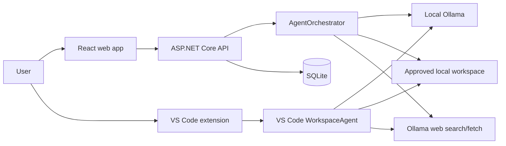
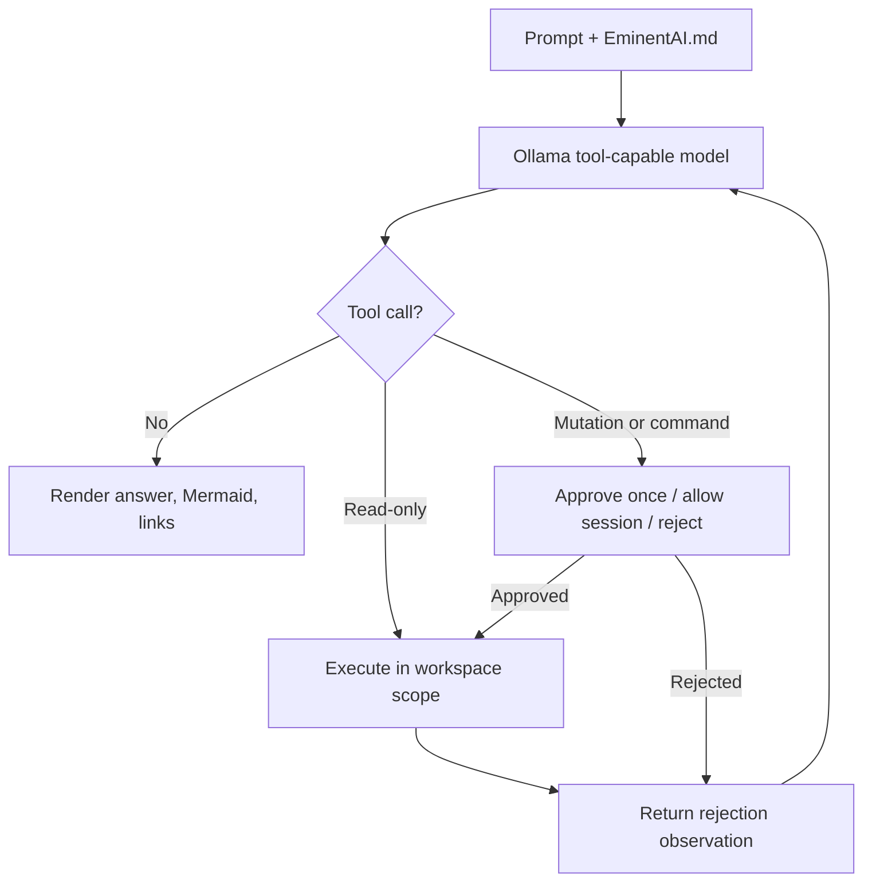
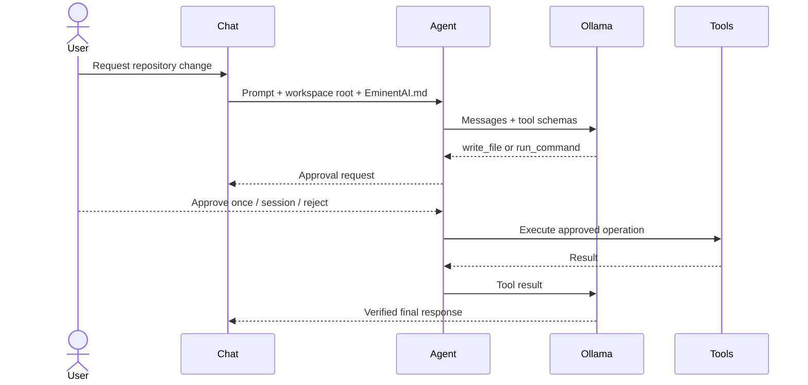

<!-- markdownlint-disable MD013 -->

# EminentAi — Local Ollama Copilot Platform

EminentAi is a localhost-only AI copilot with streaming chat, Plan mode, Agent mode, a React web UI, and a VS Code extension. It runs against Ollama and stores application state locally.

Full architecture: `docs/AIAGENT_ARCHITECTURE.md`

VS Code extension details: `VS_CODE_EXTENSION.md`

## Database Recommendation

Use the current local SQLite database for this project.

Reason: this app is explicitly localhost-only, single-user, and not deployed online. SQLite keeps setup simple, has no Docker dependency for persistence, is fast enough for chat history, agent runs, connector config, admin users, and job-search metadata, and works cleanly with EF Core.

Do not use Docker Desktop as the database. Docker Desktop is a runtime for containers, not a database. You can run PostgreSQL inside Docker Desktop, but that adds a daemon, container lifecycle, volume backups, ports, credentials, and startup ordering. For this app, that complexity is not buying much.

Use PostgreSQL in Docker only if one of these becomes true:

- Multiple local processes/users need concurrent write-heavy access.
- You need Postgres-specific search, JSONB, indexes, extensions, or migration parity with a future hosted system.
- The SQLite file grows large enough that backup, vacuum, or write-lock behavior becomes painful.
- You want to test production-like database behavior before a future deployment.

Recommended path:

1. Keep SQLite now: `src/EminentAi.Api/eminentai.db`.
2. Add EF Core migrations before the schema changes further.
3. Keep repositories behind EF Core abstractions so a future SQLite-to-Postgres move is mechanical.
4. If scaling locally later, add a `postgres` service to `docker-compose.yml` and switch only the connection string/provider.

## Layout

```text
src/EminentAi.Domain          Entities: conversations, branches, messages, agent runs,
                              generated images, policy
src/EminentAi.Application     Use cases: ChatService, PlannerService, AgentOrchestrator,
                              AgentOrchestratorFacade, IIntentRouter, IModelRouter,
                              ISpecializedAgent, ImageGenerationAgent, IGpuWorkCoordinator,
                              InfographicPromptBuilder, ModelMatrixOptions, ApprovalBroker
src/EminentAi.Infrastructure  OllamaClient, ToolCallingIntentResolver, ModelRouterService,
                              OllamaModelProvider, GpuWorkCoordinator, McpHost, PolicyEngine,
                              PiiRedactor, BuiltinToolRunner, EF Core SQLite persistence
src/EminentAi.Api             ASP.NET Core Minimal API + SSE endpoints on 127.0.0.1:5210
Generated_images/             AI-generated PNGs — gitignored, served via /api/generated-images/
web/                          React 19 + Vite + Tailwind UI
vscode-extension/             VS Code extension: chat, workspace tools, Git/tool commands,
                              web search, approvals, persistent EminentAI.md instructions
```

## Install Ollama

### macOS

```bash
brew install ollama
```

### Linux

```bash
curl -fsSL https://ollama.com/install.sh | sh
```

### Windows

```powershell
winget install Ollama.Ollama
```

Or download the installer directly from [ollama.com/download](https://ollama.com/download) and run it.

## Installed Ollama Models

| Model | Size | Tier | Role |
| --- | --- | --- | --- |
| `gemma4:e4b` | 9.6 GB | balanced | Default text model, primary classifier, and image prompt analyst |
| `ornith-1.5:9b` | 5.6 GB | reasoning | Text, coding, architecture, and classifier fallback |
| `qwen3-vl:latest` | 6.1 GB | vision | Dedicated vision-language model for image analysis & reference descriptions |
| `qwen3.5:4b` | 2.8 GB | balanced | Fast local fallback model |
| `x/flux2-klein:4b` | 5.7 GB | image_gen | Capability-gated educational infographic generation (Flux2 diffusion) |
| `x/z-image-turbo` | 12 GB | image_gen | Image generation fallback |

Flux models are capability-gated and never selected for text chat. Smart routing uses Gemma and Ornith for reasoning, Qwen for vision, and invokes Flux only for image generation requests.

## Prerequisites

```bash
ollama serve                          # start the daemon (macOS: brew services start ollama)
ollama pull gemma4:e4b                # default chat, classifier, and local tool agent
ollama pull qwen3-vl:latest           # dedicated vision model
ollama pull ornith-1.5:9b             # coding, architecture, and reasoning
ollama pull qwen3.5:4b                # fast local fallback
ollama pull x/flux2-klein:4b          # image generation (Flux2)
npm install --prefix web
npm install --prefix vscode-extension
```

Mailpit is used only for local password-reset emails:

```bash
docker compose up -d mailpit
```

Mailpit SMTP runs on `127.0.0.1:1025`; its web UI is `http://localhost:8025`.

## Run

Start everything:

```bash
./start.sh
```

Or run each service manually:

```bash
dotnet run --project src/EminentAi.Api --urls http://127.0.0.1:5210
cd web && npm run dev
```

Open `http://localhost:5173`.

The backend uses `src/EminentAi.Api/appsettings.json`. Important settings:

| Setting | Default | Purpose |
| --- | ---: | --- |
| `ConnectionStrings:Default` | `Data Source=eminentai.db` | Local SQLite database |
| `EminentAi:OllamaUrl` | `http://127.0.0.1:11434` | Ollama API |
| `EminentAi:OllamaApiKey` / `OLLAMA_API_KEY` | empty | Server-side key for Ollama web search and fetch |
| `EminentAi:WorkspaceRoot` | nearest Git root | Sandbox root for filesystem and shell tools; falls back to `~/EminentAiWorkspace` |
| `EminentAi:AllowedOrigins` | Vite localhost origins | CORS allowlist |
| `EminentAi:ApiToken` | empty | Optional API token; required for non-loopback binding |
| `EminentAi:Smtp` | Mailpit defaults | Password-reset email transport |

## Modes

- **Chat**: streaming conversation persisted to SQLite. Regenerate creates a sibling message; fork creates a new branch.
- **Plan**: read-only planning mode that returns validated JSON with repair retries.
- **Agent**: autonomous execution with `gemma4:e4b` by default and `qwen3.5:4b`/`ornith-1.5:9b` as fallback, plus repository inspection, targeted file replacement, ZIP creation, step/token/time budgets, policy checks, and human approval for mutations.
- **Smart Chat** (`POST /api/chat/smart`): agent-to-agent routing with GPU work lease concurrency serialization. Intent is resolved through UI mode affordances (Code, Architecture, Infographic, Vision image attachment) or via tool-calling on the resident model (`gemma4:e4b` with `ornith-1.5:9b` fallback). Specialist models are selected dynamically, and turns are dispatched to the appropriate agent (Vision, Code, Architecture, ImageGeneration, General). A `routing_decision` SSE event is emitted before the first token detailing the route, model, provider, source, and timing.

## Current Architecture

### HLD-01 — Local system



### LLD-01 — Agent tool decision



### SD-01 — Permissioned workspace change



### Image Generation Pipeline

Smart Chat routes image requests through an agent-to-agent educational infographic generation pipeline:

1. **Stage 0 (Vision reference)**: `qwen3-vl:latest` describes any attached reference images before content planning.
2. **Stage 1 (Content Architect)**: `gemma4:e4b` (`ornith-1.5:9b` fallback) converts the topic into structured cards, diagrams, bullets, and best practices.
3. **Stage 2-3 (VRAM Management)**: loaded models are snapshotted and unloaded to dedicate full GPU VRAM to diffusion.
4. **Stage 4-5 (Diffusion Generation)**: `x/flux2-klein:4b` (`x/z-image-turbo` fallback) generates a high-resolution PNG for each infographic prompt.
5. **Stage 6 (Model Restoration)**: previously active models are asynchronously warmed up in memory.

Generated PNGs are saved to `Generated_images/` and served with session-token ownership validation through `/api/generated-images/{filename}`.

Built-in connectors:

| Connector | Purpose | Safety |
| --- | --- | --- |
| `filesystem` | Tree/content search, read, targeted replacement, move/delete, and ZIP creation under the selected local workspace | Mutations require approval |
| `shell` | Run commands from the workspace root | Always approval-gated, timeout-limited, denylisted |
| `web` | Ollama web search and page fetch with source URLs | Requires a server-side Ollama API key |

External stdio MCP connectors can be registered through `/api/connectors`.

## Security Model

- Backend binds to `127.0.0.1` by default.
- Non-loopback binding requires `EMINENTAI_API_TOKEN` or `EminentAi:ApiToken`.
- CORS is restricted to local Vite origins.
- Global rate limiting and security headers are enabled.
- Admin routes require a session unless a global API token is configured.
- PII/secret redaction runs before persistence or model calls.
- Tool results are treated as untrusted model input.
- Filesystem writes and shell execution require approval.
- Shell execution is command-denylisted, timeout-limited, and workspace-scoped.

## API

| Method | Route | Purpose |
| --- | --- | --- |
| GET | `/api/health` | Backend health |
| GET | `/api/models` | Ollama model list with tier tags |
| GET/POST/DELETE | `/api/conversations` | Conversation CRUD |
| POST | `/api/branches/{id}/messages` | Streaming persisted chat via SSE |
| POST | `/api/messages/{id}/regenerate` | Sibling regenerate via SSE |
| POST | `/api/branches/{id}/fork` | Fork from a message |
| POST | `/api/chat` | Stateless streaming chat for the VS Code extension |
| POST | `/api/chat/smart` | A2A smart chat — auto-routes by intent, streams SSE |
| GET | `/api/generated-images/{filename}` | Serve a generated PNG (auth + ownership required) |
| POST | `/api/plan` | Goal to validated plan JSON |
| POST | `/api/agent/runs` | Start an agent run; response is SSE |
| POST | `/api/agent/runs/{id}/approvals/{stepId}` | Approve/reject a tool step |
| POST | `/api/agent/runs/{id}/cancel` | Cancel a run |
| GET/POST/DELETE | `/api/connectors` | MCP connector registry |

### Smart Chat SSE Events

| Event | When | Key fields |
| --- | --- | --- |
| `routing_decision` | After intent and model resolved, before first token | `intent`, `model`, `provider`, `reason`, `classificationMs`, `wasFastPath`, `manualOverrideApplied`, `overrideRejectedReason` |
| `token` | Per token during text generation | `text` |
| `image_gen_progress` | Pipeline stage transitions | `stage` (`analyzing_request`, `analysis_done`, `freeing_vram`, `generating`, `saving`, `restoring_models`, `primary_model_failed`) |
| `image_generated` | After each PNG is saved and persisted | `url`, `filename`, `fluxPrompt`, `description`, `index`, `total`, `generationMs` |
| `done` | After DB persist completes | `messageId` |
| `routing_error` | No model found or invalid override | `intent`, `message`, `ollamaPullCommand` |

## Password Reset

1. Start Mailpit with `docker compose up -d mailpit`.
2. Click **Forgot password?** on the login screen.
3. Enter the admin email.
4. Open `http://localhost:8025`.
5. Click the reset link and set a new password.

Manual SQLite reset:

```bash
python3 -c "
import base64, hashlib, os, sys
pw = sys.argv[1].encode()
salt = os.urandom(16)
dk = hashlib.pbkdf2_hmac('sha256', pw, salt, 100000, dklen=32)
print(base64.b64encode(salt).decode() + '.' + base64.b64encode(dk).decode())
" 'YourNewPassword'

sqlite3 src/EminentAi.Api/eminentai.db \
  "UPDATE AdminUsers SET PasswordHash='<hash>' WHERE Email='you@example.com';"
```

## VS Code Extension

Development host:

```bash
cd vscode-extension
npm install
npm run compile
```

Open the repository in VS Code, press `F5`, and launch the extension development host.

Installable VSIX:

```bash
cd vscode-extension
npm install
npm run package
code --install-extension eminentai-0.7.1.vsix
```

Features:

- Activity-bar chat with direct local Ollama streaming.
- PNG, JPEG, WebP, and GIF attachments for vision-capable Ollama models.
- Workspace-scoped list, read, search, and approved file writes.
- Read-only Git inspection plus approval-gated Git mutations.
- Approval-gated build, test, Docker, package, and tool install/update commands.
- Ollama web search with linked sources.
- In-chat approval cards and session-scoped grants.
- Mermaid HLD, LLD, sequence, and flowchart rendering.
- `EminentAI.md` loaded before every workspace prompt.

Detailed implementation and diagrams are in `VS_CODE_EXTENSION.md`.

## Verify

```bash
dotnet build EminentAi.slnx
dotnet test EminentAi.slnx --no-build
cd web && npm run build && npm run lint
cd ../vscode-extension && npm run compile && npm run package
```
