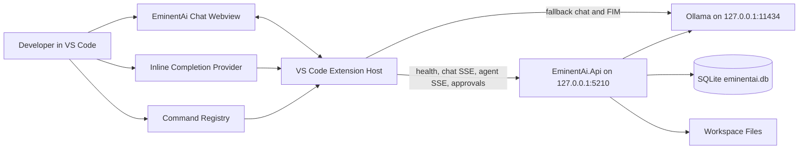
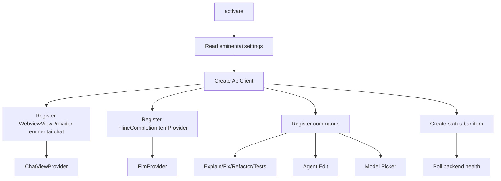
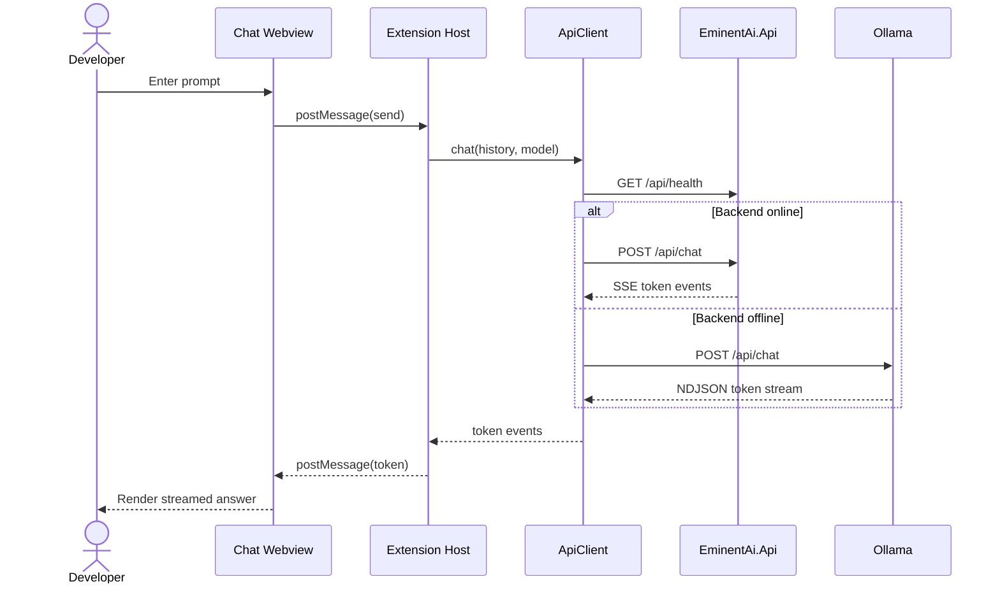
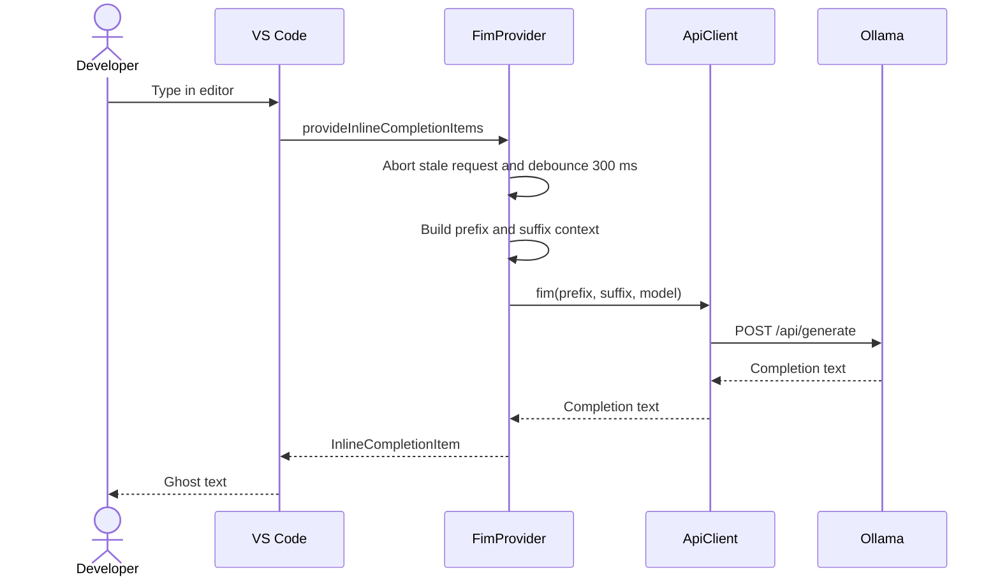
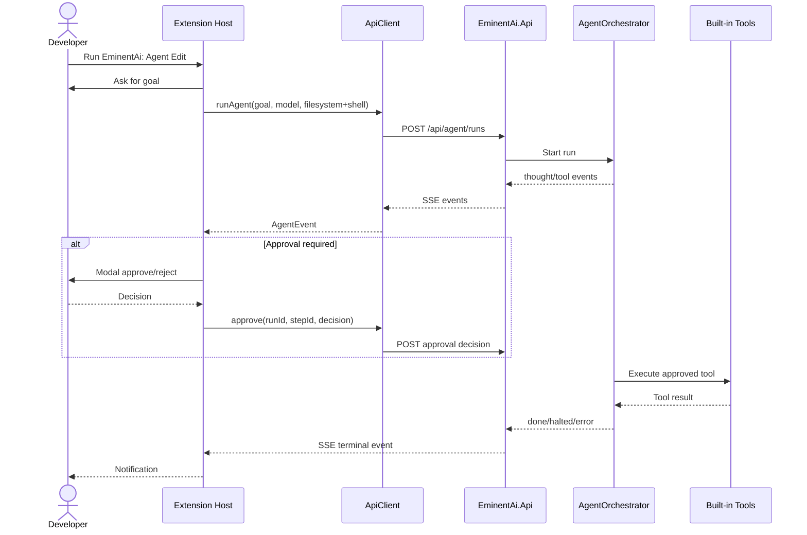

<!-- markdownlint-disable MD013 -->

# EminentAi VS Code Extension

The VS Code extension adds an EminentAi activity-bar view, streaming chat, inline fill-in-the-middle completions, code-selection commands, model switching, and backend-powered agent edits.

## Current Implementation

The extension lives in `vscode-ext/` and is implemented with TypeScript against the VS Code extension API.

| File | Responsibility |
| --- | --- |
| `vscode-ext/package.json` | Extension manifest, contributed views, commands, settings, and build scripts |
| `vscode-ext/src/extension.ts` | Activation entrypoint; wires the webview, inline completions, commands, and status bar |
| `vscode-ext/src/apiClient.ts` | HTTP client for EminentAi backend auth, SSE, Ollama fallback chat, FIM completions, models, and agent runs |
| `vscode-ext/src/chatView.ts` | Webview chat UI with streaming assistant responses |
| `vscode-ext/src/fim.ts` | Inline completion provider using Ollama `/api/generate` with FIM prompt tokens |
| `vscode-ext/src/commands.ts` | Selection commands, model picker, and `EminentAi: Agent Edit` approval flow |

The extension reads settings from the `eminentai` namespace:

| Setting | Default | Purpose |
| --- | ---: | --- |
| `eminentai.backendUrl` | `http://127.0.0.1:5210` | Local ASP.NET Core API |
| `eminentai.ollamaUrl` | `http://127.0.0.1:11434` | Direct Ollama fallback and FIM endpoint |
| `eminentai.chatModel` | `qwen2.5-coder:7b` | Chat and agent model |
| `eminentai.fimModel` | `qwen2.5-coder:1.5b-base` | Inline completion model |
| `eminentai.inlineCompletions` | `true` | Enables/disables ghost text completions |
| `eminentai.maxPrefixTokens` | `2000` | Reserved setting for completion context limits |

## How It Works

1. VS Code starts the extension on `onStartupFinished`.
2. `extension.ts` creates one `ApiClient` from the configured backend and Ollama URLs.
3. The extension registers the `eminentai.chat` webview in the activity bar.
4. The inline completion provider listens for edits in all files and debounces requests.
5. The command registry adds explain, fix, refactor, tests, agent edit, and model picker commands.
6. A status-bar item polls `/api/health` every 30 seconds and shows the selected chat model when the backend is reachable.

Chat prefers the local backend:

1. The webview sends user text to the extension host.
2. `ApiClient.chat` checks `/api/health`.
3. If signed in, the extension attaches the stored admin session bearer token.
4. If the backend is online, it streams `/api/chat` Server-Sent Events.
5. If the backend is offline, it streams directly from Ollama `/api/chat`.
6. The webview appends token events into the active assistant message.

Agent edits always use the backend:

1. `EminentAi: Agent Edit` asks for a workspace-change goal.
2. The extension posts to `/api/agent/runs`.
3. Backend events stream back through SSE.
4. When an approval event arrives, VS Code shows a modal approve/reject prompt.
5. The extension posts the decision to `/api/agent/runs/{runId}/approvals/{stepId}`.

## High-Level Design



## Low-Level Design



## Chat Sequence



## Inline Completion Sequence



## Agent Edit Sequence



## Install In VS Code

### Prerequisites

```bash
brew services start ollama
ollama pull qwen2.5-coder:7b
ollama pull qwen2.5-coder:1.5b-base
dotnet run --project src/EminentAi.Api --urls http://127.0.0.1:5210
```

### Development Host

```bash
cd vscode-ext
npm install
npm run compile
```

Then open the repository in VS Code, press `F5`, and choose the extension development host.

If chat shows `Backend returned 401`, sign in from the command palette:

1. Run `EminentAi: Sign In`.
2. Enter the same admin email and password used in the web app.
3. Retry chat.

The extension stores the returned session token in VS Code SecretStorage.

### VSIX Package

```bash
cd vscode-ext
npm install
npm run package
npx @vscode/vsce package
code --install-extension eminentai-copilot-0.1.0.vsix
```

`npm run package` bundles `src/extension.ts` to `dist/extension.js`. `npx @vscode/vsce package` creates the installable `.vsix`.

## Useful Commands

| Command | Purpose |
| --- | --- |
| `EminentAi: Explain Selection` | Sends selected code to chat with an explanation prompt |
| `EminentAi: Fix Selection` | Sends selected code to chat with a fix prompt |
| `EminentAi: Refactor Selection` | Sends selected code to chat with a refactor prompt |
| `EminentAi: Generate Tests` | Sends selected code to chat with a test-generation prompt |
| `EminentAi: Agent Edit (multi-file)` | Starts a backend agent run for workspace changes |
| `EminentAi: Switch Model` | Picks from backend model list and stores the chat model globally |
| `EminentAi: Sign In` | Logs in to the backend and stores the session token in VS Code SecretStorage |
| `EminentAi: Sign Out` | Removes the stored backend session token |

## Verification

```bash
cd vscode-ext
npm run compile
npm run package
```

For full repo verification:

```bash
dotnet build EminentAi.slnx
dotnet test EminentAi.slnx --no-build
cd web && npm run build && npm run lint
```
