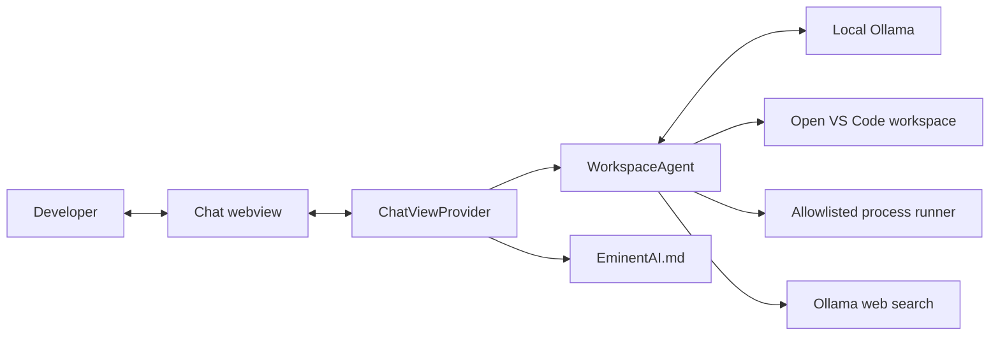
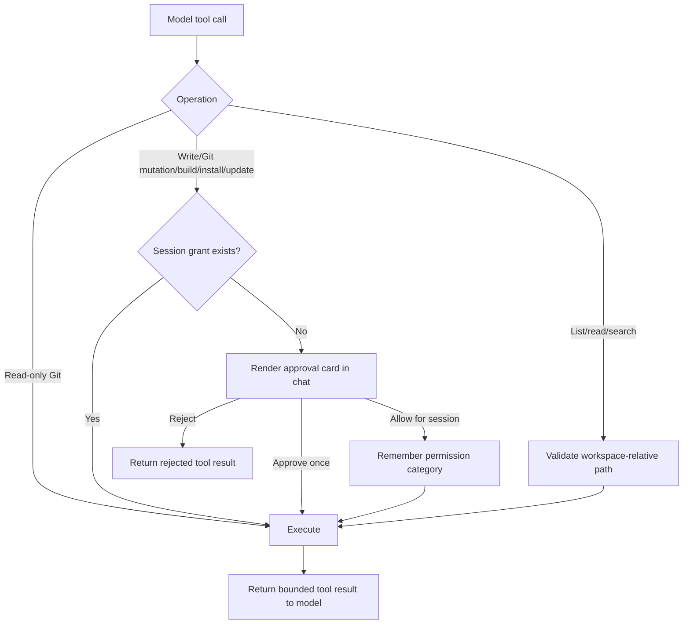
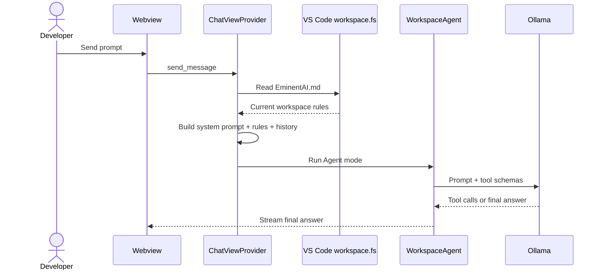
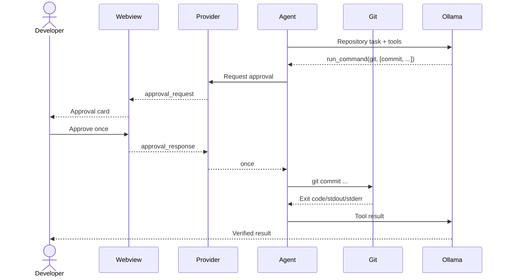
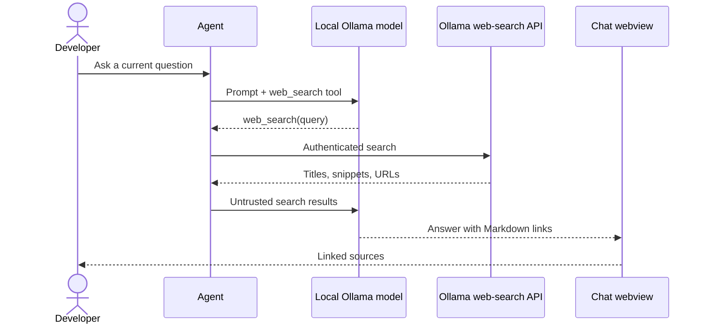

<!-- markdownlint-disable MD013 -->

# EminentAI VS Code Extension

The extension is a local Ollama coding agent for the currently opened VS Code workspace. Agent mode can inspect files, edit with approval, run permissioned Git and development-tool commands, search the web, render Mermaid architecture diagrams, and load persistent workspace instructions from `EminentAI.md` before every prompt.

## 1. Implemented Capabilities

| Capability | Behavior |
| --- | --- |
| Ask and Plan | Streaming direct-to-Ollama chat |
| Agent | Native Ollama tool loop, maximum 15 turns |
| Vision | Up to five PNG, JPEG, WebP, or GIF attachments, 5 MB each |
| Workspace | First open workspace folder is the only filesystem root |
| Files | List, read, content search, approved create/overwrite |
| Git | Read-only inspection without approval; mutations require approval |
| Commands | Allowlisted `git`, `npm`, `npx`, `dotnet`, `docker`, `brew`, and `code` executables |
| Tool management | Install/update commands require approval |
| Permissions | In-chat Approve once, Allow for session, or Reject |
| Web | Official Ollama web search using `OLLAMA_API_KEY` |
| Sources | Markdown links open through `vscode.env.openExternal` |
| Architecture | Mermaid HLD, LLD, sequence, and flowchart rendering |
| Memory | `EminentAI.md` is re-read before every prompt |

The command runner uses `spawn` with `shell: false`; pipes, redirects, substitutions, and shell chaining are not accepted.

## 2. Implementation Map

| File | Responsibility |
| --- | --- |
| `vscode-extension/src/extension.ts` | Activation, commands, status bar |
| `vscode-extension/src/chatViewProvider.ts` | Session orchestration, prompt construction, instruction loading, approval broker |
| `vscode-extension/src/workspaceAgent.ts` | Ollama tool loop, workspace tools, Git/tool commands, web search |
| `vscode-extension/src/llmClient.ts` | Streaming provider clients and Ollama model discovery |
| `vscode-extension/src/ollamaClient.ts` | Prompts and message construction |
| `vscode-extension/src/sessionManager.ts` | Local conversation state |
| `vscode-extension/src/webviewContent.ts` | CSP-safe webview and bundled Mermaid resource |
| `vscode-extension/media/chat.html` | Chat UI, source links, Mermaid rendering, approval cards |
| `EminentAI.md` | Persistent workspace rules loaded on every prompt |

## 3. HLD-01 — Extension Context



## 4. LLD-01 — Permission Model



Session grants exist only inside one `runWorkspaceAgent` invocation. They are not persisted across prompts or VS Code restarts.

## 5. LLD-02 — Tool Catalogue

### 5.1 Workspace tools

- `list_files(path)`
- `read_file(path)`
- `search_content(query)`
- `write_file(path, content)`

Paths must be relative to the first open workspace folder. Attempts to traverse outside it are rejected.

### 5.2 Command tool

`run_command(executable, args)` accepts an executable plus an argument array.

Allowed executables:

- `git`
- `npm`
- `npx`
- `dotnet`
- `docker`
- `brew`
- `code`

Read-only Git subcommands `status`, `diff`, `log`, `show`, `rev-parse`, `ls-files`, and `remote` run automatically. Other Git operations and every non-Git process require approval.

### 5.3 Web tool

`web_search(query)` calls `https://ollama.com/api/web_search` using `OLLAMA_API_KEY`. Returned URLs remain in the tool result, and the system prompt requires Markdown citations.

## 6. SD-01 — Prompt and Persistent Instructions



The file is read for every message rather than cached, so edits apply to the next prompt.

## 7. SD-02 — Git Mutation With Approval



## 8. SD-03 — Web Research



## 9. Install and Configure

```bash
ollama pull qwen3:8b
export OLLAMA_API_KEY="your-ollama-api-key"

cd vscode-extension
npm install
npm run compile
npm run package
code --install-extension eminentai-0.4.0.vsix
```

Open a folder in VS Code before using Agent mode. Put project-specific rules in `<workspace>/EminentAI.md`.

## 10. Security Boundaries

- The extension accesses only the first open workspace folder.
- Workspace paths are normalized and traversal outside the root is rejected.
- Web search requires a server-side environment variable; it is never sent to the webview.
- Ask mode prompts for writes and commands. Approve-for-me permits workspace-confined writes but still prompts for commands that execute code or mutate external state. Full access skips prompts explicitly.
- Processes have a 60-second timeout and 12,000-character output cap.
- `GIT_TERMINAL_PROMPT=0` prevents hidden interactive credential prompts.
- Tool results are evidence, not proof that model prose is correct; final responses must reflect exit codes.

## 11. Known Limits

- File writes currently replace the complete file; targeted patch tooling is implemented in the web/backend agent but not yet in the extension.
- Agent-mode screenshot requests are analyzed by the configured `eminentai.visionModel`, or the smallest installed model that advertises Ollama's `vision` capability, before the selected coding model receives the handoff.
- Only the first VS Code workspace folder is used in multi-root workspaces.
- Tool installation is allowlisted, not a general terminal.
- Web search requires an Ollama account/API key and network access.
- Local 8B models remain less reliable than hosted frontier coding models; the bounded tool loop and approval layer reduce but do not eliminate errors.

## 12. Verification

```bash
cd vscode-extension
npm run compile
npm run package

cd ../web
npm run build

cd ..
dotnet build EminentAi.slnx --no-restore
```

## 13. Marketplace Publishing

The extension manifest is versioned and includes a prepublish compile step.
Local publishing uses:

```bash
cd vscode-extension
export VSCE_PAT="publisher-scoped-token"
npm run publish:marketplace
```

The repository also includes
`.github/workflows/publish-vscode-extension.yml`. Configure the encrypted
`VSCE_PAT` repository secret and push a `vscode-v*` tag, or run the workflow
manually. The publisher ID in `package.json` is `eminentai`.
