# Agent-to-Agent Orchestration Architecture

> **EminentAi — Multi-Agent Routing System**
> Version 2.0 — revised after principal-engineer review.
> Designed for: automatic intent detection, specialized agent dispatch, image generation, and architecture planning.
> Provider-agnostic: Ollama local models today, Claude / ChatGPT / Copilot extensible by design.

---

## Revision Notes (v1 → v2)

| Finding | Severity | Resolution in this document |
|---|---|---|
| Bypassed `AgentOrchestrator` — not true A2A | High | Added `AgentOrchestratorFacade` owning the full chain: intent → model → provider → persist → SSE |
| "All local" hard-coded — no provider abstraction | High | Added `IModelProvider`, `ModelCapability`, `ModelRoute`, `ProviderHealth`, `CostPolicy`, `DataResidencyPolicy` |
| `systemPromptOverride` as raw string | High | Replaced with `AgentProfile` + `PromptProfileKind` enum, server-side only |
| `done` emitted before DB persistence | Medium | Fixed in all sequence diagrams: persist → emit `persisted` → emit `done` |
| Classifier confidence / telemetry missing | Medium | Added `ClassificationRecord` with confidence, raw output, and telemetry log |
| Flux `/api/generate` response shape unverified | Medium | Added spike task to implementation order; two fallback parse paths documented |
| Generated images served without auth | Medium | Requires same bearer token; ownership verified against `branchId` in DB |
| `autoRouteHint` semantics undefined | Medium | Treated as advisory `AgentKind?`; validated to enum; actual route always returned |
| No `AgentProfile` record — "no new class" | Low | All agents now use `AgentProfile` — consistent, extensible, zero duplication |
| Image gen first in impl order — wrong | Low | Routing + text flows first; image gen after Flux spike confirmation |
| Defensive label parsing not specified | PE note | Documented: trim, uppercase, strict enum match; unknown → `General` + log warning |
| VRAM swapping under multiple large models | PE note | `keep_alive` strategy and model-warm-up recommendation documented |
| `generated-images/` not in `.gitignore` | PE note | Added to file map and `.gitignore` section |

---

## Table of Contents

1. [Overview](#1-overview)
2. [Installed Ollama Models & Their Roles](#2-installed-ollama-models--their-roles)
3. [Existing Infrastructure (What We Keep)](#3-existing-infrastructure-what-we-keep)
4. [Core Abstractions (New Contracts)](#4-core-abstractions-new-contracts)
   - 4.1 [AgentKind & AgentProfile](#41-agentkind--agentprofile)
   - 4.2 [IModelProvider & Provider Abstraction](#42-imodelprovider--provider-abstraction)
   - 4.3 [IIntentRouter & RoutingDecision](#43-iintentrouter--routingdecision)
   - 4.4 [IModelRouter & ModelRoute](#44-imodelrouter--modelroute)
   - 4.5 [ISpecializedAgent](#45-ispecializedagent)
5. [High-Level Architecture (HLD)](#5-high-level-architecture-hld)
6. [Component Design (LLD)](#6-component-design-lld)
   - 6.1 [AgentOrchestratorFacade](#61-agentorchestratorfacade)
   - 6.2 [IntentRouterService](#62-intentrouterservice)
   - 6.3 [ModelRouterService](#63-modelrouterservice)
   - 6.4 [OllamaModelProvider](#64-ollamamodelprovider)
   - 6.5 [VisionAgent](#65-visionagent)
   - 6.6 [CodeAgent](#66-codeagent)
   - 6.7 [ArchitectureAgent](#67-architectureagent)
   - 6.8 [ImageGenerationAgent](#68-imagegenerationagent)
   - 6.9 [GeneralAgent](#69-generalagent)
7. [Sequence Diagrams](#7-sequence-diagrams)
   - 7.1 [Flow 1 — Vision / Image Reading](#71-flow-1--vision--image-reading)
   - 7.2 [Flow 2 — Code Request](#72-flow-2--code-request)
   - 7.3 [Flow 3 — Architecture & Design](#73-flow-3--architecture--design)
   - 7.4 [Flow 4 — Image Generation](#74-flow-4--image-generation)
   - 7.5 [Flow 5 — General Request](#75-flow-5--general-request)
   - 7.6 [Flow 6 — Intent Classification (Internal)](#76-flow-6--intent-classification-internal)
   - 7.7 [Flow 7 — Provider Fallback Chain](#77-flow-7--provider-fallback-chain)
8. [Overall Orchestration Flowchart](#8-overall-orchestration-flowchart)
9. [Smart Endpoint Contract](#9-smart-endpoint-contract)
10. [New SSE Event Types](#10-new-sse-event-types)
11. [Backend File Map](#11-backend-file-map)
12. [Frontend File Map](#12-frontend-file-map)
13. [Changes to Existing Files](#13-changes-to-existing-files)
14. [Implementation Order](#14-implementation-order)
15. [Model Fallback Matrix](#15-model-fallback-matrix)
16. [Security Considerations](#16-security-considerations)
17. [Operational Notes](#17-operational-notes)

---

## 1. Overview

Today every chat message goes to whatever model the user manually selected. There is no intelligence deciding *which* model is best for a given task, and there is no mechanism to route to a different provider (Claude, ChatGPT, Copilot) without rewriting the infrastructure.

This architecture corrects both problems by inserting a **true orchestration layer** between the user's message and any model call. The key insight from the v1 review: the original design bypassed `AgentOrchestrator` and wired `SmartAPI` directly to `ChatService` and `ImageGenerationAgent`. This document replaces that with a proper chain where **one facade owns routing, execution, persistence, and SSE streaming**.

```
SmartChatEndpoint
  → AgentOrchestratorFacade        (owns the whole turn: intent → model → execute → persist → SSE)
    → IntentRouter                  (classifies intent via fast-path or qwen3.5:2b)
    → ModelRouter                   (resolves best model+provider per intent)
    → ISpecializedAgent             (Vision / Code / Arch / ImageGen / General)
      → IModelProvider              (Ollama today; Claude / ChatGPT / Copilot tomorrow)
    → ChatService                   (persistence: messages, attachments)
    → SSE response stream
```

The existing `POST /api/branches/:id/messages` endpoint is **unchanged**. The smart path is a new additive endpoint: `POST /api/chat/smart`.

**Intent kinds:**

| Intent | Trigger condition | Default provider model |
|---|---|---|
| `Vision` | Image attached + question about its contents | `qwen2.5vl:latest` (Ollama) |
| `Coding` | Code, debugging, real-world examples | `qwen2.5-coder:1.5b` (Ollama) |
| `Architecture` | System design, HLD/LLD, diagrams | `qwen3:latest` (Ollama) |
| `ImageGeneration` | "Generate / draw / create a logo / image" | `x/flux2-klein:4b` (Ollama) |
| `General` | Everything else | `qwen2.5:latest` (Ollama) |

---

## 2. Installed Ollama Models & Their Roles

```
NAME                       SIZE     TIER           ROLE IN THIS SYSTEM
─────────────────────────────────────────────────────────────────────────
qwen3.5:2b                 2.7 GB   fast           Intent classifier (sub-500ms, low VRAM)
qwen2.5-coder:1.5b         986 MB   fast           Code Agent — fastest code completions
qwen2.5:latest             4.7 GB   balanced       General Agent — default fallback
qwen3:latest               5.2 GB   balanced       Architecture Agent — primary (strong reasoning)
gemma4:e4b                 9.6 GB   balanced       Architecture Agent — fallback (large, capable)
qwen2.5vl:latest           6.0 GB   vision         Vision Agent — only multimodal model installed
x/flux2-klein:4b           5.7 GB   image_gen      Image Generation Agent — Flux2 diffusion
nomic-embed-text:latest    274 MB   embedding      Reserved: RAG / semantic search
```

**VRAM note:** `x/flux2-klein:4b` + `qwen2.5vl:latest` are both large. Ollama will unload the previous model before loading the next. This causes a "cold start" delay on the first token. Mitigations:

- The `keep_alive: "10m"` already set in `OllamaClient.BuildPayload` keeps models warm between calls.
- `qwen3.5:2b` (the classifier) is tiny enough to stay loaded alongside any other model on 16 GB machines.
- Image generation (`flux2-klein`) should warn the user of 30–120 second generation time via `image_gen_progress` SSE events — these are not optional UX polish, they are **required** so the user does not think the system has crashed.

**Flux API spike required:** `x/flux2-klein:4b` is a diffusion model, not a chat model. Before implementing `ImageGenerationAgent`, run this verification:

```bash
curl http://127.0.0.1:11434/api/generate \
  -d '{"model":"x/flux2-klein:4b","prompt":"minimalist logo, AI startup","stream":false}'
```

Confirm the response shape is `{ "response": "<base64 PNG string>" }`. If the model returns a file path, a URL, chunked data, or a different JSON key, the `GenerateImageAsync` implementation must be adjusted accordingly. **Do not implement `ImageGenerationAgent` before running this spike.**

---

## 3. Existing Infrastructure (What We Keep)

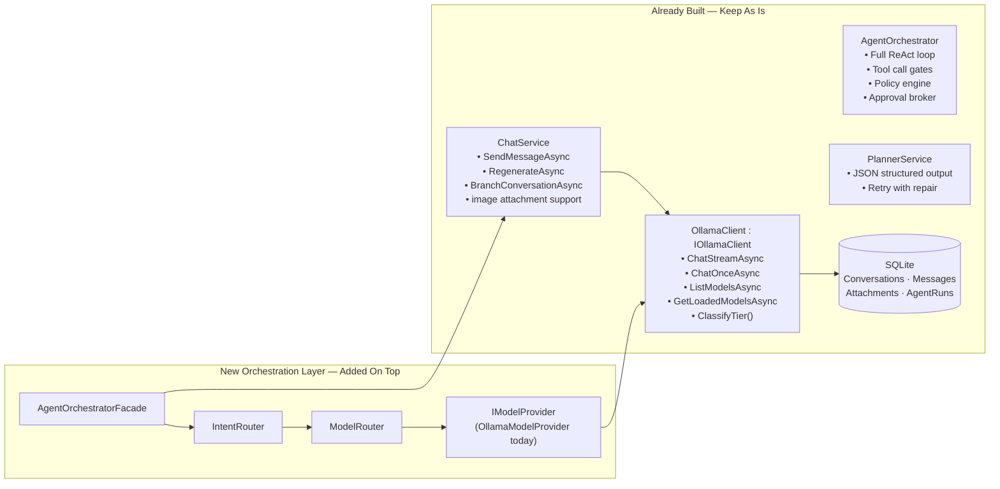

`ClassifyTier()` in `OllamaClient` already labels models as `vision`, `fast`, `balanced`, `reasoning`, `embedding`. `ModelRouter` uses these labels for tier-based fallbacks when a preferred model is not installed.

The existing `AgentOrchestrator` (ReAct loop with MCP tool calls) remains for agentic runs. `AgentOrchestratorFacade` is a **separate, lighter orchestrator** for the chat-smart flow — it does not replace the ReAct loop.

---

## 4. Core Abstractions (New Contracts)

### 4.1 AgentKind & AgentProfile

`AgentProfile` replaces the raw `systemPromptOverride` string. `ChatService` will accept an `AgentProfile?` — never a raw string from user input or any external source.

```csharp
// EminentAi.Application/Agents/AgentKind.cs
public enum AgentKind
{
    Vision,
    Coding,
    Architecture,
    ImageGeneration,
    General
}

// EminentAi.Application/Agents/AgentProfile.cs
public sealed record AgentProfile(
    AgentKind Kind,
    string SystemPrompt,
    float Temperature,
    IReadOnlySet<string> RequiredCapabilities  // e.g. {"vision"}, {"image_gen"}
);

// EminentAi.Application/Agents/AgentProfiles.cs
// All profiles are constants defined server-side. No user input ever reaches SystemPrompt.
public static class AgentProfiles
{
    public static readonly AgentProfile Vision = new(
        AgentKind.Vision,
        SystemPrompt: """
            You are a vision-capable AI assistant. When given an image:
            - Extract ALL visible text accurately, preserving structure (tables, lists, columns).
            - Describe any diagrams, charts, or visual elements that cannot be expressed as text.
            - Answer the user's specific question about the image contents.
            - If the image contains a form, invoice, or structured document, present data
              in a markdown table. Do not hallucinate content that is not visible.
            """,
        Temperature: 0.1f,
        RequiredCapabilities: new HashSet<string> { "vision" }
    );

    public static readonly AgentProfile Coding = new(
        AgentKind.Coding,
        SystemPrompt: """
            You are an expert software engineer. When providing code:
            - Show complete, runnable examples — never pseudocode or stubs.
            - Use the language/framework the user specifies, or infer from context.
            - Include only the imports and setup that are actually needed.
            - If showing a real-world pattern, name the pattern and explain the WHY in one sentence.
            - Prefer idiomatic, production-quality code over simplified toy examples.
            - If the user asks to debug, reproduce the error first, then fix it.
            """,
        Temperature: 0.1f,
        RequiredCapabilities: new HashSet<string>()
    );

    public static readonly AgentProfile Architecture = new(
        AgentKind.Architecture,
        SystemPrompt: """
            You are a senior software architect. Structure every design response as:

            ## Summary
            One paragraph: the system's purpose and the core architectural decision.

            ## HLD — High-Level Diagram
            ```mermaid
            graph TB
              [services and connections]
            ```

            ## LLD — Data Model
            ```mermaid
            classDiagram
              [key entities and relationships]
            ```

            ## Primary Flow — Sequence Diagram
            ```mermaid
            sequenceDiagram
              [happy path from user action to result]
            ```

            ## Decision Flow — Flowchart
            ```mermaid
            flowchart LR
              [branching logic and routing decisions]
            ```

            ## Technology Justification
            Bullet list: why each major technology was chosen.

            Always wrap Mermaid in triple-backtick mermaid fences. The frontend renders them natively.
            """,
        Temperature: 0.3f,
        RequiredCapabilities: new HashSet<string>()
    );

    public static readonly AgentProfile ImageGeneration = new(
        AgentKind.ImageGeneration,
        SystemPrompt: "",   // not used — ImageGenerationAgent bypasses ChatService
        Temperature: 0f,
        RequiredCapabilities: new HashSet<string> { "image_gen" }
    );

    public static readonly AgentProfile General = new(
        AgentKind.General,
        SystemPrompt: "You are EminentAi, a helpful AI assistant running fully locally.",
        Temperature: 0.7f,
        RequiredCapabilities: new HashSet<string>()
    );

    public static AgentProfile ForKind(AgentKind kind) => kind switch
    {
        AgentKind.Vision        => Vision,
        AgentKind.Coding        => Coding,
        AgentKind.Architecture  => Architecture,
        AgentKind.ImageGeneration => ImageGeneration,
        AgentKind.General       => General,
        _                       => General
    };
}
```

---

### 4.2 IModelProvider & Provider Abstraction

This abstraction makes the system provider-agnostic. Today only `OllamaModelProvider` is implemented. Adding Claude, ChatGPT, or GitHub Copilot later means implementing `IModelProvider` — nothing else changes.

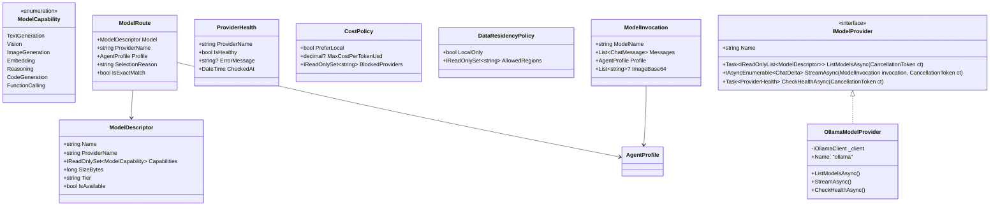

**Future providers** implement `IModelProvider` and are registered in DI. `ModelRouter` queries all healthy providers and ranks candidates:

```
Priority: CostPolicy.PreferLocal → DataResidencyPolicy.LocalOnly → RequiredCapabilities match
         → ModelDescriptor.Tier match → SizeBytes (larger preferred for architecture/reasoning)
```

---

### 4.3 IIntentRouter & RoutingDecision

```csharp
// EminentAi.Application/Routing/IIntentRouter.cs
public interface IIntentRouter
{
    Task<RoutingDecision> RouteAsync(IntentRequest request, CancellationToken ct = default);
}

public sealed record IntentRequest(
    string UserText,
    bool HasImageAttachment,
    IReadOnlyList<string> AttachmentContentTypes,
    AgentKind? HintOverride   // advisory only — user opt-in; validated to enum before use
);

public sealed record RoutingDecision(
    AgentKind Intent,
    AgentProfile Profile,
    ModelRoute ModelRoute,
    string ClassifierModel,
    long ClassificationMs,
    ClassificationRecord? Telemetry
);

public sealed record ClassificationRecord(
    string RawLabel,           // exact string the LLM emitted — logged for debugging
    bool WasFastPath,          // true if regex short-circuit fired
    float? ConfidenceHint,     // reserved: if classifier emits logprobs in future
    bool HintOverrideApplied,  // true if user's autoRouteHint changed the result
    string? OverrideOriginalLabel
);
```

**Defensive label parsing rule** — applied before any label reaches business logic:

```csharp
private static AgentKind ParseIntentLabel(string raw)
{
    // Trim whitespace, remove punctuation, uppercase — handles "Here is: CODING\n" etc.
    var clean = Regex.Replace(raw.Trim().ToUpperInvariant(), @"[^A-Z_]", "");
    return clean switch
    {
        "VISION"        => AgentKind.Vision,
        "CODING"        => AgentKind.Coding,
        "ARCHITECTURE"  => AgentKind.Architecture,
        "IMAGE_GEN"
        or "IMAGE"
        or "IMAGEGEN"   => AgentKind.ImageGeneration,
        "GENERAL"       => AgentKind.General,
        // Unknown label: log warning + default to General — never throw
        _ => AgentKind.General
    };
}
```

The raw label is always stored in `ClassificationRecord.RawLabel` regardless of parse outcome, so misrouting can be diagnosed from logs.

---

### 4.4 IModelRouter & ModelRoute

```csharp
// EminentAi.Application/Routing/IModelRouter.cs
public interface IModelRouter
{
    Task<ModelRoute> ResolveAsync(
        AgentProfile profile,
        CostPolicy costPolicy,
        DataResidencyPolicy residencyPolicy,
        CancellationToken ct = default);
}
```

`ModelRouterService` queries all registered `IModelProvider` instances, filters by health, filters by `DataResidencyPolicy`, filters by `RequiredCapabilities`, then ranks by `CostPolicy` and model tier.

---

### 4.5 ISpecializedAgent

Every agent implements this contract. `AgentOrchestratorFacade` dispatches through it.

```csharp
// EminentAi.Application/Agents/ISpecializedAgent.cs
public interface ISpecializedAgent
{
    AgentKind Kind { get; }

    /// <summary>
    /// Execute the agent turn. Yields SmartChatEvents.
    /// Must persist the assistant message BEFORE yielding done.
    /// </summary>
    IAsyncEnumerable<SmartChatEvent> ExecuteAsync(
        SmartChatContext context,
        ModelRoute route,
        CancellationToken ct);
}

public sealed record SmartChatContext(
    Guid BranchId,
    string UserText,
    IReadOnlyList<ChatAttachment> Attachments,
    RoutingDecision Routing,
    Guid AssistantMessageId   // pre-allocated so done carries the id
);
```

---

## 5. High-Level Architecture (HLD)

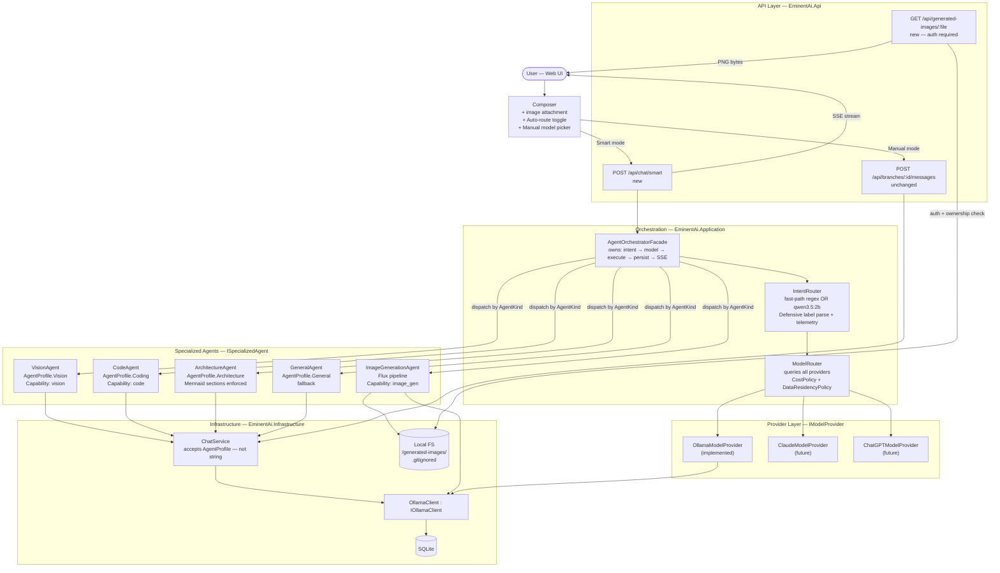

---

## 6. Component Design (LLD)

### 6.1 AgentOrchestratorFacade

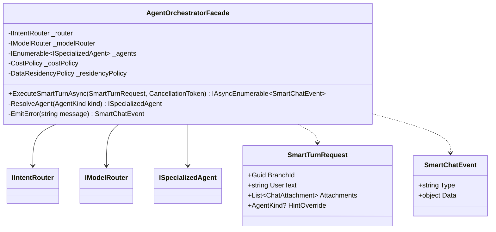

`AgentOrchestratorFacade.ExecuteSmartTurnAsync` is the single entry point. It:

1. Calls `IntentRouter.RouteAsync` → `RoutingDecision`
2. Emits `routing_decision` SSE event immediately (user sees it before model warms up)
3. Calls `ModelRouter.ResolveAsync` with the profile, cost policy, and residency policy
4. If no model found → emits `routing_error` → returns
5. Resolves the correct `ISpecializedAgent` for the intent
6. Calls `agent.ExecuteAsync` — the agent streams tokens AND persists before yielding `done`
7. Propagates all yielded events to the SSE response

**Orchestration is owned here, not scattered across the endpoint.**

---

### 6.2 IntentRouterService

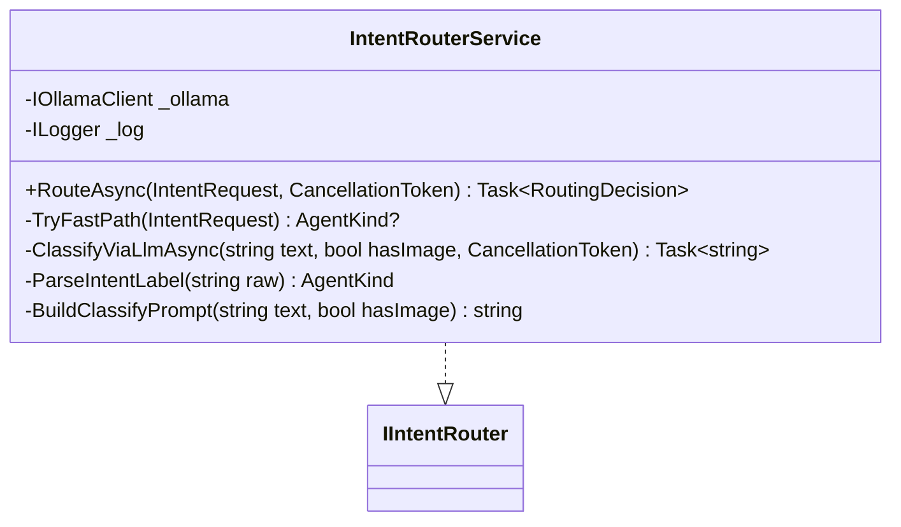

**Fast-path rules** (no LLM call, zero latency):

| Condition | Result |
|---|---|
| `HasImageAttachment && text matches \b(read\|extract\|what\|describe\|tell me about\|text in)\b` | `Vision` |
| `text matches ^(generate\|draw\|create a (logo\|image\|picture\|banner)\|design an? (image\|logo\|graphic)\|make an? (image\|logo))` (case-insensitive) | `ImageGeneration` |

Fast-path matches are recorded in `ClassificationRecord.WasFastPath = true`.

**`autoRouteHint` handling:** the `HintOverride` field in `IntentRequest` is parsed to `AgentKind?` by the endpoint before the call reaches `IntentRouterService`. If it is a valid `AgentKind`, the LLM call is skipped entirely and `ClassificationRecord.HintOverrideApplied = true` is set. The actual applied kind is always returned in `RoutingDecision.Intent` — the UI shows what was truly used, not the hint.

**Classification prompt** (sent to `qwen3.5:2b`, temperature 0.0, max 10 tokens):

```
You are a one-word classifier. Read the user message below and reply with
EXACTLY ONE of these labels, nothing else — no punctuation, no explanation.

VISION         — user attached an image and wants to read, extract, or analyse it
CODING         — user wants working code, a coding example, debugging, or code review
ARCHITECTURE   — user wants system design, tech stack, HLD, LLD, or diagrams
IMAGE_GEN      — user wants to generate, draw, or create an image, logo, or graphic
GENERAL        — anything else

HasImageAttachment: {true|false}
UserMessage: {userText}
```

---

### 6.3 ModelRouterService

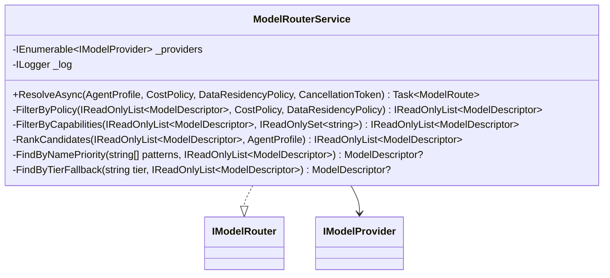

**Name-priority lists per `AgentKind`:**

```csharp
private static readonly IReadOnlyDictionary<AgentKind, string[]> NamePriorities = new Dictionary<AgentKind, string[]>
{
    [AgentKind.Vision]          = ["qwen2.5vl", "vl", "vision", "llava", "moondream"],
    [AgentKind.Coding]          = ["qwen2.5-coder:1.5b", "qwen2.5-coder", "coder", "deepseek-coder"],
    [AgentKind.Architecture]    = ["qwen3:latest", "qwen3", "gemma4", "qwen2.5:latest", "qwen2.5"],
    [AgentKind.ImageGeneration] = ["flux2-klein", "flux", "diffusion"],
    [AgentKind.General]         = ["qwen2.5:latest", "qwen2.5", "qwen3.5", "llama3"],
};
```

---

### 6.4 OllamaModelProvider

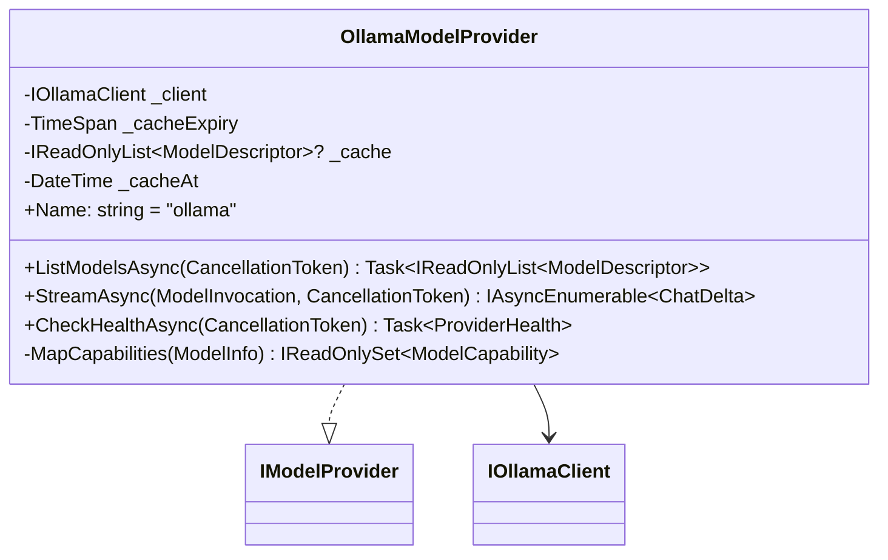

`ListModelsAsync` caches results for 60 seconds — model installs do not change mid-conversation.

`MapCapabilities` maps existing `ClassifyTier()` output to `ModelCapability` flags:

```
"vision"    → { Vision, TextGeneration }
"fast"      → { TextGeneration, CodeGeneration }
"balanced"  → { TextGeneration, CodeGeneration, FunctionCalling }
"reasoning" → { TextGeneration, Reasoning }
"embedding" → { Embedding }
"image_gen" → { ImageGeneration }   ← new tier added to ClassifyTier()
```

---

### 6.5 VisionAgent

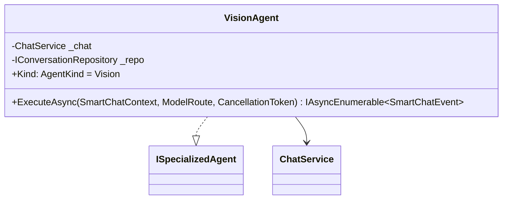

`ExecuteAsync`:

1. Streams `ChatService.SendMessageAsync` with `AgentProfile.Vision` injected as system prompt and model override.
2. Yields `token` events.
3. Awaits full stream completion.
4. Awaits `ChatService` to persist the assistant message to SQLite.
5. **Only then** yields `done` with `messageId`.

This fixes the v1 ordering bug where `done` was emitted before the DB write.

---

### 6.6 CodeAgent

Identical structure to `VisionAgent`, uses `AgentProfile.Coding`. Temperature 0.1 (deterministic code).

---

### 6.7 ArchitectureAgent

Identical structure, uses `AgentProfile.Architecture`. Temperature 0.3 (allows creative design variation). The system prompt enforces the Summary → HLD → LLD → Sequence → Flowchart → Justification structure with Mermaid fences. The existing `MarkdownRenderer.tsx` already renders Mermaid blocks — no frontend change needed for diagram rendering.

---

### 6.8 ImageGenerationAgent

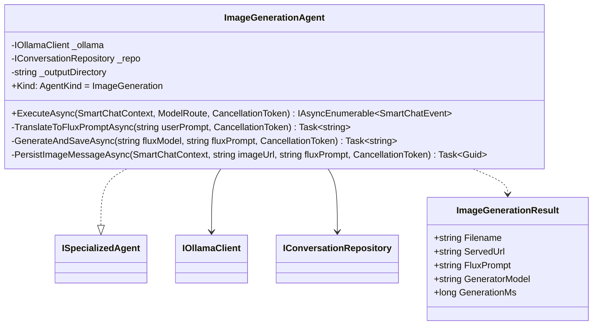

**Internal pipeline:**

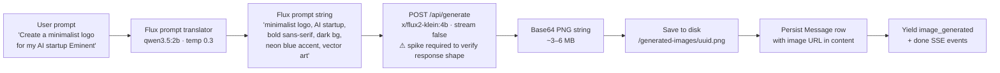

**Flux prompt translation system prompt** (sent to `qwen3.5:2b`):

```
You are a Flux2 image prompt engineer. Convert the user description into a
comma-separated keyword list of 10–20 terms describing the image visually.

Rules:
- Visual attributes only: style, colours, mood, composition, medium.
- Include art style keywords: vector, digital art, photorealistic, minimalist.
- Include quality boosters when relevant: high detail, sharp, professional.
- Do NOT include negatives — Flux uses a separate negative prompt field.
- Output ONLY the prompt string. No quotes, no explanation, no prefix.

User request: {userPrompt}
```

**Ownership tracking for image auth:** when `PersistImageMessageAsync` saves the assistant message, it also writes a row to a new `GeneratedImages` table:

```sql
CREATE TABLE IF NOT EXISTS "GeneratedImages" (
    "Id"       TEXT NOT NULL PRIMARY KEY,      -- uuid = filename
    "BranchId" TEXT NOT NULL,                  -- owning branch
    "CreatedAt" TEXT NOT NULL
);
```

`GET /api/generated-images/{filename}` verifies the caller's bearer token resolves to an admin session, then checks `GeneratedImages.BranchId` belongs to a conversation accessible by that session.

---

### 6.9 GeneralAgent

Identical structure to `VisionAgent`, uses `AgentProfile.General`. Temperature 0.7. No capability requirements.

---

## 7. Sequence Diagrams

### 7.1 Flow 1 — Vision / Image Reading

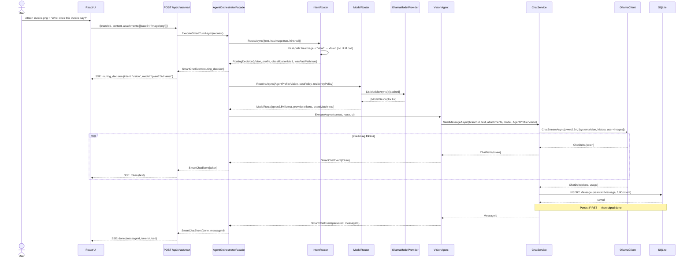

---

### 7.2 Flow 2 — Code Request

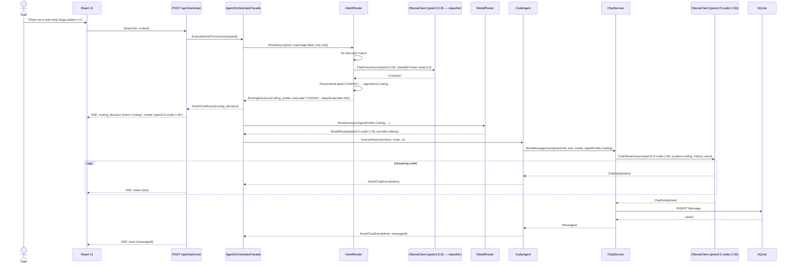

---

### 7.3 Flow 3 — Architecture & Design

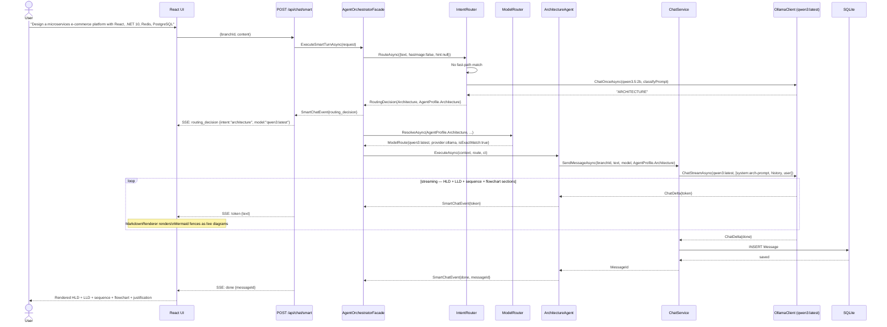

---

### 7.4 Flow 4 — Image Generation

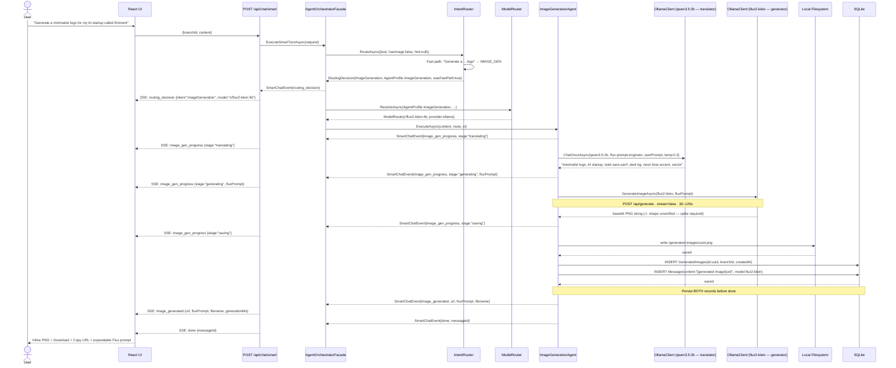

---

### 7.5 Flow 5 — General Request

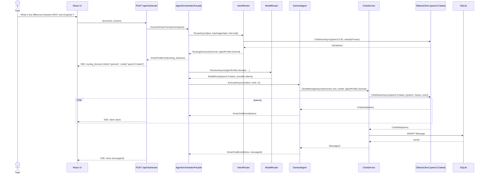

---

### 7.6 Flow 6 — Intent Classification (Internal)

Shows the full internal logic of `IntentRouterService.RouteAsync` including telemetry and defensive parsing.

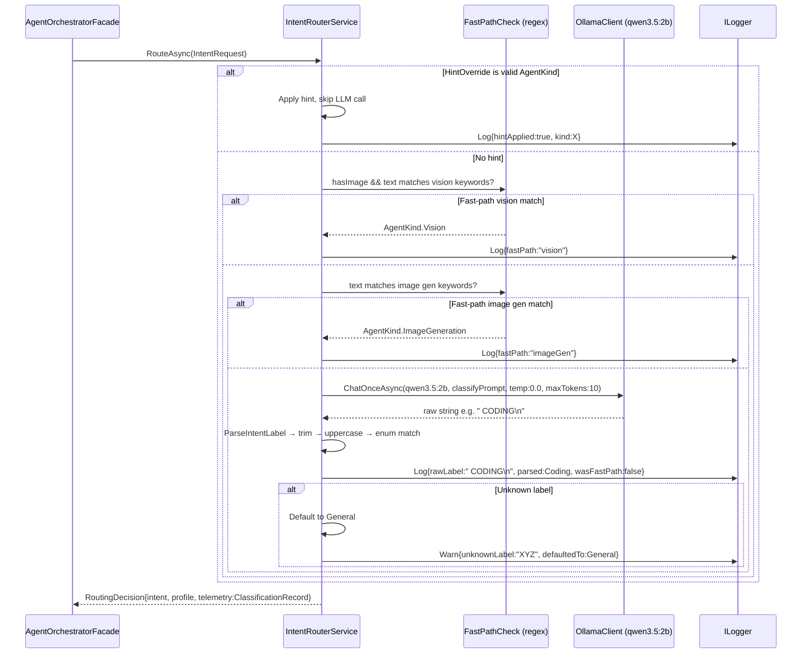

---

### 7.7 Flow 7 — Provider Fallback Chain

Shows how `ModelRouter` behaves when the preferred local model is unavailable.

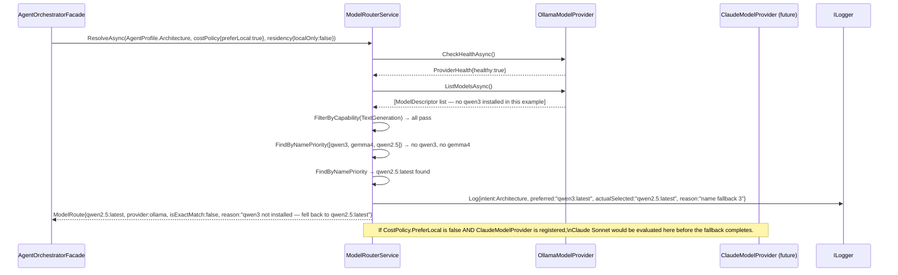

---

## 8. Overall Orchestration Flowchart

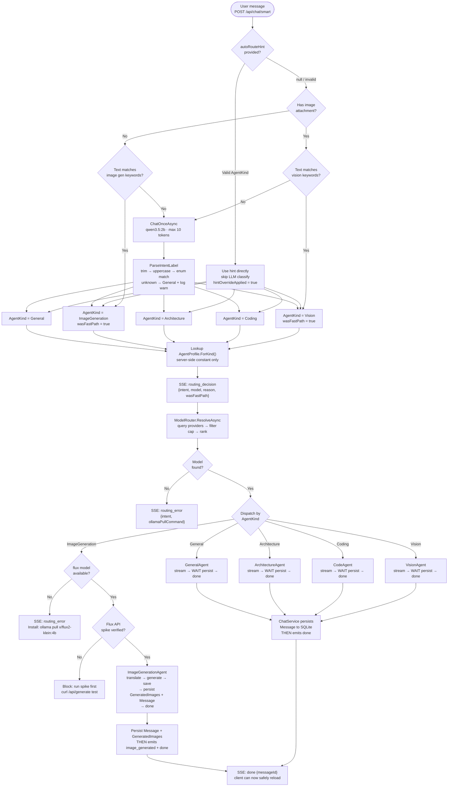

---

## 9. Smart Endpoint Contract

### Request

```
POST /api/chat/smart
Authorization: Bearer <session-token>
Content-Type: application/json

{
  "branchId": "guid",
  "content": "string — user's message text",
  "attachments": [                              // optional
    {
      "name": "invoice.png",
      "contentType": "image/png",
      "dataBase64": "iVBORw0KGgo..."            // base64, no data-URL prefix
    }
  ],
  "autoRouteHint": "vision|coding|architecture|imageGeneration|general"
                                                // optional; validated to AgentKind enum
                                                // advisory — actual route returned in routing_decision
}
```

### SSE Event Stream

```
── always first: ─────────────────────────────────────────────

event: routing_decision
data: {
  "intent": "vision",
  "model": "qwen2.5vl:latest",
  "provider": "ollama",
  "reason": "fast-path: image attached and text contains 'what'",
  "classificationMs": 1,
  "wasFastPath": true,
  "hintOverrideApplied": false
}

── for text responses (Vision / Code / Architecture / General): ─

event: token
data: { "text": "The invoice shows a total of £1,234.56..." }

── persist happens here (invisible to client) ────────────────

event: done
data: { "messageId": "guid", "tokensIn": 312, "tokensOut": 89 }

── for image generation: ─────────────────────────────────────

event: image_gen_progress
data: { "stage": "translating" }

event: image_gen_progress
data: {
  "stage": "generating",
  "fluxPrompt": "minimalist logo, AI startup, bold sans-serif, neon blue accent..."
}

event: image_gen_progress
data: { "stage": "saving" }

── persist happens here (invisible to client) ────────────────

event: image_generated
data: {
  "url": "/api/generated-images/3f7a9b2e-1234-5678-abcd-ef1234567890.png",
  "filename": "3f7a9b2e-1234-5678-abcd-ef1234567890.png",
  "fluxPrompt": "minimalist logo, AI startup, bold sans-serif...",
  "generationMs": 47320
}

event: done
data: { "messageId": "guid" }

── on error: ─────────────────────────────────────────────────

event: routing_error
data: {
  "intent": "imageGeneration",
  "message": "No image generation model installed.",
  "ollamaPullCommand": "ollama pull x/flux2-klein:4b"
}
```

### Generated Image Serve Endpoint

```
GET /api/generated-images/{filename}
Authorization: Bearer <session-token>     ← required; same auth as all other endpoints
```

- `filename` validated against `^[0-9a-f]{8}-[0-9a-f]{4}-[0-9a-f]{4}-[0-9a-f]{4}-[0-9a-f]{12}\.png$`.
- `Path.GetFullPath` check confirms resolved path is within `generated-images/` directory.
- Ownership verified: `GeneratedImages.BranchId` must belong to a conversation accessible to the session.
- `Content-Type: image/png` always set explicitly; never inferred from extension.
- Returns 400 for invalid filename, 401 for no/invalid session, 403 for ownership mismatch, 404 if file not found.

---

## 10. New SSE Event Types

| Event | Emitted by | When | Required fields |
|---|---|---|---|
| `routing_decision` | `AgentOrchestratorFacade` | Always, before first token | `intent`, `model`, `provider`, `reason`, `classificationMs`, `wasFastPath`, `hintOverrideApplied` |
| `image_gen_progress` | `ImageGenerationAgent` | 3× during generation | `stage` ("translating" / "generating" / "saving"); `fluxPrompt` on "generating" |
| `image_generated` | `ImageGenerationAgent` | After PNG saved AND persisted | `url`, `filename`, `fluxPrompt`, `generationMs` |
| `routing_error` | `AgentOrchestratorFacade` | When no model resolved | `intent`, `message`, `ollamaPullCommand`? |

Existing events (`token`, `done`, `error`) are unchanged. Ordering guarantee: `done` is **always** emitted after both stream completion and durable DB persistence.

---

## 11. Backend File Map

### New files

```
src/EminentAi.Application/
├── Agents/
│   ├── AgentKind.cs                       ← enum: Vision Coding Architecture ImageGeneration General
│   ├── AgentProfile.cs                    ← sealed record: Kind, SystemPrompt, Temperature, RequiredCapabilities
│   ├── AgentProfiles.cs                   ← static class: server-side constants, ForKind(AgentKind)
│   ├── ISpecializedAgent.cs               ← interface: Kind, ExecuteAsync(context, route, ct)
│   ├── SmartChatContext.cs                ← record: BranchId, UserText, Attachments, Routing, AssistantMessageId
│   ├── SmartChatEvent.cs                  ← record: Type, Data
│   ├── VisionAgent.cs
│   ├── CodeAgent.cs
│   ├── ArchitectureAgent.cs
│   ├── GeneralAgent.cs
│   └── ImageGeneration/
│       ├── ImageGenerationAgent.cs
│       └── ImageGenerationResult.cs       ← record: Filename, ServedUrl, FluxPrompt, GeneratorModel, GenerationMs
│
├── Routing/
│   ├── IIntentRouter.cs                   ← interface: RouteAsync
│   ├── IntentRequest.cs                   ← record: UserText, HasImageAttachment, ContentTypes, HintOverride
│   ├── RoutingDecision.cs                 ← record: Intent, Profile, ModelRoute, ClassifierModel, Ms, Telemetry
│   ├── ClassificationRecord.cs            ← record: RawLabel, WasFastPath, ConfidenceHint, HintOverrideApplied
│   ├── IModelRouter.cs                    ← interface: ResolveAsync
│   └── ModelRoute.cs                      ← record: Model, ProviderName, Profile, SelectionReason, IsExactMatch
│
└── Orchestration/
    └── AgentOrchestratorFacade.cs         ← owns full turn: intent → model → agent → persist → SSE

src/EminentAi.Infrastructure/
├── Providers/
│   ├── IModelProvider.cs                  ← interface: Name, ListModelsAsync, StreamAsync, CheckHealthAsync
│   ├── ModelDescriptor.cs                 ← record: Name, ProviderName, Capabilities, SizeBytes, Tier, IsAvailable
│   ├── ModelCapability.cs                 ← enum: TextGeneration Vision ImageGeneration Embedding Reasoning ...
│   ├── ModelInvocation.cs                 ← record: ModelName, Messages, Profile, ImageBase64
│   ├── ProviderHealth.cs                  ← record: ProviderName, IsHealthy, ErrorMessage, CheckedAt
│   ├── CostPolicy.cs                      ← record: PreferLocal, MaxCostPerTokenUsd, BlockedProviders
│   ├── DataResidencyPolicy.cs             ← record: LocalOnly, AllowedRegions
│   └── OllamaModelProvider.cs             ← implements IModelProvider via IOllamaClient
│
└── Routing/
    ├── IntentRouterService.cs             ← fast-path + qwen3.5:2b + defensive parse + telemetry
    └── ModelRouterService.cs              ← multi-provider ranking, capability filter, name priority
```

### Modified files

```
src/EminentAi.Application/Abstractions/IOllamaClient.cs
  + Task<string> GenerateImageAsync(string model, string prompt, CancellationToken ct)
  // ⚠ implement only AFTER running the Flux API spike to confirm response shape

src/EminentAi.Infrastructure/Ollama/OllamaClient.cs
  + GenerateImageAsync → POST /api/generate {model, prompt, stream:false}
  + ClassifyTier() updated: add "image_gen" tier for models matching *flux* or *diffusion*

src/EminentAi.Application/Chat/ChatService.cs
  + SendMessageAsync accepts AgentProfile? profile (not string)
  + BuildContext uses profile.SystemPrompt when profile is not null, otherwise conversation.SystemPrompt

src/EminentAi.Api/Program.cs
  + Register IIntentRouter, IModelRouter, IModelProvider (OllamaModelProvider)
  + Register all ISpecializedAgent implementations
  + Register AgentOrchestratorFacade
  + Register CostPolicy and DataResidencyPolicy (from config)
  + POST /api/chat/smart → AOF.ExecuteSmartTurnAsync → SSE
  + GET  /api/generated-images/{filename} → auth + ownership + file serve
  + Bootstrap: CREATE TABLE IF NOT EXISTS "GeneratedImages" ...

src/EminentAi.Infrastructure/Persistence/EminentAiDbContext.cs
  + DbSet<GeneratedImage> GeneratedImages

src/EminentAi.Domain/Models.cs
  + class GeneratedImage { Id, BranchId, CreatedAt }
```

---

## 12. Frontend File Map

### New files

```
web/src/
├── components/
│   ├── RoutingBadge.tsx          ← pill: "Vision • qwen2.5vl:latest" with intent icon + fade-in
│   └── GeneratedImage.tsx        ← inline image + Download + Copy URL + expandable Flux prompt
└── lib/
    └── intentMeta.ts             ← intent → { label, icon, badgeColor } mapping
```

### Modified files

```
web/src/lib/api.ts
  + smartChat(branchId, content, attachments?, hint?, onEvent): Promise<void>

web/src/lib/types.ts
  + RoutingDecision, ImageGenerationResult, SmartChatEvent union type

web/src/state/store.ts
  + routingDecision?: RoutingDecision   on Message
  + generatedImageUrl?: string           on Message
  + generatedFluxPrompt?: string         on Message

web/src/components/ChatMessage.tsx
  + Render <RoutingBadge> when message.routingDecision exists
  + Render <GeneratedImage> when message.generatedImageUrl exists

web/src/components/ChatView.tsx
  + Handle: routing_decision, token, image_gen_progress, image_generated, done, routing_error
  + Show progress indicator during image generation stages

web/src/components/Composer.tsx
  + Auto-route toggle (default: ON)
  + When ON: call smartChat(); when OFF: call existing sendMessage()
  + Image attached → set hint to "vision" automatically
```

### RoutingBadge design

```
┌─────────────────────────────────┐
│  👁 Vision  •  qwen2.5vl:latest │   purple background
│  </> Code   •  qwen2.5-coder    │   blue background
│  🗺 Arch    •  qwen3:latest     │   green background
│  🎨 Image   •  flux2-klein:4b   │   orange background
│  💬 General •  qwen2.5:latest   │   grey background
└─────────────────────────────────┘
Appears below the user message, above the assistant reply.
Fades in with 200ms opacity transition.
Shows provider name when non-Ollama: "Vision • claude-3-5-sonnet (Claude)"
```

### GeneratedImage component

```
┌──────────────────────────────────────────────────────┐
│                                                      │
│          [Generated PNG — rendered inline]           │
│          max-width: 512px, border-radius: 8px        │
│          Loading spinner during image_gen_progress   │
│                                                      │
├──────────────────────────────────────────────────────┤
│  [↓ Download]   [⧉ Copy URL]   [▾ Flux prompt]     │
├──────────────────────────────────────────────────────┤
│  minimalist logo, AI startup, bold sans-serif,       │  ← expandable, collapsed by default
│  neon blue accent, vector art, professional...       │
└──────────────────────────────────────────────────────┘
```

---

## 13. Changes to Existing Files

| File | What Changes | Why |
|---|---|---|
| [IOllamaClient.cs](../src/EminentAi.Application/Abstractions/IOllamaClient.cs) | Add `GenerateImageAsync` | Flux2 uses `/api/generate`, not `/api/chat` — after Flux spike |
| [OllamaClient.cs](../src/EminentAi.Infrastructure/Ollama/OllamaClient.cs) | Implement `GenerateImageAsync`; update `ClassifyTier` for `image_gen` | After spike to confirm response shape |
| [ChatService.cs](../src/EminentAi.Application/Chat/ChatService.cs) | Accept `AgentProfile?` not `string?` | Prevents raw string injection; server-side constants only |
| [EminentAiDbContext.cs](../src/EminentAi.Infrastructure/Persistence/EminentAiDbContext.cs) | Add `GeneratedImages` DbSet | Image ownership verification for auth |
| [Models.cs](../src/EminentAi.Domain/Models.cs) | Add `GeneratedImage` entity | DB-backed image ownership |
| [Program.cs](../src/EminentAi.Api/Program.cs) | New DI registrations, 2 new endpoints, bootstrap SQL | Wire entire new layer |
| [store.ts](../web/src/state/store.ts) | Add routing fields to Message | Badge survives re-renders |
| [ChatView.tsx](../web/src/components/ChatView.tsx) | Handle 4 new SSE event types | Routing badge, image display, progress, errors |
| [ChatMessage.tsx](../web/src/components/ChatMessage.tsx) | Render `RoutingBadge` + `GeneratedImage` | Message-level routing metadata |
| [Composer.tsx](../web/src/components/Composer.tsx) | Auto-route toggle | Smart vs manual mode switch |

---

## 14. Implementation Order

**Principle:** build the routing + text path first, validate it end-to-end, then add image generation after running the Flux spike. Never block text routing on the image pipeline.

```mermaid
gantt
    title Implementation Sequence (v2)
    dateFormat  X
    axisFormat  Step %s

    section Spike First
    Flux /api/generate spike: verify response shape          :crit, s1, 1, 2

    section Core Contracts
    AgentKind · AgentProfile · AgentProfiles (constants)    :b1, 2, 3
    ISpecializedAgent · SmartChatContext · SmartChatEvent    :b2, 3, 4
    IModelProvider · ModelDescriptor · ModelCapability       :b3, 4, 5
    IIntentRouter · IntentRequest · RoutingDecision          :b4, 5, 6
    IModelRouter · ModelRoute · CostPolicy · DataResidency   :b5, 6, 7

    section Routing Layer
    IntentRouterService (fast-path + qwen3.5:2b + parse + log)  :b6, 7, 8
    OllamaModelProvider (wraps IOllamaClient)                    :b7, 8, 9
    ModelRouterService (multi-provider rank + fallback)          :b8, 9, 10

    section Text Agents
    ChatService: AgentProfile param (not string)             :b9, 10, 11
    VisionAgent · CodeAgent · ArchitectureAgent · General    :b10, 11, 12
    AgentOrchestratorFacade                                  :b11, 12, 13

    section API — Text Path
    POST /api/chat/smart (text intents only)                 :b12, 13, 14
    DI registration in Program.cs                            :b13, 14, 15

    section Frontend — Text Path
    types.ts · api.ts smartChat()                            :f1, 15, 16
    store.ts routing fields on Message                       :f2, 16, 17
    RoutingBadge.tsx · ChatMessage.tsx · ChatView.tsx        :f3, 17, 18
    Composer.tsx auto-route toggle                           :f4, 18, 19

    section Image Generation (after spike)
    IOllamaClient + GenerateImageAsync (spike result)        :b14, 19, 20
    OllamaClient implements GenerateImageAsync               :b15, 20, 21
    GeneratedImage entity + DB table + ownership check       :b16, 21, 22
    ImageGenerationAgent (translate + generate + save)       :b17, 22, 23
    GET /api/generated-images/:file (auth + ownership)       :b18, 23, 24
    GeneratedImage.tsx frontend component                    :f5, 24, 25
```

---

## 15. Model Fallback Matrix

| Intent | Preferred | Fallback 1 | Fallback 2 | No model found |
|---|---|---|---|---|
| Vision | `qwen2.5vl:latest` | Any `*vl*` name | Any `vision` capability model | `routing_error` — include `ollama pull qwen2.5vl` |
| Coding | `qwen2.5-coder:1.5b` | Any `*coder*` name | Any `fast` tier model | Any `balanced` tier model |
| Architecture | `qwen3:latest` | `gemma4:e4b` | `qwen2.5:latest` | Largest `balanced` tier model |
| ImageGeneration | `x/flux2-klein:4b` | Any `*flux*` name | Any `image_gen` tier | `routing_error` — include `ollama pull x/flux2-klein:4b` |
| General | `qwen2.5:latest` | Any `balanced` tier | Any `fast` tier | Any installed model |

When a future `ClaudeModelProvider` is registered and `CostPolicy.PreferLocal = false`, the router will evaluate Claude's `ModelDescriptor` candidates before the local tier-fallback path. The fallback matrix above applies only to the Ollama provider.

---

## 16. Security Considerations

### System prompt — no raw string override

`ChatService.SendMessageAsync` accepts `AgentProfile? profile`. The profile's `SystemPrompt` is a compile-time constant defined in `AgentProfiles.cs`. No path from user input, HTTP body, query string, or tool result ever reaches `SystemPrompt`. The old `string? systemPromptOverride` approach was removed in this revision because it could not be enforced at the call site.

### Generated image auth and ownership

`GET /api/generated-images/{filename}` is **not** open. It requires the same bearer token as all other authenticated endpoints. After token validation, the endpoint checks `GeneratedImages` table: `BranchId` must belong to a conversation accessible to that session. A valid session holder cannot access images generated in another session's branch.

### Filename validation — two independent layers

```csharp
// Layer 1: regex — rejects anything that is not a UUID .png
if (!Regex.IsMatch(filename, @"^[0-9a-f]{8}-[0-9a-f]{4}-[0-9a-f]{4}-[0-9a-f]{4}-[0-9a-f]{12}\.png$"))
    return Results.BadRequest();

// Layer 2: path containment — defence in depth against regex edge cases
var resolved = Path.GetFullPath(Path.Combine(outputDir, filename));
if (!resolved.StartsWith(outputDir, StringComparison.OrdinalIgnoreCase))
    return Results.BadRequest();
```

### Classifier output is never trusted as instructions

`ParseIntentLabel` strips everything except `[A-Z_]` after uppercasing. It matches against a closed enum. Unknown labels default to `General`. The raw label is logged but never passed into a system prompt, SQL query, file path, or tool argument.

### Flux prompt subject to PII redaction

The translated Flux prompt is user-visible and stored in SQLite. It passes through `IPiiRedactor` before persistence, same as all other message content.

### `generated-images/` excluded from version control

Add to `.gitignore`:

```gitignore
# AI-generated images — local only, not committed
src/EminentAi.Api/generated-images/
web/public/generated-images/
**/generated-images/*.png
```

---

## 17. Operational Notes

### VRAM management and model warm-up

Ollama swaps models to fit VRAM. With `keep_alive: "10m"` already in `OllamaClient.BuildPayload`, the classifier (`qwen3.5:2b`) and the last-used chat model stay warm between turns. However:

- `flux2-klein:4b` requires a full model swap — the first image generation after any text exchange will have a 5–15 second cold-start before diffusion begins. The `image_gen_progress {stage:"generating"}` SSE event arrives before this delay, which is why it is mandatory UX.
- On 16 GB machines, `gemma4:e4b` (9.6 GB) may force unloading everything else. Monitor `/api/ollama` loaded models and add a warning badge in the UI if a large model will require a swap.

### Classifier telemetry corpus

To detect silent misrouting (unknown label defaulting to `General`), maintain a test corpus:

```json
// /tests/IntentRouterTests/routing-corpus.json
[
  { "text": "generate a dark mode logo for TechCorp", "expected": "ImageGeneration" },
  { "text": "show me a real-world repository pattern in .NET", "expected": "Coding" },
  { "text": "design a CQRS system for an e-commerce API", "expected": "Architecture" },
  { "text": "what does this receipt say?", "hasImage": true, "expected": "Vision" },
  { "text": "explain what recursion is", "expected": "General" }
]
```

Run this corpus in a unit test against `IntentRouterService` to catch regressions when the classifier model changes.

### Adding a new provider (e.g. Claude)

1. Create `ClaudeModelProvider : IModelProvider` in `EminentAi.Infrastructure/Providers/`.
2. Register it in DI.
3. Add `"claude"` to `CostPolicy.BlockedProviders` if local-only is preferred.
4. No other code changes — `ModelRouterService` queries all registered providers automatically.

---

*Document version: 2.0 — 2026-06-14*
*Supersedes version 1.0 — all v1 findings addressed.*
