# Agent-to-Agent Orchestration Architecture

> **EminentAi — Multi-Agent Routing System**
> Version 4.0 — local model order: `ornith-1.5:9b` for Coding & Architecture (and classifier fallback), `gemma4:e4b` for General / Classifier / Infographic Content Analyst, `qwen3-vl:latest` for Vision (also used to describe reference images in the image-gen pipeline, fallback `qwen3.5:9b`), `x/flux2-klein:4b` for image generation (fallback `x/z-image-turbo`). Current implementation keeps facade-level intent/model routing sequential, while MCP discovery and model-provider checks are parallelized internally.
> Provider-agnostic: Ollama local models today, Claude / ChatGPT / Copilot extensible by design.

---

## Revision Notes

### v3.9 → v4.0 (§18.7 Phases 2–4 Implemented, With Two Deliberate Scope Cuts)

All four roadmap phases were attempted. Two were implemented exactly as designed; two were implemented with a deliberate, documented scope reduction from the original blueprint, because completing them as originally written would have meant shipping unverifiable or previously-disproven behavior. `dotnet build EminentAi.slnx` and `npx tsc -b` both pass with zero errors.

| Phase | Status | What actually shipped |
|---|---|---|
| **Phase 2 — UI-Affordance Routing** | Done, as designed | `Composer.tsx`: three explicit route buttons (Code/Architecture/Infographic) send `manualRouteOverride` as a one-shot per-message selection; attaching an image now implies Vision the same way (previously only claimed in §13, never implemented — closes that gap too). `manualRouteOverride` now applies even when the "Auto" toggle is off. `RoutingDecision` gained a `source: 'ui-affordance' \| 'tool-call' \| 'fast-path'` field; `RoutingBadge` shows "you selected" vs "model decided" vs "fast-path" |
| **Phase 3 — Tool-Calling Fallback** | Done, **scoped down** | `IntentRouterService` deleted; `ToolCallingIntentResolver` (new) resolves free-text intent via native tool-calling instead of a hand-parsed one-word label — this genuinely removes §18.2 item 3's raw-string fragility and item 6's quoted-string false-positive. **Not implemented:** reusing that call's own output as the final General-case answer (the "zero extra inference" pseudocode in §18.5.3). Doing so safely requires re-plumbing `ChatService`/`GeneralAgent`'s persistence path, which could not be verified without a live Ollama instance in this session — attempting it blind risked silent double-persistence or dropped messages. So a free-text turn still costs one dedicated classification round-trip, same as before v4.0, but the round-trip itself is now structurally sound |
| **Phase 4 — Robust Media Engine** | Done, **scoped down** | `FluxImageGenerator.GenerateViaCliAsync` now kills the OS process tree (`Process.Kill(entireProcessTree: true)`) when the token is cancelled or the 15-minute timeout fires — this is the concrete, verifiable half of §18.2 item 2 (orphan processes) and required no change to response parsing. **Not implemented:** migrating from `ollama run` CLI to a direct HTTP `/api/generate` call. The v3.1→v3.2 revision notes record that this exact HTTP path was tried first and abandoned specifically because of Flux-model response-shape uncertainty across variants — reverting to it now, without a live instance running `x/flux2-klein:4b`/`x/z-image-turbo` to verify against, risks reintroducing a previously-fixed defect. This migration should be done with a live Ollama instance to test against, not blind |

**Why the two cuts:** both Phase 3 and Phase 4's full designs trade a verified, working mechanism for an unverified one, on the promise of a latency or architecture win. Per this document's own §18.3 standard (reject a rewrite unless the win survives scrutiny), shipping either change without the ability to test it against a live Ollama instance would be the same mistake §18.3 criticizes elsewhere — swapping something that works for something that looks better on paper. Both remain natural next steps once manual verification against a running instance is possible.

---

### v3.8 → v3.9 (§18.7 Phase 1 Implemented)

Phase 1 of the v4.1 roadmap (§18.7) is implemented on `feature/AI-Desktop-App` and builds clean (`dotnet build EminentAi.slnx`, 0 errors).

| Roadmap item | Status | Where |
|---|---|---|
| GPU Work Coordinator & Concurrency Lock | Done | `IGpuWorkCoordinator`/`GpuWorkCoordinator` (new); `AgentOrchestratorFacade` acquires a lease for the full duration of every agent turn before dispatch |
| Eliminate Global VRAM Eviction race (§18.2 item 1) | Done, scoped as designed | Not implemented by removing `ImageGenerationAgent`'s snapshot/evict/restore dance (that still requires §18.5.2's HTTP sidecar to be safe) — implemented by making concurrent eviction impossible: the GPU lease serializes all turns, so no turn can be mid-stream while another evicts models |
| Config-driven Model Matrix (appsettings.json) | Done | New `ModelMatrixOptions` (`EminentAi.Application/Configuration`), bound from `EminentAi:ModelMatrix` in `appsettings.json`; replaces hardcoded constants in `IntentRouterService`, `ModelRouterService.NamePriorities`, and `ImageGenerationAgent` |
| Fix doc/code drift: Vision override abort (§18.2 item 5) | Done | `AgentOrchestratorFacade`: a rejected override now falls through to `IIntentRouter.ClassifyAsync` instead of emitting `routing_error` and aborting the turn; the rejection reason is preserved in `ClassificationRecord.OverrideRejectedReason` and echoed in the `routing_decision` SSE payload (new field) |
| PII redaction on model-echoed text (§18.2 item 7) | Done, bundled in with this pass | `ImageGenerationAgent` now redacts `Understanding`, `Description`, and `FluxPrompt` once immediately after analysis, before anything is emitted or persisted — previously `FluxPrompt` was only redacted per-image at generation time and `Understanding`/`Description` were never redacted at all |
| Dead code: `IOllamaClient.GenerateImageAsync` (§18.2 item 8) | Done, bundled in with this pass | Removed from `IOllamaClient` and `OllamaClient`, along with the now-unused private `OllamaGenerateResponse` DTO |

**Deferred to Phase 2/3, not attempted in this pass:** UI-affordance mode buttons (§18.5.4), tool-calling intent resolution (§18.5.3), removing the quoted-string fast-path (§18.2 item 6), and the HTTP/IPC media sidecar (§18.5.2) that would let the VRAM-eviction dance itself be removed rather than just made safe under concurrency.

---

### v3.7 → v3.8 (Second-Pass Verification — Dead Code Confirmed, One Finding Rejected)

A second independent review pass re-checked v3.7 against the actual source. One of its two new claims held up under verification; the other did not.

| Finding | Severity | Resolution |
|---|---|---|
| `IOllamaClient.GenerateImageAsync` / `OllamaClient.GenerateImageAsync` are fully implemented but have zero call sites — the real pipeline uses `FluxImageGenerator`'s CLI path instead | High — confirmed by source grep | Added as §18.2 item 8; annotated the stale §13/§14 rows that still list it as "to add"; added removal to the §18.8 file map alongside the `DiffusionSidecarClient` work |
| `src/EminentAi.Application/Class1.cs` (and `Infrastructure`/`Domain` siblings) flagged as "unused template boilerplate" | Rejected — checked by reading the files | All three already contain only `// (intentionally empty — placeholder removed)`. Not live scaffold code. Recorded as a rejected finding in §18.2 item 8's note so it isn't re-raised by a future pass |
| §18.4's target-architecture diagram didn't visualize the §18.2 item 7 PII-redaction-of-echoed-text fix | Medium | Added an explicit `PiiGate` node on the ingestion path, with a dashed feedback edge from the Infographic Pipeline Orchestrator showing that model-echoed `Understanding`/`Description` text is redacted before emission, not just user input |

---

### v3.6 → v3.7 (§18 Redesigned — Tool-Calling & UI-Affordance Routing, Doc/Code Drift Fixes)

This revision replaces the entire §18 blueprint following an independent architect review. The review (a) diffed §18's own claims against the actual `feature/AI-Desktop-App` code and found real doc/code contract drift in the sections §18 did *not* cover, and (b) rejected two of §18 v1's four subsystem proposals as over-engineered for a single-user local desktop app, in favor of patterns closer to what shipped agent products (Cursor, Claude Code, Copilot) and LLM-routing products (OpenRouter, Martian) actually use.

| Finding | Severity | Resolution |
|---|---|---|
| §6.1/§8/§16 claim a `Vision` override without an image "falls through to classify normally"; `AgentOrchestratorFacade.cs` actually emits `routing_error` and aborts the turn | High | Documented as a real behavioral bug in §18.2 (item 5); target architecture in §18.4 removes the override-rejection dead-end entirely by letting the model itself see the lack of an image and decide |
| §4.3 declares `ClassificationRecord.OverrideRejectedReason` as `AgentKind?`; actual record is `string?` | Low | Documented in §18.2 (item 5) as doc/code contract drift |
| §6.2's fast-path table omits that `ImageGenKeywords` also matches any bare quoted-string message (`"..."`, `"...", "..."`), which can misroute quoted OCR/Vision text into image generation | Medium | Documented in §18.2 (item 6); eliminated in the target architecture by moving image-gen triggering to an explicit UI affordance instead of regex-on-free-text |
| `IPiiRedactor` is applied to `userText` and the Flux prompt but not to `understanding`/`description`, which are echoed into SSE and persisted verbatim | Medium | Documented in §18.2 (item 7); target architecture requires all model-echoed text to pass through redaction before emission, not just user-authored text |
| §18 v1 proposed an ONNX/MiniLM embedding-centroid router as the primary latency fix | Rejected | Removed. A hand-maintained centroid classifier requires an ongoing labeled corpus and threshold tuning to save ~500ms on a path dominated by 30–180s image generation. Superseded by tool-calling-based intent resolution (§18.4) and UI-affordance routing (§18.5), matching how Cursor/Claude Code/Copilot avoid a dedicated classifier entirely — see §18.3 |
| §18 v1 proposed migrating specialized agents to Microsoft Semantic Kernel | Rejected | Removed. Buys OpenTelemetry/filters at the cost of a framework dependency with a history of breaking API rewrites, for a working, understood ~2000-line orchestrator. The same observability gain is available by adding `System.Diagnostics.Activity` spans directly — see §18.3 |
| §18 v1's GPU Work Coordinator and HTTP/IPC media sidecar proposals | Kept | Both are genuine hardware-constraint fixes, independent of the routing-strategy question — carried forward unchanged into §18.4/§18.5 |

---

### v3.5 → v3.6 (Verified Against Implementation — ImageGenerationAgent Redesign)

This revision was produced by diffing the doc against the actual code on `feature/AI-Desktop-App` (43 files ahead of `origin/main`). Routing core (§§4–8) matched the implementation closely; `ImageGenerationAgent` had diverged completely.

| Finding | Severity | Resolution |
|---|---|---|
| `ImageGenerationAgent` doc described a single-logo "translate → generate" pipeline; actual code is a fixed-template **educational infographic generator** | High | Rewrote §6.6, §7.4, §9, §10 around the real pipeline: `InfographicPromptBuilder` (fixed design, variable content), multi-infographic output, `GeneratedImage[]` not a single URL |
| Classifier fallback documented as `qwen3.5:9b` | Medium | `IntentRouterService.cs:20` uses `ornith-1.5:9b` as the fallback classifier — fixed in §6.2 |
| Image-gen fallback model `x/z-image-turbo` undocumented | High | `FluxImageGenerator.cs:13` defines it as the fallback for `x/flux2-klein:4b`; added to §15 and the SSE stage table (`primary_model_failed`) |
| Reference-image description stage (Stage 0, vision model) undocumented | High | `ImageGenerationAgent.cs:130` describes attached reference images via `qwen3-vl:latest` (fallback `qwen3.5:9b`) before content analysis; added to §6.6 |
| Shared `FluxImageGenerator` static class not in file map | Medium | Extracted so both `ImageGenerationAgent` and the Agent-mode `image.generate` builtin tool (`BuiltinToolRunner.cs:82`) call the same CLI-based generator; added to §11 |
| `SmartChatContext`/`SmartTurnRequest` gained `RequestTokenHash` | Low | Used for `GeneratedImages` ownership checks independent of `BranchId`; added to §4.5 and §11 |
| New top-level `AI_DESKTOP_APP_ARCHI.md` (Tauri + ASP.NET Core sidecar packaging plan) is a separate initiative, not reflected here | Info | Cross-referenced from §1 — it does not change anything in this document; it is a packaging/shell plan around the same backend |

### v3.4 → v3.5 (Specialized Local Model Matrix)

| Finding | Severity | Resolution |
|---|---|---|
| Pulled dedicated vision model `qwen3-vl:latest` | High | Vision routes now prefer `qwen3-vl:latest` over text-only fallbacks |
| Added 9B reasoning/coding model `ornith-1.5:9b` | Medium | Coding & Architecture routes prioritize `ornith-1.5:9b` for 9B reasoning depth; `gemma4:e4b` is primary for General, Classifier, and Infographic Analyst |
| Reference image describer updated | Medium | `ImageGenerationAgent` reference image analysis prioritizes `qwen3-vl:latest` |

### v3.3 → v3.4 (Local Model Priority)

| Finding | Severity | Resolution |
|---|---|---|
| Routing referenced local models that are no longer installed | High | Text routes now prefer `gemma4:e4b`, then `qwen3.5:9b` |
| Classifier and image analyst had no local-model fallback | Medium | Both use `gemma4:e4b` first and retry with `qwen3.5:9b` |
| Image routing must not leak into text selection | High | `x/flux2-klein:4b` remains capability-gated to `ImageGeneration` |

### v3.2 → v3.3 (Workspace Tools, Web Research, and IDE Agent)

| Finding | Severity | Resolution |
|---|---|---|
| Smart models could describe file changes but not perform them | High | Agent mode now exposes scoped filesystem, archive, shell, and web tools |
| Web agent was fixed to one repository root | High | `/api/agent/runs` accepts an explicit per-run local workspace path |
| Ollama tool-call history was flattened into text | High | Assistant `tool_calls`, IDs, and tool names are preserved across model turns |
| VS Code extension was chat-only | High | Added direct Ollama `WorkspaceAgent` with file, Git, command, and web tools |
| VS Code approvals were outside chat | Medium | Added in-chat approve-once, session-grant, and reject cards |
| Architecture diagrams rendered as source | Medium | Bundled Mermaid rendering in web and VS Code chats |
| Workspace rules were not persistent | Medium | `EminentAI.md` is re-read before every VS Code prompt |
| Web-search toggle had no execution path | Medium | Added official Ollama `web_search` and `web_fetch` integration with linked sources |

### v1 → v2

| Finding | Severity | Resolution |
|---|---|---|
| Bypassed `AgentOrchestrator` — not true A2A | High | Added `AgentOrchestratorFacade` owning full chain |
| "All local" hard-coded — no provider abstraction | High | Added `IModelProvider`, `ModelCapability`, `CostPolicy`, `DataResidencyPolicy` |
| `systemPromptOverride` as raw string | High | Replaced with `AgentProfile` — server-side constants only |
| `done` emitted before DB persistence | Medium | Fixed in all sequence diagrams |
| Classifier confidence / telemetry missing | Medium | Added `ClassificationRecord` |
| Flux API spike unverified | Medium | Spike task added to impl order; response shape documented as unconfirmed |
| Generated images served without auth | Medium | Bearer token + ownership check added |
| `autoRouteHint` semantics undefined | Medium | Treated as advisory; validated to enum |
| No `AgentProfile` record | Low | All agents use `AgentProfile` |
| Image gen first in impl order | Low | Text flows first; image gen implemented and depends on Flux returning base64 PNG in `response` |
| VRAM swapping unaddressed | PE note | `keep_alive` strategy documented |
| `generated-images/` not in `.gitignore` | PE note | Added to file map |

### v2 → v3

| Finding | Severity | Resolution |
|---|---|---|
| `routing_decision` emitted before model resolved but carries `model`+`provider` | High | AOF now resolves `ModelRoute` before emitting any SSE; ordering fixed in all sequence diagrams |
| `RoutingDecision` embeds `ModelRoute` — violates `IIntentRouter`'s responsibility | High | Split: `IIntentRouter` returns `IntentDecision` (intent only); AOF combines with `ModelRoute` for SSE payload |
| Provider DTOs in Infrastructure — Application depends on them | High | All provider interfaces and DTOs moved to `Application/Providers/`; Infrastructure holds implementations only |
| `AgentProfile.RequiredCapabilities` is `IReadOnlySet<string>` vs `IReadOnlySet<ModelCapability>` | Medium | Unified to `IReadOnlySet<ModelCapability>` everywhere |
| `DataResidencyPolicy` and `CostPolicy` unenforceable — `ModelDescriptor` lacks fields | Medium | Added `IsLocal`, `Region`, `InputTokenCostUsd`, `OutputTokenCostUsd` to `ModelDescriptor` |
| `autoRouteHint` is advisory but skips classification — semantics conflict | Medium | Renamed to `manualRouteOverride`; validation added: Vision requires image; missing models are handled by model resolution |
| `SmartChatContext.AssistantMessageId` preallocated but `ChatService` owns creation | Medium | Removed from context; `ChatService` creates the assistant message and surfaces the ID on deltas before persisting |
| `persisted` SSE event referenced in diagrams but absent from SSE contract | Low | Removed from sequence diagrams; persistence is an internal step; `done` is the client signal |

### v3 → v3.1 (Performance & Async Update)

| Finding | Severity | Resolution |
|---|---|---|
| Sequential intent + model resolution | Medium | Still sequential in `AgentOrchestratorFacade`; manual override skips classification, while model/provider health checks run in parallel inside `ModelRouterService` |
| Blocking security evaluation | High | `IPolicyEngine` refactored to `EvaluateAsync` for non-blocking loop persistence |
| Regex overhead in security | Medium | Added compiled `RegexCache` to `PolicyEngine` for glob pattern matching |
| Classifier latency on missing model | Low | Not proactively health-checked in `IntentRouterService`; failed classifier calls are caught and default to `General` |

### v3.1 → v3.2 (ImageGenerationAgent — Actual Implementation)

| Finding | Severity | Resolution |
|---|---|---|
| Analyst model was `qwen3.5:2b` in spec | High | Actual impl uses `qwen3:latest` — larger reasoning model for higher-quality Flux prompt expansion |
| Single-image pipeline in spec | High | Actual impl expands one request into N prompts, generates N images, streams each separately |
| `/api/generate` HTTP call for Flux | High | Actual impl uses `ollama run` CLI — avoids response-shape uncertainty; captures PNG from working directory or base64 in stdout |
| No VRAM management in spec | Medium | Actual impl snapshots loaded models → unloads all → runs Flux → restores; prevents VRAM OOM on 16 GB systems |
| SSE stages in spec: `translating`, `generating`, `saving` | Medium | Actual stages: `analyzing_request`, `analysis_done`, `freeing_vram`, `generating`, `saving`, `restoring_models` + `gen_failed`, `save_failed` |
| `ImageGenProgressPanel` not in frontend file map | Low | New component added: collapsible pipeline panel with per-step status, progress bar, A2A badge, model chips |
| `x/z-image-turbo` not in model table | Low | Added — 12 GB high-quality image generation model |

---

## Table of Contents

1. [Overview](#1-overview)
2. [Installed Ollama Models](#2-installed-ollama-models)
3. [Existing Infrastructure](#3-existing-infrastructure)
4. [Core Abstractions](#4-core-abstractions)
   - 4.1 [AgentKind & AgentProfile](#41-agentkind--agentprofile)
   - 4.2 [Provider Contracts — Application Layer](#42-provider-contracts--application-layer)
   - 4.3 [IIntentRouter & IntentDecision](#43-iintentrouter--intentdecision)
   - 4.4 [IModelRouter & ModelRoute](#44-imodelrouter--modelroute)
   - 4.5 [ISpecializedAgent & SmartChatContext](#45-ispecializedagent--smartchatcontext)
5. [High-Level Architecture (HLD)](#5-high-level-architecture-hld)
6. [Component Design (LLD)](#6-component-design-lld)
   - 6.1 [AgentOrchestratorFacade](#61-agentorchestratorfacade)
   - 6.2 [IntentRouterService](#62-intentrouterservice)
   - 6.3 [ModelRouterService](#63-modelrouterservice)
   - 6.4 [OllamaModelProvider](#64-ollamamodelprovider)
   - 6.5 [Specialized Agents](#65-specialized-agents)
   - 6.6 [ImageGenerationAgent](#66-imagegenerationagent)
7. [Sequence Diagrams](#7-sequence-diagrams)
   - 7.1 [Vision](#71-flow-1--vision)
   - 7.2 [Code](#72-flow-2--code)
   - 7.3 [Architecture](#73-flow-3--architecture)
   - 7.4 [Image Generation](#74-flow-4--image-generation)
   - 7.5 [General](#75-flow-5--general)
   - 7.6 [Classification Internal](#76-flow-6--classification-internal)
   - 7.7 [Provider Fallback](#77-flow-7--provider-fallback)
8. [Overall Orchestration Flowchart](#8-overall-orchestration-flowchart)
9. [Smart Endpoint Contract](#9-smart-endpoint-contract)
10. [SSE Event Reference](#10-sse-event-reference)
11. [Backend File Map](#11-backend-file-map)
12. [Frontend File Map](#12-frontend-file-map)
13. [Changes to Existing Files](#13-changes-to-existing-files)
14. [Implementation Order](#14-implementation-order)
15. [Model Fallback Matrix](#15-model-fallback-matrix)
16. [Security Considerations](#16-security-considerations)
17. [Operational Notes](#17-operational-notes)
18. [Architectural Critique & Next-Generation Alternatives (v4.1 Blueprint — Tool-Calling & UI-Affordance Routing)](#18-architectural-critique--next-generation-alternatives-v41-blueprint--tool-calling--ui-affordance-routing)
   - 18.1 [Architectural Review & Scorecard](#181-architectural-review--scorecard)
   - 18.2 [Critical Gaps & Fragility Analysis](#182-critical-gaps--fragility-analysis)
   - 18.3 [Rejected Alternatives & Industry Comparison](#183-rejected-alternatives--industry-comparison)
   - 18.4 [Proposed Target Architecture: Tool-Calling Intent Resolution](#184-proposed-target-architecture-tool-calling-intent-resolution)
   - 18.5 [Core Subsystem Design](#185-core-subsystem-design)
   - 18.6 [Target State Sequence Diagram](#186-target-state-sequence-diagram)
   - 18.7 [Migration & Phased Implementation Roadmap](#187-migration--phased-implementation-roadmap)
   - 18.8 [v4.1 File Map — What Actually Changes](#188-v41-file-map--what-actually-changes)

---

## 1. Overview

Every chat message today goes to whatever model the user manually selected. No intelligence routes by task type, and no abstraction allows swapping providers without rewriting infrastructure.

> **Related document:** [`AI_DESKTOP_APP_ARCHI.md`](../AI_DESKTOP_APP_ARCHI.md) is a separate, higher-level plan for packaging this same ASP.NET Core backend behind a Tauri desktop shell. It does not change anything described here — the smart-chat routing layer, agents, and SSE contract in this document are what the desktop shell would call over loopback HTTP.

This architecture inserts a **true orchestration layer** with a clean separation of concerns:

```
POST /api/chat/smart
  └─ AgentOrchestratorFacade          owns the entire turn
       ├─ IIntentRouter                classifies intent → IntentDecision   (no model knowledge)
       ├─ IModelRouter                 resolves model + provider → ModelRoute
       ├─ [emit routing_decision SSE]  only after both intent AND model are resolved
       ├─ ISpecializedAgent            executes, streams, persists
       │    └─ IModelProvider          Ollama today; Claude / ChatGPT tomorrow
       └─ ChatService                  persistence layer
```

`POST /api/branches/:id/messages` is **unchanged**. The smart path is additive.

---

## 2. Installed Ollama Models

```
NAME                       SIZE     TIER           ROLE
────────────────────────────────────────────────────────────────────────
gemma4:e4b                 9.6 GB   balanced       Default text model + classifier + image prompt analyst
ornith-1.5:9b              5.6 GB   reasoning      Text, coding, architecture, classifier fallback
qwen3-vl:latest            6.1 GB   vision         Dedicated vision-language model for image analysis
qwen3.5:4b                 2.8 GB   balanced       Fast/local fallback model
x/flux2-klein:4b           5.7 GB   image_gen      Image generation — Flux2 diffusion
```

**VRAM management:** `ImageGenerationAgent` takes an active approach — it snapshots all currently loaded models via `/api/ps`, unloads each with `keep_alive=0`, runs the Flux model, then fire-and-forgets `WarmUpModelAsync` for each previously loaded model. This prevents OOM on 16 GB systems when Flux needs the full VRAM budget. Progress is streamed via `image_gen_progress` SSE events so the UI is never silent during the 30–180 s generation window.

**Generation method:** `ImageGenerationAgent` uses the `ollama run <model> "<prompt>"` CLI — not `/api/generate`. This avoids response-shape uncertainty across Flux model variants. The agent checks the working directory for a written PNG first (Strategy A), then falls back to extracting base64 from stdout (Strategy B). Generation timeout is 15 minutes.

---

## 3. Existing Infrastructure

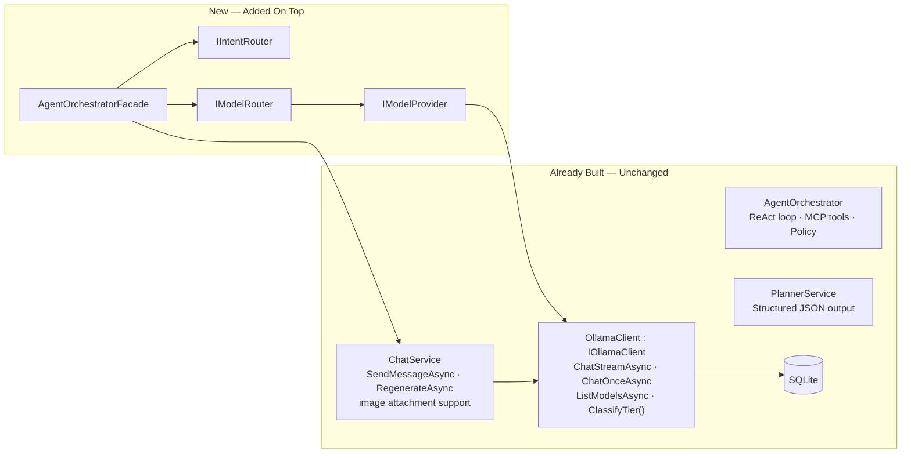

`AgentOrchestrator` (ReAct + tools) remains for agentic runs. `AgentOrchestratorFacade` is a separate, lighter path for chat-smart turns.

---

## 4. Core Abstractions

### 4.1 AgentKind & AgentProfile

`AgentProfile` is always a server-side compile-time constant. No code path accepts a raw string as a system prompt.

```csharp
// EminentAi.Application/Agents/AgentKind.cs
public enum AgentKind { Vision, Coding, Architecture, ImageGeneration, General }

// EminentAi.Application/Agents/AgentProfile.cs
public sealed record AgentProfile(
    AgentKind Kind,
    string SystemPrompt,
    float Temperature,
    IReadOnlySet<ModelCapability> RequiredCapabilities  // typed — matches ModelDescriptor.Capabilities
);

// EminentAi.Application/Agents/AgentProfiles.cs
public static class AgentProfiles
{
    public static readonly AgentProfile Vision = new(
        AgentKind.Vision,
        SystemPrompt: """
            You are a vision-capable AI assistant. When given an image:
            - Extract ALL visible text accurately, preserving structure (tables, lists, columns).
            - Describe diagrams, charts, or visuals that cannot be expressed as text.
            - Answer the user's specific question about the image.
            - For forms, invoices, or structured documents, present data in a markdown table.
            - Do not hallucinate content that is not visible.
            """,
        Temperature: 0.1f,
        RequiredCapabilities: new HashSet<ModelCapability> { ModelCapability.Vision }
    );

    public static readonly AgentProfile Coding = new(
        AgentKind.Coding,
        SystemPrompt: """
            You are an expert software engineer. When providing code:
            - Show complete, runnable examples — never pseudocode or stubs.
            - Use the language/framework the user specifies, or infer from context.
            - Include only the imports and setup that are actually needed.
            - If showing a real-world pattern, name it and explain the WHY in one sentence.
            - Prefer idiomatic, production-quality code.
            - If asked to debug, reproduce the error first, then fix it.
            """,
        Temperature: 0.1f,
        RequiredCapabilities: new HashSet<ModelCapability>()
    );

    public static readonly AgentProfile Architecture = new(
        AgentKind.Architecture,
        SystemPrompt: """
            You are a senior software architect. Structure every design response as:

            ## Summary
            One paragraph: the system's purpose and the core architectural decision.

            ## HLD — High-Level Diagram
            ```mermaid
            graph TB
              [services and connections]
            ```

            ## LLD — Data Model
            ```mermaid
            classDiagram
              [key entities and relationships]
            ```

            ## Primary Flow — Sequence Diagram
            ```mermaid
            sequenceDiagram
              [happy path from user action to result]
            ```

            ## Decision Flow — Flowchart
            ```mermaid
            flowchart LR
              [branching logic and routing decisions]
            ```

            ## Technology Justification
            Bullet list: why each major technology was chosen.

            Always wrap Mermaid in triple-backtick mermaid fences.
            """,
        Temperature: 0.3f,
        RequiredCapabilities: new HashSet<ModelCapability>()
    );

    public static readonly AgentProfile ImageGeneration = new(
        AgentKind.ImageGeneration,
        SystemPrompt: "",   // not used — ImageGenerationAgent bypasses ChatService
        Temperature: 0f,
        RequiredCapabilities: new HashSet<ModelCapability> { ModelCapability.ImageGeneration }
    );

    public static readonly AgentProfile General = new(
        AgentKind.General,
        SystemPrompt: "You are EminentAi, a helpful AI assistant running fully locally.",
        Temperature: 0.7f,
        RequiredCapabilities: new HashSet<ModelCapability>()
    );

    public static AgentProfile ForKind(AgentKind kind) => kind switch
    {
        AgentKind.Vision          => Vision,
        AgentKind.Coding          => Coding,
        AgentKind.Architecture    => Architecture,
        AgentKind.ImageGeneration => ImageGeneration,
        _                         => General
    };
}
```

---

### 4.2 Provider Contracts — Application Layer

All provider interfaces and DTOs live in `EminentAi.Application/Providers/`. Infrastructure holds only implementations.

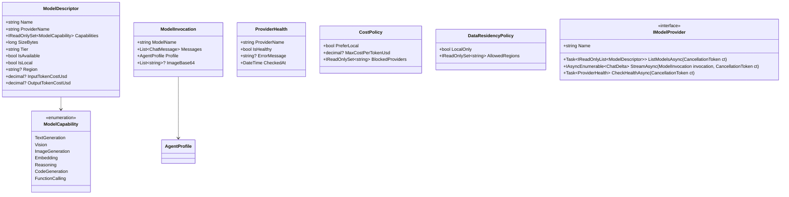

**`ModelDescriptor` enforcement fields:**

| Field | Used by | How |
| --- | --- | --- |
| `IsLocal` | `DataResidencyPolicy.LocalOnly` | Reject any `IsLocal == false` when `LocalOnly == true` |
| `Region` | `DataResidencyPolicy.AllowedRegions` | Reject if region not in allowed set |
| `InputTokenCostUsd` | `CostPolicy.MaxCostPerTokenUsd` | Skip model if cost exceeds cap |
| `OutputTokenCostUsd` | `CostPolicy.MaxCostPerTokenUsd` | Skip model if cost exceeds cap |

For Ollama-provided models: `IsLocal = true`, `Region = null`, `InputTokenCostUsd = 0`, `OutputTokenCostUsd = 0`. Future cloud providers supply real values.

---

### 4.3 IIntentRouter & IntentDecision

`IIntentRouter` knows nothing about models or providers. It returns only intent classification.

```csharp
// EminentAi.Application/Routing/IIntentRouter.cs
public interface IIntentRouter
{
    Task<IntentDecision> ClassifyAsync(IntentRequest request, CancellationToken ct = default);
}

// IntentDecision — intent + profile + telemetry. NO model, NO provider.
public sealed record IntentDecision(
    AgentKind Intent,
    AgentProfile Profile,
    string ClassifierModel,
    long ClassificationMs,
    ClassificationRecord Telemetry
);

public sealed record IntentRequest(
    string UserText,
    bool HasImageAttachment,
    IReadOnlyList<string> AttachmentContentTypes
    // manualRouteOverride is handled in AOF before reaching IIntentRouter
);

public sealed record ClassificationRecord(
    string RawLabel,
    bool WasFastPath,
    bool ManualOverrideApplied,
    AgentKind? OverrideRequestedKind,   // what the caller asked for
    AgentKind? OverrideRejectedReason   // null if override was accepted
);
```

**`RoutingDecision` is an AOF-internal record, not a contract.** It combines `IntentDecision` and `ModelRoute` for the SSE payload only:

```csharp
// EminentAi.Application/Orchestration/AgentOrchestratorFacade.cs (private)
private sealed record RoutingDecision(IntentDecision Intent, ModelRoute Route);
```

---

### 4.4 IModelRouter & ModelRoute

```csharp
// EminentAi.Application/Routing/IModelRouter.cs
public interface IModelRouter
{
    Task<ModelRoute?> ResolveAsync(
        AgentProfile profile,
        CostPolicy costPolicy,
        DataResidencyPolicy residencyPolicy,
        CancellationToken ct = default);
    // Returns null when no eligible model found across all providers.
}

// EminentAi.Application/Routing/ModelRoute.cs
public sealed record ModelRoute(
    ModelDescriptor Model,
    string ProviderName,
    string SelectionReason,
    bool IsExactMatch
);
```

---

### 4.5 ISpecializedAgent & SmartChatContext

```csharp
// EminentAi.Application/Agents/ISpecializedAgent.cs
public interface ISpecializedAgent
{
    AgentKind Kind { get; }

    /// <summary>
    /// Executes the agent turn. Must persist the message before yielding done.
    /// The done event is yielded only after ChatService has persisted the assistant message.
    /// </summary>
    IAsyncEnumerable<SmartChatEvent> ExecuteAsync(
        SmartChatContext context,
        ModelRoute route,
        CancellationToken ct);
}

// AssistantMessageId was removed from SmartChatContext. ChatService creates the assistant Message entity and surfaces its ID on streamed deltas before persisting it at the end of the stream.
// RequestTokenHash (added v3.6) is a hash of the caller's bearer token, independent of BranchId,
// used by ImageGenerationAgent to record per-session ownership on GeneratedImages rows.
public sealed record SmartChatContext(
    Guid BranchId,
    string UserText,
    IReadOnlyList<ChatAttachment> Attachments,
    IntentDecision Intent,
    string? RequestTokenHash
);

public sealed record SmartChatEvent(string Type, object Data);
```

---

## 5. High-Level Architecture (HLD)

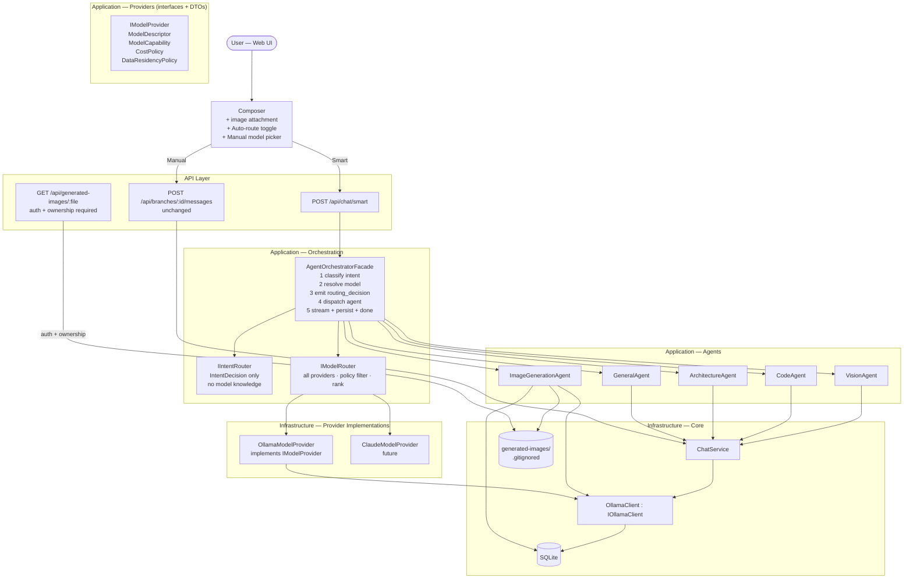

---

## 6. Component Design (LLD)

### 6.1 AgentOrchestratorFacade

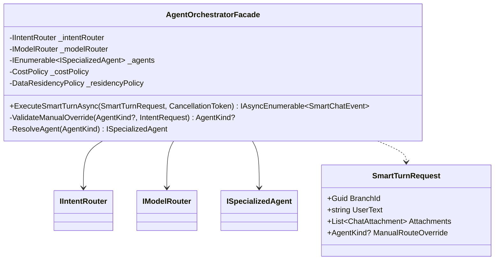

**Execution order inside `ExecuteSmartTurnAsync`:**

```text
1. ValidateManualOverride(request.ManualRouteOverride, intentRequest)
     → Vision override rejected if no image attached
     → ImageGeneration override is accepted here; missing image_gen model is handled by model resolution
     → Invalid enum value rejected by the API before facade execution

2. IIntentRouter.ClassifyAsync(intentRequest)
     → Returns IntentDecision (no model info)
     → Skipped when manualRouteOverride is valid

3. IModelRouter.ResolveAsync(profile, costPolicy, residencyPolicy)
     → Returns ModelRoute? — null triggers routing_error SSE + return
     → Internally runs provider health checks and model listing with Task.WhenAll

4. Emit routing_decision SSE
     ← Only now, with both intent AND model known

5. ISpecializedAgent.ExecuteAsync(context, route, ct)
     → Agent streams tokens → persists message → yields done
     → done carries the assistant message ID surfaced by ChatService after persistence completes

6. Propagate all SmartChatEvents to SSE response
```

**`manualRouteOverride` validation rules:**

| Requested | Condition for rejection | What happens on rejection |
| --- | --- | --- |
| `Vision` | `HasImageAttachment == false` | Log warning; ignore override; classify normally |
| `ImageGeneration` | None at override-validation time | Override is accepted; missing model produces `routing_error` during model resolution |
| Any invalid enum string | Can't parse to `AgentKind` | Return `routing_error` SSE immediately |

The applied `AgentKind` is always returned in `routing_decision.intent` so the UI shows what actually ran, not what was requested.

---

### 6.2 IntentRouterService

> **Superseded as of v4.0 (§18.7 Phase 3):** `IntentRouterService` was deleted from the codebase and
> its `IIntentRouter` registration replaced by `ToolCallingIntentResolver` (§18.5.3), which resolves
> free-text intent via native tool-calling instead of the raw-string classification prompt described
> below. This LLD is retained for historical/design-rationale context — the fast-path table, the
> classification prompt, and the defensive label parsing it documents no longer exist in the running
> system. See §18.2 items 3/6 for why, and the v3.9 → v4.0 revision notes for what replaced it.

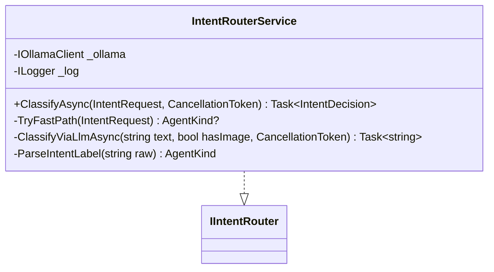

`IntentRouterService` has no knowledge of models, providers, or routes. It returns `IntentDecision` only. It does not proactively health-check the classifier model; failed classifier calls are caught and default to `General`.

**Fast-path rules (no LLM call):**

| Condition | Result | Logged as |
| --- | --- | --- |
| `HasImageAttachment && text matches \b(read\|extract\|what\|describe\|tell me about\|text in)\b` | `Vision` | `fastPath:vision` |
| `text matches ^(generate\|draw\|create a (logo\|image\|picture\|banner)\|design an? image\|make an? logo)` | `ImageGeneration` | `fastPath:imageGen` |

**Classification prompt** (sent to `gemma4:e4b`, then retried with `ornith-1.5:9b` on failure; temperature 0.0, max 10 tokens):

```
You are a one-word classifier. Reply with EXACTLY ONE label — no punctuation, no explanation.

VISION         — user attached an image and wants to read, extract, or analyse it
CODING         — user wants working code, a coding example, debugging, or code review
ARCHITECTURE   — user wants system design, tech stack plan, HLD, LLD, or diagrams
IMAGE_GEN      — user wants to generate, draw, or create an image, logo, or graphic
GENERAL        — anything else

HasImageAttachment: {true|false}
UserMessage: {userText}
```

**Defensive label parsing:**

```csharp
private static AgentKind ParseIntentLabel(string raw)
{
    // Strip everything except A-Z and underscore after uppercasing.
    // Handles "  CODING\n", "Here is: IMAGE_GEN.", "coding" etc.
    var clean = Regex.Replace(raw.Trim().ToUpperInvariant(), @"[^A-Z_]", "");
    return clean switch
    {
        "VISION"                     => AgentKind.Vision,
        "CODING"                     => AgentKind.Coding,
        "ARCHITECTURE"               => AgentKind.Architecture,
        "IMAGE_GEN" or "IMAGEGEN"
                    or "IMAGE"       => AgentKind.ImageGeneration,
        "GENERAL"                    => AgentKind.General,
        // Unknown label — log, default to General, never throw
        _ => AgentKind.General
    };
}
```

The raw string from the model is always stored in `ClassificationRecord.RawLabel` before parsing, regardless of parse outcome.

---

### 6.3 ModelRouterService

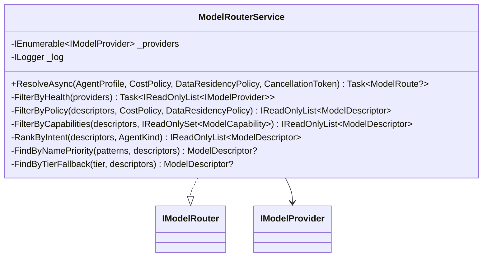

**Policy filtering using `ModelDescriptor` fields:**

```csharp
private IReadOnlyList<ModelDescriptor> FilterByPolicy(
    IReadOnlyList<ModelDescriptor> candidates,
    CostPolicy cost,
    DataResidencyPolicy residency)
{
    return candidates.Where(m =>
        // Residency: reject non-local when LocalOnly required
        (!residency.LocalOnly || m.IsLocal) &&
        // Residency: reject wrong region when regions are specified
        (residency.AllowedRegions.Count == 0 || m.Region is null || residency.AllowedRegions.Contains(m.Region)) &&
        // Cost: reject models exceeding per-token cap (use the higher of input/output)
        (cost.MaxCostPerTokenUsd is null ||
            Math.Max(m.InputTokenCostUsd ?? 0m, m.OutputTokenCostUsd ?? 0m) <= cost.MaxCostPerTokenUsd) &&
        // Cost: reject explicitly blocked providers
        !cost.BlockedProviders.Contains(m.ProviderName)
    ).ToList();
}
```

**Capability filtering** uses `IReadOnlySet<ModelCapability>` — same type as `AgentProfile.RequiredCapabilities`:

```csharp
private IReadOnlyList<ModelDescriptor> FilterByCapabilities(
    IReadOnlyList<ModelDescriptor> candidates,
    IReadOnlySet<ModelCapability> required)
{
    if (required.Count == 0) return candidates;
    return candidates.Where(m => required.IsSubsetOf(m.Capabilities)).ToList();
}
```

**Name-priority lists per `AgentKind`:**

```csharp
private static readonly IReadOnlyDictionary<AgentKind, string[]> NamePriorities =
    new Dictionary<AgentKind, string[]>
    {
        [AgentKind.Vision]          = ["qwen3-vl:latest", "qwen3-vl", "qwen3.5:9b", "qwen3.5:4b", "qwen3.5", "qwen2.5vl", "vl", "vision", "llava", "moondream"],
        [AgentKind.Coding]          = ["ornith-1.5:9b", "ornith", "gemma4:e4b", "qwen3.5:9b", "qwen3.5:4b", "qwen3.5", "qwen2.5-coder", "coder", "deepseek-coder"],
        [AgentKind.Architecture]    = ["ornith-1.5:9b", "ornith", "gemma4:e4b", "qwen3.5:9b", "qwen3.5:4b", "qwen3.5", "gemma4", "qwen2.5:latest", "qwen2.5"],
        [AgentKind.ImageGeneration] = ["x/flux2-klein:4b", "flux2-klein", "flux", "diffusion"],
        [AgentKind.General]         = ["gemma4:e4b", "ornith-1.5:9b", "ornith", "qwen3.5:9b", "qwen3.5:4b", "qwen3.5", "qwen2.5:latest", "qwen2.5", "llama3"],
    };
```

---

### 6.4 OllamaModelProvider

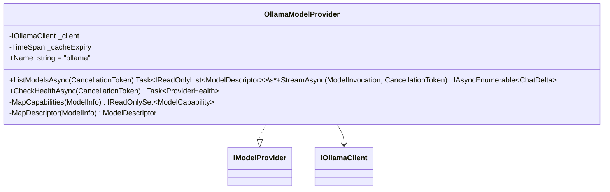

`MapDescriptor` sets the policy-enforcement fields for Ollama models:

```csharp
private static ModelDescriptor MapDescriptor(ModelInfo m) => new(
    Name:               m.Name,
    ProviderName:       "ollama",
    Capabilities:       MapCapabilities(m),
    SizeBytes:          m.SizeBytes,
    Tier:               m.Tier,
    IsAvailable:        true,
    IsLocal:            true,       // all Ollama models are local
    Region:             null,       // local — no region
    InputTokenCostUsd:  0m,         // local — no cost
    OutputTokenCostUsd: 0m
);
```

`MapCapabilities` extends `ClassifyTier()` output into typed `ModelCapability` flags:

```
"vision"    → { Vision, TextGeneration }
"fast"      → { TextGeneration, CodeGeneration }
"balanced"  → { TextGeneration, CodeGeneration, FunctionCalling }
"reasoning" → { TextGeneration, Reasoning }
"embedding" → { Embedding }
"image_gen" → { ImageGeneration }   ← new tier added to ClassifyTier()
```

---

### 6.5 Specialized Agents

**VisionAgent, CodeAgent, ArchitectureAgent, GeneralAgent** share the same structure:

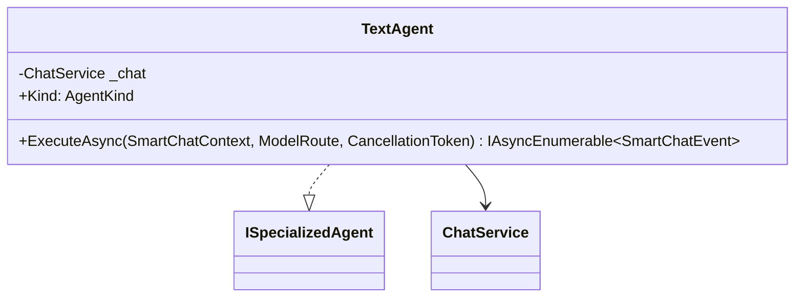

`ExecuteAsync` for all text agents:

```
1. Call ChatService.SendMessageAsync(context.BranchId, context.UserText,
       context.Attachments, modelOverride: route.Model.Name,
       profile: context.Intent.Profile)
       ↑ profile replaces systemPromptOverride — server-side constant, never user input

2. Yield SmartChatEvent{token} for each ChatDelta.Token

3. Await ChatDelta.Done (stream complete)

4. Await ChatService persistence (INSERT Message) — internal, invisible to client

5. Yield SmartChatEvent{done, messageId}
   ↑ ChatService creates the assistant Message entity before streaming, surfaces its ID on deltas, then persists it before the agent emits done
```

`ChatService.SendMessageAsync` gains one parameter:

```csharp
// Before:
public async IAsyncEnumerable<ChatDelta> SendMessageAsync(
    Guid branchId, string content, string? modelOverride, List<ChatAttachment>? attachments, ...)

// After (v3):
public async IAsyncEnumerable<ChatDelta> SendMessageAsync(
    Guid branchId, string content, string? modelOverride, List<ChatAttachment>? attachments,
    AgentProfile? profile = null, ...)
// BuildContext uses profile.SystemPrompt when profile != null, else conversation.SystemPrompt
```

---

### 6.6 ImageGenerationAgent

`ImageGenerationAgent` is **not** a general "type a prompt, get an image" pipeline. It is a fixed-template **educational software-engineering infographic generator** — every output uses the same visual design (`InfographicPromptBuilder`); only the *content* (title, subtitle, up to 8 cards, best-practice labels) varies per request, so a whole series looks consistent. A single user request can expand into multiple infographics (one per distinct topic), each producing its own image.

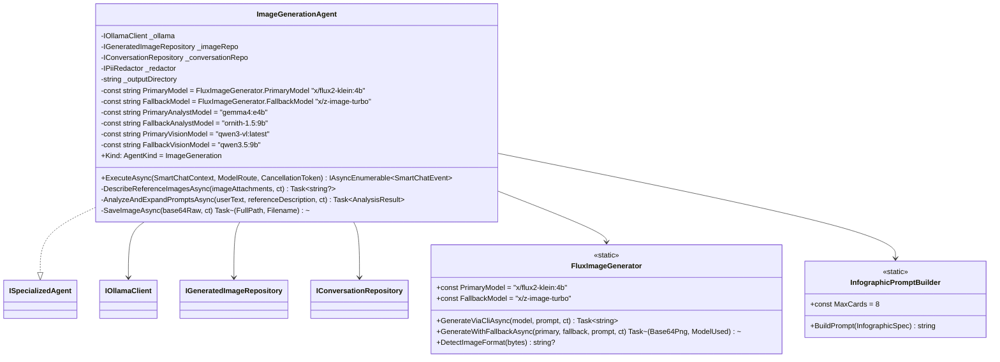

`FluxImageGenerator` is a shared static class — both `ImageGenerationAgent` and the Agent-mode `image.generate` builtin tool (`BuiltinToolRunner.cs`) call it for CLI-based generation, so the two code paths cannot drift in how they invoke `ollama run` or parse output.

**Actual pipeline (v3.6):**

```mermaid
flowchart LR
    A["User message\n(+ optional reference image)"] --> A0{"Reference image\nattached?"}
    A0 -->|"yes"| V["Stage 0: qwen3-vl:latest\nFallback: qwen3.5:9b\nDescribe reference image in 1-2 sentences"]
    A0 -->|"no"| B
    V --> B["Stage 1: gemma4:e4b\nFallback: ornith-1.5:9b\nExpand topic into N infographic\nCONTENT blocks (JSON) — title,\nsubtitle, ≤8 cards, best practices"]
    B --> C["Snapshot loaded models via /api/ps"]
    C --> D["Unload all models\nkeep_alive=0 · 500ms settle"]
    D --> E["Per infographic:\nInfographicPromptBuilder merges FIXED\ndesign template + generated content"]
    E --> F["ollama run x/flux2-klein:4b <prompt>\n15-min timeout"]
    F -->|"fails"| F2["primary_model_failed SSE\nollama run x/z-image-turbo <prompt>"]
    F --> G["Strategy A: PNG in workdir\nStrategy B: base64 in stdout"]
    F2 --> G
    G --> H["Save to Generated_images/uuid.png\nPath containment check"]
    H --> I["image_generated SSE per image"]
    I --> J["INSERT GeneratedImages ×N\n+ INSERT Message\nwith all image markdown"]
    J --> K["done SSE"]
    K --> L["WarmUp previously loaded models\nfire-and-forget"]
```

**Stage 0 — reference image description (new in v3.6):** if the user attaches an image, `DescribeReferenceImagesAsync` sends it to `qwen3-vl:latest` (fallback `qwen3.5:9b`) with a fixed prompt asking for a 1-2 sentence description (subject, style, colours, composition). The description is prepended to the content-analyst's input as `Reference image: {description}`. This never touches the fixed visual design — it only informs the *content*.

**Content-analyst system prompt** (sent to `gemma4:e4b`, then `ornith-1.5:9b` on failure; temp 0.2, force JSON): the analyst's ONLY job is content — title, subtitle, cards, best practices — never visual style, colour, or layout (those are fixed in `InfographicPromptBuilder.DesignBlock`). It returns:

```json
{
  "understanding": "One sentence: what topic(s) you are covering",
  "infographics": [
    {
      "title": "SHORT TITLE",
      "subtitle": "SHORT SUBTITLE",
      "cards": [
        { "title": "CARD TITLE", "diagram": "A -> B -> C", "bullets": ["...", "...", "..."] }
      ],
      "bestPractices": ["...", "..."]
    }
  ]
}
```

Rules enforced in the prompt: at most `InfographicPromptBuilder.MaxCards` (8) cards per infographic — chosen for accuracy, Ollama's own guidance is that more causes distorted Flux text; each card has a 2-4 word uppercase title, a one-line diagram description, and exactly three bullets under five words each; if the user asks about multiple distinct topics, the analyst returns a **separate infographic object per topic** — one user message can produce N images. `<think>…</think>` reasoning blocks (from qwen-family models) are stripped before JSON parsing. On analyst failure (both models), a single-card fallback infographic is built directly from the raw user text (`FallbackResult`) rather than failing the turn.

**`InfographicPromptBuilder`:** merges a constant `DesignBlock` (white background, purple border, numbered circular badges, pastel card colours, hand-drawn headline typography, `ekanatha.io` watermark) and `AvoidBlock` (no photorealism, no gradients, no dark background, no distorted letters) with the per-request `InfographicSpec` (title/subtitle/cards/bestPractices) to produce the final Flux prompt. Card layout is single-row for ≤5 cards, otherwise a 4-column grid.

**`IOllamaClient` methods used by `ImageGenerationAgent`:**

```csharp
Task<string> ChatOnceAsync(ChatRequest request, CancellationToken ct);            // Stage 0 vision + Stage 1 content analysis
Task<IReadOnlyList<LoadedModelInfo>> GetLoadedModelsAsync(CancellationToken ct);   // VRAM snapshot
Task UnloadModelAsync(string modelName, CancellationToken ct);                    // VRAM free
Task WarmUpModelAsync(string modelName, CancellationToken ct);                    // VRAM restore (fire-and-forget)
// GenerateImageAsync / /api/generate is NOT used — CLI path via FluxImageGenerator.GenerateViaCliAsync (`ollama run`) is used instead
```

**SSE stages emitted:**

| Stage | Meaning |
|---|---|
| `analyzing_request` | `gemma4:e4b` is processing the request; `analystModel` emitted |
| `analysis_done` | Expansion complete; `understanding`, `analystModel`, `total` (infographic count), `prompts[]` emitted |
| `freeing_vram` | Unloading models; `killingModels[]` list emitted |
| `generating` | Flux is running for infographic N of M; `current`, `total`, `prompt`, `description` emitted |
| `primary_model_failed` | `x/flux2-klein:4b` failed for one image; falling back to `x/z-image-turbo`; `model`, `fallback`, `error` emitted |
| `gen_failed` | Both primary and fallback failed for one image; pipeline continues with the next |
| `saving` | PNG detected; writing to disk |
| `save_failed` | Write failed; pipeline continues |
| `restoring_models` | Fire-and-forget warm-up; `models[]` list emitted |

**Ownership persistence** — before `done` is emitted:

The user message is persisted **immediately**, before the (potentially multi-minute) pipeline runs, so it survives a client disconnect mid-generation. Once generation finishes, every successful image gets a `GeneratedImages` row (keyed by `RequestTokenHash`, not just `BranchId`) and the assistant `Message` (markdown for all successful images) is written using `CancellationToken.None` — a disconnect after images are generated must not lose them. `done` is yielded only after all of that persistence completes. If every image in the batch fails, no assistant message is created and a `routing_error` is emitted instead.

---

## 7. Sequence Diagrams

### 7.1 Flow 1 — Vision


---

### 7.2 Flow 2 — Code

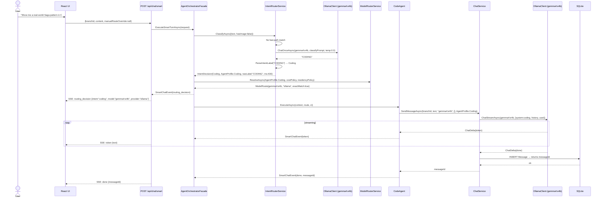

---

### 7.3 Flow 3 — Architecture

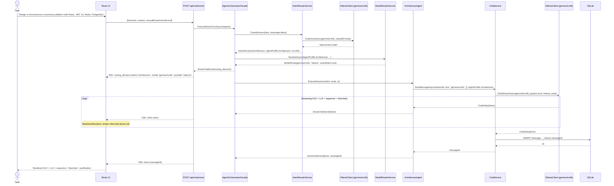

---

### 7.4 Flow 4 — Image Generation (Infographic Pipeline)

```mermaid
sequenceDiagram
    actor User
    participant Web as React UI
    participant API as POST /api/chat/smart
    participant AOF as AgentOrchestratorFacade
    participant IR as IntentRouterService
    participant MR as ModelRouterService
    participant IGA as ImageGenerationAgent
    participant OC_V as OllamaClient (qwen3-vl:latest — reference vision)
    participant OC_A as OllamaClient (gemma4:e4b — content analyst)
    participant OC_F as ollama run (x/flux2-klein:4b, fallback x/z-image-turbo)
    participant FS as Local Filesystem
    participant DB as SQLite

    User->>Web: "Make infographics explaining SOLID principles and caching strategies"
    Web->>API: {branchId, content, manualRouteOverride:null}

    API->>AOF: ExecuteSmartTurnAsync(request)
    AOF->>IR: ClassifyAsync({text, hasImage:false})
    IR->>IR: Fast-path: "Generate/create..." or quoted-prompt pattern → ImageGeneration
    IR-->>AOF: IntentDecision{ImageGeneration, AgentProfile.ImageGeneration, wasFastPath:true}

    AOF->>MR: ResolveAsync(AgentProfile.ImageGeneration, costPolicy, residencyPolicy)
    MR->>MR: FilterByCapabilities({ImageGeneration}) → flux2-klein passes
    MR-->>AOF: ModelRoute{x/flux2-klein:4b, "ollama", exactMatch:true}

    AOF-->>API: SmartChatEvent{routing_decision}
    API-->>Web: SSE: routing_decision {intent:"imageGeneration", model:"x/flux2-klein:4b", provider:"ollama"}

    AOF->>IGA: ExecuteAsync(context, route, ct)
    IGA->>DB: INSERT Message(role:User) — persisted immediately, before the slow pipeline

    opt reference image attached
        IGA->>OC_V: ChatOnceAsync(qwen3-vl:latest, describeReferenceImage)
        OC_V-->>IGA: "1-2 sentence description" (fallback qwen3.5:9b on failure)
    end

    IGA-->>AOF: SmartChatEvent{image_gen_progress, stage:"analyzing_request", analystModel:"gemma4:e4b"}
    API-->>Web: SSE: image_gen_progress {stage:"analyzing_request"}

    IGA->>OC_A: ChatOnceAsync(gemma4:e4b, analystSystemPrompt, [refDescription+]userText, forceJson:true)
    OC_A-->>IGA: {understanding, infographics:[{title,subtitle,cards[≤8],bestPractices}, ...]}
    Note over IGA,OC_A: fallback ornith-1.5:9b on failure; <think> blocks stripped;\nsingle-card fallback infographic if both models fail

    IGA-->>AOF: SmartChatEvent{image_gen_progress, stage:"analysis_done", understanding, total:2, prompts[]}
    API-->>Web: SSE: image_gen_progress {stage:"analysis_done", total:2}

    IGA->>IGA: Snapshot loaded models (/api/ps) → unload all (keep_alive=0, 500ms settle)
    IGA-->>AOF: SmartChatEvent{image_gen_progress, stage:"freeing_vram", killingModels[]}
    API-->>Web: SSE: image_gen_progress {stage:"freeing_vram"}

    loop for each expanded infographic (InfographicPromptBuilder merges fixed design + content)
        IGA-->>AOF: SmartChatEvent{image_gen_progress, stage:"generating", current, total, prompt, description}
        API-->>Web: SSE: image_gen_progress {stage:"generating"}

        IGA->>OC_F: ollama run x/flux2-klein:4b "<merged prompt>" (15-min timeout)
        alt primary succeeds
            OC_F-->>IGA: PNG (workdir file or base64 stdout)
        else primary fails
            IGA-->>AOF: SmartChatEvent{image_gen_progress, stage:"primary_model_failed", model, fallback, error}
            API-->>Web: SSE: image_gen_progress {stage:"primary_model_failed"}
            IGA->>OC_F: ollama run x/z-image-turbo "<merged prompt>"
            OC_F-->>IGA: PNG or failure → gen_failed, continue to next infographic
        end

        IGA-->>AOF: SmartChatEvent{image_gen_progress, stage:"saving"}
        IGA->>FS: write Generated_images/{guid}.png (path containment check)
        FS-->>IGA: ok

        IGA-->>AOF: SmartChatEvent{image_generated, url, filename, fluxPrompt, description, index, total, generationMs}
        API-->>Web: SSE: image_generated {url, index, total, ...}
    end

    IGA-->>AOF: SmartChatEvent{image_gen_progress, stage:"restoring_models", models[]}
    API-->>Web: SSE: image_gen_progress {stage:"restoring_models"}
    IGA->>IGA: WarmUpModelAsync per previously-loaded model (fire-and-forget)

    Note over IGA,DB: Persist GeneratedImages ×N + assistant Message (CancellationToken.None)\nbefore any done signal — already-generated images must survive a disconnect
    IGA->>DB: INSERT GeneratedImages(id, branchId, requestTokenHash) ×N
    IGA->>DB: INSERT Message(content: markdown for all successful images)
    DB-->>IGA: ok · returns messageId

    IGA-->>AOF: SmartChatEvent{done, messageId}
    API-->>Web: SSE: done {messageId}

    Web-->>User: N inline infographic PNGs, each with Download + Copy URL + expandable Flux prompt
```

---

### 7.5 Flow 5 — General

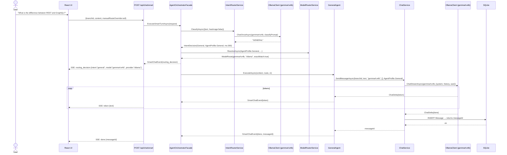

---

### 7.6 Flow 6 — Classification Internal

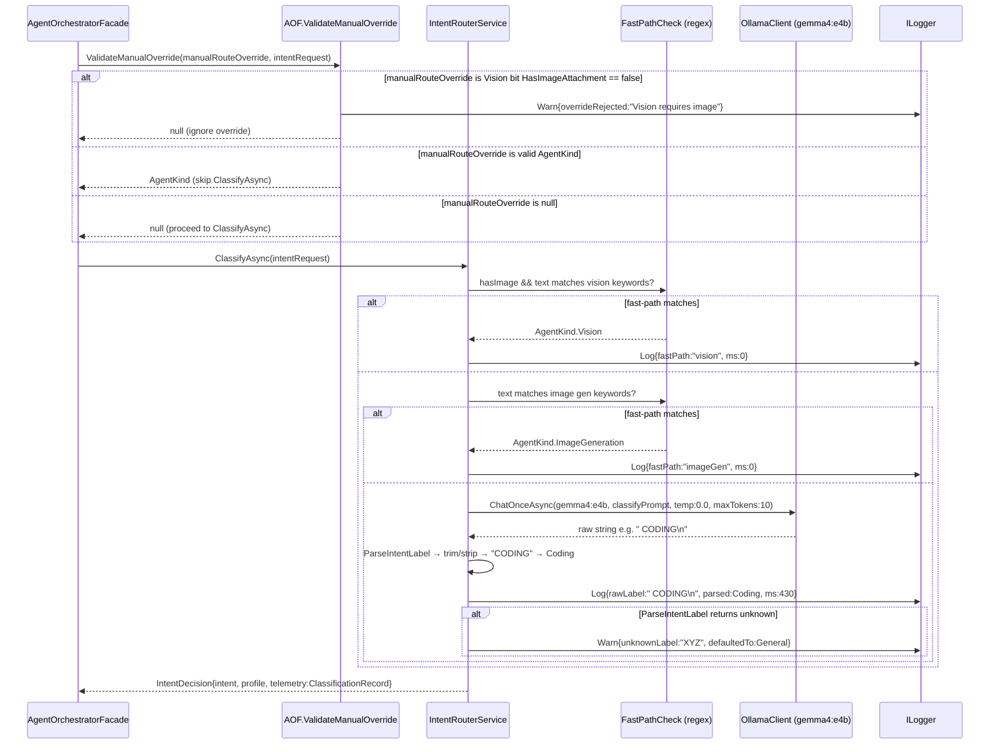

---

### 7.7 Flow 7 — Provider Fallback

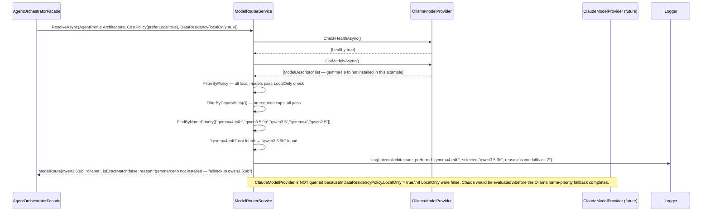

---

## 8. Overall Orchestration Flowchart


---

## 9. Smart Endpoint Contract

### Request

```
POST /api/chat/smart
Authorization: Bearer <session-token>
Content-Type: application/json

{
  "branchId": "guid",
  "content": "string",
  "attachments": [
    {
      "name": "invoice.png",
      "contentType": "image/png",
      "dataBase64": "iVBORw0KGgo..."
    }
  ],
  "manualRouteOverride": "vision|coding|architecture|imageGeneration|general"
                          // optional · validated to AgentKind enum · advisory
                          // Vision without image → rejected (ignored, classify normally)
                          // actual applied kind always in routing_decision.intent
}
```

### SSE Stream

```
── always first (after both intent and model resolved): ──────

event: routing_decision
data: {
  "intent": "vision",
  "model": "qwen3.5:9b",
  "provider": "ollama",
  "reason": "fast-path: image attached + text contains 'what'",
  "classificationMs": 1,
  "wasFastPath": true,
  "manualOverrideApplied": false
}

── text responses (Vision / Code / Architecture / General): ──

event: token
data: { "text": "The invoice shows..." }

  [ChatService persists Message — internal, invisible to client]

event: done
data: { "messageId": "guid", "tokensIn": 312, "tokensOut": 89 }

── image generation (infographic pipeline — see §6.6): ────────

event: image_gen_progress
data: { "stage": "analyzing_request", "analystModel": "gemma4:e4b" }

event: image_gen_progress
data: { "stage": "analysis_done", "understanding": "...", "analystModel": "gemma4:e4b", "total": 2, "prompts": [{ "description": "...", "fluxPrompt": "..." }] }

event: image_gen_progress
data: { "stage": "freeing_vram", "killingModels": ["gemma4:e4b"] }

event: image_gen_progress
data: { "stage": "generating", "current": 1, "total": 2, "prompt": "...", "description": "SOLID Principles" }

event: image_gen_progress   // only if x/flux2-klein:4b fails for this image
data: { "stage": "primary_model_failed", "model": "x/flux2-klein:4b", "fallback": "x/z-image-turbo", "error": "...", "current": 1, "total": 2 }

event: image_gen_progress
data: { "stage": "saving", "current": 1, "total": 2 }

event: image_generated       // once per successful image, may fire multiple times
data: {
  "url": "/api/generated-images/3f7a9b2e-...png",
  "filename": "3f7a9b2e-...png",
  "fluxPrompt": "...",
  "description": "SOLID Principles",
  "index": 1,
  "total": 2,
  "generationMs": 47320
}

event: image_gen_progress
data: { "stage": "restoring_models", "models": ["gemma4:e4b"] }

  [INSERT GeneratedImages ×N + INSERT Message — internal, invisible to client]

event: done
data: { "messageId": "guid" }

── on error: ─────────────────────────────────────────────────

event: routing_error
data: {
  "intent": "imageGeneration",
  "message": "No image generation model installed.",
  "ollamaPullCommand": "ollama pull x/flux2-klein:4b"
}
```

### Generated Image Serve

```
GET /api/generated-images/{filename}
Authorization: Bearer <session-token>
```

Returns 400 for invalid filename, 401 for bad/missing token, 403 for ownership mismatch, 404 if not found.

---

## 10. SSE Event Reference

| Event | Emitter | Timing guarantee | Fields |
|---|---|---|---|
| `routing_decision` | `AgentOrchestratorFacade` | After both intent AND model resolved; before first token | `intent`, `model`, `provider`, `reason`, `classificationMs`, `wasFastPath`, `manualOverrideApplied` |
| `token` | Specialized agent | Per token during text generation | `text` |
| `image_gen_progress` | `ImageGenerationAgent` | Multiple times — one per stage transition | `stage` (see below), plus stage-specific fields |
| `image_generated` | `ImageGenerationAgent` | After each PNG is written AND DB row inserted; may fire multiple times per turn | `url`, `filename`, `fluxPrompt`, `description`, `index`, `total`, `generationMs` |
| `done` | Specialized agent | After all DB persists complete | `messageId` |
| `routing_error` | `AgentOrchestratorFacade` / `ImageGenerationAgent` | When no model resolved, override invalid, or every image in the batch failed | `intent`, `message` |

**`image_gen_progress` stage field values:**

| Stage | Extra fields | UI meaning |
|---|---|---|
| `analyzing_request` | `analystModel` | `gemma4:e4b` is expanding the topic into infographic content |
| `analysis_done` | `understanding`, `analystModel`, `total`, `prompts[]` | Content expansion complete — `total` is the infographic count |
| `freeing_vram` | `killingModels[]` | Unloading models before Flux |
| `generating` | `current`, `total`, `prompt`, `description` | Flux running for infographic N of M |
| `primary_model_failed` | `model`, `fallback`, `error`, `current`, `total` | `x/flux2-klein:4b` failed; retrying with `x/z-image-turbo` |
| `gen_failed` | `current`, `total`, `error` | Both primary and fallback failed; continuing to next |
| `saving` | `current`, `total` | Writing PNG to disk |
| `save_failed` | `current`, `total`, `error` | Write failed; continuing |
| `restoring_models` | `models[]` | Warming up previously loaded models (fire-and-forget) |

Persistence is an internal step. It is never visible to the client as an SSE event. `done` is the sole signal that the turn is complete and all messages are durable.

---

## 11. Backend File Map

### Backend layer rule

```
EminentAi.Application/    ← interfaces, DTOs, profiles, orchestration logic
EminentAi.Infrastructure/ ← implementations only (OllamaModelProvider, IntentRouterService, etc.)
EminentAi.Domain/         ← entity models
EminentAi.Api/            ← endpoints, DI wiring, bootstrap
```

### Backend new files

```
src/EminentAi.Application/
├── Agents/
│   ├── AgentKind.cs
│   ├── AgentProfile.cs
│   ├── AgentProfiles.cs              ← server-side constants; ForKind(AgentKind)
│   ├── ISpecializedAgent.cs
│   ├── SmartChatContext.cs           ← BranchId, UserText, Attachments, IntentDecision
│   │                                    (no AssistantMessageId — ChatService owns creation)
│   ├── SmartChatEvent.cs
│   ├── VisionAgent.cs
│   ├── CodeAgent.cs
│   ├── ArchitectureAgent.cs
│   ├── GeneralAgent.cs
│   └── ImageGeneration/
│       ├── ImageGenerationAgent.cs        ← infographic content+image pipeline (see §6.6)
│       ├── InfographicPromptBuilder.cs    ← fixed design template + per-request InfographicSpec
│       └── FluxImageGenerator.cs          ← shared CLI generator; also used by Agent-mode "image.generate" tool
│
├── Providers/                         ← interfaces + DTOs live here, NOT in Infrastructure
│   ├── IModelProvider.cs
│   ├── ModelDescriptor.cs             ← IsLocal, Region, InputTokenCostUsd, OutputTokenCostUsd
│   ├── ModelCapability.cs             ← enum; used in AgentProfile + ModelDescriptor
│   ├── ModelInvocation.cs
│   ├── ProviderHealth.cs
│   ├── CostPolicy.cs
│   └── DataResidencyPolicy.cs
│
└── Routing/
    ├── IIntentRouter.cs               ← ClassifyAsync → IntentDecision (no ModelRoute)
    ├── IntentRequest.cs               ← no manualRouteOverride (AOF handles that)
    ├── IntentDecision.cs              ← Intent, Profile, ClassifierModel, Ms, Telemetry
    ├── ClassificationRecord.cs
    ├── IModelRouter.cs                ← ResolveAsync → ModelRoute?
    └── ModelRoute.cs

src/EminentAi.Application/Orchestration/
└── AgentOrchestratorFacade.cs        ← calls IR → MR → [emit routing_decision] → agent

src/EminentAi.Infrastructure/
├── Providers/
│   └── OllamaModelProvider.cs         ← implements IModelProvider; IsLocal=true; cost=0
│
└── Routing/
    ├── IntentRouterService.cs          ← fast-path, Gemma/Qwen fallback, defensive parse, telemetry
    └── ModelRouterService.cs           ← multi-provider, FilterByPolicy (uses ModelDescriptor fields)
```

### Backend modified files

```
src/EminentAi.Application/Abstractions/IOllamaClient.cs
  + Task<string> GenerateImageAsync(string model, string prompt, CancellationToken ct)
  // Expects Ollama /api/generate response.response to contain base64 PNG bytes.

src/EminentAi.Infrastructure/Ollama/OllamaClient.cs
  + Implement GenerateImageAsync
  + ClassifyTier(): add "image_gen" for *flux* / *diffusion* → new tier

src/EminentAi.Application/Chat/ChatService.cs
  + SendMessageAsync(... AgentProfile? profile = null ...)
  + BuildContext: use profile.SystemPrompt when profile != null

src/EminentAi.Domain/Models.cs
  + class GeneratedImage { Guid Id; Guid BranchId; DateTime CreatedAt }

src/EminentAi.Infrastructure/Persistence/EminentAiDbContext.cs
  + DbSet<GeneratedImage> GeneratedImages

src/EminentAi.Api/Program.cs
  + Register IIntentRouter, IModelRouter, IModelProvider (OllamaModelProvider)
  + Register all ISpecializedAgent implementations
  + Register AgentOrchestratorFacade
  + Register CostPolicy{preferLocal:true} and DataResidencyPolicy{localOnly:true} as singletons
  + POST /api/chat/smart → AOF.ExecuteSmartTurnAsync → SSE
  + GET  /api/generated-images/{filename} → auth + ownership + file serve
  + Bootstrap SQL: CREATE TABLE IF NOT EXISTS "GeneratedImages" ...
```

---

## 12. Frontend File Map

### Frontend new files

```
web/src/
├── components/
│   ├── RoutingBadge.tsx           ← intent icon + model name pill, 200ms fade-in
│   ├── GeneratedImage.tsx         ← inline PNG + Download + Copy URL + expandable Flux prompt
│   └── ImageGenProgressPanel.tsx  ← collapsible pipeline panel: 5 steps, progress bar,
│                                     A2A badge, model chips, per-step spinner/check icons
└── lib/
    └── intentMeta.ts              ← AgentKind → { label, icon, badgeColor }
```

**`ImageGenProgressPanel` props:**

```typescript
interface ImageGenProgressProps {
  stage?: ImageGenStage;
  progress?: { current: number; total: number; stage: string };
  killingModels?: string[];
  restoringModels?: string[];
  currentPrompt?: string;
  completedCount?: number;
  understanding?: string;   // analyst's one-line understanding
  analystModel?: string;    // e.g. "gemma4:e4b"
}
```

The panel collapses to a headline + progress bar by default. Expanding reveals the full 5-step pipeline with per-step icons (spinner while active, checkmark when done, dimmed circle when pending), an A2A badge showing `gemma4:e4b → flux2-klein:4b`, and model chips for the VRAM unload step.

### Frontend modified files

```
web/src/lib/api.ts
  + smartChat(branchId, content, attachments?, manualRouteOverride?, onEvent): Promise<void>

web/src/lib/types.ts
  + RoutingDecision, ImageGenerationResult, SmartChatEvent union

web/src/state/store.ts
  + routingDecision?: RoutingDecision              on Message
  + generatedImages?: ImageGenerationResult[]      on Message — array; a single turn can
  |                                                   produce multiple infographics, appended
  |                                                   as each image_generated event arrives
  + imageGenStage?: ImageGenStage                  on Message

web/src/components/ChatMessage.tsx
  + Render <RoutingBadge routing={msg.routingDecision} />
  + Render one <GeneratedImage> per entry in msg.generatedImages[]

web/src/components/ChatView.tsx
  + Handle: routing_decision, image_gen_progress, image_generated, routing_error

web/src/components/Composer.tsx
  + Auto-route toggle (default ON)
  + Image attached → manualRouteOverride pre-filled to "vision"
```

### RoutingBadge design

```
┌──────────────────────────────────────┐
│  👁 Vision  •  qwen3.5:9b • ollama  │  purple
│  </> Code   •  gemma4:e4b           │  blue
│  🗺 Arch    •  gemma4:e4b           │  green
│  🎨 Image   •  flux2-klein:4b       │  orange
│  💬 General •  gemma4:e4b           │  grey
└──────────────────────────────────────┘
Provider shown only when non-ollama.
Appears below user message, above assistant reply. 200ms fade-in.
```

### GeneratedImage component

```
┌──────────────────────────────────────────────┐
│  [Spinner during image_gen_progress stages]  │
│                                              │
│     [Inline PNG — max-width 512px]           │
│                                              │
├──────────────────────────────────────────────┤
│  [↓ Download]  [⧉ Copy URL]  [▾ Flux prompt]│
├──────────────────────────────────────────────┤
│  minimalist logo, AI startup, bold...        │  ← collapsed by default
└──────────────────────────────────────────────┘
```

---

## 13. Changes to Existing Files

| File | Change | Why |
|---|---|---|
| [IOllamaClient.cs](../src/EminentAi.Application/Abstractions/IOllamaClient.cs) | Add `GenerateImageAsync` | Flux2 uses `/api/generate` not `/api/chat` — add after spike |
| [OllamaClient.cs](../src/EminentAi.Infrastructure/Ollama/OllamaClient.cs) | Implement `GenerateImageAsync`; update `ClassifyTier` for `image_gen` | After spike confirms shape |
| [ChatService.cs](../src/EminentAi.Application/Chat/ChatService.cs) | Add `AgentProfile? profile` param; `BuildContext` uses `profile.SystemPrompt` | Replaces raw string override; server-side constants only |
| [Models.cs](../src/EminentAi.Domain/Models.cs) | Add `GeneratedImage` entity | Image ownership for auth |
| [EminentAiDbContext.cs](../src/EminentAi.Infrastructure/Persistence/EminentAiDbContext.cs) | Add `DbSet<GeneratedImage>` | ORM access to `GeneratedImages` table |
| [Program.cs](../src/EminentAi.Api/Program.cs) | New DI registrations, 2 new endpoints, bootstrap SQL | Wire entire new layer |
| [store.ts](../web/src/state/store.ts) | Add routing fields to Message | Badge survives re-renders |
| [ChatView.tsx](../web/src/components/ChatView.tsx) | Handle 4 new SSE event types | Routing badge, image display, progress, errors |
| [ChatMessage.tsx](../web/src/components/ChatMessage.tsx) | Render `RoutingBadge` + `GeneratedImage` | Message-level routing metadata |
| [Composer.tsx](../web/src/components/Composer.tsx) | Auto-route toggle; image pre-fills vision hint | Smart vs manual mode |

> **Superseded (see §18.2 item 8):** the `IOllamaClient.GenerateImageAsync` / `OllamaClient.GenerateImageAsync` rows above describe a v1-era plan that was never followed — the shipped `ImageGenerationAgent` generates images via `FluxImageGenerator`'s CLI path instead (§6.6). Both methods exist in the current codebase, fully implemented, with zero call sites. Retained here for implementation-history context only; do not implement against these rows.

---

## 14. Implementation Order

**Rule:** text routing validates first; `ImageGenerationAgent` depends on the configured Flux model returning a base64 PNG in `response`.

```mermaid
gantt
    title Implementation Sequence (v3.1)
    dateFormat  X
    axisFormat  Step %s

    section Image Response Assumption
    Flux /api/generate response.response is base64 PNG         :crit, s1, 1, 2

    section Application Contracts
    ModelCapability enum                                      :b1, 2, 3
    ModelDescriptor (IsLocal Region Cost fields)              :b2, 3, 4
    CostPolicy · DataResidencyPolicy · IModelProvider         :b3, 4, 5
    AgentKind · AgentProfile · AgentProfiles                  :b4, 5, 6
    IIntentRouter · IntentDecision · ClassificationRecord     :b5, 6, 7
    IModelRouter · ModelRoute                                 :b6, 7, 8
    ISpecializedAgent · SmartChatContext (no prealloc ID)     :b7, 8, 9

    section Infrastructure — Routing
    IntentRouterService (fast-path + llm + defensive parse)   :b8, 9, 10
    OllamaModelProvider (IsLocal=true cost=0)                 :b9, 10, 11
    ModelRouterService (policy + cap filter + name priority)  :b10, 11, 12

    section Text Agents + Orchestration
    ChatService: AgentProfile param (not string)              :b11, 12, 13
    VisionAgent · CodeAgent · ArchitectureAgent · General     :b12, 13, 14
    AgentOrchestratorFacade (IR then MR then emit then agent) :b13, 14, 15

    section API — Text Path
    POST /api/chat/smart (text intents only)                  :b14, 15, 16
    DI wiring in Program.cs                                   :b15, 16, 17

    section Frontend — Text Path
    types.ts · api.ts smartChat()                             :f1, 17, 18
    store.ts routing fields                                   :f2, 18, 19
    RoutingBadge.tsx · ChatMessage.tsx · ChatView.tsx          :f3, 19, 20
    Composer.tsx toggle                                       :f4, 20, 21

    section Image Generation
    IOllamaClient + GenerateImageAsync                        :b16, 21, 22
    OllamaClient implements GenerateImageAsync                :b17, 22, 23
    GeneratedImage entity + DB table                          :b18, 23, 24
    ImageGenerationAgent (translate → generate → save)        :b19, 24, 25
    GET /api/generated-images/:file (auth + ownership)        :b20, 25, 26
    GeneratedImage.tsx frontend component                     :f5, 26, 27
```

> **Historical note (see §18.2 item 8):** the "Image Generation" section's first two tasks (`IOllamaClient + GenerateImageAsync`, `OllamaClient implements GenerateImageAsync`) describe work that shipped but was then bypassed — the actual `ImageGenerationAgent` never calls either method. They are left in this historical Gantt chart for traceability of what was actually built, not as a current implementation guide.

---

## 15. Model Fallback Matrix

| Intent | Preferred | Fallback 1 | Fallback 2 | No model found |
|---|---|---|---|---|
| Vision | `qwen3-vl:latest` | `qwen3.5:9b` / `qwen3.5:4b` | Any `ModelCapability.Vision` model | `routing_error` + `ollama pull qwen3-vl:latest` |
| Coding | `ornith-1.5:9b` | `gemma4:e4b` | `qwen3.5:9b` / `qwen3.5:4b` | Any text model |
| Architecture | `ornith-1.5:9b` | `gemma4:e4b` | `qwen3.5:9b` / `qwen3.5:4b` | Largest `balanced` / `reasoning` tier |
| ImageGeneration | `x/flux2-klein:4b` | `x/z-image-turbo` (per-image fallback in `FluxImageGenerator`, not `ModelRouterService`) | Any `ModelCapability.ImageGeneration` | `routing_error` + `ollama pull x/flux2-klein:4b` |
| General | `gemma4:e4b` | `ornith-1.5:9b` | `qwen3.5:9b` / `qwen3.5:4b` | Any installed model |

When `DataResidencyPolicy.LocalOnly = true`, only `IsLocal = true` models reach the priority list. Cloud providers are filtered out before any name match runs.
 
---

## 16. Security Considerations

### `AgentProfile` — no raw string override

`ChatService.SendMessageAsync` accepts `AgentProfile? profile`. The profile's `SystemPrompt` is a compile-time constant from `AgentProfiles.cs`. No HTTP field, no user message, and no tool result ever reaches the system prompt string. The v2 `systemPromptOverride string?` parameter is removed.

### `manualRouteOverride` validation

Parsed in `AgentOrchestratorFacade` before reaching any agent:

- String → `AgentKind` via `Enum.TryParse` (case-insensitive). Invalid strings → `routing_error`.
- `Vision` without `HasImageAttachment == true` → override silently ignored, classify normally.
- `ImageGeneration` override is accepted; if no `image_gen` model is available, model resolution emits `routing_error`.

The applied kind is always echoed in `routing_decision.intent`. The user sees what actually ran.

### Generated image auth

`GET /api/generated-images/{filename}` requires a valid bearer token (same session auth as all other endpoints). The `GeneratedImages` table is queried to verify the filename's `BranchId` belongs to a conversation accessible to that session.

### Filename validation — two independent layers

```csharp
// Layer 1: regex (UUID .png only)
if (!Regex.IsMatch(filename, @"^[0-9a-f]{8}-[0-9a-f]{4}-[0-9a-f]{4}-[0-9a-f]{4}-[0-9a-f]{12}\.png$"))
    return Results.BadRequest();

// Layer 2: path containment (defence in depth)
var resolved = Path.GetFullPath(Path.Combine(outputDir, filename));
if (!resolved.StartsWith(outputDir, StringComparison.OrdinalIgnoreCase))
    return Results.BadRequest();
```

### Classifier output isolation

`ParseIntentLabel` strips everything outside `[A-Z_]` after uppercasing. Result is matched to a closed `AgentKind` enum. Unknown labels default to `General`. The raw label is logged for diagnostics but never used in system prompts, SQL, file paths, or tool arguments.

### `.gitignore`

```gitignore
# AI-generated images — local only
src/EminentAi.Api/generated-images/
web/public/generated-images/
**/generated-images/*.png
```

---

## 17. Operational Notes

### Classifier telemetry corpus

Maintain a test corpus to catch silent misrouting:

```json
// /tests/IntentRouterTests/routing-corpus.json
[
  { "text": "generate a dark mode logo for TechCorp", "expected": "ImageGeneration" },
  { "text": "show me a real-world repository pattern in .NET", "expected": "Coding" },
  { "text": "design a CQRS system for an e-commerce API", "expected": "Architecture" },
  { "text": "what does this receipt say?", "hasImage": true, "expected": "Vision" },
  { "text": "explain what recursion is", "expected": "General" }
]
```

Run against `IntentRouterService` in unit tests. `ClassificationRecord.RawLabel` is logged on every turn — grep it in development to spot misroutes before they reach the user.

### Adding a new provider

1. Create `ClaudeModelProvider : IModelProvider` in `EminentAi.Infrastructure/Providers/`.
2. Populate `ModelDescriptor.IsLocal = false`, `Region = "us-east-1"`, `InputTokenCostUsd`, `OutputTokenCostUsd`.
3. Register in DI.
4. Set `CostPolicy.BlockedProviders` or `DataResidencyPolicy.LocalOnly = true` in configuration to prevent cloud calls in local-only deployments.
5. No other code changes — `ModelRouterService` queries all registered providers.

### VRAM keep-alive strategy

`keep_alive: "10m"` in `OllamaClient.BuildPayload` keeps the last chat model warm. `gemma4:e4b` is the classifier and primary general/coding route; `qwen3.5:9b` is the fallback. `flux2-klein` triggers a full model swap — the `image_gen_progress {stage:"generating"}` SSE event fires before the swap begins, so the UI shows a spinner. This is not optional UX; without it, the user has no feedback for 30–120 seconds.

---

*Document version: 4.0 — 2026-09-02*
*Supersedes v3.9. All four phases of §18.7 are now implemented on `feature/AI-Desktop-App` (`dotnet build EminentAi.slnx` and `npx tsc -b` both pass). Phases 1 and 2 shipped exactly as designed. Phases 3 and 4 shipped with a deliberate scope cut each, recorded in the v3.9 → v4.0 notes: intent resolution now uses structured tool-calling but still costs one round-trip per free-text turn (the "zero extra inference" version needs a persistence re-plumb this session couldn't verify live); image generation still runs via the `ollama run` CLI with proper process-tree cancellation added, rather than migrating to the HTTP endpoint that the v3.1→v3.2 history recorded as previously abandoned for Flux response-shape reasons. §§1–17 describe the implementation as previously verified, with §13/§14's `GenerateImageAsync` rows still historical-only per §18.2 item 8.*

---

## 18. Architectural Critique & Next-Generation Alternatives (v4.1 Blueprint — Tool-Calling & UI-Affordance Routing)

> **v4.1 supersedes v4.0.** The original v4.0 blueprint (ONNX embedding router + GPU coordinator + HTTP media sidecar + Semantic Kernel migration) is retained in git history only. Independent architect review kept the two subsystem fixes that address genuine local-hardware constraints (§18.5.1, §18.5.2) and replaced the two routing/framework proposals with patterns closer to what shipped agent products actually use — see §18.3 for the reasoning and industry comparison.

### 18.1 Architectural Review & Scorecard

**Overall Architectural Rating: 7 / 10**

| Dimension | Rating | Analysis & Justification |
| :--- | :---: | :--- |
| **Separation of Concerns & Layering** | **8.5 / 10** | Clean decoupling of Intent Routing (`IIntentRouter`) from Model Routing (`IModelRouter`). Typed `ModelCapability` enum and immutable `AgentProfile` records prevent system prompt injection. |
| **Protocol & SSE Stream Contract** | **8.5 / 10** | Rich event contract (`routing_decision`, `image_gen_progress`, `image_generated`, `done`) enables smooth UI telemetry and progress visualization. |
| **Local Hardware & Runtime Stability** | **6.0 / 10** | High fragility in GPU resource management: global model eviction (`keep_alive=0`) causes race conditions across concurrent turns; CLI process execution (`ollama run`) lacks process group isolation and true progress callbacks. |
| **Extensibility & Cloud Readiness** | **8.0 / 10** | Provider interfaces (`IModelProvider`) with policy filters (`CostPolicy`, `DataResidencyPolicy`) provide clear extension points for cloud models (Claude, OpenAI). |
| **Latency & Routing Efficiency** | **6.5 / 10** | Non-fastpath queries require an LLM round-trip (`gemma4:e4b`) taking 300–800ms and risking cold-model loading latency before the target agent can even begin. This is real, but see §18.3 — the fix is architectural (stop making a dedicated round-trip), not a faster classifier. |
| **Doc/Code Contract Fidelity** | **5.0 / 10** *(new)* | This document claims to be "verified against implementation" as of v3.6, but independent review of the actual `feature/AI-Desktop-App` source found three unreported divergences — see §18.2 items 5–7. A doc that asserts verification and still drifts from code is a process gap, not just a content gap. |

---

### 18.2 Critical Gaps & Fragility Analysis

#### 1. Uncoordinated Global VRAM Eviction (Multi-Turn / Multi-Session Race Condition)
`ImageGenerationAgent` calls `/api/ps` and unloads all models with `keep_alive=0`. In a multi-tab or concurrent user scenario, an ongoing chat generation on another branch will be forcibly terminated or cause Ollama to throw OOM / 500 errors when attempting to run Flux.

#### 2. OS Process Spawning inside ASP.NET Core Runtime
Executing `ollama run <model> "<prompt>"` via `ProcessStartInfo` introduces several failure modes:
* **Orphan/Zombie Processes:** Web server request cancellations do not guarantee OS child process termination without Win32 Job Objects or Linux cgroups.
* **Pipe Buffer Deadlocks:** Large base64 stdout strings can saturate standard output buffers if not read asynchronously in chunks.
* **File Clashes:** Concurrent generations scanning the working directory for generated `.png` files create race conditions on file detection.

#### 3. Classification Latency & Cold-Model Penalties
When a query does not match the regex fast-path, `IntentRouterService` calls a 4B/9B LLM. If `gemma4:e4b` is not already resident in VRAM, the system incurs a cold model swap (2–6s), classifies the prompt in one word, and then immediately unloads or context-swaps to load the target model (e.g. `ornith-1.5:9b` or `qwen3-vl`). **This entire round-trip is removed in §18.4** rather than sped up — see §18.3 for why speeding it up (the v4.0 ONNX proposal) was rejected.

#### 4. Model Metadata Hardcoding
While `IModelProvider` abstracts model discovery, `NamePriorities` dictionaries and `ImageGenerationAgent` model names are hardcoded C# constants rather than configuration-driven options in `appsettings.json`.

#### 5. Doc/Code Contract Drift — Vision Override & `ClassificationRecord` Type *(new)*
Independent review of the actual code (not just this document) found two undocumented divergences:
* **§6.1/§8/§16 claim** a `Vision` override submitted without an image attachment is "ignored" and the request "falls through to classify normally." **The actual code** (`AgentOrchestratorFacade.ExecuteSmartTurnAsync`) returns a non-null `overrideRejectedReason` from `ValidateManualOverride` and immediately `yield return`s `routing_error` then `yield break`s — the entire turn is aborted, not re-classified. This is a functional bug relative to the documented (and presumably intended) behavior: a user who attaches text with a stale/incorrect `Vision` override gets a hard error instead of a normal chat response.
* **§4.3 declares** `ClassificationRecord.OverrideRejectedReason` as `AgentKind?`. **The actual record** (`ClassificationRecord.cs`) declares it `string?`. The contract table in §4.3 does not match the type actually compiled and shipped.

#### 6. Undocumented Fast-Path: Bare Quoted Strings Trigger Image Generation *(new)*
`IntentRouterService.ImageGenKeywords` (not shown in §6.2's fast-path table) also matches any message that is purely one or more quoted strings: `^\s*"[^"]{3,}"(\s*,\s*"[^"]{3,}")*\s*$`. A user pasting quoted OCR'd or invoice text — e.g. `"Total: $412.50"` — matches this pattern and is routed to `ImageGeneration` before the LLM classifier or even the Vision fast-path ever runs, regardless of an attached image. This is exactly the kind of silent misroute the routing-corpus test in §17 is meant to catch, but the corpus in §17 does not include a quoted-string case.

#### 7. PII Redaction Does Not Cover Model-Echoed Text *(new)*
`IPiiRedactor.Redact` is applied to `context.UserText` and to each `ExpandedPrompt.FluxPrompt` before it is emitted or persisted (`ImageGenerationAgent.cs`), but **not** to `AnalysisResult.Understanding` or `ExpandedPrompt.Description` — both are model-generated text that can echo back content from the (unredacted) analyst input, and both are emitted in `image_gen_progress`/`image_generated` SSE events and persisted verbatim in the assistant `Message.Content` header (`> **{analystModel} understood:** {understanding}`). Any PII the redactor was meant to strip can resurface here if the analyst model repeats it back.

#### 8. Dead Code: `IOllamaClient.GenerateImageAsync` Is Implemented but Never Called *(new, verified against source)*
`IOllamaClient.cs:71` declares `Task<string> GenerateImageAsync(string model, string prompt, CancellationToken ct)`, and `OllamaClient.cs:204` fully implements it against Ollama's `/api/generate` endpoint — this was the v1-era image-generation plan (§13, §14). The shipped `ImageGenerationAgent` never calls it; the real pipeline goes through `FluxImageGenerator.GenerateViaCliAsync` (`ollama run` CLI, §6.6) instead. A repo-wide search for instance call sites (`.GenerateImageAsync(` outside the interface declaration and its implementation) returns zero results. This is not just stale documentation in §13/§14 — it is a genuinely dead public interface method and implementation shipping in the codebase today. Candidate for removal alongside the §18.5.2 `DiffusionSidecarClient` work, since both touch the same seam.

> **Note on a related claim, checked and rejected:** a separate review pass also flagged `src/EminentAi.Application/Class1.cs` (and its `Infrastructure`/`Domain` siblings) as "unused template boilerplate." Reading all three files shows they already contain only a single comment — `// (intentionally empty — placeholder removed)` — not live scaffold code. That finding does not hold; the only real housekeeping opportunity is deleting three placeholder files outright, which is cosmetic and not tracked here as an architectural gap.

---

### 18.3 Rejected Alternatives & Industry Comparison

The v4.0 blueprint proposed four subsystems. Two are kept unchanged (§18.5.1, §18.5.2) because they fix genuine local-hardware constraints that exist regardless of routing strategy. The other two are **rejected outright**, not merely deferred, for reasons independent of implementation cost:

#### Rejected: ONNX/MiniLM Embedding-Centroid Router
An in-process CPU classifier trades a 300–800ms LLM round-trip for a hand-maintained ML system: a labeled training corpus, periodic centroid recalibration as the prompt distribution drifts, and a confidence threshold that will misfire precisely on the ambiguous messages that matter most. The latency it saves is invisible next to a 30–180s image-generation pipeline or even normal token-streaming start. This is optimizing a path nobody perceives, at the cost of an ongoing maintenance burden that never ends.

**What the industry actually does instead, based on public information:**
* **Cursor** does not run a hidden text classifier in front of chat. Routing is done by *product surface* — Tab-completion, Cmd-K inline edit, and Chat/Composer are different features the user explicitly invoked; model selection within a feature is user- or config-driven, not inferred from free text.
* **LLM-routing products** (OpenRouter, Martian, and similar "model router" services) that *do* route by text content use small purpose-built classifier or reward models trained/distilled for that one job — not a full chat-completion call to a general-purpose 4–9B model asked to emit one word.
* **Agent products built on frontier models** (Claude Code, GitHub Copilot Workspace, Devin-style agents) use a single capable model with **tool/function calling** — the model decides what to do as a first-class part of the same inference pass that answers the request, with no separate classification round-trip at all. This is the pattern adopted in §18.4 below.

#### Rejected: Microsoft Semantic Kernel Migration
Migrating the specialized agents to Semantic Kernel's `ChatCompletionAgent`/`AgentGroupChat` abstractions buys OpenTelemetry instrumentation and enterprise filters, in exchange for rewriting a working, well-understood orchestrator (§6.1–§6.6, refined across seven documented revisions) onto a third-party framework with a track record of breaking API redesigns across major versions. The observability benefit is available directly: adding `System.Diagnostics.Activity` spans to `AgentOrchestratorFacade` and each `ISpecializedAgent.ExecuteAsync` gets the same tracing without a framework dependency or a rewrite. This is solving a documentation/maturity gap with a migration; it is rejected regardless of available engineering time.

#### Kept: GPU Work Coordinator & HTTP/IPC Media Sidecar
Both remain in §18.5 unchanged in substance. Neither is a routing-strategy choice — they fix real defects (§18.2 items 1–2) that exist under any intent-routing design, including the tool-calling design adopted below. A single local Ollama instance genuinely needs a concurrency gate around model swaps, and `Process.Start("ollama run ...")` genuinely lacks cancellation and structured output regardless of how intent is determined upstream.

---

### 18.4 Proposed Target Architecture: Tool-Calling Intent Resolution

The core change: **stop asking a separate model to classify intent as an isolated first step.** Instead, resolve intent as one of two ways, in priority order:

1. **UI affordance (preferred, zero inference cost).** The Composer exposes explicit modes the user directly selects — an "Infographic" action, a "Vision"/attach-image flow, a code/architecture toggle — the same way Cursor's Tab/Cmd-K/Chat are distinct product surfaces rather than text-classified. When the user's action already carries the intent, no model call is needed to rediscover it.
2. **Tool-calling on the primary resident model (fallback, for free-form chat).** For messages typed into plain chat with no explicit mode, the already-resident general model (e.g. `gemma4:e4b`) is given tool definitions — `respond_as_code`, `respond_as_architecture`, `generate_infographic`, `analyze_attached_image` — and answers the message in the *same* inference pass, either directly or via a tool call that hands off to a specialized agent. There is no dedicated classifier call, no enum-parsing of a raw string, and no cold-model penalty solely to determine intent (§18.2 item 3 is eliminated by construction, not sped up).

Vision and image generation still require different underlying models — that is a modality constraint no routing strategy removes — but which model *starts* the turn is now decided by the UI or by the resident model's own tool choice, not by a standalone classification service.

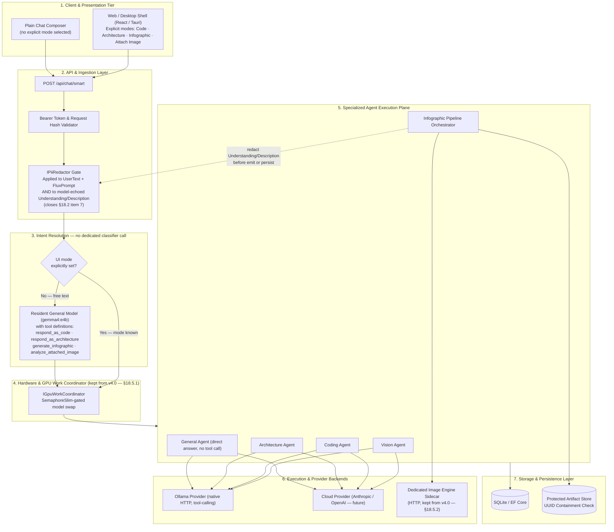

---

### 18.5 Core Subsystem Design

#### 18.5.1 Hardware & GPU Work Coordinator *(kept from v4.0, unchanged)*
Introduce a concurrency gateway to coordinate local GPU execution safely, independent of how intent was resolved:

```csharp
// EminentAi.Infrastructure/Hardware/GpuWorkCoordinator.cs
public interface IGpuWorkCoordinator
{
    Task<IDisposable> AcquireGpuLockAsync(GpuTaskPriority priority, string targetModel, CancellationToken ct);
}

public sealed class GpuWorkCoordinator : IGpuWorkCoordinator
{
    private readonly SemaphoreSlim _gpuLock = new(1, 1);
    private readonly IOllamaClient _ollama;
    private string? _currentlyLoadedModel;

    public async Task<IDisposable> AcquireGpuLockAsync(GpuTaskPriority priority, string targetModel, CancellationToken ct)
    {
        await _gpuLock.WaitAsync(ct);

        try
        {
            if (_currentlyLoadedModel != targetModel)
            {
                // Managed warm-up / transition without blind eviction
                _currentlyLoadedModel = targetModel;
            }
            return new Releaser(_gpuLock);
        }
        catch
        {
            _gpuLock.Release();
            throw;
        }
    }

    private sealed class Releaser(SemaphoreSlim sem) : IDisposable
    {
        public void Dispose() => sem.Release();
    }
}
```

* **Prevents OOM Crashes:** Multiple requests are queued gracefully rather than colliding in VRAM.
* **Eliminates Race Conditions:** No background process can dump models while an active stream is reading tokens.
* **Scoped per-process, not per-priority-queue:** for a single-user local app, a plain `SemaphoreSlim(1,1)` is sufficient — the `GpuTaskPriority` parameter is retained for API shape but does not need a real priority queue until multi-user/concurrent-session support is a stated goal.

#### 18.5.2 Dedicated HTTP/IPC Media Engine (Sidecar Daemon) *(kept from v4.0, unchanged)*
Replace `Process.Start("ollama run ...")` with an HTTP/REST sidecar or native Ollama image endpoint:

| Feature | Current (`ollama run` CLI) | Target (HTTP Daemon / Native Endpoint) |
| :--- | :--- | :--- |
| **Progress Reporting** | Coarse-grained SSE stages | Step-by-step denoising progress (e.g., `step 12/25`) |
| **Cancellation** | Risk of orphaned OS child processes | Immediate cancellation via standard `CancellationToken` HTTP abort |
| **Concurrent Safety** | High risk of working-directory collisions | Isolated memory buffers with per-request correlation IDs |
| **Output Extraction** | Heuristic file search + base64 stdout regex | Typed JSON response with binary/base64 payload |

#### 18.5.3 Tool-Calling Intent Resolution *(new — replaces the ONNX router)*

```csharp
// EminentAi.Application/Routing/ToolCallingIntentResolver.cs
// Replaces IIntentRouter's dedicated classification call for free-text chat only.
// UI-affordance requests (§18.5.4) never reach this path.
public sealed class ToolCallingIntentResolver
{
    private static readonly IReadOnlyList<ToolDefinition> IntentTools =
    [
        new("respond_as_code",          "User wants working code, debugging, or a code review."),
        new("respond_as_architecture",  "User wants system design, HLD/LLD, or diagrams."),
        new("generate_infographic",     "User wants an educational infographic image generated."),
        new("analyze_attached_image",   "User attached an image and wants it read or described.")
        // No tool call at all => General — the model just answers directly.
    ];

    public async IAsyncEnumerable<SmartChatEvent> ResolveAndExecuteAsync(
        SmartChatContext context, ModelRoute residentModelRoute, CancellationToken ct)
    {
        // One inference pass: the resident general model either answers directly
        // (no tool call => AgentKind.General, zero extra round-trips) or calls exactly
        // one tool, which is resolved to the corresponding ISpecializedAgent.
        // No separate ChatOnceAsync classification call, no raw-string enum parsing,
        // no cold-model swap purely to determine intent.
    }
}

public sealed record ToolDefinition(string Name, string Description);
```

* **Eliminates §18.2 item 3 entirely** (classification latency + cold-model penalty), rather than shrinking it — there is no separate classifier call to be slow.
* **Eliminates §18.2 item 6** — there is no regex-on-free-text image-gen trigger to false-positive on quoted strings; `generate_infographic` is only invoked when the resident model itself judges that to be the request, with the full conversation as context rather than a single regex pattern.
* Requires the resident model to support reliable function/tool calling — already true of modern local models such as those in the current matrix (§2).

#### 18.5.4 UI-Affordance Routing Contract *(new — the Cursor-style path)*

| Composer action | Routed directly to | Model call to determine intent |
| :--- | :--- | :--- |
| User selects "Infographic" action | `ImageGenerationAgent` | None |
| User attaches an image | `VisionAgent` | None |
| User toggles Code / Architecture mode | `CodeAgent` / `ArchitectureAgent` | None |
| Plain chat message, no mode selected | Resolved via §18.5.3 tool-calling | One inference pass (already answering the message) |

`manualRouteOverride` already exists in the current implementation (§6.1, §9) as a partial version of this — the target architecture makes it the **primary** path rather than an optional override, and removes the override-rejection dead-end identified in §18.2 item 5: since intent is either explicit (UI) or resolved in the same pass the model answers with (tool-calling), there is no longer a "Vision requested but no image attached" state to reject — the resident model simply notices the missing image and responds accordingly, the same way a human would.

---

### 18.6 Target State Sequence Diagram

```mermaid
sequenceDiagram
    autonumber
    actor User
    participant Web as React / Tauri UI
    participant API as POST /api/chat/smart
    participant AOF as AgentOrchestratorFacade
    participant GC as GpuWorkCoordinator (Lock)
    participant Resident as Resident Model (tool-calling)
    participant Agent as Specialized Agent
    participant Provider as Ollama / Cloud Provider
    participant DB as SQLite Persistence

    User->>Web: Submits Prompt (+ Optional Attachments / UI mode)
    Web->>API: HTTP POST /api/chat/smart {mode?, content, attachments}
    API->>AOF: ExecuteSmartTurnAsync(request)

    alt UI mode explicitly set (§18.5.4)
        AOF-->>Web: SSE: routing_decision {intent: mode, source:"ui-affordance", ms:0}
    else Plain chat — resolve via tool-calling (§18.5.3)
        rect rgb(240, 248, 255)
            Note over AOF,Resident: One inference pass — no dedicated classifier round-trip
            AOF->>GC: AcquireGpuLockAsync(Normal, "gemma4:e4b")
            GC-->>AOF: Lease granted
            AOF->>Resident: StreamAsync(messages, tools:[respond_as_code, respond_as_architecture, generate_infographic, analyze_attached_image])
            Resident-->>AOF: Tool call: respond_as_code  (or: direct answer => General)
        end
        AOF-->>Web: SSE: routing_decision {intent:"coding", source:"tool-call", ms: <inference time, not extra>}
    end

    AOF->>GC: AcquireGpuLockAsync(Normal, route.Model)
    GC-->>AOF: Lease granted
    AOF->>Agent: ExecuteAsync(context, route, lease)
    Agent->>Provider: StreamTokensAsync(route.Model, messages)

    loop Token Streaming
        Provider-->>Agent: Token chunk
        Agent-->>Web: SSE: token {text}
    end

    Provider-->>Agent: Generation Complete (usage stats)
    Agent->>DB: Persist Message & Metadata
    DB-->>Agent: ok (messageId)

    Agent->>GC: Release GPU Lease
    Agent-->>AOF: Complete
    AOF-->>Web: SSE: done {messageId, tokensIn, tokensOut}
```

---

### 18.7 Migration & Phased Implementation Roadmap

```mermaid
gantt
    title v4.1 Modernization Roadmap — Tool-Calling & UI-Affordance Routing
    dateFormat  YYYY-MM-DD
    section Phase 1: Stability (kept from v4.0)
    GPU Work Coordinator & Concurrency Lock       :p1_1, 2026-09-08, 7d
    Eliminate Global VRAM Eviction (keep_alive=0)  :p1_2, after p1_1, 4d
    Config-driven Model Matrix (appsettings.json)   :p1_3, after p1_2, 3d
    Fix doc-code drift (Vision override, record type) :p1_4, after p1_1, 2d

    section Phase 2: UI-Affordance Routing
    Composer explicit modes (Code/Arch/Infographic) :p2_1, 2026-09-22, 6d
    manualRouteOverride promoted to primary path    :p2_2, after p2_1, 3d
    Remove Vision-override-rejection dead-end        :p2_3, after p2_2, 2d

    section Phase 3: Tool-Calling Fallback
    Tool definitions on resident general model      :p3_1, 2026-10-06, 8d
    Retire IntentRouterService classifier call       :p3_2, after p3_1, 4d
    Routing-corpus tests updated for tool-call path  :p3_3, after p3_2, 3d

    section Phase 4: Media Pipeline (kept from v4.0)
    Direct HTTP/REST Image Generation Client         :p4_1, 2026-10-27, 8d
    Remove CLI Process Execution & File Scraping     :p4_2, after p4_1, 4d
    Granular Denoising Step Progress SSE Events      :p4_3, after p4_2, 3d
```

| Phase | Milestone | Expected Outcome |
| :--- | :--- | :--- |
| **Phase 1: Stability & Concurrency** | Implement `IGpuWorkCoordinator`, lock leasing, and fix the doc/code drift bug (§18.2 item 5). | Zero OOM crashes or model-eviction race conditions under concurrent tabs; override behavior matches documentation. |
| **Phase 2: UI-Affordance Routing** | Explicit Composer modes become the primary routing path; `manualRouteOverride` stops being an "override" and becomes the normal case. | Most turns resolve intent with **zero** model calls, not a fast classifier — eliminates §18.2 item 3 for the majority of traffic. |
| **Phase 3: Tool-Calling Fallback** | Free-text chat with no explicit mode resolves intent via tool-calling on the already-resident model, replacing `IntentRouterService`'s dedicated classification call. | No standalone classifier round-trip remains anywhere in the system; §18.2 items 3 and 6 are eliminated by construction. |
| **Phase 4: Robust Media Engine** | Deprecate CLI `Process.Start` in favor of HTTP image API. | Clean process cancellation, no zombie OS tasks, and granular step progress. |

---

### 18.8 v4.1 File Map — What Actually Changes

Mirrors the level of detail in §11/§12/§13 for the current implementation, scoped to what each phase in §18.7 touches.

**Backend — new files:**

```
src/EminentAi.Application/Routing/
├── ToolCallingIntentResolver.cs   ← §18.5.3; replaces IntentRouterService's classification call
│                                     for free-text chat only (UI-affordance requests never reach it)
├── ToolDefinition.cs               ← name + description pairs passed to the resident model
└── IntentSource.cs                 ← enum: UiAffordance | ToolCall | FastPath
                                       (extends, does not replace, ClassificationRecord.WasFastPath)

src/EminentAi.Infrastructure/Hardware/
├── IGpuWorkCoordinator.cs          ← §18.5.1
└── GpuWorkCoordinator.cs           ← SemaphoreSlim(1,1) gate around every model-serving call,
                                       not just ImageGenerationAgent — text agents acquire it too

src/EminentAi.Infrastructure/ImageGeneration/
└── DiffusionSidecarClient.cs       ← §18.5.2; HTTP client replacing FluxImageGenerator's
                                       Process.Start("ollama run ...") CLI path
```

**Backend — modified files:**

```
src/EminentAi.Application/Orchestration/AgentOrchestratorFacade.cs
  - Remove ValidateManualOverride's routing_error-and-abort branch for Vision-without-image (§18.2 item 5)
  + manualRouteOverride / UI mode becomes the primary path checked first (§18.5.4)
  + When no mode is set, dispatch to ToolCallingIntentResolver instead of IIntentRouter.ClassifyAsync
  + Every ISpecializedAgent.ExecuteAsync call wrapped in IGpuWorkCoordinator.AcquireGpuLockAsync

src/EminentAi.Application/Routing/ClassificationRecord.cs
  No code change — OverrideRejectedReason is already string?; §4.3's contract table is corrected
  to match it (the drift was in this document, not the code)

src/EminentAi.Application/Agents/ImageGeneration/ImageGenerationAgent.cs
  - Remove the GetLoadedModelsAsync / UnloadModelAsync / WarmUpModelAsync snapshot-evict-restore
    dance (§18.2 item 1) — VRAM safety now comes from IGpuWorkCoordinator, not manual eviction
  + Call DiffusionSidecarClient instead of FluxImageGenerator's CLI path
  + Apply redactor.Redact to AnalysisResult.Understanding and ExpandedPrompt.Description before
    they are emitted in SSE or persisted (§18.2 item 7) — currently only UserText and FluxPrompt are redacted

src/EminentAi.Infrastructure/Routing/IntentRouterService.cs
  - Remove the ImageGenKeywords quoted-string fast-path (§18.2 item 6) — superseded by tool-calling,
    which sees the full conversation instead of matching a single regex against one message
  Retained only as an emergency default (→ General) if the resident model's tool-calling call itself fails

src/EminentAi.Application/Abstractions/IOllamaClient.cs
src/EminentAi.Infrastructure/Ollama/OllamaClient.cs
  - Delete GenerateImageAsync from both (§18.2 item 8) — implemented, zero call sites, superseded
    by FluxImageGenerator since before v3.0; safe to remove alongside the DiffusionSidecarClient work
    since both replace the same "how do we get a PNG out of Ollama" seam
```

**Frontend — new/modified files (mirrors §12):**

```
web/src/components/Composer.tsx
  + Explicit mode buttons — Code · Architecture · Infographic — become the primary way to signal
    intent, not a secondary "Auto-route toggle"; image attachment still implies Vision as today
  + manualRouteOverride is sent whenever a mode button is active; omitted only for plain chat,
    which is the sole case that reaches ToolCallingIntentResolver server-side

web/src/lib/api.ts
  + smartChat(...) request carries the existing manualRouteOverride field; no new field needed —
    "mode selected" is simply "manualRouteOverride is non-null"

web/src/lib/types.ts
  + RoutingDecision gains `source: "ui-affordance" | "tool-call" | "fast-path"`, replacing the
    current boolean wasFastPath with a three-way discriminator the RoutingBadge can render distinctly

web/src/components/RoutingBadge.tsx
  + Badge text reflects source: "Vision • you selected" vs "Coding • model decided" vs "Vision • fast-path"
```

