# Agent-to-Agent Orchestration Architecture

> **EminentAi — Multi-Agent Routing System**
> Version 3.1 — revised after async/security performance review. Current implementation keeps facade-level intent/model routing sequential, while MCP discovery and model-provider checks are parallelized internally.
> Provider-agnostic: Ollama local models today, Claude / ChatGPT / Copilot extensible by design.

---

## Revision Notes

### v1 → v2

| Finding | Severity | Resolution |
|---|---|---|
| Bypassed `AgentOrchestrator` — not true A2A | High | Added `AgentOrchestratorFacade` owning full chain |
| "All local" hard-coded — no provider abstraction | High | Added `IModelProvider`, `ModelCapability`, `CostPolicy`, `DataResidencyPolicy` |
| `systemPromptOverride` as raw string | High | Replaced with `AgentProfile` — server-side constants only |
| `done` emitted before DB persistence | Medium | Fixed in all sequence diagrams |
| Classifier confidence / telemetry missing | Medium | Added `ClassificationRecord` |
| Flux API spike unverified | Medium | Spike task added to impl order; response shape documented as unconfirmed |
| Generated images served without auth | Medium | Bearer token + ownership check added |
| `autoRouteHint` semantics undefined | Medium | Treated as advisory; validated to enum |
| No `AgentProfile` record | Low | All agents use `AgentProfile` |
| Image gen first in impl order | Low | Text flows first; image gen implemented and depends on Flux returning base64 PNG in `response` |
| VRAM swapping unaddressed | PE note | `keep_alive` strategy documented |
| `generated-images/` not in `.gitignore` | PE note | Added to file map |

### v2 → v3

| Finding | Severity | Resolution |
|---|---|---|
| `routing_decision` emitted before model resolved but carries `model`+`provider` | High | AOF now resolves `ModelRoute` before emitting any SSE; ordering fixed in all sequence diagrams |
| `RoutingDecision` embeds `ModelRoute` — violates `IIntentRouter`'s responsibility | High | Split: `IIntentRouter` returns `IntentDecision` (intent only); AOF combines with `ModelRoute` for SSE payload |
| Provider DTOs in Infrastructure — Application depends on them | High | All provider interfaces and DTOs moved to `Application/Providers/`; Infrastructure holds implementations only |
| `AgentProfile.RequiredCapabilities` is `IReadOnlySet<string>` vs `IReadOnlySet<ModelCapability>` | Medium | Unified to `IReadOnlySet<ModelCapability>` everywhere |
| `DataResidencyPolicy` and `CostPolicy` unenforceable — `ModelDescriptor` lacks fields | Medium | Added `IsLocal`, `Region`, `InputTokenCostUsd`, `OutputTokenCostUsd` to `ModelDescriptor` |
| `autoRouteHint` is advisory but skips classification — semantics conflict | Medium | Renamed to `manualRouteOverride`; validation added: Vision requires image; missing models are handled by model resolution |
| `SmartChatContext.AssistantMessageId` preallocated but `ChatService` owns creation | Medium | Removed from context; `ChatService` creates the assistant message and surfaces the ID on deltas before persisting |
| `persisted` SSE event referenced in diagrams but absent from SSE contract | Low | Removed from sequence diagrams; persistence is an internal step; `done` is the client signal |

### v3 → v3.1 (Performance & Async Update)

| Finding | Severity | Resolution |
|---|---|---|
| Sequential intent + model resolution | Medium | Still sequential in `AgentOrchestratorFacade`; manual override skips classification, while model/provider health checks run in parallel inside `ModelRouterService` |
| Blocking security evaluation | High | `IPolicyEngine` refactored to `EvaluateAsync` for non-blocking loop persistence |
| Regex overhead in security | Medium | Added compiled `RegexCache` to `PolicyEngine` for glob pattern matching |
| Classifier latency on missing model | Low | Not proactively health-checked in `IntentRouterService`; failed classifier calls are caught and default to `General` |

### v3.1 → v3.2 (ImageGenerationAgent — Actual Implementation)

| Finding | Severity | Resolution |
|---|---|---|
| Analyst model was `qwen3.5:2b` in spec | High | Actual impl uses `qwen3:latest` — larger reasoning model for higher-quality Flux prompt expansion |
| Single-image pipeline in spec | High | Actual impl expands one request into N prompts, generates N images, streams each separately |
| `/api/generate` HTTP call for Flux | High | Actual impl uses `ollama run` CLI — avoids response-shape uncertainty; captures PNG from working directory or base64 in stdout |
| No VRAM management in spec | Medium | Actual impl snapshots loaded models → unloads all → runs Flux → restores; prevents VRAM OOM on 16 GB systems |
| SSE stages in spec: `translating`, `generating`, `saving` | Medium | Actual stages: `analyzing_request`, `analysis_done`, `freeing_vram`, `generating`, `saving`, `restoring_models` + `gen_failed`, `save_failed` |
| `ImageGenProgressPanel` not in frontend file map | Low | New component added: collapsible pipeline panel with per-step status, progress bar, A2A badge, model chips |
| `x/z-image-turbo` not in model table | Low | Added — 12 GB high-quality image generation model |

---

## Table of Contents

1. [Overview](#1-overview)
2. [Installed Ollama Models](#2-installed-ollama-models)
3. [Existing Infrastructure](#3-existing-infrastructure)
4. [Core Abstractions](#4-core-abstractions)
   - 4.1 [AgentKind & AgentProfile](#41-agentkind--agentprofile)
   - 4.2 [Provider Contracts — Application Layer](#42-provider-contracts--application-layer)
   - 4.3 [IIntentRouter & IntentDecision](#43-iintentrouter--intentdecision)
   - 4.4 [IModelRouter & ModelRoute](#44-imodelrouter--modelroute)
   - 4.5 [ISpecializedAgent & SmartChatContext](#45-ispecializedagent--smartchatcontext)
5. [High-Level Architecture (HLD)](#5-high-level-architecture-hld)
6. [Component Design (LLD)](#6-component-design-lld)
   - 6.1 [AgentOrchestratorFacade](#61-agentorchestratorfacade)
   - 6.2 [IntentRouterService](#62-intentrouterservice)
   - 6.3 [ModelRouterService](#63-modelrouterservice)
   - 6.4 [OllamaModelProvider](#64-ollamamodelprovider)
   - 6.5 [Specialized Agents](#65-specialized-agents)
   - 6.6 [ImageGenerationAgent](#66-imagegenerationagent)
7. [Sequence Diagrams](#7-sequence-diagrams)
   - 7.1 [Vision](#71-flow-1--vision)
   - 7.2 [Code](#72-flow-2--code)
   - 7.3 [Architecture](#73-flow-3--architecture)
   - 7.4 [Image Generation](#74-flow-4--image-generation)
   - 7.5 [General](#75-flow-5--general)
   - 7.6 [Classification Internal](#76-flow-6--classification-internal)
   - 7.7 [Provider Fallback](#77-flow-7--provider-fallback)
8. [Overall Orchestration Flowchart](#8-overall-orchestration-flowchart)
9. [Smart Endpoint Contract](#9-smart-endpoint-contract)
10. [SSE Event Reference](#10-sse-event-reference)
11. [Backend File Map](#11-backend-file-map)
12. [Frontend File Map](#12-frontend-file-map)
13. [Changes to Existing Files](#13-changes-to-existing-files)
14. [Implementation Order](#14-implementation-order)
15. [Model Fallback Matrix](#15-model-fallback-matrix)
16. [Security Considerations](#16-security-considerations)
17. [Operational Notes](#17-operational-notes)

---

## 1. Overview

Every chat message today goes to whatever model the user manually selected. No intelligence routes by task type, and no abstraction allows swapping providers without rewriting infrastructure.

This architecture inserts a **true orchestration layer** with a clean separation of concerns:

```
POST /api/chat/smart
  └─ AgentOrchestratorFacade          owns the entire turn
       ├─ IIntentRouter                classifies intent → IntentDecision   (no model knowledge)
       ├─ IModelRouter                 resolves model + provider → ModelRoute
       ├─ [emit routing_decision SSE]  only after both intent AND model are resolved
       ├─ ISpecializedAgent            executes, streams, persists
       │    └─ IModelProvider          Ollama today; Claude / ChatGPT tomorrow
       └─ ChatService                  persistence layer
```

`POST /api/branches/:id/messages` is **unchanged**. The smart path is additive.

---

## 2. Installed Ollama Models

```
NAME                       SIZE     TIER           ROLE
────────────────────────────────────────────────────────────────────────
qwen3.5:2b                 2.7 GB   fast           Intent classifier — stays warm, sub-500ms
qwen2.5-coder:1.5b         986 MB   fast           Code Agent + VS Code FIM completions
qwen2.5:latest             4.7 GB   balanced       General Agent / Architecture fallback
qwen3:latest               5.2 GB   balanced       Architecture Agent (primary) + Image prompt engineer
gemma4:e4b                 9.6 GB   balanced       Architecture Agent — fallback
qwen2.5vl:latest           6.0 GB   vision         Vision Agent — only multimodal model
x/flux2-klein:4b           5.7 GB   image_gen      Image generation — Flux2 diffusion
x/z-image-turbo            12 GB    image_gen      Image generation — high quality
nomic-embed-text:latest    274 MB   embedding      Reserved: RAG / semantic search
```

**VRAM management:** `ImageGenerationAgent` takes an active approach — it snapshots all currently loaded models via `/api/ps`, unloads each with `keep_alive=0`, runs the Flux model, then fire-and-forgets `WarmUpModelAsync` for each previously loaded model. This prevents OOM on 16 GB systems when Flux needs the full VRAM budget. Progress is streamed via `image_gen_progress` SSE events so the UI is never silent during the 30–180 s generation window.

**Generation method:** `ImageGenerationAgent` uses the `ollama run <model> "<prompt>"` CLI — not `/api/generate`. This avoids response-shape uncertainty across Flux model variants. The agent checks the working directory for a written PNG first (Strategy A), then falls back to extracting base64 from stdout (Strategy B). Generation timeout is 15 minutes.

---

## 3. Existing Infrastructure

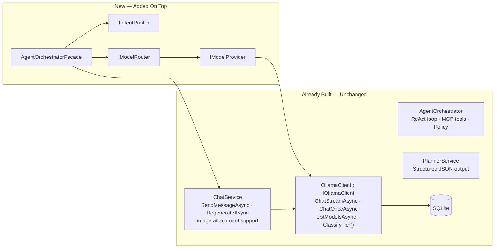

`AgentOrchestrator` (ReAct + tools) remains for agentic runs. `AgentOrchestratorFacade` is a separate, lighter path for chat-smart turns.

---

## 4. Core Abstractions

### 4.1 AgentKind & AgentProfile

`AgentProfile` is always a server-side compile-time constant. No code path accepts a raw string as a system prompt.

```csharp
// EminentAi.Application/Agents/AgentKind.cs
public enum AgentKind { Vision, Coding, Architecture, ImageGeneration, General }

// EminentAi.Application/Agents/AgentProfile.cs
public sealed record AgentProfile(
    AgentKind Kind,
    string SystemPrompt,
    float Temperature,
    IReadOnlySet<ModelCapability> RequiredCapabilities  // typed — matches ModelDescriptor.Capabilities
);

// EminentAi.Application/Agents/AgentProfiles.cs
public static class AgentProfiles
{
    public static readonly AgentProfile Vision = new(
        AgentKind.Vision,
        SystemPrompt: """
            You are a vision-capable AI assistant. When given an image:
            - Extract ALL visible text accurately, preserving structure (tables, lists, columns).
            - Describe diagrams, charts, or visuals that cannot be expressed as text.
            - Answer the user's specific question about the image.
            - For forms, invoices, or structured documents, present data in a markdown table.
            - Do not hallucinate content that is not visible.
            """,
        Temperature: 0.1f,
        RequiredCapabilities: new HashSet<ModelCapability> { ModelCapability.Vision }
    );

    public static readonly AgentProfile Coding = new(
        AgentKind.Coding,
        SystemPrompt: """
            You are an expert software engineer. When providing code:
            - Show complete, runnable examples — never pseudocode or stubs.
            - Use the language/framework the user specifies, or infer from context.
            - Include only the imports and setup that are actually needed.
            - If showing a real-world pattern, name it and explain the WHY in one sentence.
            - Prefer idiomatic, production-quality code.
            - If asked to debug, reproduce the error first, then fix it.
            """,
        Temperature: 0.1f,
        RequiredCapabilities: new HashSet<ModelCapability>()
    );

    public static readonly AgentProfile Architecture = new(
        AgentKind.Architecture,
        SystemPrompt: """
            You are a senior software architect. Structure every design response as:

            ## Summary
            One paragraph: the system's purpose and the core architectural decision.

            ## HLD — High-Level Diagram
            ```mermaid
            graph TB
              [services and connections]
            ```

            ## LLD — Data Model
            ```mermaid
            classDiagram
              [key entities and relationships]
            ```

            ## Primary Flow — Sequence Diagram
            ```mermaid
            sequenceDiagram
              [happy path from user action to result]
            ```

            ## Decision Flow — Flowchart
            ```mermaid
            flowchart LR
              [branching logic and routing decisions]
            ```

            ## Technology Justification
            Bullet list: why each major technology was chosen.

            Always wrap Mermaid in triple-backtick mermaid fences.
            """,
        Temperature: 0.3f,
        RequiredCapabilities: new HashSet<ModelCapability>()
    );

    public static readonly AgentProfile ImageGeneration = new(
        AgentKind.ImageGeneration,
        SystemPrompt: "",   // not used — ImageGenerationAgent bypasses ChatService
        Temperature: 0f,
        RequiredCapabilities: new HashSet<ModelCapability> { ModelCapability.ImageGeneration }
    );

    public static readonly AgentProfile General = new(
        AgentKind.General,
        SystemPrompt: "You are EminentAi, a helpful AI assistant running fully locally.",
        Temperature: 0.7f,
        RequiredCapabilities: new HashSet<ModelCapability>()
    );

    public static AgentProfile ForKind(AgentKind kind) => kind switch
    {
        AgentKind.Vision          => Vision,
        AgentKind.Coding          => Coding,
        AgentKind.Architecture    => Architecture,
        AgentKind.ImageGeneration => ImageGeneration,
        _                         => General
    };
}
```

---

### 4.2 Provider Contracts — Application Layer

All provider interfaces and DTOs live in `EminentAi.Application/Providers/`. Infrastructure holds only implementations.


**`ModelDescriptor` enforcement fields:**

| Field | Used by | How |
| --- | --- | --- |
| `IsLocal` | `DataResidencyPolicy.LocalOnly` | Reject any `IsLocal == false` when `LocalOnly == true` |
| `Region` | `DataResidencyPolicy.AllowedRegions` | Reject if region not in allowed set |
| `InputTokenCostUsd` | `CostPolicy.MaxCostPerTokenUsd` | Skip model if cost exceeds cap |
| `OutputTokenCostUsd` | `CostPolicy.MaxCostPerTokenUsd` | Skip model if cost exceeds cap |

For Ollama-provided models: `IsLocal = true`, `Region = null`, `InputTokenCostUsd = 0`, `OutputTokenCostUsd = 0`. Future cloud providers supply real values.

---

### 4.3 IIntentRouter & IntentDecision

`IIntentRouter` knows nothing about models or providers. It returns only intent classification.

```csharp
// EminentAi.Application/Routing/IIntentRouter.cs
public interface IIntentRouter
{
    Task<IntentDecision> ClassifyAsync(IntentRequest request, CancellationToken ct = default);
}

// IntentDecision — intent + profile + telemetry. NO model, NO provider.
public sealed record IntentDecision(
    AgentKind Intent,
    AgentProfile Profile,
    string ClassifierModel,
    long ClassificationMs,
    ClassificationRecord Telemetry
);

public sealed record IntentRequest(
    string UserText,
    bool HasImageAttachment,
    IReadOnlyList<string> AttachmentContentTypes
    // manualRouteOverride is handled in AOF before reaching IIntentRouter
);

public sealed record ClassificationRecord(
    string RawLabel,
    bool WasFastPath,
    bool ManualOverrideApplied,
    AgentKind? OverrideRequestedKind,   // what the caller asked for
    AgentKind? OverrideRejectedReason   // null if override was accepted
);
```

**`RoutingDecision` is an AOF-internal record, not a contract.** It combines `IntentDecision` and `ModelRoute` for the SSE payload only:

```csharp
// EminentAi.Application/Orchestration/AgentOrchestratorFacade.cs (private)
private sealed record RoutingDecision(IntentDecision Intent, ModelRoute Route);
```

---

### 4.4 IModelRouter & ModelRoute

```csharp
// EminentAi.Application/Routing/IModelRouter.cs
public interface IModelRouter
{
    Task<ModelRoute?> ResolveAsync(
        AgentProfile profile,
        CostPolicy costPolicy,
        DataResidencyPolicy residencyPolicy,
        CancellationToken ct = default);
    // Returns null when no eligible model found across all providers.
}

// EminentAi.Application/Routing/ModelRoute.cs
public sealed record ModelRoute(
    ModelDescriptor Model,
    string ProviderName,
    string SelectionReason,
    bool IsExactMatch
);
```

---

### 4.5 ISpecializedAgent & SmartChatContext

```csharp
// EminentAi.Application/Agents/ISpecializedAgent.cs
public interface ISpecializedAgent
{
    AgentKind Kind { get; }

    /// <summary>
    /// Executes the agent turn. Must persist the message before yielding done.
    /// The done event is yielded only after ChatService has persisted the assistant message.
    /// </summary>
    IAsyncEnumerable<SmartChatEvent> ExecuteAsync(
        SmartChatContext context,
        ModelRoute route,
        CancellationToken ct);
}

// AssistantMessageId was removed from SmartChatContext. ChatService creates the assistant Message entity and surfaces its ID on streamed deltas before persisting it at the end of the stream.
public sealed record SmartChatContext(
    Guid BranchId,
    string UserText,
    IReadOnlyList<ChatAttachment> Attachments,
    IntentDecision Intent
);

public sealed record SmartChatEvent(string Type, object Data);
```

---

## 5. High-Level Architecture (HLD)


---

## 6. Component Design (LLD)

### 6.1 AgentOrchestratorFacade

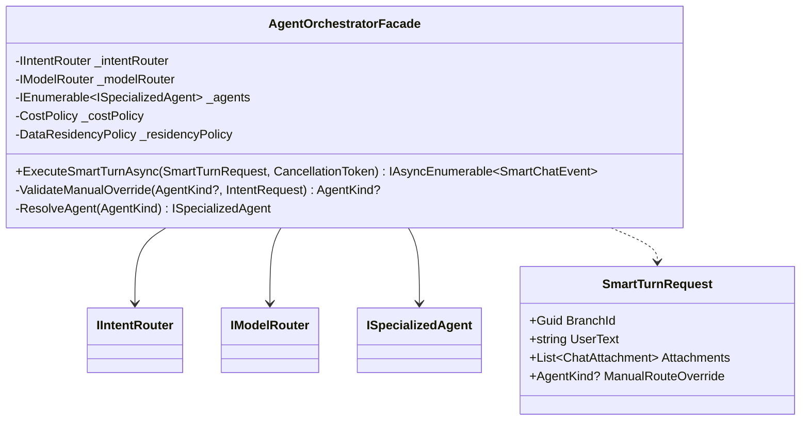

**Execution order inside `ExecuteSmartTurnAsync`:**

```text
1. ValidateManualOverride(request.ManualRouteOverride, intentRequest)
     → Vision override rejected if no image attached
     → ImageGeneration override is accepted here; missing image_gen model is handled by model resolution
     → Invalid enum value rejected by the API before facade execution

2. IIntentRouter.ClassifyAsync(intentRequest)
     → Returns IntentDecision (no model info)
     → Skipped when manualRouteOverride is valid

3. IModelRouter.ResolveAsync(profile, costPolicy, residencyPolicy)
     → Returns ModelRoute? — null triggers routing_error SSE + return
     → Internally runs provider health checks and model listing with Task.WhenAll

4. Emit routing_decision SSE
     ← Only now, with both intent AND model known

5. ISpecializedAgent.ExecuteAsync(context, route, ct)
     → Agent streams tokens → persists message → yields done
     → done carries the assistant message ID surfaced by ChatService after persistence completes

6. Propagate all SmartChatEvents to SSE response
```

**`manualRouteOverride` validation rules:**

| Requested | Condition for rejection | What happens on rejection |
| --- | --- | --- |
| `Vision` | `HasImageAttachment == false` | Log warning; ignore override; classify normally |
| `ImageGeneration` | None at override-validation time | Override is accepted; missing model produces `routing_error` during model resolution |
| Any invalid enum string | Can't parse to `AgentKind` | Return `routing_error` SSE immediately |

The applied `AgentKind` is always returned in `routing_decision.intent` so the UI shows what actually ran, not what was requested.

---

### 6.2 IntentRouterService

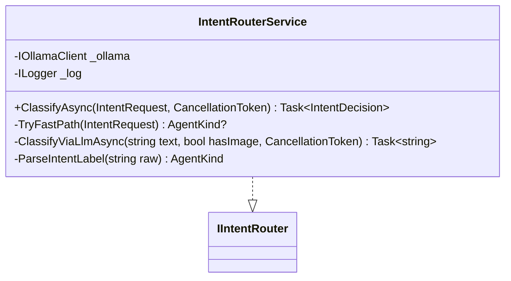

`IntentRouterService` has no knowledge of models, providers, or routes. It returns `IntentDecision` only. It does not proactively health-check the classifier model; failed classifier calls are caught and default to `General`.

**Fast-path rules (no LLM call):**

| Condition | Result | Logged as |
| --- | --- | --- |
| `HasImageAttachment && text matches \b(read\|extract\|what\|describe\|tell me about\|text in)\b` | `Vision` | `fastPath:vision` |
| `text matches ^(generate\|draw\|create a (logo\|image\|picture\|banner)\|design an? image\|make an? logo)` | `ImageGeneration` | `fastPath:imageGen` |

**Classification prompt** (sent to `qwen3.5:2b`, temperature 0.0, max 10 tokens):

```
You are a one-word classifier. Reply with EXACTLY ONE label — no punctuation, no explanation.

VISION         — user attached an image and wants to read, extract, or analyse it
CODING         — user wants working code, a coding example, debugging, or code review
ARCHITECTURE   — user wants system design, tech stack plan, HLD, LLD, or diagrams
IMAGE_GEN      — user wants to generate, draw, or create an image, logo, or graphic
GENERAL        — anything else

HasImageAttachment: {true|false}
UserMessage: {userText}
```

**Defensive label parsing:**

```csharp
private static AgentKind ParseIntentLabel(string raw)
{
    // Strip everything except A-Z and underscore after uppercasing.
    // Handles "  CODING\n", "Here is: IMAGE_GEN.", "coding" etc.
    var clean = Regex.Replace(raw.Trim().ToUpperInvariant(), @"[^A-Z_]", "");
    return clean switch
    {
        "VISION"                     => AgentKind.Vision,
        "CODING"                     => AgentKind.Coding,
        "ARCHITECTURE"               => AgentKind.Architecture,
        "IMAGE_GEN" or "IMAGEGEN"
                    or "IMAGE"       => AgentKind.ImageGeneration,
        "GENERAL"                    => AgentKind.General,
        // Unknown label — log, default to General, never throw
        _ => AgentKind.General
    };
}
```

The raw string from the model is always stored in `ClassificationRecord.RawLabel` before parsing, regardless of parse outcome.

---

### 6.3 ModelRouterService

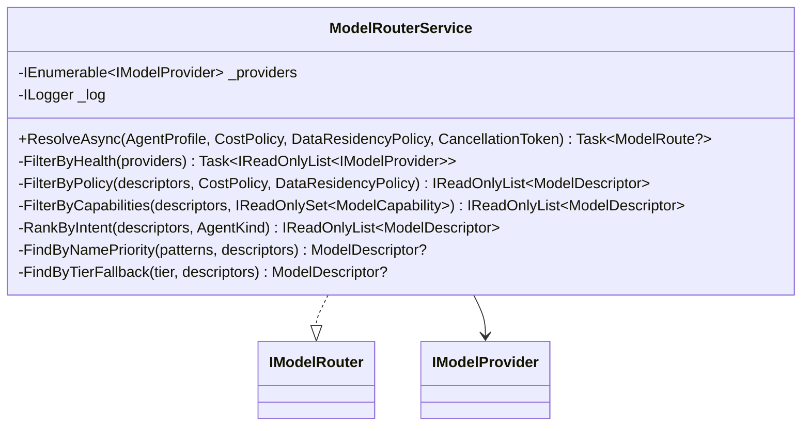

**Policy filtering using `ModelDescriptor` fields:**

```csharp
private IReadOnlyList<ModelDescriptor> FilterByPolicy(
    IReadOnlyList<ModelDescriptor> candidates,
    CostPolicy cost,
    DataResidencyPolicy residency)
{
    return candidates.Where(m =>
        // Residency: reject non-local when LocalOnly required
        (!residency.LocalOnly || m.IsLocal) &&
        // Residency: reject wrong region when regions are specified
        (residency.AllowedRegions.Count == 0 || m.Region is null || residency.AllowedRegions.Contains(m.Region)) &&
        // Cost: reject models exceeding per-token cap (use the higher of input/output)
        (cost.MaxCostPerTokenUsd is null ||
            Math.Max(m.InputTokenCostUsd ?? 0m, m.OutputTokenCostUsd ?? 0m) <= cost.MaxCostPerTokenUsd) &&
        // Cost: reject explicitly blocked providers
        !cost.BlockedProviders.Contains(m.ProviderName)
    ).ToList();
}
```

**Capability filtering** uses `IReadOnlySet<ModelCapability>` — same type as `AgentProfile.RequiredCapabilities`:

```csharp
private IReadOnlyList<ModelDescriptor> FilterByCapabilities(
    IReadOnlyList<ModelDescriptor> candidates,
    IReadOnlySet<ModelCapability> required)
{
    if (required.Count == 0) return candidates;
    return candidates.Where(m => required.IsSubsetOf(m.Capabilities)).ToList();
}
```

**Name-priority lists per `AgentKind`:**

```csharp
private static readonly IReadOnlyDictionary<AgentKind, string[]> NamePriorities =
    new Dictionary<AgentKind, string[]>
    {
        [AgentKind.Vision]          = ["qwen2.5vl", "vl", "vision", "llava", "moondream"],
        [AgentKind.Coding]          = ["qwen2.5-coder:1.5b", "qwen2.5-coder", "coder", "deepseek-coder"],
        [AgentKind.Architecture]    = ["qwen3:latest", "qwen3", "gemma4", "qwen2.5:latest", "qwen2.5"],
        [AgentKind.ImageGeneration] = ["flux2-klein", "flux", "diffusion"],
        [AgentKind.General]         = ["qwen2.5:latest", "qwen2.5", "qwen3.5", "llama3"],
    };
```

---

### 6.4 OllamaModelProvider

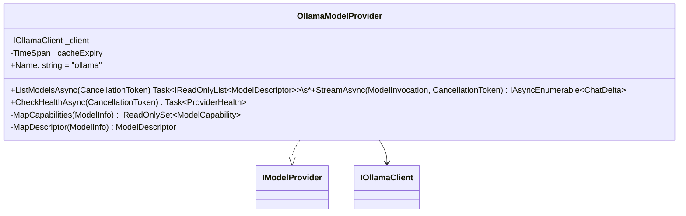

`MapDescriptor` sets the policy-enforcement fields for Ollama models:

```csharp
private static ModelDescriptor MapDescriptor(ModelInfo m) => new(
    Name:               m.Name,
    ProviderName:       "ollama",
    Capabilities:       MapCapabilities(m),
    SizeBytes:          m.SizeBytes,
    Tier:               m.Tier,
    IsAvailable:        true,
    IsLocal:            true,       // all Ollama models are local
    Region:             null,       // local — no region
    InputTokenCostUsd:  0m,         // local — no cost
    OutputTokenCostUsd: 0m
);
```

`MapCapabilities` extends `ClassifyTier()` output into typed `ModelCapability` flags:

```
"vision"    → { Vision, TextGeneration }
"fast"      → { TextGeneration, CodeGeneration }
"balanced"  → { TextGeneration, CodeGeneration, FunctionCalling }
"reasoning" → { TextGeneration, Reasoning }
"embedding" → { Embedding }
"image_gen" → { ImageGeneration }   ← new tier added to ClassifyTier()
```

---

### 6.5 Specialized Agents

**VisionAgent, CodeAgent, ArchitectureAgent, GeneralAgent** share the same structure:

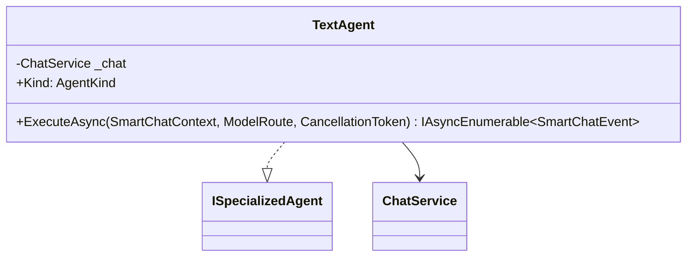

`ExecuteAsync` for all text agents:

```
1. Call ChatService.SendMessageAsync(context.BranchId, context.UserText,
       context.Attachments, modelOverride: route.Model.Name,
       profile: context.Intent.Profile)
       ↑ profile replaces systemPromptOverride — server-side constant, never user input

2. Yield SmartChatEvent{token} for each ChatDelta.Token

3. Await ChatDelta.Done (stream complete)

4. Await ChatService persistence (INSERT Message) — internal, invisible to client

5. Yield SmartChatEvent{done, messageId}
   ↑ ChatService creates the assistant Message entity before streaming, surfaces its ID on deltas, then persists it before the agent emits done
```

`ChatService.SendMessageAsync` gains one parameter:

```csharp
// Before:
public async IAsyncEnumerable<ChatDelta> SendMessageAsync(
    Guid branchId, string content, string? modelOverride, List<ChatAttachment>? attachments, ...)

// After (v3):
public async IAsyncEnumerable<ChatDelta> SendMessageAsync(
    Guid branchId, string content, string? modelOverride, List<ChatAttachment>? attachments,
    AgentProfile? profile = null, ...)
// BuildContext uses profile.SystemPrompt when profile != null, else conversation.SystemPrompt
```

---

### 6.6 ImageGenerationAgent

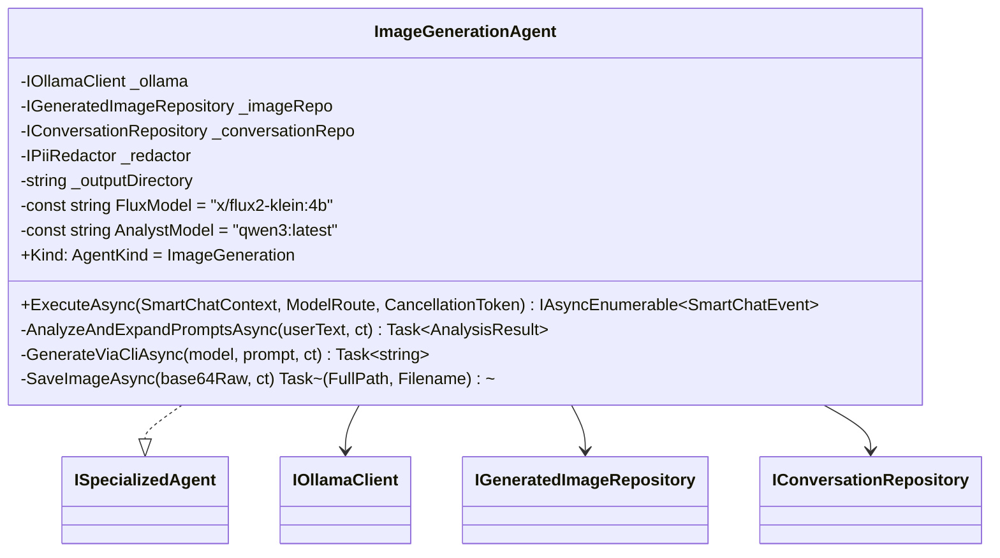

**Actual pipeline (v3.2):**

```mermaid
flowchart LR
    A["User prompt"] --> B["Agent 1: qwen3:latest\nAnalyse + expand to N Flux prompts\nJSON: understanding + prompts[]"]
    B --> C["Snapshot loaded models\nvia /api/ps"]
    C --> D["Unload all models\nkeep_alive=0 · 500ms settle"]
    D --> E["For each expanded prompt:\nollama run flux2-klein prompt\n15-min timeout"]
    E --> F["Strategy A: PNG in workdir\nStrategy B: base64 in stdout"]
    F --> G["Save to Generated_images/uuid.png\nPath containment check"]
    G --> H["INSERT GeneratedImages\n+ INSERT Message\nwith all image markdown"]
    H --> I["image_generated SSE\ndone SSE"]
    I --> J["WarmUp previously\nloaded models\nfire-and-forget"]
```

**Analyst system prompt** (sent to `qwen3:latest`, temp 0.2, force JSON):

The analyst is instructed to return:
```json
{
  "understanding": "One sentence: what the user wants",
  "prompts": [
    { "description": "short human-readable label", "prompt": "the Flux2 prompt" }
  ]
}
```

For multi-variant requests (dark/light theme, different sizes, multiple colour schemes), the analyst generates a separate prompt object per variant. `<think>…</think>` reasoning blocks from qwen3 are stripped before JSON parsing.

**Quoted-prompt shortcut:** Input of the form `"A cute baby", "Bold text"` bypasses the analyst and sends each quoted string directly to Flux with enhancement instructions.

**`IOllamaClient` methods used by `ImageGenerationAgent`:**

```csharp
Task<string> ChatOnceAsync(ChatRequest request, CancellationToken ct);       // Agent 1: qwen3 analysis
Task<IReadOnlyList<LoadedModelInfo>> GetLoadedModelsAsync(CancellationToken ct); // VRAM snapshot
Task UnloadModelAsync(string modelName, CancellationToken ct);               // VRAM free
Task WarmUpModelAsync(string modelName, CancellationToken ct);               // VRAM restore (fire-and-forget)
// GenerateImageAsync is NOT used — CLI path via `ollama run` is used instead
```

**SSE stages emitted:**

| Stage | Meaning |
|---|---|
| `analyzing_request` | qwen3:latest is processing the request |
| `analysis_done` | Expansion complete; `understanding` and `total` counts emitted |
| `freeing_vram` | Unloading models; `killingModels[]` list emitted |
| `generating` | Flux is running for prompt N of M; `prompt`, `description` emitted |
| `gen_failed` | Flux failed for one image; pipeline continues with next |
| `saving` | PNG detected; writing to disk |
| `save_failed` | Write failed; pipeline continues |
| `restoring_models` | Fire-and-forget warm-up; `models[]` list emitted |

**Ownership persistence** — before `done` is emitted:

Both `GeneratedImages` row and `Message` row (containing markdown for all successful images) are written before `done` is yielded.

---

## 7. Sequence Diagrams

### 7.1 Flow 1 — Vision

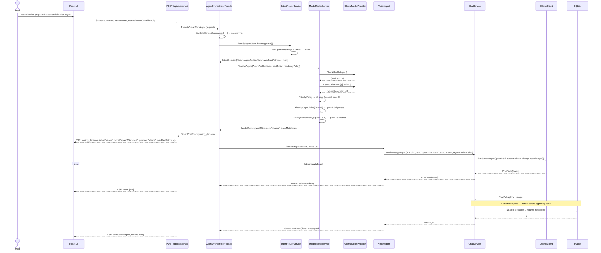

---

### 7.2 Flow 2 — Code

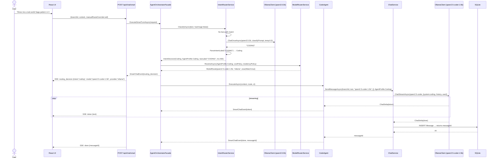

---

### 7.3 Flow 3 — Architecture

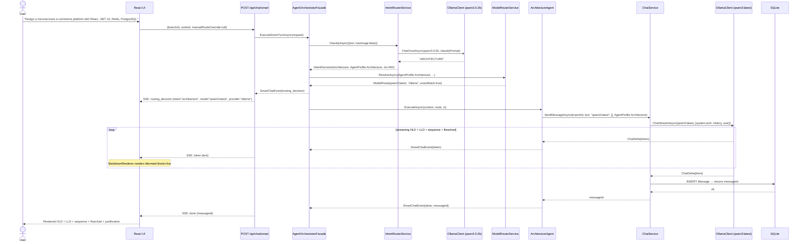

---

### 7.4 Flow 4 — Image Generation

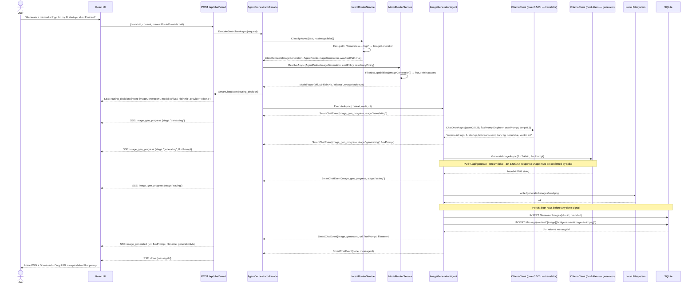

---

### 7.5 Flow 5 — General

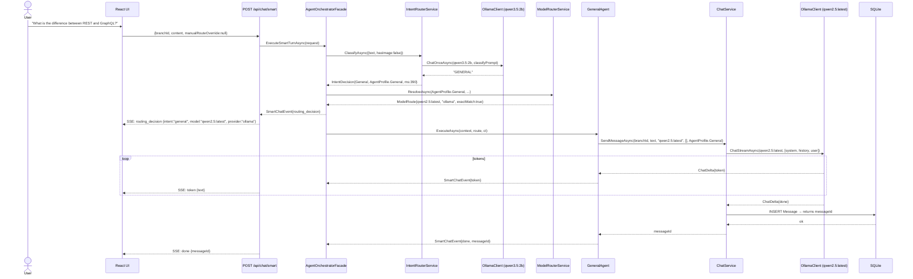

---

### 7.6 Flow 6 — Classification Internal

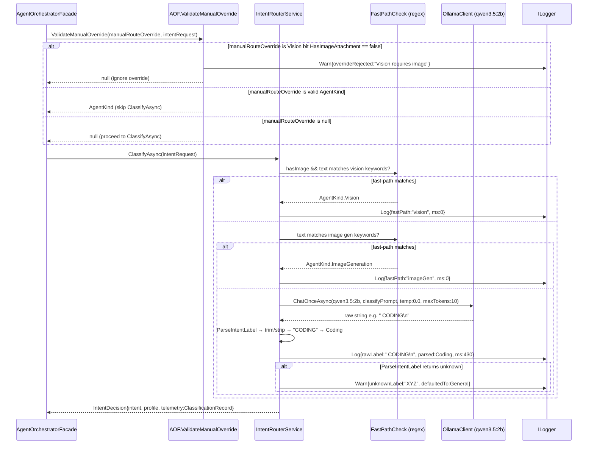

---

### 7.7 Flow 7 — Provider Fallback

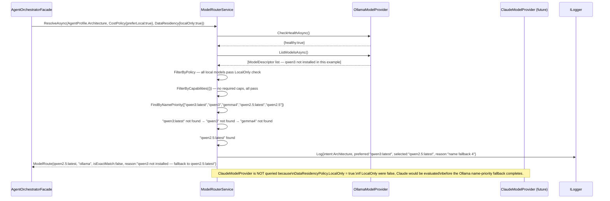

---

## 8. Overall Orchestration Flowchart

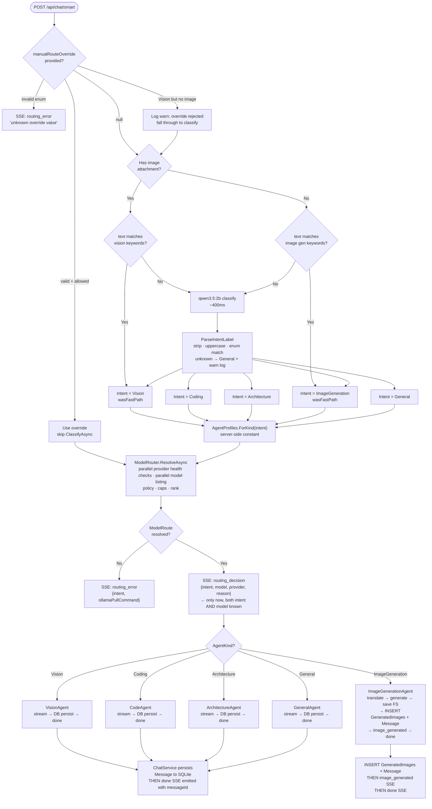

---

## 9. Smart Endpoint Contract

### Request

```
POST /api/chat/smart
Authorization: Bearer <session-token>
Content-Type: application/json

{
  "branchId": "guid",
  "content": "string",
  "attachments": [
    {
      "name": "invoice.png",
      "contentType": "image/png",
      "dataBase64": "iVBORw0KGgo..."
    }
  ],
  "manualRouteOverride": "vision|coding|architecture|imageGeneration|general"
                          // optional · validated to AgentKind enum · advisory
                          // Vision without image → rejected (ignored, classify normally)
                          // actual applied kind always in routing_decision.intent
}
```

### SSE Stream

```
── always first (after both intent and model resolved): ──────

event: routing_decision
data: {
  "intent": "vision",
  "model": "qwen2.5vl:latest",
  "provider": "ollama",
  "reason": "fast-path: image attached + text contains 'what'",
  "classificationMs": 1,
  "wasFastPath": true,
  "manualOverrideApplied": false
}

── text responses (Vision / Code / Architecture / General): ──

event: token
data: { "text": "The invoice shows..." }

  [ChatService persists Message — internal, invisible to client]

event: done
data: { "messageId": "guid", "tokensIn": 312, "tokensOut": 89 }

── image generation: ─────────────────────────────────────────

event: image_gen_progress
data: { "stage": "translating" }

event: image_gen_progress
data: { "stage": "generating", "fluxPrompt": "minimalist logo, AI startup..." }

event: image_gen_progress
data: { "stage": "saving" }

  [INSERT GeneratedImages + INSERT Message — internal, invisible to client]

event: image_generated
data: {
  "url": "/api/generated-images/3f7a9b2e-...png",
  "filename": "3f7a9b2e-...png",
  "fluxPrompt": "minimalist logo, AI startup...",
  "generationMs": 47320
}

event: done
data: { "messageId": "guid" }

── on error: ─────────────────────────────────────────────────

event: routing_error
data: {
  "intent": "imageGeneration",
  "message": "No image generation model installed.",
  "ollamaPullCommand": "ollama pull x/flux2-klein:4b"
}
```

### Generated Image Serve

```
GET /api/generated-images/{filename}
Authorization: Bearer <session-token>
```

Returns 400 for invalid filename, 401 for bad/missing token, 403 for ownership mismatch, 404 if not found.

---

## 10. SSE Event Reference

| Event | Emitter | Timing guarantee | Fields |
|---|---|---|---|
| `routing_decision` | `AgentOrchestratorFacade` | After both intent AND model resolved; before first token | `intent`, `model`, `provider`, `reason`, `classificationMs`, `wasFastPath`, `manualOverrideApplied` |
| `token` | Specialized agent | Per token during text generation | `text` |
| `image_gen_progress` | `ImageGenerationAgent` | Multiple times — one per stage transition | `stage` (see below), plus stage-specific fields |
| `image_generated` | `ImageGenerationAgent` | After each PNG is written AND DB row inserted | `url`, `filename`, `fluxPrompt`, `description`, `index`, `total`, `generationMs` |
| `done` | Specialized agent | After all DB persists complete | `messageId` |
| `routing_error` | `AgentOrchestratorFacade` | When no model resolved or override invalid | `intent`, `message` |

**`image_gen_progress` stage field values:**

| Stage | Extra fields | UI meaning |
|---|---|---|
| `analyzing_request` | `analystModel` | qwen3 is reading the request |
| `analysis_done` | `understanding`, `total`, `prompts[]` | Expansion complete |
| `freeing_vram` | `killingModels[]` | Unloading models before Flux |
| `generating` | `current`, `total`, `prompt`, `description` | Flux running |
| `gen_failed` | `current`, `total`, `error` | Flux failed; continuing |
| `saving` | `current`, `total` | Writing PNG to disk |
| `save_failed` | `current`, `total`, `error` | Write failed; continuing |
| `restoring_models` | `models[]` | Warming up previously loaded models |

Persistence is an internal step. It is never visible to the client as an SSE event. `done` is the sole signal that the turn is complete and all messages are durable.

---

## 11. Backend File Map

### Backend layer rule

```
EminentAi.Application/    ← interfaces, DTOs, profiles, orchestration logic
EminentAi.Infrastructure/ ← implementations only (OllamaModelProvider, IntentRouterService, etc.)
EminentAi.Domain/         ← entity models
EminentAi.Api/            ← endpoints, DI wiring, bootstrap
```

### Backend new files

```
src/EminentAi.Application/
├── Agents/
│   ├── AgentKind.cs
│   ├── AgentProfile.cs
│   ├── AgentProfiles.cs              ← server-side constants; ForKind(AgentKind)
│   ├── ISpecializedAgent.cs
│   ├── SmartChatContext.cs           ← BranchId, UserText, Attachments, IntentDecision
│   │                                    (no AssistantMessageId — ChatService owns creation)
│   ├── SmartChatEvent.cs
│   ├── VisionAgent.cs
│   ├── CodeAgent.cs
│   ├── ArchitectureAgent.cs
│   ├── GeneralAgent.cs
│   └── ImageGeneration/
│       ├── ImageGenerationAgent.cs
│       └── ImageGenerationResult.cs
│
├── Providers/                         ← interfaces + DTOs live here, NOT in Infrastructure
│   ├── IModelProvider.cs
│   ├── ModelDescriptor.cs             ← IsLocal, Region, InputTokenCostUsd, OutputTokenCostUsd
│   ├── ModelCapability.cs             ← enum; used in AgentProfile + ModelDescriptor
│   ├── ModelInvocation.cs
│   ├── ProviderHealth.cs
│   ├── CostPolicy.cs
│   └── DataResidencyPolicy.cs
│
└── Routing/
    ├── IIntentRouter.cs               ← ClassifyAsync → IntentDecision (no ModelRoute)
    ├── IntentRequest.cs               ← no manualRouteOverride (AOF handles that)
    ├── IntentDecision.cs              ← Intent, Profile, ClassifierModel, Ms, Telemetry
    ├── ClassificationRecord.cs
    ├── IModelRouter.cs                ← ResolveAsync → ModelRoute?
    └── ModelRoute.cs

src/EminentAi.Application/Orchestration/
└── AgentOrchestratorFacade.cs        ← calls IR → MR → [emit routing_decision] → agent

src/EminentAi.Infrastructure/
├── Providers/
│   └── OllamaModelProvider.cs         ← implements IModelProvider; IsLocal=true; cost=0
│
└── Routing/
    ├── IntentRouterService.cs          ← fast-path, qwen3.5:2b, defensive parse, telemetry
    └── ModelRouterService.cs           ← multi-provider, FilterByPolicy (uses ModelDescriptor fields)
```

### Backend modified files

```
src/EminentAi.Application/Abstractions/IOllamaClient.cs
  + Task<string> GenerateImageAsync(string model, string prompt, CancellationToken ct)
  // Expects Ollama /api/generate response.response to contain base64 PNG bytes.

src/EminentAi.Infrastructure/Ollama/OllamaClient.cs
  + Implement GenerateImageAsync
  + ClassifyTier(): add "image_gen" for *flux* / *diffusion* → new tier

src/EminentAi.Application/Chat/ChatService.cs
  + SendMessageAsync(... AgentProfile? profile = null ...)
  + BuildContext: use profile.SystemPrompt when profile != null

src/EminentAi.Domain/Models.cs
  + class GeneratedImage { Guid Id; Guid BranchId; DateTime CreatedAt }

src/EminentAi.Infrastructure/Persistence/EminentAiDbContext.cs
  + DbSet<GeneratedImage> GeneratedImages

src/EminentAi.Api/Program.cs
  + Register IIntentRouter, IModelRouter, IModelProvider (OllamaModelProvider)
  + Register all ISpecializedAgent implementations
  + Register AgentOrchestratorFacade
  + Register CostPolicy{preferLocal:true} and DataResidencyPolicy{localOnly:true} as singletons
  + POST /api/chat/smart → AOF.ExecuteSmartTurnAsync → SSE
  + GET  /api/generated-images/{filename} → auth + ownership + file serve
  + Bootstrap SQL: CREATE TABLE IF NOT EXISTS "GeneratedImages" ...
```

---

## 12. Frontend File Map

### Frontend new files

```
web/src/
├── components/
│   ├── RoutingBadge.tsx           ← intent icon + model name pill, 200ms fade-in
│   ├── GeneratedImage.tsx         ← inline PNG + Download + Copy URL + expandable Flux prompt
│   └── ImageGenProgressPanel.tsx  ← collapsible pipeline panel: 5 steps, progress bar,
│                                     A2A badge, model chips, per-step spinner/check icons
└── lib/
    └── intentMeta.ts              ← AgentKind → { label, icon, badgeColor }
```

**`ImageGenProgressPanel` props:**

```typescript
interface ImageGenProgressProps {
  stage?: ImageGenStage;
  progress?: { current: number; total: number; stage: string };
  killingModels?: string[];
  restoringModels?: string[];
  currentPrompt?: string;
  completedCount?: number;
  understanding?: string;   // qwen3's one-line understanding
  analystModel?: string;    // e.g. "qwen3:latest"
}
```

The panel collapses to a headline + progress bar by default. Expanding reveals the full 5-step pipeline with per-step icons (spinner while active, checkmark when done, dimmed circle when pending), an A2A badge showing `qwen3:latest → flux2-klein:4b`, and model chips for the VRAM unload step.

### Frontend modified files

```
web/src/lib/api.ts
  + smartChat(branchId, content, attachments?, manualRouteOverride?, onEvent): Promise<void>

web/src/lib/types.ts
  + RoutingDecision, ImageGenerationResult, SmartChatEvent union

web/src/state/store.ts
  + routingDecision?: RoutingDecision  on Message
  + generatedImageUrl?: string          on Message
  + generatedFluxPrompt?: string        on Message

web/src/components/ChatMessage.tsx
  + Render <RoutingBadge routing={msg.routingDecision} />
  + Render <GeneratedImage url={msg.generatedImageUrl} fluxPrompt={msg.generatedFluxPrompt} />

web/src/components/ChatView.tsx
  + Handle: routing_decision, image_gen_progress, image_generated, routing_error

web/src/components/Composer.tsx
  + Auto-route toggle (default ON)
  + Image attached → manualRouteOverride pre-filled to "vision"
```

### RoutingBadge design

```
┌──────────────────────────────────────┐
│  👁 Vision  •  qwen2.5vl  • ollama  │  purple
│  </> Code   •  qwen2.5-coder        │  blue
│  🗺 Arch    •  qwen3:latest         │  green
│  🎨 Image   •  flux2-klein:4b       │  orange
│  💬 General •  qwen2.5:latest       │  grey
└──────────────────────────────────────┘
Provider shown only when non-ollama.
Appears below user message, above assistant reply. 200ms fade-in.
```

### GeneratedImage component

```
┌──────────────────────────────────────────────┐
│  [Spinner during image_gen_progress stages]  │
│                                              │
│     [Inline PNG — max-width 512px]           │
│                                              │
├──────────────────────────────────────────────┤
│  [↓ Download]  [⧉ Copy URL]  [▾ Flux prompt]│
├──────────────────────────────────────────────┤
│  minimalist logo, AI startup, bold...        │  ← collapsed by default
└──────────────────────────────────────────────┘
```

---

## 13. Changes to Existing Files

| File | Change | Why |
|---|---|---|
| [IOllamaClient.cs](../src/EminentAi.Application/Abstractions/IOllamaClient.cs) | Add `GenerateImageAsync` | Flux2 uses `/api/generate` not `/api/chat` — add after spike |
| [OllamaClient.cs](../src/EminentAi.Infrastructure/Ollama/OllamaClient.cs) | Implement `GenerateImageAsync`; update `ClassifyTier` for `image_gen` | After spike confirms shape |
| [ChatService.cs](../src/EminentAi.Application/Chat/ChatService.cs) | Add `AgentProfile? profile` param; `BuildContext` uses `profile.SystemPrompt` | Replaces raw string override; server-side constants only |
| [Models.cs](../src/EminentAi.Domain/Models.cs) | Add `GeneratedImage` entity | Image ownership for auth |
| [EminentAiDbContext.cs](../src/EminentAi.Infrastructure/Persistence/EminentAiDbContext.cs) | Add `DbSet<GeneratedImage>` | ORM access to `GeneratedImages` table |
| [Program.cs](../src/EminentAi.Api/Program.cs) | New DI registrations, 2 new endpoints, bootstrap SQL | Wire entire new layer |
| [store.ts](../web/src/state/store.ts) | Add routing fields to Message | Badge survives re-renders |
| [ChatView.tsx](../web/src/components/ChatView.tsx) | Handle 4 new SSE event types | Routing badge, image display, progress, errors |
| [ChatMessage.tsx](../web/src/components/ChatMessage.tsx) | Render `RoutingBadge` + `GeneratedImage` | Message-level routing metadata |
| [Composer.tsx](../web/src/components/Composer.tsx) | Auto-route toggle; image pre-fills vision hint | Smart vs manual mode |

---

## 14. Implementation Order

**Rule:** text routing validates first; `ImageGenerationAgent` depends on the configured Flux model returning a base64 PNG in `response`.

```mermaid
gantt
    title Implementation Sequence (v3.1)
    dateFormat  X
    axisFormat  Step %s

    section Image Response Assumption
    Flux /api/generate response.response is base64 PNG         :crit, s1, 1, 2

    section Application Contracts
    ModelCapability enum                                      :b1, 2, 3
    ModelDescriptor (IsLocal Region Cost fields)              :b2, 3, 4
    CostPolicy · DataResidencyPolicy · IModelProvider         :b3, 4, 5
    AgentKind · AgentProfile · AgentProfiles                  :b4, 5, 6
    IIntentRouter · IntentDecision · ClassificationRecord     :b5, 6, 7
    IModelRouter · ModelRoute                                 :b6, 7, 8
    ISpecializedAgent · SmartChatContext (no prealloc ID)     :b7, 8, 9

    section Infrastructure — Routing
    IntentRouterService (fast-path + llm + defensive parse)   :b8, 9, 10
    OllamaModelProvider (IsLocal=true cost=0)                 :b9, 10, 11
    ModelRouterService (policy + cap filter + name priority)  :b10, 11, 12

    section Text Agents + Orchestration
    ChatService: AgentProfile param (not string)              :b11, 12, 13
    VisionAgent · CodeAgent · ArchitectureAgent · General     :b12, 13, 14
    AgentOrchestratorFacade (IR then MR then emit then agent) :b13, 14, 15

    section API — Text Path
    POST /api/chat/smart (text intents only)                  :b14, 15, 16
    DI wiring in Program.cs                                   :b15, 16, 17

    section Frontend — Text Path
    types.ts · api.ts smartChat()                             :f1, 17, 18
    store.ts routing fields                                   :f2, 18, 19
    RoutingBadge.tsx · ChatMessage.tsx · ChatView.tsx          :f3, 19, 20
    Composer.tsx toggle                                       :f4, 20, 21

    section Image Generation
    IOllamaClient + GenerateImageAsync                        :b16, 21, 22
    OllamaClient implements GenerateImageAsync                :b17, 22, 23
    GeneratedImage entity + DB table                          :b18, 23, 24
    ImageGenerationAgent (translate → generate → save)        :b19, 24, 25
    GET /api/generated-images/:file (auth + ownership)        :b20, 25, 26
    GeneratedImage.tsx frontend component                     :f5, 26, 27
```

---

## 15. Model Fallback Matrix

| Intent | Preferred | Fallback 1 | Fallback 2 | No model found |
|---|---|---|---|---|
| Vision | `qwen2.5vl:latest` | Any `*vl*` name match | Any `ModelCapability.Vision` model | `routing_error` + `ollama pull qwen2.5vl` |
| Coding | `qwen2.5-coder:1.5b` | Any `*coder*` name | Any `fast` tier | Any `balanced` tier |
| Architecture | `qwen3:latest` | `gemma4:e4b` | `qwen2.5:latest` | Largest `balanced` tier |
| ImageGeneration | `x/flux2-klein:4b` | Any `*flux*` name | Any `ModelCapability.ImageGeneration` | `routing_error` + `ollama pull x/flux2-klein:4b` |
| General | `qwen2.5:latest` | Any `balanced` tier | Any `fast` tier | Any installed model |

When `DataResidencyPolicy.LocalOnly = true`, only `IsLocal = true` models reach the priority list. Cloud providers are filtered out before any name match runs.
 
---

## 16. Security Considerations

### `AgentProfile` — no raw string override

`ChatService.SendMessageAsync` accepts `AgentProfile? profile`. The profile's `SystemPrompt` is a compile-time constant from `AgentProfiles.cs`. No HTTP field, no user message, and no tool result ever reaches the system prompt string. The v2 `systemPromptOverride string?` parameter is removed.

### `manualRouteOverride` validation

Parsed in `AgentOrchestratorFacade` before reaching any agent:

- String → `AgentKind` via `Enum.TryParse` (case-insensitive). Invalid strings → `routing_error`.
- `Vision` without `HasImageAttachment == true` → override silently ignored, classify normally.
- `ImageGeneration` override is accepted; if no `image_gen` model is available, model resolution emits `routing_error`.

The applied kind is always echoed in `routing_decision.intent`. The user sees what actually ran.

### Generated image auth

`GET /api/generated-images/{filename}` requires a valid bearer token (same session auth as all other endpoints). The `GeneratedImages` table is queried to verify the filename's `BranchId` belongs to a conversation accessible to that session.

### Filename validation — two independent layers

```csharp
// Layer 1: regex (UUID .png only)
if (!Regex.IsMatch(filename, @"^[0-9a-f]{8}-[0-9a-f]{4}-[0-9a-f]{4}-[0-9a-f]{4}-[0-9a-f]{12}\.png$"))
    return Results.BadRequest();

// Layer 2: path containment (defence in depth)
var resolved = Path.GetFullPath(Path.Combine(outputDir, filename));
if (!resolved.StartsWith(outputDir, StringComparison.OrdinalIgnoreCase))
    return Results.BadRequest();
```

### Classifier output isolation

`ParseIntentLabel` strips everything outside `[A-Z_]` after uppercasing. Result is matched to a closed `AgentKind` enum. Unknown labels default to `General`. The raw label is logged for diagnostics but never used in system prompts, SQL, file paths, or tool arguments.

### `.gitignore`

```gitignore
# AI-generated images — local only
src/EminentAi.Api/generated-images/
web/public/generated-images/
**/generated-images/*.png
```

---

## 17. Operational Notes

### Classifier telemetry corpus

Maintain a test corpus to catch silent misrouting:

```json
// /tests/IntentRouterTests/routing-corpus.json
[
  { "text": "generate a dark mode logo for TechCorp", "expected": "ImageGeneration" },
  { "text": "show me a real-world repository pattern in .NET", "expected": "Coding" },
  { "text": "design a CQRS system for an e-commerce API", "expected": "Architecture" },
  { "text": "what does this receipt say?", "hasImage": true, "expected": "Vision" },
  { "text": "explain what recursion is", "expected": "General" }
]
```

Run against `IntentRouterService` in unit tests. `ClassificationRecord.RawLabel` is logged on every turn — grep it in development to spot misroutes before they reach the user.

### Adding a new provider

1. Create `ClaudeModelProvider : IModelProvider` in `EminentAi.Infrastructure/Providers/`.
2. Populate `ModelDescriptor.IsLocal = false`, `Region = "us-east-1"`, `InputTokenCostUsd`, `OutputTokenCostUsd`.
3. Register in DI.
4. Set `CostPolicy.BlockedProviders` or `DataResidencyPolicy.LocalOnly = true` in configuration to prevent cloud calls in local-only deployments.
5. No other code changes — `ModelRouterService` queries all registered providers.

### VRAM keep-alive strategy

`keep_alive: "10m"` in `OllamaClient.BuildPayload` keeps the last chat model warm. `qwen3.5:2b` (classifier) coexists with other models on 16 GB. `flux2-klein` triggers a full model swap — the `image_gen_progress {stage:"generating"}` SSE event fires before the swap begins, so the UI shows a spinner. This is not optional UX; without it, the user has no feedback for 30–120 seconds.

---

*Document version: 3.2 — 2026-06-21*
*Supersedes v3.1. `ImageGenerationAgent` updated to reflect actual implementation: `qwen3:latest` as analyst, multi-image prompt expansion, VRAM snapshot/unload/restore pipeline via `ollama run` CLI, new SSE stages, `ImageGenProgressPanel` frontend component, and `x/z-image-turbo` model added to the model table.*
 