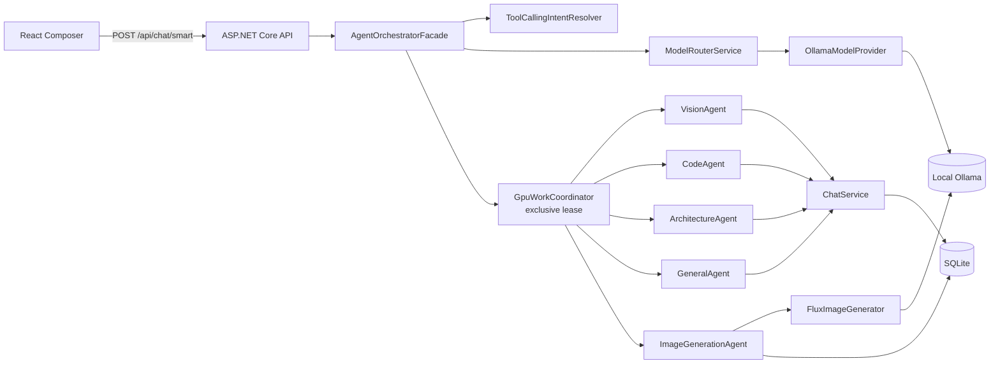
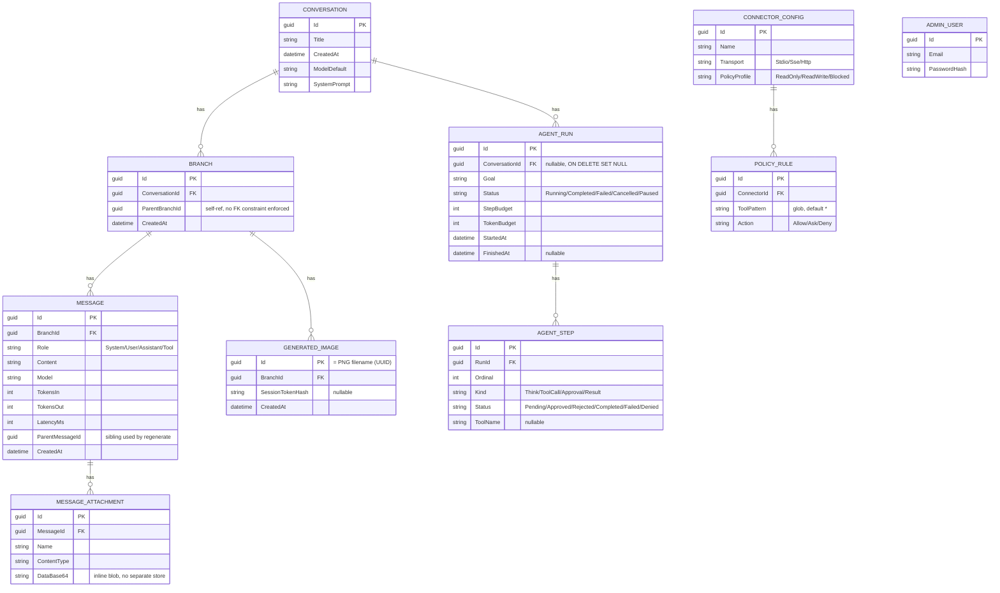
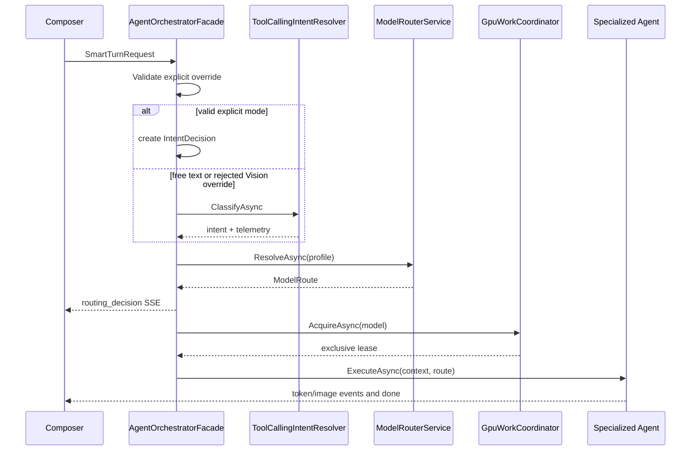
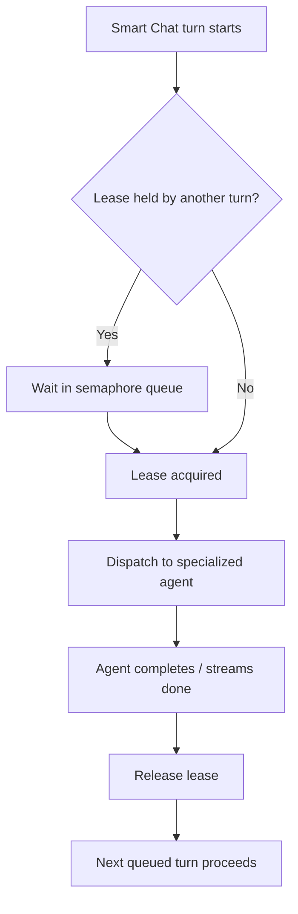
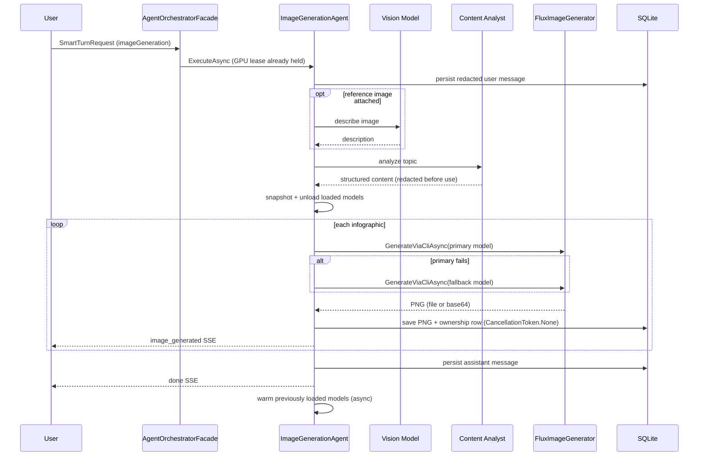
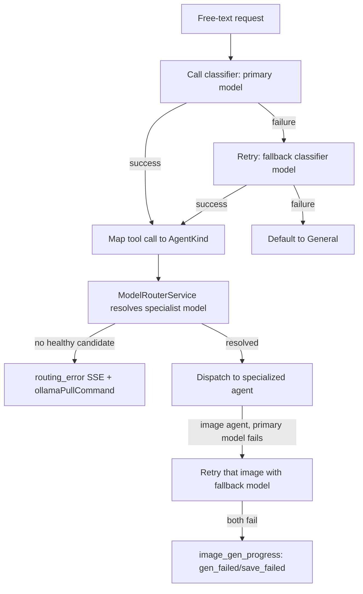

# Agent-to-Agent Orchestration Architecture

> **EminentAi — implemented smart-chat architecture**
> Verified against the source tree on 2026-09-02. Sections 1–11 describe the running implementation, not a future-state proposal. Section 12 is explicitly labeled where it departs from that rule.

## Table of Contents

1. [Scope](#1-scope)
2. [High-Level Design (HLD)](#2-high-level-design-hld)
3. [Configured Model Matrix](#3-configured-model-matrix)
4. [Data Model (ERD)](#4-data-model-erd)
5. [Low-Level Design (LLD)](#5-low-level-design-lld)
6. [Flow 1 — Request Routing](#6-flow-1--request-routing)
7. [Flow 2 — Model Resolution and GPU Coordination](#7-flow-2--model-resolution-and-gpu-coordination)
8. [Flow 3 — Image-Generation Pipeline](#8-flow-3--image-generation-pipeline)
9. [Flow 4 — Fallback and Error Handling](#9-flow-4--fallback-and-error-handling)
10. [HTTP and SSE Contract](#10-http-and-sse-contract)
11. [Security and Persistence](#11-security-and-persistence)
12. [Agent Mode vs. Smart Chat](#12-agent-mode-vs-smart-chat)
13. [Implementation Map](#13-implementation-map)
14. [Known Boundaries](#14-known-boundaries)
15. [Implementation Plan](#15-implementation-plan)
16. [Related Documents](#16-related-documents)

## 1. Scope

Smart Chat is an additive path at `POST /api/chat/smart`. Standard chat, Plan mode, and Agent mode retain their existing flows (see [§12](#12-agent-mode-vs-smart-chat) for how Agent mode differs). Smart Chat selects an intent and an installed local Ollama model, serializes model-serving work with one GPU lease, then dispatches to a specialized agent — this facade-to-specialist handoff is the "agent-to-agent" (A2A) orchestration this document covers.

`IModelProvider`, `IModelRouter`, `IIntentRouter`, and the specialized-agent interfaces are provider-neutral. Only `OllamaModelProvider` is registered today; cloud providers are not implemented or configured.

## 2. High-Level Design (HLD)

### HLD-01 — Smart Chat system context



### HLD-02 — Component responsibilities

| Component | Layer | Responsibility |
| --- | --- | --- |
| `AgentOrchestratorFacade` | Application | Owns the whole Smart Chat turn end to end |
| `ToolCallingIntentResolver` | Infrastructure | Resolves free-text intent via tool-calling |
| `ModelRouterService` | Infrastructure | Resolves a healthy, capable, policy-compliant model |
| `OllamaModelProvider` | Infrastructure | Wraps the local Ollama daemon as an `IModelProvider` |
| `GpuWorkCoordinator` | Infrastructure | Serializes GPU-bound work across one Smart Chat turn at a time |
| `ChatService` | Application | Persistence and streaming shared by all text agents |
| `VisionAgent` / `CodeAgent` / `ArchitectureAgent` / `GeneralAgent` | Application | Thin `ChatService` wrappers per intent |
| `ImageGenerationAgent` / `FluxImageGenerator` | Application | Multi-stage infographic generation pipeline |
| `PolicyEngine` / `PiiRedactor` | Infrastructure | Security gates shared with Agent mode ([§12](#12-agent-mode-vs-smart-chat)) |

## 3. Configured Model Matrix

Model names are configured in `src/EminentAi.Api/appsettings.json` under `EminentAi:ModelMatrix`. They are defaults, not an inventory of models installed on a user's machine. `ModelRouterService` only selects models returned by the healthy local Ollama provider.

| Workload | Primary | Fallback |
| --- | --- | --- |
| Tool-calling intent resolution | `gemma4:e4b` | `ornith-1.5:9b` |
| General responses | `gemma4:e4b` | name-priority fallback, beginning with `ornith-1.5:9b` |
| Coding and architecture | `ornith-1.5:9b` | `gemma4:e4b`, then configured name-priority fallbacks |
| Vision and reference-image description | `qwen3-vl:latest` | `qwen3.5:9b` |
| Infographic content analysis | `gemma4:e4b` | `ornith-1.5:9b` |
| Image generation | `x/flux2-klein:latest` | `x/z-image-turbo` |

The full name-priority lists remain in configuration so deployments can extend or reorder model aliases without a code change. Image-generation models must advertise `ImageGeneration`; vision routes require `Vision`. There is no GPU-coordinator, policy-engine, or redaction-specific config section today — those components use fixed in-code behavior (see [§14](#14-known-boundaries)).

## 4. Data Model (ERD)

Entities live in `src/EminentAi.Domain/Models.cs`; the EF Core mapping is `src/EminentAi.Infrastructure/Persistence/EminentAiDbContext.cs`.



Notes:

- `Branch.ParentBranchId` is a self-referencing GUID with no FK constraint — forking is enforced at the application layer, scoped to the parent conversation.
- `GeneratedImage.Id` doubles as the served PNG filename; `GET /api/generated-images/{filename}` validates it as a UUID and checks `SessionTokenHash` ownership before serving the file.
- `Message.ParentMessageId` implements non-destructive regenerate: a new sibling message is created rather than overwriting the original.
- A `job_search_criteria` table exists via raw SQL in `Program.cs` outside this EF model; it belongs to a separate job-search subsystem, not Smart Chat orchestration.

## 5. Low-Level Design (LLD)

| Class | File | Key method(s) | Responsibility |
| --- | --- | --- | --- |
| `AgentOrchestratorFacade` | `src/EminentAi.Application/Orchestration/AgentOrchestratorFacade.cs` | `IAsyncEnumerable<SmartChatEvent> ExecuteSmartTurnAsync(SmartTurnRequest, ct)` | Validates manual override → classifies intent → resolves model → emits `routing_decision` → acquires GPU lease → dispatches to the matching `ISpecializedAgent` |
| `ToolCallingIntentResolver` | `src/EminentAi.Infrastructure/Routing/ToolCallingIntentResolver.cs` | `Task<IntentDecision> ClassifyAsync(IntentRequest, ct)` | Vision-attachment regex fast path (no inference); otherwise structured tool-calling classification against four empty tools, with primary→fallback model retry, defaulting to `General` on total failure |
| `ModelRouterService` | `src/EminentAi.Infrastructure/Routing/ModelRouterService.cs` | `Task<ModelRoute?> ResolveAsync(AgentProfile, CostPolicy, DataResidencyPolicy, ct)` | Filters providers by health → collects descriptors → applies cost/residency policy → filters by required capability → matches configured name priorities → falls back to first available |
| `OllamaModelProvider` | `src/EminentAi.Infrastructure/Providers/OllamaModelProvider.cs` | `ListModelsAsync`, `StreamAsync`, `CheckHealthAsync` | Wraps `OllamaClient`; caches the model list for 30s with a stampede-safe `SemaphoreSlim`; maps Ollama tier strings to `ModelCapability` flags |
| `GpuWorkCoordinator` | `src/EminentAi.Infrastructure/Hardware/GpuWorkCoordinator.cs` | `Task<IDisposable> AcquireAsync(targetModel, priority, ct)` | Single-holder exclusive lease held for an entire Smart Chat turn, so image-gen's VRAM eviction cannot race a concurrent generation. `priority` (§15 item 3) determines queue order: a High-priority waiter is granted the lease ahead of any queued Normal waiter as soon as it frees up |
| `PolicyEngine` | `src/EminentAi.Infrastructure/Security/PolicyEngine.cs` | `Task<PolicyVerdict> EvaluateAsync(connector, tool, args, ct)` | Hard-deny check → explicit deny rule → most specific matching rule → connector profile default → global Ask; a `ReadOnly` connector profile can never silently allow a mutating tool |
| `PiiRedactor` | `src/EminentAi.Infrastructure/Security/PiiRedactor.cs` | `string Redact(string input)` | Regex-based redaction of cloud provider keys, private-key blocks, JWTs, bearer headers, password assignments, card numbers, and SSNs, applied before persistence or model calls |
| `ChatService` | `src/EminentAi.Application/Chat/ChatService.cs` | `SendMessageAsync`, `RegenerateAsync` | Shared persistence and streaming for standard chat and every text specialized agent; redacts user text before persisting |
| `VisionAgent` / `CodeAgent` / `ArchitectureAgent` / `GeneralAgent` | `src/EminentAi.Application/Agents/*Agent.cs` | `ExecuteAsync(SmartChatContext, ModelRoute, ct)` | Structurally identical thin wrappers translating `ChatService` deltas into `token`/`done` SSE events |
| `ImageGenerationAgent` | `src/EminentAi.Application/Agents/ImageGeneration/ImageGenerationAgent.cs` | `ExecuteAsync(...)` | Six-stage pipeline described in [§8](#8-flow-3--image-generation-pipeline) |
| `FluxImageGenerator` | `src/EminentAi.Application/Agents/ImageGeneration/FluxImageGenerator.cs` | `GenerateViaCliAsync`, `GenerateWithFallbackAsync` | Runs `ollama run` as a CLI subprocess (not `/api/generate`) with a 15-minute timeout, kills the process tree on cancel/timeout, and parses a PNG file or a base64 blob from stdout |

## 6. Flow 1 — Request Routing

The React composer sends a one-message-only `manualRouteOverride` for Code, Architecture, or Infographic. An image attachment implies `vision` unless the user selected another explicit mode. An explicit selection uses Smart Chat even if the Auto toggle is off.

For a request without an applicable override, `ToolCallingIntentResolver` handles routing:

1. When an image attachment and a vision-oriented request match the narrow vision regex, it returns `Vision` without model inference.
2. Otherwise it calls the configured classifier model with four empty tools: `respond_as_code`, `respond_as_architecture`, `generate_infographic`, and `analyze_attached_image`.
3. The selected tool maps to an `AgentKind`; no tool call maps to `General`.
4. If the primary call fails, it retries once with the configured fallback. If both fail, it safely uses `General`.

This is a dedicated routing inference, not always a second one: it eliminates the prior raw-label parser and its image-generation keyword/quoted-string route, and for `General` decisions it now reuses the classification call's own generated content as the final answer when the resolved model matches ([§15](#15-implementation-plan) item 1).



`Vision` without an image is rejected as an override and then falls through to intent resolution; it does not abort the turn. Invalid override strings are rejected by the API with `routing_error` before facade execution.

## 7. Flow 2 — Model Resolution and GPU Coordination

`ModelRouterService`:

1. checks provider health in parallel;
2. obtains model descriptors from healthy providers in parallel;
3. applies data-residency and cost policy;
4. enforces the agent capability requirements;
5. applies configured name priorities; and
6. falls back to the profile's preferred tier when no named candidate matches.

`GpuWorkCoordinator` uses a process-wide exclusive lease around the entire Smart Chat agent turn, with real priority ordering (§15 item 3): `AgentOrchestratorFacade` requests `High` priority for every intent except `ImageGeneration`, so a queued text/vision turn is handed the lease ahead of a queued image generation. This serializes text, vision, and image work so `ImageGenerationAgent` cannot unload Ollama models while another Smart Chat response is streaming. It does not coordinate the separate standard chat, Plan, or Agent-mode paths.



## 8. Flow 3 — Image-Generation Pipeline

1. Persist the redacted user message.
2. If images are attached, describe them with the configured vision model.
3. Ask the configured content analyst to produce structured infographic content.
4. Redact analyst `Understanding`, `Description`, and Flux prompt values before emitting or persisting them.
5. Snapshot loaded Ollama models, unload them, then generate each infographic with `ollama run` through `FluxImageGenerator`.
6. On primary failure, retry that image with the configured fallback model.
7. Save successful images to `Generated_images/`, create ownership records, persist the assistant message, and emit `done`.
8. Warm previously loaded models asynchronously.



`FluxImageGenerator` has a 15-minute timeout and kills the process tree on cancellation or timeout. It first reads a PNG written to its temporary directory, then falls back to a validated base64 image found in stdout. The project intentionally does not use Ollama `/api/generate` for this pipeline ([§14](#14-known-boundaries)).

## 9. Flow 4 — Fallback and Error Handling



## 10. HTTP and SSE Contract

```json
{
  "branchId": "guid",
  "content": "Explain event sourcing",
  "attachments": [],
  "manualRouteOverride": "coding"
}
```

`manualRouteOverride` is optional and accepts the case-insensitive `AgentKind` names: `vision`, `coding`, `architecture`, `imageGeneration`, and `general`.

| Event | Source | Key fields |
| --- | --- | --- |
| `routing_decision` | `AgentOrchestratorFacade` | `intent`, `model`, `provider`, `reason`, `classificationMs`, `wasFastPath`, `manualOverrideApplied`, `overrideRejectedReason`, `source` |
| `token` | Text agent | `text` |
| `image_gen_progress` | Image agent | `stage` (`analyzing_request`, `analysis_done`, `freeing_vram`, `generating`, `saving`, `restoring_models`, `gen_failed`, `save_failed`, `primary_model_failed`) plus stage-specific fields |
| `image_generated` | Image agent | `url`, `filename`, `fluxPrompt`, `description`, `index`, `total`, `generationMs` |
| `done` | Specialized agent | `messageId` (text agents also include `tokensIn`/`tokensOut`) |
| `routing_error` | Facade or image agent | `intent` when known and `message`; facade errors may add `ollamaPullCommand` |

`source` is emitted by the backend and is one of `ui-affordance`, `fast-path`, or `tool-call`. The UI (`RoutingBadge.tsx`) renders "you selected", "fast-path", or "model decided" accordingly.

## 11. Security and Persistence

- The API validates attachment size and the route-override enum before orchestration.
- User text is redacted before persistence and before the image-generation analysis flow. Model-echoed infographic values are redacted before SSE emission and persistence.
- Generated-image retrieval validates a UUID PNG filename, resolves the path under the configured output directory, and checks request-token ownership.
- Image assistant messages and image ownership rows use `CancellationToken.None` after successful generation so a client disconnect does not orphan completed images.
- Model-selection and routing tool output are closed mappings; tool names do not become paths, SQL, prompts, or executable arguments.
- `PolicyEngine` and `PiiRedactor` (§5) are shared with Agent mode's tool loop — see [§12](#12-agent-mode-vs-smart-chat).

## 12. Agent Mode vs. Smart Chat

Smart Chat and Agent mode are separate systems that both live in this backend; they are not layered on top of each other.

| | Smart Chat (`/api/chat/smart`) | Agent mode (`/api/agent/runs`) |
| --- | --- | --- |
| Shape | Single-shot: classify → route → dispatch to one specialist | Multi-step ReAct loop: think → tool call → observe → repeat |
| Owner | `AgentOrchestratorFacade` | `AgentOrchestrator` |
| Tools | None — specialists stream a model response or run the fixed image pipeline | `filesystem` / `shell` / `web` / `image` builtins (`BuiltinToolRunner`) or MCP connectors (`IMcpHost`) |
| Approval | None | Tool call → `PolicyEngine` verdict `Ask` → SSE `approval_required` → client `POST /api/agent/runs/{id}/approvals/{stepId}` → `ApprovalBroker` unblocks the loop; `remember=true` persists a `PolicyRule` scoped to that exact tool (never a wildcard) |
| Budgets | GPU lease for the turn | `StepBudget`, `TokenBudget`, wall-clock timeout, and loop detection (3 identical calls) |
| Data | `Message`/`Branch`/`GeneratedImage` | `AgentRun`/`AgentStep` |

The VS Code extension's own "Agent" mode (`vscode-extension/src/workspaceAgent.ts`) is a **third, independent implementation** — it does not call this backend's `/api/agent/runs` at all. It talks directly to local Ollama and implements its own tool set and its own richer approval model (`'once' | 'session' | 'reject'`, `approvalPolicy.ts`), matching the "Approve once / Allow for session / Reject" UX in [VS_CODE_EXTENSION.md](../VS_CODE_EXTENSION.md). Full detail on that implementation lives there rather than duplicated here.

## 13. Implementation Map

| Area | Implementation |
| --- | --- |
| Orchestration | `src/EminentAi.Application/Orchestration/AgentOrchestratorFacade.cs` |
| Intent resolution | `src/EminentAi.Infrastructure/Routing/ToolCallingIntentResolver.cs` |
| Model resolution | `src/EminentAi.Infrastructure/Routing/ModelRouterService.cs` |
| Model defaults | `src/EminentAi.Application/Configuration/ModelMatrixOptions.cs` and `src/EminentAi.Api/appsettings.json` |
| GPU lease | `src/EminentAi.Application/Hardware/IGpuWorkCoordinator.cs` and `src/EminentAi.Infrastructure/Hardware/GpuWorkCoordinator.cs` |
| Data model | `src/EminentAi.Domain/Models.cs` and `src/EminentAi.Infrastructure/Persistence/EminentAiDbContext.cs` |
| Image pipeline | `src/EminentAi.Application/Agents/ImageGeneration/ImageGenerationAgent.cs` and `FluxImageGenerator.cs` |
| Security | `src/EminentAi.Infrastructure/Security/PolicyEngine.cs` and `PiiRedactor.cs` |
| API route | `src/EminentAi.Api/Program.cs` |
| Web routing UX | `web/src/components/Composer.tsx`, `web/src/state/store.ts`, and `web/src/components/RoutingBadge.tsx` |
| Agent mode (backend) | `src/EminentAi.Application/Agent/AgentOrchestrator.cs` and `ApprovalBroker.cs` |

## 14. Known Boundaries

- Only local Ollama is registered. Provider abstractions do not mean cloud inference is available.
- A free-text Smart Chat request makes one routing inference before the final specialist response.
- GPU serialization applies only to Smart Chat; parallel work from other application paths or external Ollama clients is outside this coordinator.
- Image generation depends on the output behavior of the installed Flux-compatible model and is therefore validated at runtime, not by a typed Ollama HTTP response contract. The optional `/api/generate` path (§15 item 2) inherits this: it is validated defensively and falls back to the CLI path on any shape mismatch, rather than trusting a typed contract.
- Cloud model providers are not implemented; `ModelRouterService` only ever resolves the local Ollama provider.

## 15. Implementation Plan

Items 1, 2, 3, and 5 below are now implemented, each still gated the way its prerequisite required. Items 4 and 6 remain proposed — their prerequisites (a concrete cross-cutting lock justification, a concrete cost/residency policy) are still unmet, so nothing was built for them.

| # | Proposal | Status | Notes |
| --- | --- | --- | --- |
| 1 | Reuse `ToolCallingIntentResolver`'s classification call as the final `General` answer instead of a second inference | **Implemented** | The classifier's system prompt now answers directly instead of replying with nothing when no tool matches; `IntentDecision.PrehydratedResponse` carries that answer. `GeneralAgent` reuses it via `ChatService.SendPrehydratedMessageAsync` only when the resolved route's model matches `IntentDecision.ClassifierModel` exactly — a mismatch (health/policy routed elsewhere) falls back to a normal second inference, so `routing_decision.model` and the actual response model can never disagree. |
| 2 | Migrate `FluxImageGenerator` from the `ollama run` CLI to `/api/generate` | **Implemented, opt-in** | `IOllamaClient.GenerateImageAsync` calls `/api/generate` and validates the decoded bytes are a real PNG/JPEG/WebP before returning. Gated behind `EminentAi:ModelMatrix:UseHttpGenerateForImages` (default `false`) because the response shape for image-output models is still unverified against a live instance in this environment — this exact migration was reverted once before for that reason. Any HTTP failure or shape mismatch falls back to the `ollama run` CLI path automatically, so enabling the flag cannot break generation, only reduce it to the CLI path silently. Verify against your installed `x/flux2-klein:latest` / `x/z-image-turbo` before relying on it. |
| 3 | Implement real priority ordering in `GpuWorkCoordinator` | **Implemented** | The lease is no longer a `SemaphoreSlim` — a waiter is queued by `GpuTaskPriority`, and on release the lease is handed directly to the next High-priority waiter before any queued Normal waiter. `AgentOrchestratorFacade` passes `High` for every intent except `ImageGeneration` (`Normal`), so a short text/vision turn can now overtake a queued image generation. |
| 4 | Extend GPU coordination to standard chat, Plan, and Agent mode | Proposed | Prerequisite unchanged: confirm those paths actually share GPU-bound model calls with Smart Chat in practice before adding a cross-cutting lock. |
| 5 | Resolve the `vscode-ext/` vs `vscode-extension/` duplication | **Implemented** | `vscode-ext/` had one real capability `vscode-extension/` lacked — ghost-text fill-in-the-middle inline completion. That was ported to `vscode-extension/src/fimProvider.ts` (backed by `generateFim` in `llmClient.ts`, routed through the existing `validateOllamaUrl` local-only guard) and exposed via the `eminentai.inlineCompletions` / `eminentai.fimModel` settings. `vscode-ext/`'s sign-in/out commands were NOT ported — they authenticate against this backend's `/api/auth/login` admin API, which `vscode-extension` never calls (§12); porting them would have added a backend dependency this extension is explicitly architected not to need. `vscode-ext/` has been deleted. |
| 6 | Add cloud model provider(s) behind `IModelProvider` | Proposed | Prerequisite unchanged: needs a concrete cost/data-residency policy for the first non-local provider. |

## 16. Related Documents

- [VS_CODE_EXTENSION.md](../VS_CODE_EXTENSION.md) — the VS Code extension's own agent loop, tools, and approval UX.
- [docs/AIAGENT_ARCHITECTURE.md](AIAGENT_ARCHITECTURE.md) — broader platform roadmap and MCP connector plans; historical, not authoritative for Smart Chat.
- [docs/HYBRID_ARCHITECTURE.md](HYBRID_ARCHITECTURE.md) — optional future hosted-frontend/local-backend deployment topology; not the default runtime.
- [README.md](../README.md) — setup, install, and top-level system overview.
