# EminentAi Agent Architecture

## Purpose

This document describes the implemented architecture of the EminentAi Agent project, currently branded in code as `EminentAi`. It covers the .NET backend, React web UI, VS Code extension, Ollama integration, MCP connector host, persistence model, agent loop, security controls, and job-search workflow.

The project is a local-first AI copilot platform:

- Local inference through Ollama.
- Streaming chat with persisted conversations.
- Plan mode that produces editable, read-only execution plans.
- Agent mode that can call tools, request approvals, and persist run transcripts.
- Built-in filesystem and shell tools.
- MCP connector registry for external tool servers.
- React/Vite admin UI and VS Code extension clients.
- SQLite persistence for local single-user operation.

## Implementation Map

```text
.
├── src
│   ├── EminentAi.Domain
│   │   └── Models.cs
│   ├── EminentAi.Application
│   │   ├── Abstractions
│   │   ├── Agent
│   │   ├── Chat
│   │   ├── Planning
│   │   └── Security
│   ├── EminentAi.Infrastructure
│   │   ├── Mcp
│   │   ├── Ollama
│   │   ├── Persistence
│   │   ├── Security
│   │   └── Tools
│   └── EminentAi.Api
│       ├── Program.cs
│       └── JobSearchService.cs
├── web
│   └── src
│       ├── components
│       ├── lib
│       └── state
├── vscode-ext
│   └── src
├── docker-compose.yml
└── start.sh
```

## High-Level Design

### System Context

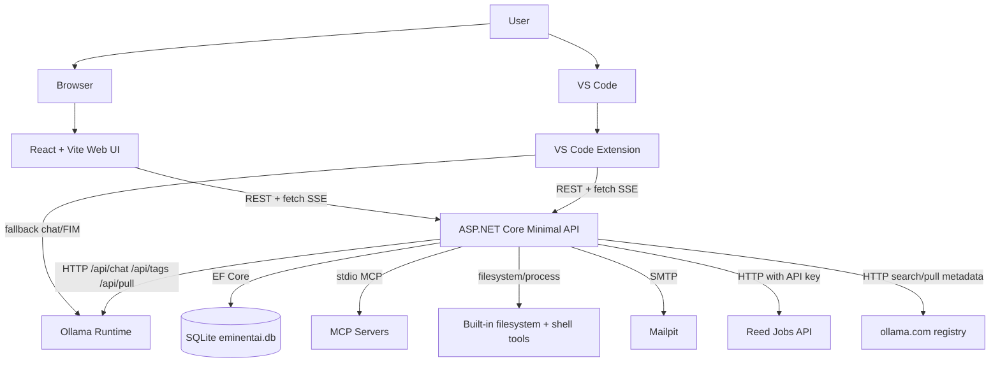

### Container View

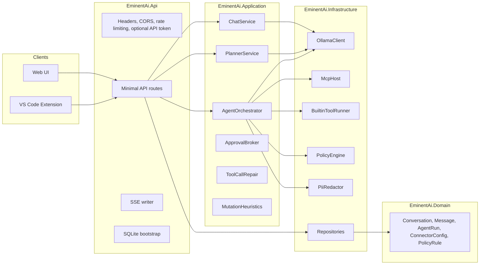

### Runtime Deployment

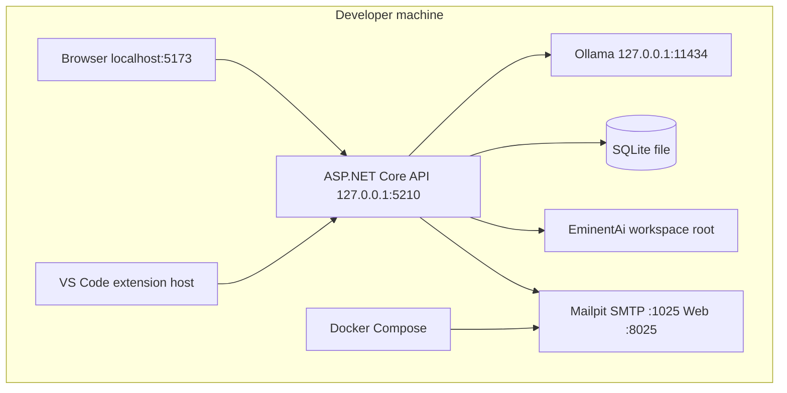

## Project Responsibilities

### `EminentAi.Domain`

`EminentAi.Domain` contains persistence entities and enums. It has no infrastructure dependencies.

Primary model groups:

- Conversation model: `Conversation`, `Branch`, `Message`, `MessageAttachment`.
- Admin model: `AdminUser`.
- Agent model: `AgentRun`, `AgentStep`, `AgentRunStatus`, `AgentStepStatus`.
- Connector model: `ConnectorConfig`, `PolicyRule`, `ConnectorTransport`, `PolicyProfile`, `PolicyAction`.

The domain currently keeps models simple and mutable for EF Core. Regeneration is represented by sibling assistant messages through `ParentMessageId`, and conversation branching is represented by `Branch.ParentBranchId`.

### `EminentAi.Application`

`EminentAi.Application` owns use cases and cross-cutting abstractions.

Key implementation files:

- `Chat/ChatService.cs`: creates conversations, sends messages, streams assistant output, persists messages, regenerates replies, and forks branches.
- `Planning/PlannerService.cs`: creates read-only plans with JSON-only Ollama output and repair retries.
- `Agent/AgentOrchestrator.cs`: runs the autonomous agent loop, gathers tools, evaluates policy, waits for approvals, executes tools, redacts observations, and persists run steps.
- `Agent/ApprovalBroker.cs`: coordinates pending approvals and run cancellation.
- `Agent/ToolCallRepair.cs`: resolves malformed or inline tool-call attempts from smaller local models.
- `Security/MutationHeuristics.cs`: classifies mutating tools and hard-denied operations.
- `Abstractions/*`: interfaces for repositories, Ollama, MCP, policy, redaction, and built-in tools.

### `EminentAi.Infrastructure`

`EminentAi.Infrastructure` implements external adapters.

Key implementation files:

- `Ollama/OllamaClient.cs`: wraps Ollama `/api/chat`, `/api/tags`, and `/api/pull`.
- `Mcp/McpHost.cs`: hosts stdio MCP clients, lists tools, namespaces tool names, and calls MCP tools. Now parallelizes tool listing across connectors.
- `Tools/BuiltinToolRunner.cs`: provides built-in `filesystem.*` and `shell.run` tools.
- `Security/PolicyEngine.cs`: evaluates connector rules asynchronously and remembers approval decisions. Uses a compiled regex cache for high-performance glob matching.
- `Security/PiiRedactor.cs`: regex redaction for common tokens, keys, cards, SSNs, private keys, and auth headers.
- `Persistence/EminentAiDbContext.cs`: EF Core mappings and indexes.
- `Persistence/ConversationRepository.cs`: conversation, branch, and message persistence.
- `Persistence/AgentRunRepository.cs`: agent run and step persistence with `IDbContextFactory`.

### `EminentAi.Api`

`EminentAi.Api` is a single ASP.NET Core Minimal API host.

Implemented concerns:

- Loopback default binding.
- Optional API token middleware.
- Security headers.
- CORS allowlist.
- Global fixed-window rate limiting.
- 50 MB request body limit.
- SSE helper for streaming responses.
- SQLite bootstrap with `EnsureCreated` and raw SQL for extra tables.
- Chat, plan, agent, connector, auth, model, Mailpit, CV, and job-search routes.

### `web`

The web UI is React + TypeScript + Vite + Tailwind + Zustand.

Primary implementation files:

- `src/App.tsx`: top-level layout, routing between app views, startup health/model/conversation/admin loading.
- `src/state/store.ts`: Zustand store for app state, conversations, plans, agent runs, auth, connectors, models, job search, and voice mode.
- `src/lib/api.ts`: typed REST and fetch-based SSE client.
- `src/components/*`: UI features for chat, composer, plan, agent timeline, connectors, Ollama model management, Mailpit, library, job search, auth, and layout.

### `vscode-ext`

The extension is a TypeScript VS Code extension.

Primary implementation files:

- `src/extension.ts`: activation, client creation, provider registration.
- `src/apiClient.ts`: backend client, SSE parser, direct Ollama fallback, FIM completion calls, agent approval/cancel calls.
- `src/chatView.ts`: webview chat sidebar with CSP nonce and text-only rendering.
- `src/commands.ts`: explain/fix/refactor/test-gen, agent edit, and model picker commands.
- `src/fim.ts`: inline completion provider using Ollama generate with FIM prompt tokens.

## Core Data Model

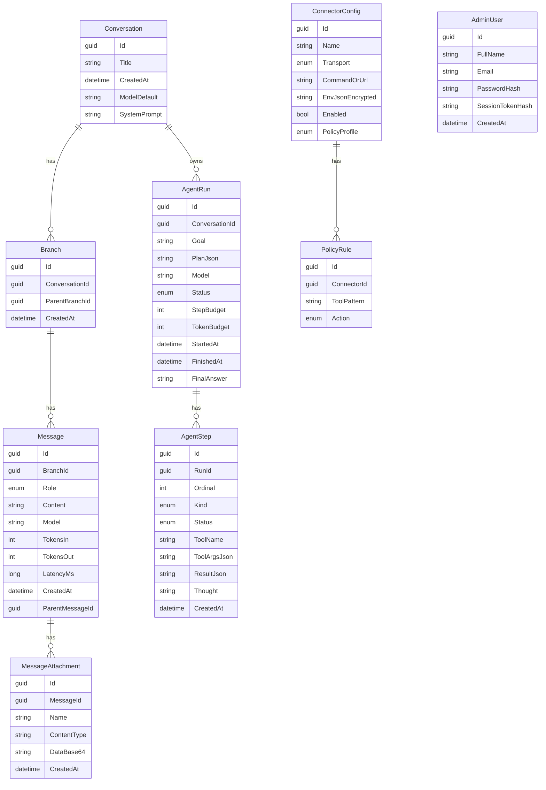

Additional raw-SQL bootstrapped tables:

- `PasswordResetTokens`: reset token hash, admin user id, expiry, used timestamp.
- `AppSettings`: key/value store used for job-search criteria.
- `JobSearchRuns`: intended run history table for job search.

## Request and Stream Model

The web UI and extension use normal JSON REST calls for CRUD-like operations and fetch-based SSE for long-running operations.

SSE frames follow this format:

```text
event: token
data: {"token":"partial text","done":false}

event: done
data: {"done":true,"usage":{"in":100,"out":200}}
```

Important event families:

- Chat: `token`, `done`, `error`.
- Model pull: `progress`, `done`, `error`.
- Agent: `run_started`, `token`, `thought`, `tool_call`, `approval_required`, `tool_approved`, `tool_rejected`, `tool_denied`, `tool_result`, `tool_failed`, `done`, `halted`, `error`.

## Chat Flow

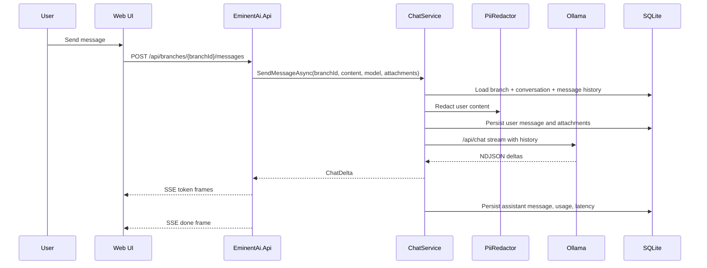

### Chat Low-Level Behavior

1. `ChatService` loads the target branch and its conversation.
2. User text is redacted before persistence and inference.
3. Only image attachments are passed into model context.
4. The first user message can rename a conversation from `New chat`.
5. `BuildContext` includes system prompt plus user/assistant messages.
6. Ollama output streams back to the client.
7. The assistant message is persisted after the stream completes or after cancellation with partial content.

## Regenerate and Branch Flow

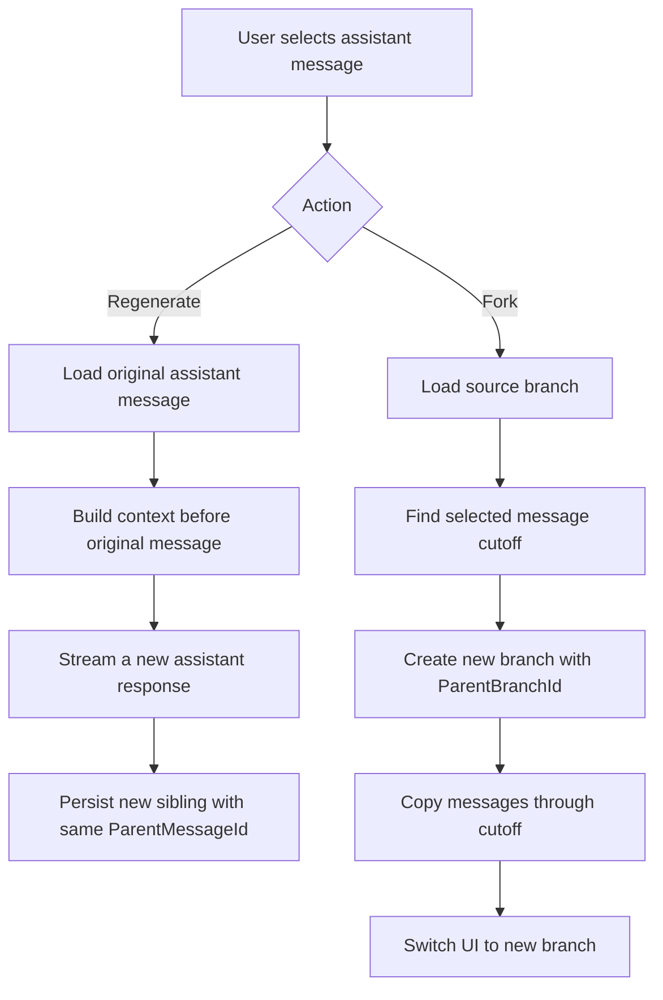

Regenerate is non-destructive. It creates another assistant message rather than overwriting prior output.

Branching copies messages from a source branch through a selected message into a new branch, then the UI selects that branch.

## Plan Mode

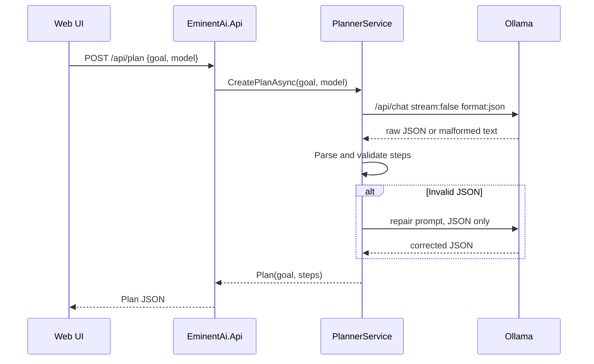

Plan mode does not execute tools. It exists to turn an intent into an editable list of ordered steps. The web UI can promote the plan into Agent mode by passing `PlanJson` into `/api/agent/runs`.

## Agent Mode High-Level Flow

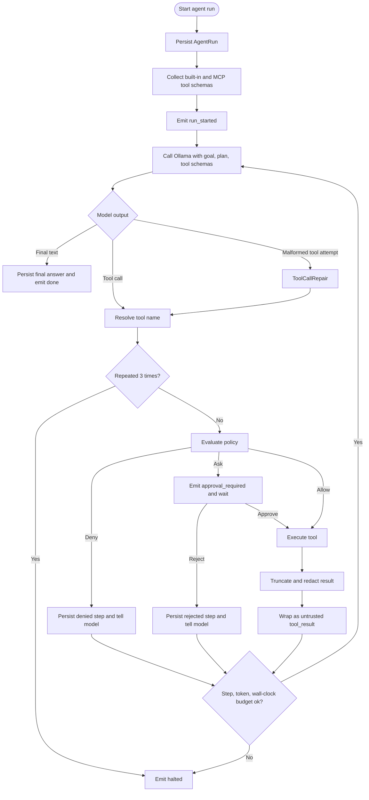

### Agent Low-Level Design

`AgentOrchestrator.RunAsync` owns the control loop.

Initialization:

1. Register cancellation with `ApprovalBroker`.
2. Persist `AgentRun` with redacted goal.
3. Collect tool schemas from selected connectors.
4. Emit `run_started`.
5. Seed model messages with an agent system prompt and the user goal or plan.

Each loop iteration:

1. Check wall-clock and token budgets.
2. Stream a model turn from Ollama with tool schemas.
3. Capture assistant text and tool calls.
4. If no structured tool calls exist but text looks like a tool attempt, try tool-call repair.
5. If no tool call remains, treat assistant text as final answer.
6. Persist model thought text when a thought accompanies a tool call.
7. Resolve tool namespace.
8. Detect repeated identical calls.
9. Evaluate mutation and policy.
10. Request human approval when required.
11. Execute built-in or MCP tool.
12. Truncate and redact output.
13. Wrap output in `<tool_result trust="untrusted">`.
14. Feed observation back into the next model turn.
15. Finish with `done` or `halted`.

### Agent Sequence With Approval

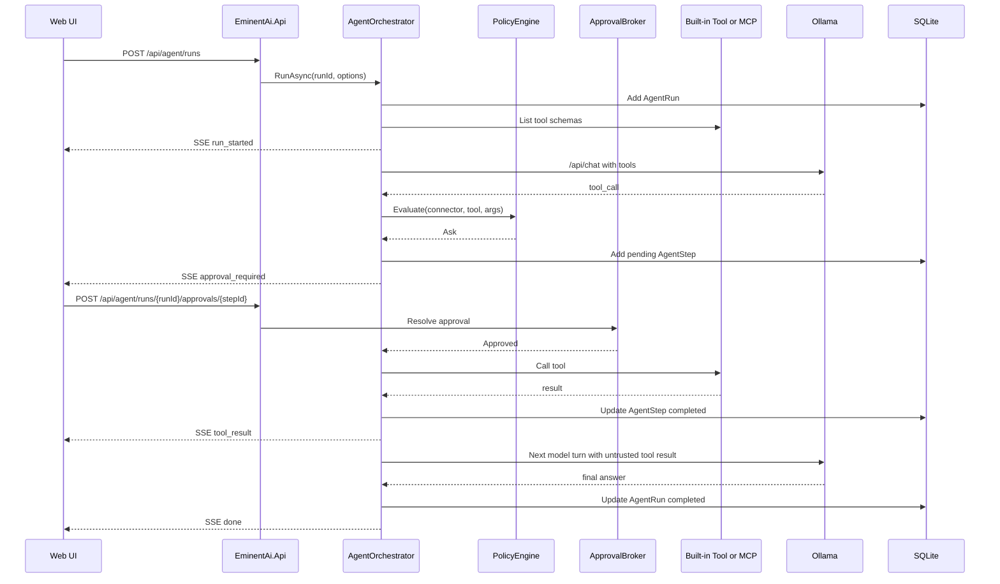

## Tooling Model

### Built-in Filesystem Tools

```text
filesystem.read_file(path)
filesystem.list_directory(path)
filesystem.write_file(path, content)
filesystem.search_files(query)
```

Controls:

- Paths are resolved under `EminentAi:WorkspaceRoot`.
- Path traversal is blocked with full-path comparison.
- Reads are limited to 1 MB.
- Listings are capped.
- Search returns up to 100 matches.
- Writes require approval through the agent policy layer.

### Built-in Shell Tool

```text
shell.run(command)
```

Controls:

- Always classified as mutating.
- Requires approval.
- Executes with working directory set to workspace root.
- Uses a denylist for high-risk command patterns.
- Hard timeout of 60 seconds.
- Captures stdout/stderr and truncates output.

Important boundary note: the current implementation constrains shell working directory and approvals, but does not provide OS-level sandboxing.

### MCP Tools

MCP connectors are stored in SQLite as `ConnectorConfig`.

Current supported transport:

- `Stdio`.

Planned enum values but not implemented by `McpHost`:

- `Sse`.
- `Http`.

Tool names are namespaced as:

```text
{connectorName}.{toolName}
```

Example:

```text
github.create_issue
stripe.list_customers
filesystem.read_file
```

## Policy Model

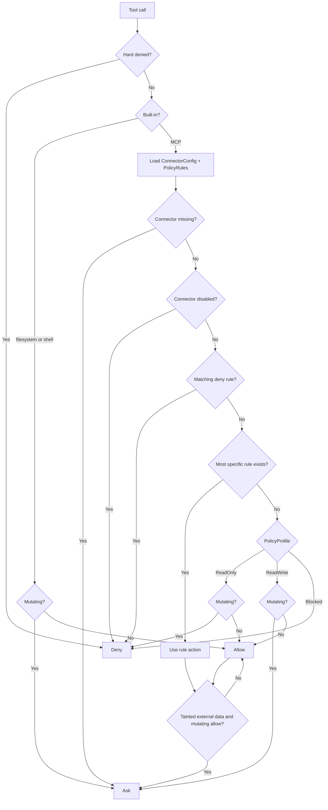

Policy rules are exact or glob-like patterns. Explicit deny wins. Remembered decisions are persisted as `PolicyRule` rows scoped to a connector and exact tool name.

Hard-denied examples:

- Stripe refund, payout, transfer operations.
- Any tool containing `wipe`.

## Security Architecture

### Implemented Controls

- Loopback binding by default.
- Refuses non-loopback binding unless `EMINENTAI_API_TOKEN` or `EminentAi:ApiToken` is configured.
- CORS allowlist for Vite origins.
- Global fixed-window rate limiter.
- Security headers:
  - `X-Content-Type-Options: nosniff`
  - `X-Frame-Options: DENY`
  - `Referrer-Policy: no-referrer`
- PBKDF2 password hashing with random salt.
- Session tokens stored as SHA-256 hashes.
- Password reset tokens stored as SHA-256 hashes.
- Email enumeration avoidance in forgot-password response.
- PII and secret redaction before persistence/model calls in core chat and agent paths.
- Agent tool outputs are marked as untrusted data.
- External MCP reads taint the context and force approval for later mutating allowed writes.
- Webview chat extension uses `textContent` and CSP nonce.

### Current Security Gaps

These gaps are current implementation facts and should be treated as architectural debt:

- Admin login is implemented, but most API endpoints do not enforce admin-session authorization.
- Optional API token middleware protects all endpoints only when configured.
- Query-string API token fallback exists for SSE compatibility even though current web SSE uses fetch headers.
- Shell execution is approval-gated but not OS-sandboxed.
- MCP stdio connector registration can start local processes from configured command strings.
- Password reset token use is not atomic across concurrent reset requests.
- Web admin token is stored in `localStorage`.
- CV upload validates extension, but not content type, per-file size, or collision-safe storage names.

## Authentication and Admin Flow

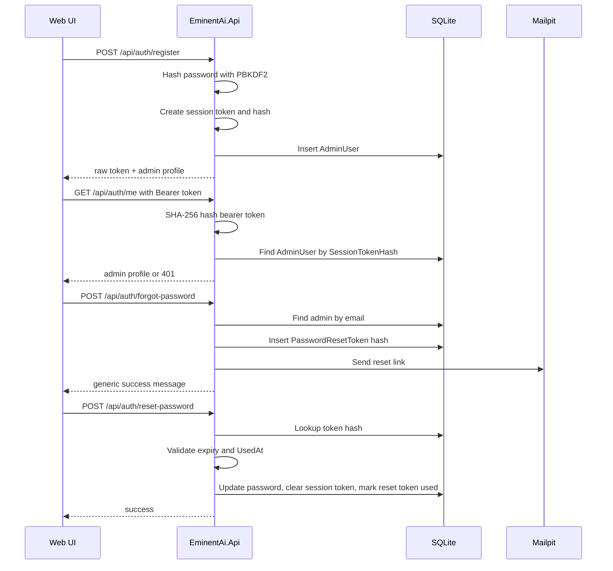

## Job Search Architecture

The job-search module is implemented in `EminentAi.Api/JobSearchService.cs` and exposed through `/api/jobs/*` and `/api/cvs/*`.

### Components

- `JobSearchOrchestrator`: coordinates source fetching, deduplication, filtering, scoring, report generation, and latest-run cache update.
- `IndeedDirectBuffer`: in-memory buffer for externally ingested Indeed jobs.
- `JobRunCache`: singleton storing latest `JobSearchRunResult`.
- `ReedAdapter`: fetches Reed API jobs when `REED_API_KEY` is configured.
- `CvLoader`: reads CV files from `EminentAi:CvFolder` or `CVs`.
- `JobFilter`: applies user criteria.
- `JobScorer`: scores jobs using criteria and CV keywords.
- `ReportGenerator`: produces markdown report text.

### Job Search Flow

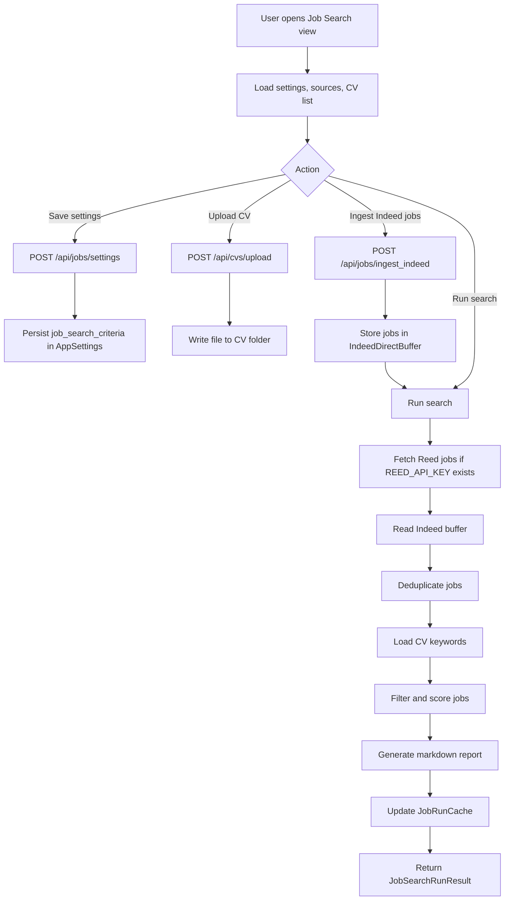

## Web UI Architecture

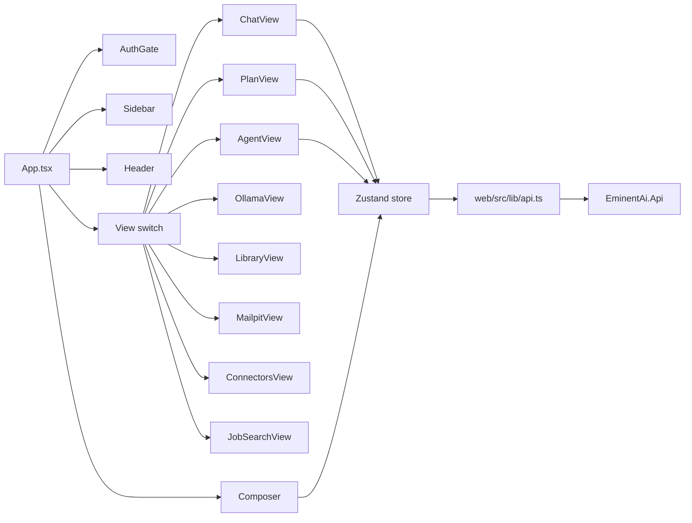

The Zustand store owns most client behavior:

- Health polling.
- Model list and selected model.
- Conversation list and active branch.
- Chat streaming and cancellation.
- Plan creation and promotion to agent.
- Agent streaming, timeline, approvals, cancellation.
- Connector CRUD.
- Admin login/register/reset state.
- Job search settings, runs, sources, and CV upload.

## VS Code Extension Architecture

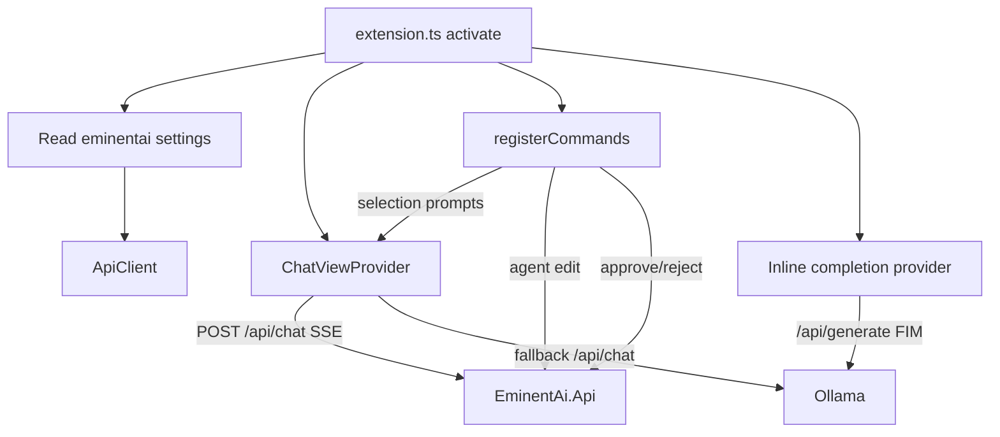

### Extension Client Behavior

- Uses backend chat when `/api/health` is reachable.
- Falls back to direct Ollama for chat if backend is offline.
- Uses direct Ollama `/api/generate` for fill-in-middle completions.
- Starts agent runs through backend SSE.
- Sends approvals and cancellations through backend REST calls.
- Renders chat webview content with text nodes to avoid HTML injection.

## API Surface

### Health and Model Management

| Method | Route | Purpose |
|---|---|---|
| GET | `/api/health` | Backend status plus Ollama health |
| GET | `/api/models` | Ollama model list with tier classification |
| GET | `/api/ollama/search?q=` | Search ollama.com model registry |
| POST | `/api/ollama/pull` | Stream model pull progress |
| POST | `/api/ollama/start` | Start app-managed Ollama process |
| POST | `/api/ollama/stop` | Stop app-managed Ollama process |
| POST | `/api/mailpit/start` | Start Mailpit through Docker Compose |

### Conversations and Chat

| Method | Route | Purpose |
|---|---|---|
| GET | `/api/conversations` | List conversations |
| POST | `/api/conversations` | Create conversation |
| GET | `/api/conversations/{id}` | Load conversation with branches and messages |
| DELETE | `/api/conversations/{id}` | Delete conversation |
| POST | `/api/branches/{branchId}/messages` | Stream chat response and persist messages |
| POST | `/api/messages/{messageId}/regenerate` | Stream regenerated assistant sibling |
| POST | `/api/branches/{branchId}/fork` | Fork branch from selected message |
| POST | `/api/chat` | Stateless chat for VS Code extension |

### Plan and Agent

| Method | Route | Purpose |
|---|---|---|
| POST | `/api/plan` | Generate validated plan JSON |
| POST | `/api/agent/runs` | Start agent run and stream events |
| POST | `/api/agent/runs/{runId}/approvals/{stepId}` | Resolve approval |
| POST | `/api/agent/runs/{runId}/cancel` | Cancel a run |
| GET | `/api/agent/runs/{runId}` | Load persisted run transcript |

### Admin Auth

| Method | Route | Purpose |
|---|---|---|
| GET | `/api/auth/me` | Validate bearer session token |
| POST | `/api/auth/register` | Create admin and return session token |
| POST | `/api/auth/login` | Login and rotate session token |
| POST | `/api/auth/forgot-password` | Send Mailpit reset link |
| POST | `/api/auth/reset-password` | Reset password and invalidate active session |

### Connectors

| Method | Route | Purpose |
|---|---|---|
| GET | `/api/connectors` | List registered connectors and rules |
| POST | `/api/connectors` | Register connector |
| DELETE | `/api/connectors/{id}` | Delete connector |

### Job Search and CVs

| Method | Route | Purpose |
|---|---|---|
| GET | `/api/jobs/results` | Latest job search result |
| GET | `/api/jobs/search` | Run job search |
| GET | `/api/jobs/sources/health` | Source readiness |
| GET | `/api/jobs/settings` | Load criteria |
| POST | `/api/jobs/settings` | Save criteria |
| POST | `/api/jobs/ingest_indeed` | Ingest Indeed jobs and auto-run search |
| GET | `/api/cvs` | List CV files |
| POST | `/api/cvs/upload` | Upload CV file |
| DELETE | `/api/cvs/{filename}` | Delete CV file |

## Persistence Design

EF Core owns core mapped entities. Startup currently uses:

1. `db.Database.EnsureCreated()`.
2. Raw SQL `CREATE TABLE IF NOT EXISTS` for tables not fully modeled or added after initial schema.

Indexes:

- `Conversation.CreatedAt`.
- `Message(BranchId, CreatedAt)`.
- `MessageAttachment.MessageId`.
- `AdminUser.Email` unique.
- `AgentRun.StartedAt`.
- `AgentStep(RunId, Ordinal)`.
- `ConnectorConfig.Name` unique.
- `PasswordResetTokens.TokenHash`.

Recommended next step: move bootstrap SQL to EF Core migrations once schema stabilizes.

## Configuration

`src/EminentAi.Api/appsettings.json`:

```json
{
  "ConnectionStrings": {
    "Default": "Data Source=eminentai.db"
  },
  "EminentAi": {
    "OllamaUrl": "http://127.0.0.1:11434",
    "WorkspaceRoot": "",
    "AllowedOrigins": ["http://localhost:5173", "http://127.0.0.1:5173"],
    "ApiToken": "",
    "Smtp": {
      "Host": "127.0.0.1",
      "Port": 1025,
      "FromAddress": "noreply@eminentai.local",
      "FromName": "EminentAi",
      "AppBaseUrl": "http://localhost:5173"
    }
  }
}
```

Environment variables:

- `EMINENTAI_API_TOKEN`: optional global API token, required for non-loopback binding.
- `REED_API_KEY`: enables Reed job source.
- Ollama environment variables can tune model residency outside this app.

## Operational Flow

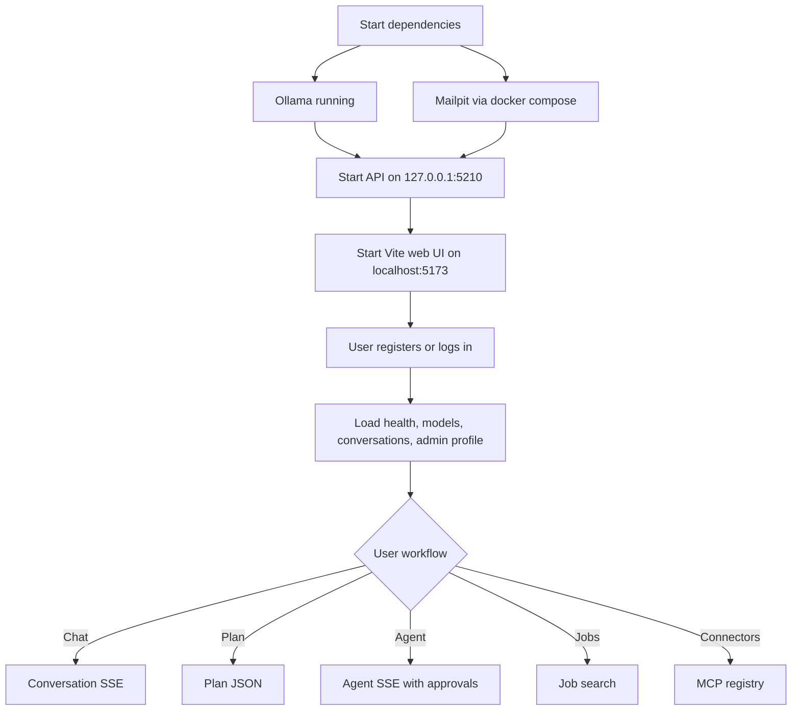

## Performance Characteristics

Current design choices:

- Streaming from Ollama to backend and from backend to clients avoids waiting for full responses.
- `HttpCompletionOption.ResponseHeadersRead` is used for streamed Ollama calls.
- Assistant messages are persisted after streaming, not per token.
- Tool results are truncated before re-entering the model context.
- Agent budgets bound steps, tokens, wall-clock time, and repeated call loops.
- EF `AsSplitQuery` is used for conversation graph loading.
- Job search deduplicates by `Source|SourceJobId`.

Known performance risks:

- Conversation load returns full branch history and base64 attachments.
- Web production bundle currently emits a large chunk warning.
- Shell output capture reads full stdout/stderr before returning, then truncates.
- Job search latest result is stored in-memory and not currently persisted through repository logic.

## Quality Gates

Current verification commands:

```bash
dotnet build EminentAi.slnx
cd web && npm run build
cd web && npm run lint
cd vscode-ext && npm run compile
```

Current test gap:

- No .NET test project is present.
- No frontend test config is present.
- No extension test harness is present.

Recommended tests:

- Auth middleware and admin-token enforcement.
- Password hash and reset token flow.
- Conversation send/regenerate/fork persistence.
- Agent tool-call policy transitions.
- ApprovalBroker cancellation and timeout behavior.
- BuiltinToolRunner path traversal and output limits.
- PolicyEngine rule specificity and profile defaults.
- PiiRedactor rules for representative secret formats.
- web `streamSse` parser behavior.
- VS Code extension SSE parser behavior.

## Current Architecture Risks

| Risk | Area | Impact | Preferred Fix |
|---|---|---|---|
| Admin session token not enforced globally | API auth | Unauthorized local clients can call most routes | Add route groups or endpoint filters that require admin except auth/bootstrap routes |
| Query token fallback | API auth | Token can leak in history/logs | Remove query token path and keep fetch SSE headers |
| Shell is not OS-sandboxed | Agent tools | Commands can escape cwd boundaries | Use container/jail/allowlisted command runner for real isolation |
| MCP command string starts local processes | Connector host | Connector registration is high privilege | Require auth, validate commands, support explicit trusted connector presets |
| Password reset is non-atomic | Auth | Concurrent token reuse possible | Conditional update in transaction |
| `localStorage` session token | Web auth | XSS persistence risk | Prefer HttpOnly same-site cookie or in-memory token |
| Generated artifacts in repo | Repo hygiene | Noisy commits, data/secret leakage | Add root `.gitignore` and untrack `bin`, `obj`, `node_modules`, DBs |
| No tests | Engineering | Regressions in security-critical code | Add focused unit/integration tests |

## Suggested Evolution Path

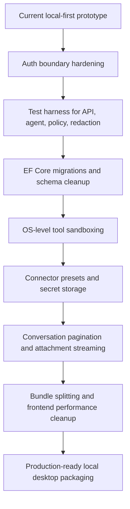

## Glossary

- Agent run: A persisted autonomous execution session with a goal, model, budgets, and steps.
- Agent step: A persisted thought, tool call, approval, result, denial, or failure associated with a run.
- Branch: A conversation timeline fork.
- MCP: Model Context Protocol, used to expose external tools to the agent.
- Policy profile: Connector-level default for tool calls: `ReadOnly`, `ReadWrite`, or `Blocked`.
- SSE: Server-Sent Events, used for long-running streaming responses.
- Tainted context: Agent state after reading external MCP data; later mutating operations require approval.
- Tool call repair: Recovery path for malformed tool attempts from local models.
