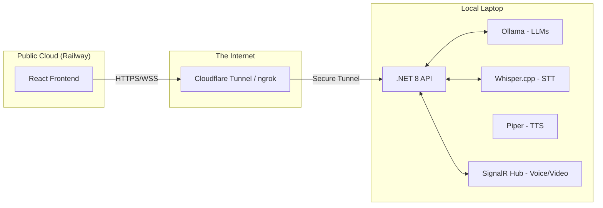

# EminentAi Hybrid Architecture: Cloud-Local Bridge

> Status: optional future deployment design, not the default or fully verified runtime. The implemented product remains localhost-first. Exposing per-run local workspace access through a public tunnel materially expands risk; disable filesystem, shell, and command tools for remote clients unless a strong authenticated authorization boundary is added.

This architecture enables hosting the **EminentAi Frontend** on **Railway** while keeping the **Backend (LLMs, Ollama, Whisper)** on a **Local Laptop**. This setup bypasses cloud compute limits and keeps sensitive data/heavy processing on local hardware.

## 1. System Overview

## 2. Component Design

### A. Frontend (Railway)
- **Deployment:** Deployed as a static site or a lightweight Node.js container.
- **Environment Variables:**
  - `VITE_API_URL`: The public URL provided by the tunnel (e.g., `https://api.eminentai.dev`).
  - `VITE_WS_URL`: The WebSocket endpoint for SignalR (e.g., `wss://api.eminentai.dev/voice-hub`).
- **Media Handling:** Uses `navigator.mediaDevices` for Mic/Camera access. Audio is captured in chunks (PCM 16kHz) and streamed via WebSockets.

### B. The Bridge (Cloudflare Tunnel)
- **Why:** Safely exposes `localhost:5210` without port forwarding or managing dynamic IPs.
- **Security:** Use Cloudflare Access or a shared Secret Header (`X-Eminent-Secret`) to ensure only the Railway frontend can talk to the local backend.

### C. Backend (Local Laptop)
- **SignalR Hub:** A new bi-directional streaming hub to handle real-time voice and video frames.
- **Voice Pipeline (ChatGPT Mode):**
    1. **STT:** Backend receives audio chunks, passes them to a local `whisper-server` (running `whisper.cpp`).
    2. **LLM:** Transcribed text is sent to Ollama (e.g., `qwen2.5-coder`).
    3. **TTS:** LLM text response is streamed to a local TTS engine (Piper) which generates audio chunks.
    4. **Streaming:** Audio chunks are sent back to the Frontend via SignalR for immediate playback.
- **Video Mode:** Frontend sends Base64 encoded video frames at 1-2 FPS. Backend uses vision-capable models (e.g., `llama3-vision` or `llava`) to "see" the user's environment.

## 3. Implementation Steps

### Phase 1: Connectivity
1.  **Cloudflare Tunnel:** Run `cloudflared tunnel run eminentai` to map `localhost:5210` to a public domain.
2.  **CORS Config:** Update `Program.cs` in the .NET API to allow the Railway domain (`*.railway.app`).

### Phase 2: Real-time Communication
1.  **SignalR Integration:** Add `Microsoft.AspNetCore.SignalR` to the backend.
2.  **VoiceHub:** Create a `VoiceHub.cs` to handle `Stream` methods for audio/video.
3.  **Frontend Hook:** Create `useVoiceMode.ts` in the React app to manage the WebSocket connection and MediaRecorder.

### Phase 3: Railway Deployment
1.  **Dockerfile:** Create a production-ready Dockerfile for the `web/` directory.
2.  **Railway Config:** Set up the Railway project with the custom domain and environment variables.
