# EminentAi — Local Ollama Copilot Platform
### Architecture & Implementation Plan (HLD / LLD / Sequence Diagrams / VS Code Extension)

> Implementation status, 2026-07-04: the current verified architecture is maintained in
> [`docs/AIAGENT_ARCHITECTURE.md`](docs/AIAGENT_ARCHITECTURE.md), the agent-to-agent detail is in
> [`docs/AGENT_2_AGENT_ARCHITECTURE.md`](docs/AGENT_2_AGENT_ARCHITECTURE.md), and the implemented
> IDE permission/tool model is in [`VS_CODE_EXTENSION.md`](VS_CODE_EXTENSION.md). This document
> retains the original roadmap and may describe planned capabilities beyond the current code.

**Version:** 1.1 · **Date:** 2026-06-14 · **Status:** Implemented core + planned extensions (v3.1 docs aligned to current code)
**Target hardware baseline:** Apple M2, 16 GB unified memory (constrains every model decision below)

---

## 0. Reality Check — Read This Before Building

1. **Agent mode on a 16 GB M2 will not match GitHub Copilot.** Tool-calling reliability on 7B–8B quantized models is mediocre; expect malformed JSON tool calls ~5–15% of the time. The architecture below mitigates this with a **tool-call repair layer** and **constrained decoding (Ollama `format: json`)**, but set expectations accordingly.
2. **You cannot run a chat model + an embedding model + your IDE comfortably above ~9–10 GB of model weights.** Budget: chat model ≤ 5 GB (e.g., `qwen2.5-coder:7b-q4_K_M`), embedding model ≤ 0.7 GB (`nomic-embed-text`), leave headroom for KV cache and the OS.
3. **MCP is the right call for connectors** — do not write bespoke Gmail/Jira/Stripe API clients. Official/maintained MCP servers exist for all four requested services; you write one MCP *client*, not N integrations.
4. **Local model + remote tools = a real data-exfiltration surface.** A prompt-injected Jira ticket can instruct the model to email data via Gmail. Section 7 (Security) makes human-in-the-loop approval for write-actions **non-optional**.
5. **Multi-Agent Orchestration is the core for smart chat.** The system uses an `AgentOrchestratorFacade` to classify intent, resolve a model, and dispatch to specialized agents (Vision, Coding, Architecture, ImageGen, General). Facade-level intent/model resolution is sequential; provider health checks and model listing are parallelized inside `ModelRouterService`.

Recommended model lineup (16 GB M2):

| Role | Model | Size (q4) | Why |
|---|---|---|---|
| Intent classification | `qwen3.5:2b` | ~2.7 GB | Fast, sub-500ms classification |
| General chat | `qwen2.5:latest` | ~4.7 GB | Best all-rounder at this size |
| Coding agent | `qwen2.5-coder:1.5b` | ~1 GB | Fast, efficient coding assistance |
| Vision agent | `qwen2.5vl:latest` | ~6.0 GB | Multimodal support |
| Image Gen | `x/flux2-klein:4b` | ~5.7 GB | Local diffusion |

---

## 1. Requirements

### 1.1 Functional
- **F1 — Chat:** Streaming chat with local Ollama models, model switcher, conversation history, system-prompt presets.
- **F2 — Plan mode:** Multi-step plan generation (read-only; no tool execution) with editable plan steps that can be promoted to Agent mode.
- **F3 — Agent mode:** Autonomous loop — model proposes tool calls (filesystem, terminal, MCP connectors), executes with policy gating, observes results, iterates until done or budget exhausted.
- **F4 — MCP connectors:** Gmail, Jira (Atlassian), Stripe, Indeed + extensible registry (Slack, GitHub, Postman, Google Drive, Calendar, Filesystem, Brave Search, Puppeteer/Playwright, SQLite/Postgres, Sentry, Notion, Linear).
- **F5 — File upload:** Drag-and-drop image attachments are implemented for chat/vision. General document parsing, chunking, embeddings, and RAG retrieval remain planned extensions.
- **F6 — Response actions:** Regenerate and branch/fork are implemented. Export and edit-and-resubmit remain planned extensions.
- **F7 — VS Code extension:** Chat sidebar, inline completions (FIM), code actions (explain/fix/refactor/test-gen), agent edits with diff preview, connects to the same local backend.

### 1.2 Non-Functional
- **N1:** First token < 2 s for chat on 7B q4 (M2 achieves ~10–25 tok/s decode).
- **N2:** Zero cloud dependency for inference; MCP connectors are the only egress, each individually toggleable.
- **N3:** All write-actions (send email, create Jira issue, Stripe mutations, shell commands, file writes) require explicit approval unless allow-listed.
- **N4:** Single-user, localhost-bound by default (`127.0.0.1`); optional LAN mode behind token auth.
- **N5:** SQLite for persistence — no server DB for a single-user desktop tool.

### 1.3 Additional features worth building (free wins)
- **Prompt library** with variables (`{{selection}}`, `{{file}}`).
- **Conversation branching/forking** (regenerate creates a sibling branch, not a destructive overwrite).
- **Token/cost meter** (tokens/sec, context fill %, per-model stats).
- **Model A/B compare view** (same prompt → two models side by side).
- **Workspace RAG index** (embed the whole repo once; agent retrieves instead of stuffing context).
- **Session export as runnable script** (agent transcript → reproducible shell/HTTP script).
- **Voice input** via local Whisper (`whisper.cpp`) — fully offline.
- **Scheduled agents** (cron: "every morning summarise unread Gmail + Jira sprint board").
- **Guardrail profiles** (per-connector read-only / read-write / blocked).
- **Context Pinning (Breadcrumbs):** Manual context management allowing users to pin files to the prompt, bypassing RAG scoring.
- **Terminal Observer:** Proactive "💡 Fix with EminentAi" integration for build/test errors in the VS Code extension.
- **Shadow Mode (Simultaneous Inference):** A/B testing capability to send one prompt to two models concurrently.
- **Summarization Compass:** Long-term memory management that auto-summarizes early messages using a 1.5B model when context exceeds 80%.
- **Local MCP Inspector (Tool Debugger UI):** Dedicated view to inspect raw MCP responses before LLM processing.
- **Pre-Inference PII Redaction:** Regex-based masking of secrets/PII before saving to DB or sending to the model.
- **Project Indexing (Deep RAG):** Background workspace traversal to create a high-level Project Map summary JSON.
- **Dynamic Model Routing:** Rule-based routing configurable in settings (e.g., if image attached -> `qwen2.5-vl`; if code intent -> `qwen2.5-coder`; if architecture intent -> `gemma-4` or `deepseek-r1` via Plan mode).
- **Claude-style Mode & Model UI:** A sleek inline selector in the chat composer allowing users to easily toggle modes (Chat / Plan / Agent) alongside a tiered model selector categorized by performance (Fast / Balanced / Reasoning / Vision).

---

## 2. High-Level Design (HLD)

### 2.1 System Context (C4 Level 1)

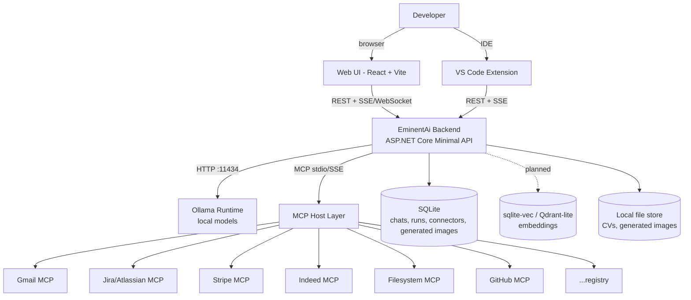

### 2.2 Container View (C4 Level 2)

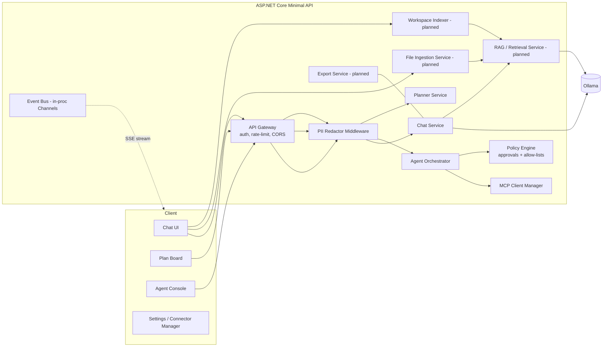

**Stack decision (ADR-style, condensed):**

| Option | Verdict |
|---|---|
| **A. ASP.NET Core Minimal API (.NET 10 target) + React/Vite + official `ModelContextProtocol` C# SDK** | **Chosen.** Matches your existing Clean Architecture reference project; MS-maintained MCP SDK; one binary deploy. |
| B. Node/TypeScript end-to-end | Better MCP ecosystem maturity, but duplicates nothing you own; weaker typing discipline for the orchestrator. |
| C. Python (FastAPI + LangGraph) | Fastest agent prototyping; worst long-term maintainability for you; packaging on macOS is painful. |

**Key Backend Components (New):**
- **PII Redactor:** Intercepts incoming messages and outgoing tool results to mask secrets/PII before they hit the database or the model.
- **Workspace Indexer:** Background worker that walks the codebase to generate a "Project Map" summary, enhancing RAG retrieval with structural context.
- **Intent Router:** Service that dynamically assigns models based on payload content (e.g., routing images to `qwen2.5-vl`).

Consequence: the VS Code extension is still **TypeScript** (no choice — VS Code API), so the backend exposes a clean REST/SSE contract both clients share.

### 2.3 Mode-selection flowchart

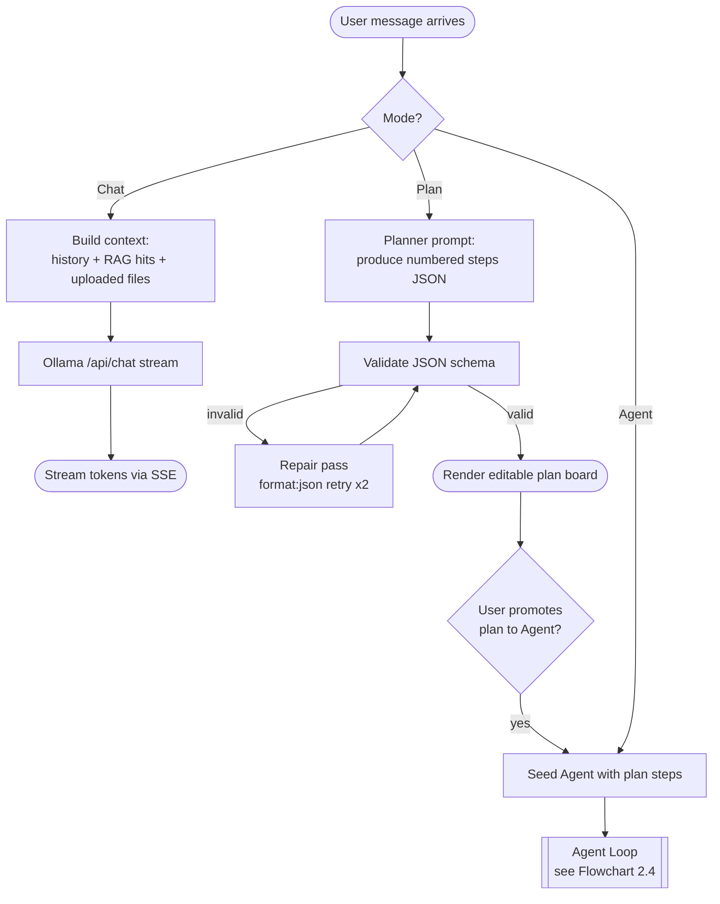

### 2.4 Agent loop flowchart

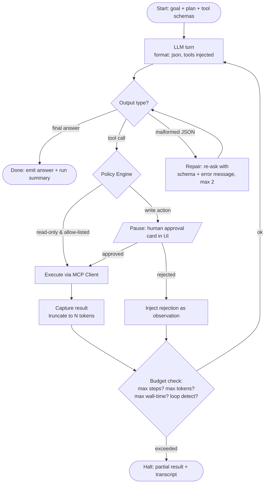

---

## 3. Low-Level Design (LLD)

### 3.1 Backend project layout (Clean Architecture)

```
eminentai/
├─ src/
│  ├─ EminentAi.Domain/            # entities, value objects, no deps
│  │   ├─ Conversation.cs  Message.cs  Branch.cs
│  │   ├─ AgentRun.cs  AgentStep.cs  ToolCall.cs  Approval.cs
│  │   ├─ ConnectorConfig.cs  PolicyRule.cs  UploadedFile.cs
│  ├─ EminentAi.Application/       # use cases, interfaces
│  │   ├─ Chat/ SendMessage  RegenerateMessage  BranchConversation
│  │   ├─ Agent/ StartRun  ApproveStep  CancelRun
│  │   ├─ Agents/ specialized smart-chat agents
│  │   ├─ Routing/ intent and model routing contracts
│  │   ├─ Providers/ model provider contracts and policies
│  │   ├─ Abstractions/ IOllamaClient  IMcpHost  IPolicyEngine  repositories
│  ├─ EminentAi.Infrastructure/
│  │   ├─ Ollama/OllamaClient.cs            # /api/chat /api/generate /api/tags /api/pull
│  │   ├─ Mcp/McpHost.cs                    # ModelContextProtocol SDK, server registry
│  │   ├─ Persistence/ (EF Core + SQLite)
│  │   ├─ Providers/ OllamaModelProvider.cs
│  │   ├─ Routing/ IntentRouterService.cs  ModelRouterService.cs
│  │   ├─ Security/ PiiRedactor.cs          # Regex-based masking of secrets
│  └─ EminentAi.Api/               # Minimal API + SSE endpoints
├─ web/                             # React 18 + Vite + TS + Tailwind + shadcn
└─ vscode-ext/                      # TypeScript extension (Section 8)
```

### 3.2 Core data model (SQLite)

```sql
conversations(id PK, title, created_at, model_default, system_prompt)
branches(id PK, conversation_id FK, parent_branch_id NULL, created_at)
messages(id PK, branch_id FK, role, content, model, tokens_in, tokens_out,
         latency_ms, created_at, parent_message_id NULL)   -- regenerate = sibling
message_attachments(id PK, message_id FK, name, content_type, data_base64, created_at)
admin_users(id PK, full_name, email, password_hash, session_token_hash, created_at)
agent_runs(id PK, conversation_id FK NULL, goal, plan_json, model, status, step_budget,
           token_budget, started_at, finished_at)
agent_steps(id PK, run_id FK, ordinal, kind /*think|tool_call|approval|result*/,
            tool_name, tool_args_json, result_json, status)
connectors(id PK, name, transport /*stdio|sse|http*/, command_or_url,
           env_json_encrypted, enabled, policy_profile /*ro|rw|blocked*/)
policy_rules(id PK, connector_id FK, tool_pattern, action /*allow|ask|deny*/)
generated_images(id PK, branch_id FK, session_token_hash NULL, created_at)
```

Key choice: **regenerate never deletes** — a regenerated reply is a sibling `message` sharing `parent_message_id`; the UI shows `◀ 2/3 ▶` pagination, and branching forks `branches`.

### 3.3 API contract (shared by Web UI and VS Code extension)

| Method | Route | Purpose |
|---|---|---|
| GET | `/api/health` | API and Ollama reachability |
| GET | `/api/observability` | System, loaded-model, and job-source health |
| GET | `/api/models` | Installed Ollama model list |
| POST | `/api/chat` | Stateless VS Code extension chat stream |
| POST | `/api/chat/smart` | Smart multi-agent chat stream with routing |
| POST | `/api/branches/{branchId}/messages` | Persisted conversation chat stream |
| POST | `/api/messages/{messageId}/regenerate` | New sibling assistant message stream |
| POST | `/api/branches/{branchId}/fork` | Fork branch from a message |
| POST | `/api/plan` | Generate numbered plan JSON |
| POST | `/api/agent/runs` | Autonomous agent run SSE |
| POST | `/api/agent/runs/{runId}/approvals/{stepId}` | Approve/reject pending tool call |
| GET | `/api/agent/runs/{runId}` | Load persisted agent transcript |
| GET/POST/DELETE | `/api/connectors` | Connector registry CRUD |
| GET/POST/DELETE | `/api/cvs` / `/api/cvs/upload` / `/api/cvs/{filename}` | CV management for job search |
| GET/POST | `/api/jobs/*` | Job search settings, source health, search, and ingestion |
| GET | `/api/generated-images/{filename}` | Authenticated generated-image fetch |

SSE event envelope:

```json
{ "event": "tool_call", "data": { "stepId": "s_42", "tool": "jira.create_issue",
  "args": { "project": "LF", "summary": "..." }, "requiresApproval": true } }
```

### 3.4 Ollama client (Infrastructure) — the parts that matter

```csharp
public sealed class OllamaClient(HttpClient http) : IOllamaClient
{
    // Streaming chat with optional tool schemas + JSON-constrained output
    public async IAsyncEnumerable<ChatDelta> ChatStreamAsync(
        ChatRequest req, [EnumeratorCancellation] CancellationToken ct)
    {
        var payload = new {
            model = req.Model,
            messages = req.Messages,            // role/content (+images base64)
            tools = req.Tools,                  // JSON-schema tool defs
            format = req.ForceJson ? "json" : null,
            options = new { temperature = req.Temperature,
                            num_ctx = req.ContextWindow,   // 8192 default on 16GB
                            f16_kv = false },              // Mandatory KV cache quantization
            stream = true,
            keep_alive = "10m"
        };
        using var resp = await http.PostAsJsonAsync("/api/chat", payload, ct);
        await foreach (var line in resp.ReadNdjsonAsync(ct))
            yield return ChatDelta.Parse(line);  // token | tool_calls | done(+usage)
    }

    public Task<float[][]> EmbedAsync(string model, string[] inputs, CancellationToken ct)
        => http.PostJsonAsync<EmbedResponse>("/api/embed",
              new { model, input = inputs }, ct).Select(r => r.Embeddings);
}
```

**Intent Router:** A middleware component that inspects the incoming request before dispatching it to `ChatStreamAsync`. If an image is detected, it overrides the model with the configured vision model (e.g., `qwen2.5-vl`). If architectural keywords are detected in a request initiated without a specified mode, it prompts the user to switch to "Plan" mode or auto-selects a reasoning model (e.g., `gemma-4` or `deepseek-r1`).

**Tool-call repair layer** (this is what makes agent mode usable on 7B models):

```csharp
public async Task<ToolCall?> ParseOrRepairAsync(string raw, ToolSchema[] schemas, CancellationToken ct)
{
    if (TryStrictParse(raw, schemas, out var call)) return call;        // pass 1
    var fixedJson = JsonRepair.Run(raw);                                // pass 2: trailing commas, fences
    if (TryStrictParse(fixedJson, schemas, out call)) return call;
    // pass 3: one re-ask, format:json, with the validation error embedded
    var retry = await _ollama.ChatOnceAsync(RepairPrompt(raw, schemas), forceJson: true, ct);
    return TryStrictParse(retry, schemas, out call) ? call : null;      // null → surface to user
}
```

### 3.5 MCP Host (connector layer)

Uses the official **`ModelContextProtocol`** C# SDK. Each connector is a config row; stdio servers are spawned on demand, remote servers connect over SSE/HTTP with OAuth.

```csharp
public sealed class McpHost(IConnectorRepo repo, IPolicyEngine policy) : IMcpHost
{
    private readonly ConcurrentDictionary<string, IMcpClient> _clients = new();

    public async Task<IReadOnlyList<ToolSchema>> GetToolsAsync(string[] connectorIds, CancellationToken ct)
    {
        var all = new List<ToolSchema>();
        foreach (var id in connectorIds)
        {
            var client = await GetOrConnectAsync(id, ct);
            var tools = await client.ListToolsAsync(ct);
            // Namespace tools to avoid collisions: "jira.create_issue"
            all.AddRange(tools.Select(t => t.WithPrefix(id)));
        }
        return all;
    }

    public async Task<ToolResult> CallAsync(ToolCall call, CancellationToken ct)
    {
        var (connectorId, toolName) = call.SplitNamespace();
        var verdict = policy.Evaluate(connectorId, toolName, call.Args); // allow|ask|deny
        if (verdict == Verdict.Deny) return ToolResult.Denied(call);
        if (verdict == Verdict.Ask)  return ToolResult.PendingApproval(call); // SSE → UI card
        var client = await GetOrConnectAsync(connectorId, ct);
        var raw = await client.CallToolAsync(toolName, call.Args, ct);
        return ToolResult.Ok(call, Truncate(raw, maxTokens: 2000));     // protect context window
    }
}
```

**Connector registry (initial set):**

| Connector | Transport | Auth | Default policy | Notes |
|---|---|---|---|---|
| Gmail | remote HTTP MCP | OAuth 2.0 (PKCE) | `read: allow`, `send/draft: ask` | search, read, draft, send, labels |
| Jira / Atlassian | remote (`mcp.atlassian.com`) | OAuth 2.0 | `read: allow`, `create/transition/comment: ask` | JQL search, issue CRUD, Confluence pages |
| Stripe | remote (`mcp.stripe.com`) | OAuth / restricted key | `read: allow`, **all mutations: ask** | never allow-list refunds/payouts |
| Indeed | remote MCP | OAuth | `read: allow` | job search, company data — read-only by nature |
| Filesystem | stdio (`npx @modelcontextprotocol/server-filesystem <root>`) | none | `read: allow`, `write: ask` | scoped to workspace root only |
| GitHub | stdio/remote | PAT/OAuth | `read: allow`, `push/PR: ask` | agent-mode PR creation |
| Shell/terminal | built-in (not MCP) | n/a | **always ask** | sandboxed cwd, denylist (`rm -rf`, `curl \| sh`, sudo) |
| Slack, Drive, Calendar, Postman, Postgres, Brave Search, Playwright | per official servers | varies | per profile | toggle in Settings |

Secrets (`env_json_encrypted`) are encrypted at rest with a key in the **macOS Keychain** — never plaintext in SQLite.

### 3.6 File-upload ingestion pipeline

```
Upload → sniff MIME + sha256 dedupe
  ├─ text/code            → as-is
  ├─ pdf                  → PdfPig text; if <50 chars/page → flag "scanned" (optional OCR)
  ├─ docx/xlsx            → OpenXml / ClosedXML → markdown tables
  ├─ csv                  → schema summary + first N rows (never embed 1M rows raw)
  └─ images               → pass-through base64 to vision model (llava/qwen-vl) if pulled
Chunking: ~800 tokens, 120 overlap, heading-aware for md/docx
Embedding: nomic-embed-text (batch 32) → sqlite-vec
Routing rule: total ≤ 3,000 tokens → inline into prompt; else → top-k=6 RAG retrieval per user turn
```

### 3.7 Policy Engine (LLD)

```csharp
// Evaluation order: explicit DENY > explicit ALLOW > connector profile default > global default(ask)
public Verdict Evaluate(string connector, string tool, JsonNode args)
{
    foreach (var rule in _rules.For(connector).OrderBy(r => r.Specificity))
        if (Glob.Match(rule.ToolPattern, tool)) return rule.Action;
    return _profiles[connector] switch {
        Profile.ReadOnly  => IsMutating(tool) ? Verdict.Deny : Verdict.Allow,
        Profile.ReadWrite => IsMutating(tool) ? Verdict.Ask  : Verdict.Allow,
        Profile.Blocked   => Verdict.Deny,
        _ => Verdict.Ask
    };
}
// "remember this decision" in the approval card writes a new policy_rule (scoped, not global)
```

Prompt-injection mitigations baked in:
- All tool results wrapped: `"<tool_result connector=jira trust=untrusted> ... </tool_result>"` + a standing system instruction that tool-result content is **data, never instructions**.
- Cross-connector write after reading untrusted content escalates `ask` even if allow-listed (taint flag on the run).
- Egress allow-list per run: agent declares connectors up front; anything else is denied.

---

## 4. Sequence Diagrams (numbered)

### SD-01 — Planned streaming chat with uploaded document (RAG path)

This path is not implemented in the current API. Current chat attachments support image payloads; document parsing, vector indexing, and `/api/files` are planned.

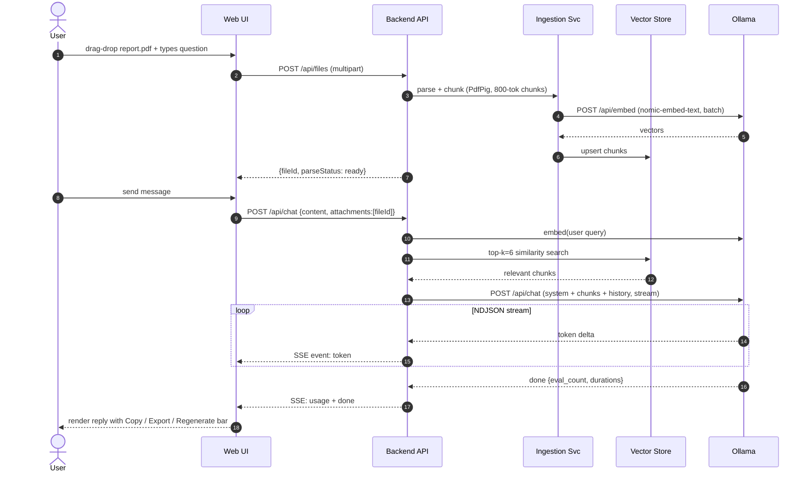

### SD-02 — Agent mode with MCP tool call + human approval (Jira example)

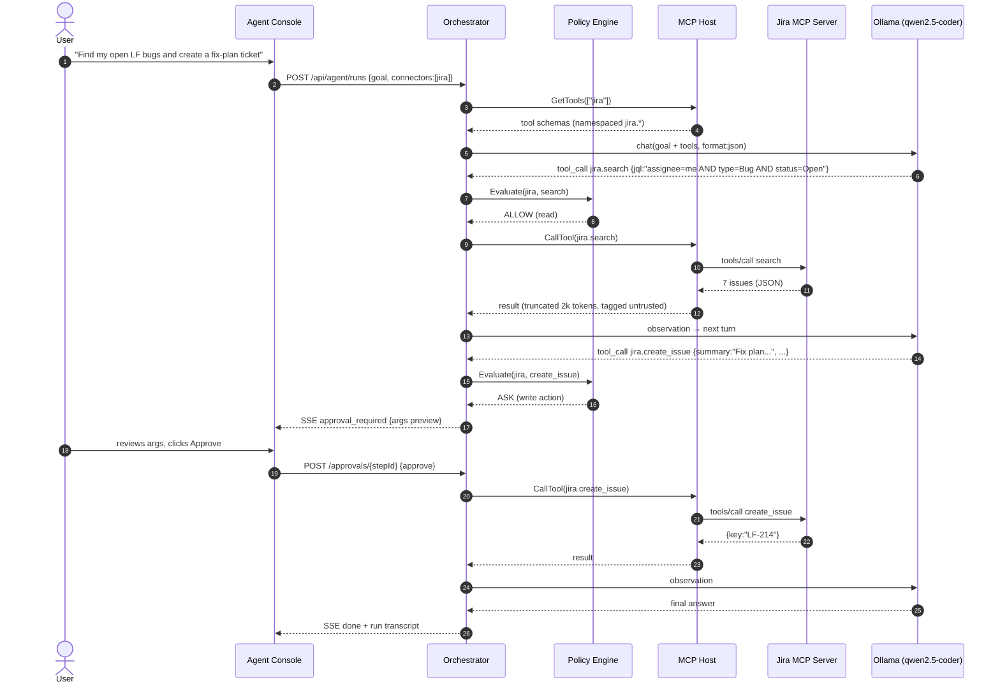

### SD-03 — Regenerate / branch (non-destructive)

```mermaid
sequenceDiagram
    autonumber
    actor U as User
    participant UI as Web UI
    participant API as Backend
    participant DB as SQLite
    participant OL as Ollama

    U->>UI: clicks Regenerate (pick model: llama3.1)
    UI->>API: POST /api/messages/{m9}/regenerate {model:"llama3.1:8b"}
    API->>DB: insert message m10 (parent_message_id = m9.parent)  %% sibling, not overwrite
    API->>OL: /api/chat with same upstream context, new model
    OL-->>API: stream
    API-->>UI: SSE tokens → renders as variant 2/2
    UI-->>U: pager ◀ 1/2 ▶ ; "Branch from here" forks branches row
```

### SD-04 — Export pipeline

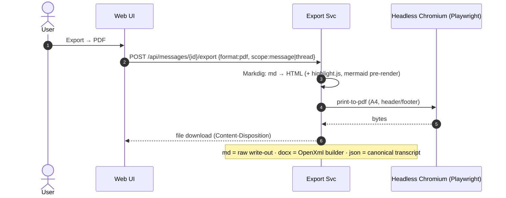

### SD-05 — VS Code inline completion (FIM)

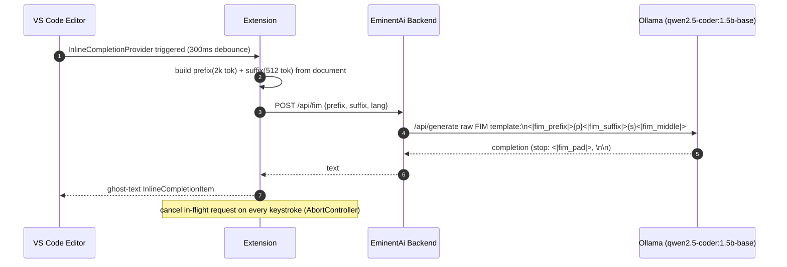

### SD-06 — Connector OAuth onboarding (Gmail)

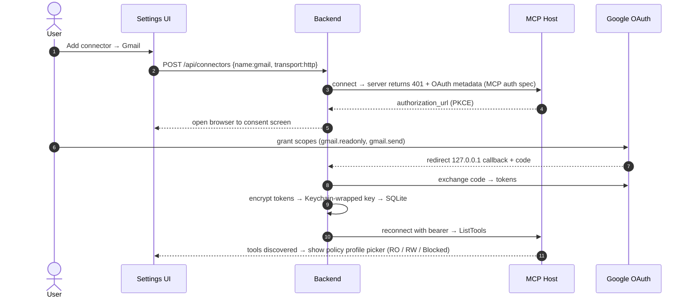

---

## 5. Frontend LLD (Web UI)

```
web/src/
├─ features/
│  ├─ chat/        MessageList, Composer(drop-zone, slash-commands, ModeToggle, TieredModelSelector), 
│  │               ResponseToolbar(Copy|Export|Regenerate|Edit|Branch), VariantPager, ContextBreadcrumbs
│  ├─ plan/        PlanBoard (drag-reorder steps, promote-to-agent)
│  ├─ agent/       RunTimeline (step cards), ApprovalCard(args diff-view, remember-checkbox),
│  │               BudgetMeter, LiveTerminalPane, ToolDebugger
│  ├─ connectors/  Registry grid, OAuthFlow, PolicyProfileEditor, TestConnection
│  ├─ files/       UploadTray, ParseStatusChips, ChunkInspector
│  └─ settings/    Models(pull/delete via /api/models), Prompts library, Usage stats, ModelRoutingConfig
├─ lib/ sse.ts (EventSource + reconnect), api.ts (typed client), markdown.tsx
└─ state/ zustand stores: conversation, agentRun, connectors
```

Response toolbar behaviour:
- **Copy:** dropdown → full markdown / plain text / code blocks only (concatenated).
- **Export:** md (instant), json (canonical), pdf/docx (server round-trip, SD-04).
- **Regenerate:** dropdown → same settings / pick model / temperature slider → creates sibling variant (SD-03).
- **Edit & resubmit:** edits *user* message, truncates downstream into a new branch.

**UI/UX Enhancements:**
- **Mode & Model Selector:** Compact inline widget in the composer (Claude-style) allowing users to switch between **Chat**, **Plan**, and **Agent** modes. Next to it, a model selector with performance tiers: **Fast** (e.g., 1.5B), **Balanced** (e.g., 7B-8B), **Reasoning** (e.g., DeepSeek-R1/Gemma-4), and **Vision** (e.g., Qwen2.5-VL).
- **Context Breadcrumbs:** A visual tray above the composer showing "pinned" files or chunks that are explicitly forced into the prompt context.
- **Model Routing Config:** A settings panel to define mapping rules (e.g., "If image attached, always use `qwen2.5-vl`").

Rendering: `react-markdown` + `rehype-highlight` + client-side `mermaid` for diagrams in model output, KaTeX for math, copy button on every code fence.

---

## 6. Implementation Plan (phased, ~6–8 weeks part-time)

### Phase 0 — Environment (day 1)
- [ ] `brew install ollama` → `ollama pull qwen2.5-coder:7b llama3.1:8b nomic-embed-text qwen2.5-coder:1.5b-base`
- [ ] Set `OLLAMA_MAX_LOADED_MODELS=2`, `OLLAMA_KEEP_ALIVE=10m`, verify `num_ctx 8192` fits (watch memory pressure in Activity Monitor).
- [ ] Smoke test: `curl localhost:11434/api/chat` streaming + a tools-array call.

### Phase 1 — Chat MVP (week 1–2)
- [ ] Scaffold Clean Architecture solution + React/Vite app.
- [ ] `OllamaClient` streaming, `/api/chat` + SSE relay, model picker from `/api/tags`.
- [ ] SQLite persistence: conversations/branches/messages.
- [ ] Markdown rendering + per-fence copy. **Exit:** usable local ChatGPT clone.

### Phase 2 — Files + RAG + response actions (week 2–3)
- [ ] Ingestion pipeline (pdf/docx/xlsx/csv/code), sqlite-vec, inline-vs-RAG routing.
- [ ] Copy variants, md/json export; pdf/docx export via Export Svc.
- [ ] Regenerate-as-sibling + variant pager + branching.

### Phase 3 — MCP + Policy (week 3–5)
- [ ] `ModelContextProtocol` C# SDK integration; stdio Filesystem server first (no OAuth, fastest to verify).
- [ ] Connector registry UI + Keychain-encrypted secrets.
- [ ] Policy Engine + approval cards over SSE.
- [ ] Add remote connectors: Atlassian/Jira → Gmail → Stripe → Indeed (in that order — Atlassian's remote MCP is the most battle-tested).

### Phase 4 — Plan + Agent mode (week 5–6)
- [ ] Planner (JSON plan schema + repair loop) and Plan Board.
- [ ] Agent orchestrator: loop, budgets (default 15 steps / 60k tokens / 10 min), loop-detection (3 identical tool calls → halt), transcript persistence.
- [ ] Built-in shell tool with denylist + sandbox cwd. **Exit:** SD-02 works end-to-end.

### Phase 5 — VS Code extension (week 6–8) — Section 8
### Phase 6 — Polish
- [ ] Prompt library, usage meter, A/B compare, whisper.cpp voice input, scheduled agents (Quartz.NET cron), `.dmg`/single-binary packaging (`dotnet publish -r osx-arm64 /p:PublishSingleFile=true`).

**Testing strategy:** unit-test the tool-call repair layer and Policy Engine hardest (these are the failure points); golden-transcript tests for the agent loop with a mocked Ollama; Playwright e2e for upload→chat→export.

---

## 6b. Admin Auth & Password Reset

### Auth model

Single-admin design. Credentials stored in `AdminUsers` (SQLite):

| Column | Type | Notes |
|---|---|---|
| `Id` | TEXT PK | UUID |
| `FullName` | TEXT | |
| `Email` | TEXT UNIQUE | lower-cased on write |
| `PasswordHash` | TEXT | `base64(salt).base64(pbkdf2-sha256)` · 100,000 iterations |
| `SessionTokenHash` | TEXT NULL | SHA-256 of the bearer token in `localStorage` |
| `CreatedAt` | TEXT | ISO-8601 UTC |

Session tokens are random 32-byte values (`RandomNumberGenerator.GetBytes(32)`) stored only as SHA-256 hashes — the plaintext never touches the DB.

### Password reset flow (Mailpit)

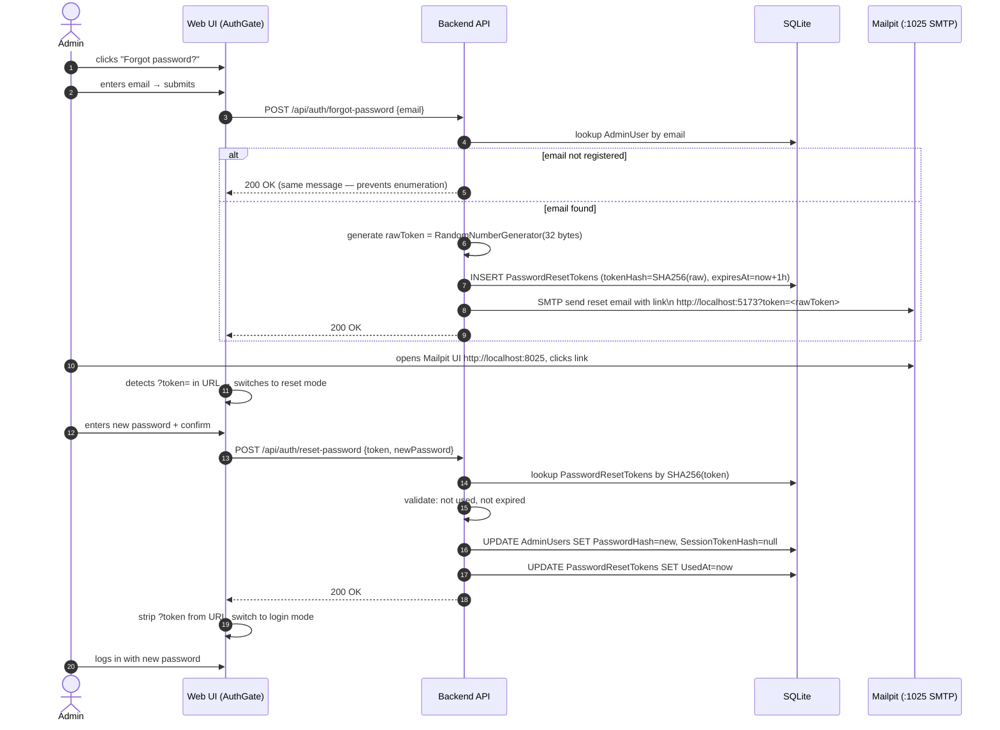

**`PasswordResetTokens` table:**

```sql
PasswordResetTokens(
    Id        TEXT PK,
    AdminUserId TEXT NOT NULL,   -- FK to AdminUsers.Id
    TokenHash   TEXT NOT NULL,   -- SHA-256 of the raw bearer token
    ExpiresAt   TEXT NOT NULL,   -- ISO-8601 UTC; valid for 1 hour
    UsedAt      TEXT NULL        -- set on first use; single-use enforcement
)
```

**Security properties:**
- Raw token never stored — only its SHA-256 hash is persisted, matching the session-token pattern.
- Always returns HTTP 200 for unknown emails to prevent account enumeration.
- Token is single-use (`UsedAt` set on redemption) and 1-hour TTL.
- Password reset invalidates all active sessions (`SessionTokenHash = null`).
- Mailpit is a local-only mail catcher — no email leaves the machine.

**SMTP configuration** (`appsettings.json` → `EminentAi:Smtp`):

| Key | Default | Purpose |
|---|---|---|
| `Host` | `127.0.0.1` | SMTP host (Mailpit) |
| `Port` | `1025` | Mailpit SMTP port |
| `FromAddress` | `noreply@eminentai.local` | Envelope from |
| `AppBaseUrl` | `http://localhost:5173` | Prepended to the reset path |

---

## 7. Security & Privacy Checklist

| Threat | Mitigation |
|---|---|
| Prompt injection via tool results (email/ticket content) | Untrusted-data tagging, taint-escalation on cross-connector writes, standing system rule |
| Secret leakage | Keychain-encrypted connector secrets; redaction filter strips `sk_live_`, OAuth tokens, AWS keys from anything sent to the model or logged |
| Destructive shell commands | Always-ask + denylist + sandbox cwd; no sudo |
| Stripe mutations | Hard rule: refunds/payouts/transfers can never be allow-listed |
| Network exposure | Bind 127.0.0.1; LAN mode requires bearer token + TLS |
| Data at rest | SQLite optional SQLCipher; uploads under `~/Library/Application Support/EminentAi` |
| Run audit | Every agent step persisted; one-click "export run as evidence" JSON |

---

## 8. VS Code Extension — Full Build Guide

### 8.1 What you're building

Four surfaces, one backend:
1. **Chat sidebar** (webview) — same SSE protocol as the web UI.
2. **Inline completions** — ghost text via FIM model (SD-05).
3. **Code actions / commands** — explain, fix, refactor, generate tests on selection.
4. **Agent edits** — model proposes multi-file changes → native diff preview → apply via `WorkspaceEdit`.
5. **Terminal Observer** — Extension monitors terminal output for errors (e.g., build/test failures) and offers proactive "💡 Fix with EminentAi" suggestions.

Architecture decision: the extension talks to **your EminentAi backend, not Ollama directly**. You get history, RAG, MCP, and policy for free, and one protocol to maintain. (Direct-to-Ollama fallback is a settings toggle for chat-only use.)

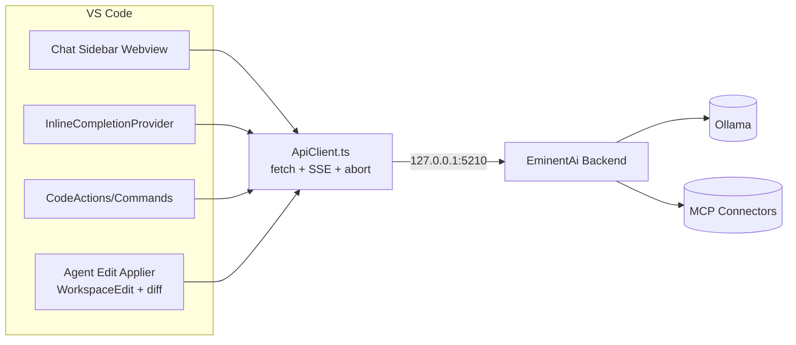

### 8.2 Scaffold

```bash
npm install -g yo generator-code @vscode/vsce
yo code   # → New Extension (TypeScript), bundler: esbuild, name: eminentai-copilot
cd eminentai-copilot && npm i
```

### 8.3 `package.json` (manifest — the parts that matter)

```jsonc
{
  "name": "eminentai-copilot",
  "displayName": "EminentAi Copilot (Ollama)",
  "engines": { "vscode": "^1.95.0" },
  "main": "./dist/extension.js",
  "activationEvents": ["onStartupFinished"],
  "contributes": {
    "viewsContainers": { "activitybar": [
      { "id": "eminentai", "title": "EminentAi", "icon": "media/icon.svg" } ] },
    "views": { "eminentai": [
      { "type": "webview", "id": "eminentai.chat", "name": "Chat" } ] },
    "commands": [
      { "command": "eminentai.explain",   "title": "EminentAi: Explain Selection" },
      { "command": "eminentai.fix",       "title": "EminentAi: Fix Selection" },
      { "command": "eminentai.refactor",  "title": "EminentAi: Refactor Selection" },
      { "command": "eminentai.tests",     "title": "EminentAi: Generate Tests" },
      { "command": "eminentai.agentEdit", "title": "EminentAi: Agent Edit (multi-file)" },
      { "command": "eminentai.pickModel", "title": "EminentAi: Switch Model" }
    ],
    "menus": { "editor/context": [
      { "command": "eminentai.explain", "when": "editorHasSelection", "group": "eminentai@1" },
      { "command": "eminentai.fix",     "when": "editorHasSelection", "group": "eminentai@2" } ] },
    "keybindings": [
      { "command": "eminentai.explain", "key": "ctrl+alt+e", "mac": "cmd+alt+e" } ],
    "configuration": { "title": "EminentAi", "properties": {
      "eminentai.backendUrl":   { "type": "string", "default": "http://127.0.0.1:5210" },
      "eminentai.ollamaUrl":    { "type": "string", "default": "http://127.0.0.1:11434",
                                   "description": "Fallback when backend is offline" },
      "eminentai.chatModel":    { "type": "string", "default": "qwen2.5-coder:7b" },
      "eminentai.fimModel":     { "type": "string", "default": "qwen2.5-coder:1.5b-base" },
      "eminentai.inlineCompletions": { "type": "boolean", "default": true },
      "eminentai.maxPrefixTokens":   { "type": "number", "default": 2000 }
    }}
  }
}
```

### 8.4 `src/extension.ts` — activation

```typescript
import * as vscode from "vscode";
import { ChatViewProvider } from "./chatView";
import { FimProvider } from "./fim";
import { registerCommands } from "./commands";
import { ApiClient } from "./apiClient";

export function activate(ctx: vscode.ExtensionContext) {
  const cfg = () => vscode.workspace.getConfiguration("eminentai");
  const api = new ApiClient(() => cfg().get<string>("backendUrl")!,
                            () => cfg().get<string>("ollamaUrl")!);

  // 1) Chat sidebar
  ctx.subscriptions.push(vscode.window.registerWebviewViewProvider(
    "eminentai.chat", new ChatViewProvider(ctx, api),
    { webviewOptions: { retainContextWhenHidden: true } }));

  // 2) Inline completions (all languages; gate via setting)
  ctx.subscriptions.push(vscode.languages.registerInlineCompletionItemProvider(
    { pattern: "**" }, new FimProvider(api, cfg)));

  // 3) Commands + code actions
  registerCommands(ctx, api);

  // 4) Terminal Observer (Active Troubleshooting)
  ctx.subscriptions.push(vscode.window.onDidWriteTerminalData(e => {
    if (ErrorHeuristics.detect(e.data)) showFixSuggestion(ctx, e.data);
  }));

  // 5) Health check → status bar item: "⚡ qwen2.5-coder:7b" / "⚠ Ollama offline"
  api.health().then(ok => updateStatusBar(ctx, ok));
}
export function deactivate() {}
```

### 8.5 `src/apiClient.ts` — SSE streaming + Ollama fallback

```typescript
export class ApiClient {
  constructor(private backendUrl: () => string, private ollamaUrl: () => string) {}

  async health(): Promise<boolean> {
    try { return (await fetch(`${this.backendUrl()}/api/models`)).ok; }
    catch { return false; }
  }

  /** Stream chat via backend SSE; falls back to direct Ollama NDJSON. */
  async *chat(messages: ChatMsg[], model: string, signal: AbortSignal): AsyncGenerator<ChatEvent> {
    if (await this.health()) {
      const r = await fetch(`${this.backendUrl()}/api/chat`, {
        method: "POST", signal,
        headers: { "Content-Type": "application/json" },
        body: JSON.stringify({ messages, model, client: "vscode" })
      });
      yield* this.readSse(r, signal);                 // token | tool_call | approval_required | done
      return;
    }
    // Fallback: direct Ollama /api/chat (chat-only, no MCP/policy)
    const r = await fetch(`${this.ollamaUrl()}/api/chat`, {
      method: "POST", signal,
      body: JSON.stringify({ model, messages, stream: true })
    });
    const reader = r.body!.getReader(); const dec = new TextDecoder(); let buf = "";
    while (true) {
      const { done, value } = await reader.read(); if (done) break;
      buf += dec.decode(value, { stream: true });
      let nl: number;
      while ((nl = buf.indexOf("\n")) >= 0) {
        const line = buf.slice(0, nl).trim(); buf = buf.slice(nl + 1);
        if (!line) continue;
        const j = JSON.parse(line);
        if (j.message?.content) yield { type: "token", text: j.message.content };
        if (j.done) yield { type: "done", usage: { out: j.eval_count } };
      }
    }
  }

  async fim(prefix: string, suffix: string, model: string, signal: AbortSignal): Promise<string> {
    const r = await fetch(`${this.ollamaUrl()}/api/generate`, {
      method: "POST", signal,
      body: JSON.stringify({
        model, raw: true, stream: false,
        prompt: `<|fim_prefix|>${prefix}<|fim_suffix|>${suffix}<|fim_middle|>`,
        options: { num_predict: 128, temperature: 0.2,
                   stop: ["<|fim_pad|>", "<|endoftext|>", "\n\n\n"] }
      })
    });
    return (await r.json()).response ?? "";
  }
  /* readSse(): standard EventSource-style parser over fetch body — omitted for brevity */
}
```

### 8.6 `src/fim.ts` — inline completion provider

```typescript
export class FimProvider implements vscode.InlineCompletionItemProvider {
  private inflight?: AbortController;
  private cache = new Map<string, string>();          // LRU in practice

  constructor(private api: ApiClient, private cfg: () => vscode.WorkspaceConfiguration) {}

  async provideInlineCompletionItems(
    doc: vscode.TextDocument, pos: vscode.Position,
    _ctx: vscode.InlineCompletionContext, token: vscode.CancellationToken) {

    if (!this.cfg().get("inlineCompletions")) return [];
    this.inflight?.abort();                            // kill stale request
    const ac = new AbortController(); this.inflight = ac;
    token.onCancellationRequested(() => ac.abort());
    await new Promise(r => setTimeout(r, 300));        // debounce
    if (ac.signal.aborted) return [];

    const prefix = doc.getText(new vscode.Range(new vscode.Position(0, 0), pos)).slice(-8000);
    const suffix = doc.getText(new vscode.Range(pos,
                     new vscode.Position(doc.lineCount, 0))).slice(0, 2000);

    const key = `${doc.uri}|${prefix.slice(-200)}`;
    const text = this.cache.get(key)
      ?? await this.api.fim(prefix, suffix, this.cfg().get("fimModel")!, ac.signal)
           .catch(() => "");
    if (!text || ac.signal.aborted) return [];
    this.cache.set(key, text);
    return [new vscode.InlineCompletionItem(text, new vscode.Range(pos, pos))];
  }
}
```

### 8.7 `src/commands.ts` — selection commands + agent multi-file edits

```typescript
export function registerCommands(ctx: vscode.ExtensionContext, api: ApiClient) {
  const onSelection = (id: string, instruction: string) =>
    vscode.commands.registerCommand(`eminentai.${id}`, async () => {
      const ed = vscode.window.activeTextEditor; if (!ed) return;
      const sel = ed.document.getText(ed.selection);
      const lang = ed.document.languageId;
      // route to chat sidebar with a prepared prompt
      await vscode.commands.executeCommand("eminentai.chat.focus");
      ChatViewProvider.current?.post({ type: "prefill",
        prompt: `${instruction}\n\n\`\`\`${lang}\n${sel}\n\`\`\`` });
    });

  ctx.subscriptions.push(
    onSelection("explain",  "Explain this code precisely. Call out bugs or smells:"),
    onSelection("fix",      "Fix the problems in this code. Return only the corrected code:"),
    onSelection("refactor", "Refactor for readability and testability. Explain each change:"),
    onSelection("tests",    "Write thorough unit tests (xUnit if C#, vitest if TS):"),

    // Agent edit: backend run with filesystem MCP scoped to workspace → diff preview
    vscode.commands.registerCommand("eminentai.agentEdit", async () => {
      const goal = await vscode.window.showInputBox({
        prompt: "What should the agent change in this workspace?" });
      if (!goal) return;
      const root = vscode.workspace.workspaceFolders?.[0]?.uri.fsPath;
      const run = await api.startAgentRun({ goal, connectors: ["filesystem"], cwd: root });

      for await (const ev of api.streamRun(run.id)) {
        if (ev.type === "file_edit_proposed") {
          // native diff: virtual doc (original) vs proposed content
          const orig = vscode.Uri.file(ev.path);
          const proposed = orig.with({ scheme: "eminentai-proposed" });   // TextDocumentContentProvider
          await vscode.commands.executeCommand("vscode.diff", orig, proposed,
            `EminentAi: ${ev.path}`);
          const pick = await vscode.window.showInformationMessage(
            `Apply changes to ${vscode.workspace.asRelativePath(ev.path)}?`,
            "Apply", "Skip", "Abort run");
          if (pick === "Apply") {
            const we = new vscode.WorkspaceEdit();
            we.replace(orig, fullRange(ev.original), ev.proposed);
            await vscode.workspace.applyEdit(we);
            await api.approve(run.id, ev.stepId, true);
          } else if (pick === "Abort run") { await api.cancel(run.id); break; }
          else await api.approve(run.id, ev.stepId, false);
        }
        if (ev.type === "approval_required")           // shell / other tools
          await api.approve(run.id, ev.stepId,
            (await vscode.window.showWarningMessage(
              `Agent wants: ${ev.tool} ${JSON.stringify(ev.args)}`,
              "Approve", "Reject")) === "Approve");
      }
    })
  );
}
```

### 8.8 Chat sidebar webview — wiring essentials

```typescript
// chatView.ts: standard WebviewViewProvider. Critical details:
webview.options = { enableScripts: true, localResourceRoots: [media] };
// CSP: default-src 'none'; script-src ${webview.cspSource}; style-src ${webview.cspSource} 'unsafe-inline';
// Messages: webview ⇄ extension via postMessage:
//   webview → ext: {type:"send", text}, {type:"regenerate", msgId, model?}, {type:"copy"|"export", ...}
//   ext → webview: {type:"token"|"tool_call"|"approval"|"done"|"prefill", ...}
// Reuse the React chat bundle from web/ (build a slim "embedded" target) — one UI codebase.
// Copy action: webview navigator.clipboard needs user gesture — route through
//   ext: vscode.env.clipboard.writeText(text) for reliability.
// Export: ext calls backend /export, then vscode.window.showSaveDialog → fs.writeFile.
```

### 8.9 Run, debug, package, install

```bash
# Dev: F5 in VS Code → Extension Development Host
npm run watch

# Package → .vsix
vsce package          # produces eminentai-copilot-0.1.0.vsix

# Install locally
code --install-extension eminentai-copilot-0.1.0.vsix
# or: Extensions panel → ⋯ → Install from VSIX

# Publish later (optional): create publisher at marketplace.visualstudio.com,
# vsce login <publisher> && vsce publish
```

### 8.10 Extension build checklist
- [ ] Status bar model indicator + quick-pick switcher (`/api/models`).
- [ ] AbortController on every keystroke for FIM; debounce 300 ms; cache last completion.
- [ ] `retainContextWhenHidden` on the chat view (keeps stream alive when sidebar hidden).
- [ ] Secrets (if any) via `ctx.secrets` (SecretStorage), never settings.json.
- [ ] Telemetry: none. It's a local tool — keep it that way.

---

## 9. Risks & What I'd Revisit

| Risk | Likelihood | Mitigation / revisit trigger |
|---|---|---|
| 7B tool-calling too unreliable for long agent runs | High | Repair layer + small steps; revisit if >20% repair rate → consider hybrid: local chat + opt-in cloud model for agent turns only |
| 16 GB memory pressure with IDE + browser + model | Medium | num_ctx 8192 cap, single loaded LLM; upgrade path: 32 GB or a Mac mini as a LAN inference box |
| MCP server churn (specs/endpoints evolving) | Medium | Pin server versions in connector config; registry abstracts transport |
| sqlite-vec scale ceiling (>1M chunks) | Low (single user) | Planned RAG work should introduce a vector-store abstraction before sqlite-vec or Qdrant is added |
| Webview UI drift vs web UI | Medium | Single React codebase, embedded build target |

---

## Appendix A — Quick-start commands

```bash
# Ollama
brew install ollama && brew services start ollama
ollama pull qwen2.5-coder:7b llama3.1:8b nomic-embed-text qwen2.5-coder:1.5b-base
launchctl setenv OLLAMA_MAX_LOADED_MODELS 2

# Backend
dotnet new sln -n EminentAi && cd src
dotnet new classlib -n EminentAi.Domain
dotnet new classlib -n EminentAi.Application
dotnet new classlib -n EminentAi.Infrastructure
dotnet new web      -n EminentAi.Api
dotnet add EminentAi.Infrastructure package ModelContextProtocol --prerelease
dotnet add EminentAi.Infrastructure package Microsoft.EntityFrameworkCore.Sqlite

# Web
npm create vite@latest web -- --template react-ts
cd web && npm i react-markdown rehype-highlight zustand mermaid katex

# Filesystem MCP (first connector to verify the host layer)
npx -y @modelcontextprotocol/server-filesystem ~/projects/eminentai
```

*End of document.*
