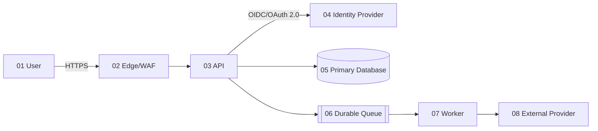
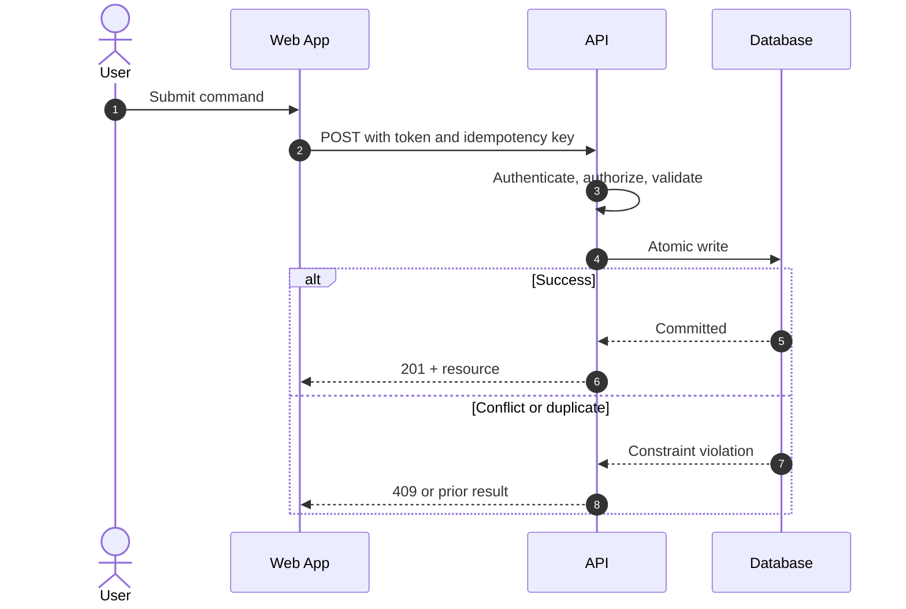
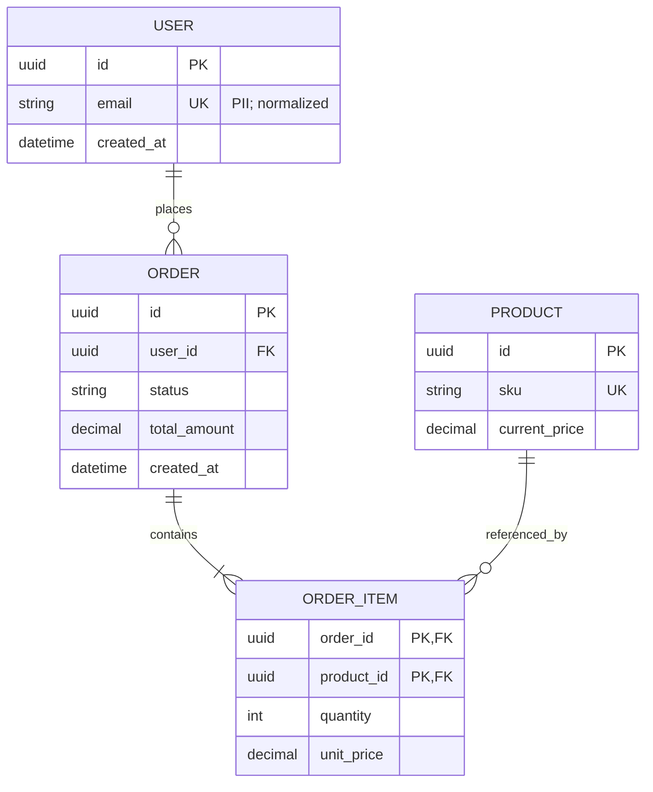

# Architecture Standards

## Contents

1. Decision principles
2. Required views
3. API and event contracts
4. Reliability
5. ADR template
6. Mermaid templates

## 1. Decision principles

- Start with a modular monolith unless independently deployable boundaries, scaling, ownership, isolation, or release cadence justify services.
- Align modules and services to business capabilities. A service owns its data and contract.
- Prefer stateless compute; isolate state in fit-for-purpose managed stores.
- Avoid distributed transactions. Use idempotency, outbox/inbox, sagas, and reconciliation where atomicity cannot cross boundaries.
- Version public contracts compatibly. Apply expand-and-contract to schema and API changes.
- Quantify trade-offs in latency, availability, consistency, recovery, complexity, cost, and lock-in.
- Define build-versus-buy criteria and an exit plan for critical vendors.

## 2. Required views

For consequential systems, document:

1. Context: users, external systems, boundaries, and business capabilities.
2. Containers: deployable units, protocols, stores, and ownership.
3. Components: only where internal structure informs a decision.
4. Deployment: regions, zones, networks, ingress, compute, state, and observability.
5. Data flow: classifications, encryption, retention, processors, and cross-border transfers.
6. Runtime sequence: success plus authentication, timeout, retry, duplicate, and failure paths.
7. ERD: keys, cardinality, constraints, ownership, audit fields, and deletion behavior.

## 3. API and event contracts

- Use resource-oriented HTTP semantics or an explicitly justified RPC/event model.
- Publish OpenAPI or AsyncAPI as the source of truth and validate it in CI.
- Specify authentication, authorization scopes, headers, media types, validation, status codes, pagination, filtering, idempotency, rate limits, timeouts, and error schema.
- Use correlation/trace IDs without placing secrets or personal data in identifiers.
- Reject unknown security-sensitive fields; bound request size, collection size, nesting, and execution time.
- Make retry behavior explicit. Retry only transient failures with bounded exponential backoff and jitter.
- For events, define owner, schema version, partition key, ordering, delivery semantics, deduplication, retention, replay, dead-letter handling, and sensitive-data policy.

## 4. Reliability

- Set SLIs/SLOs for availability, latency, correctness, freshness, and durability.
- Define RTO and RPO per business capability.
- Size capacity from workload models and verify with load tests.
- Use timeouts on every remote call. Bound concurrency and queues.
- Apply circuit breakers only when they prevent cascading failure and can be observed.
- Test backup restoration and regional/zone failover; a backup is not proven until restored.
- Prefer graceful degradation and load shedding over uncontrolled collapse.

## 5. ADR template

```markdown
# ADR-NNN: Decision title

- Status: Proposed | Accepted | Superseded | Rejected
- Date: YYYY-MM-DD
- Owners:

## Context
Business need, constraints, quality attributes, facts, and assumptions.

## Options
Options with evidence and trade-offs.

## Decision
Chosen option and why.

## Consequences
Positive, negative, operational, security, compliance, cost, and migration effects.

## Validation
Metrics, tests, review date, and reversal trigger.
```

## 6. Mermaid templates

### Numbered service flow



### Runtime sequence



### ERD


