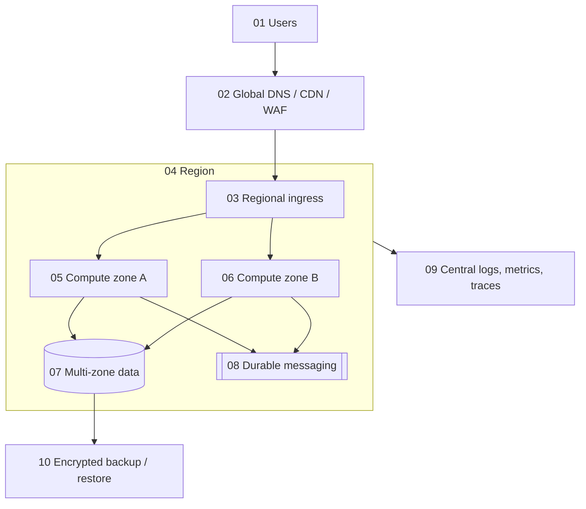

# AWS and Azure Standards

## Shared cloud principles

- Organize accounts/subscriptions by environment and risk boundary. Centralize identity, policy, audit, security telemetry, and billing.
- Use workload identity and short-lived credentials; prohibit shared users and embedded access keys.
- Make private networking the default for data and internal services. Control ingress and egress explicitly.
- Use infrastructure as code, reviewed plans, immutable artifacts, policy as code, drift detection, and tagged ownership.
- Design across failure domains from the SLO; multi-region only when business recovery requirements justify its complexity.
- Encrypt with managed keys, rotate secrets, centralize logs, and protect audit trails from workload administrators.
- Set budgets, anomaly detection, quotas, right-sizing, lifecycle rules, and cost attribution.
- Verify backup restoration, disaster recovery, capacity, and provider-limit assumptions regularly.

## AWS

- Use AWS Organizations, separate accounts, SCP guardrails, IAM Identity Center, CloudTrail organization trails, Config, GuardDuty/Security Hub as risk requires, and centralized logs.
- Prefer IAM roles and workload federation. Restrict resource policies and block unintended public S3 access.
- Use CloudFront, Shield, WAF, API Gateway/ALB, throttling, and origin restrictions for public workloads.
- Select RDS/Aurora, DynamoDB, S3, SQS/SNS/EventBridge, ECS/EKS/Lambda from workload access, scaling, and operational needs—not fashion.
- Use VPC endpoints/private connectivity where justified and log relevant network flows.

## Azure

- Use management groups, separate subscriptions, Azure Policy, Entra ID, privileged identity management, managed identities, Defender for Cloud, and centralized Monitor/Log Analytics.
- Prefer private endpoints and disable public network access for sensitive PaaS resources where feasible.
- Use Front Door/DDoS Protection/WAF/API Management and origin restrictions for public workloads.
- Select Azure SQL/PostgreSQL, Cosmos DB, Storage, Service Bus/Event Grid, Container Apps/AKS/Functions from measured requirements.
- Use Key Vault with RBAC, managed identity, soft delete, purge protection, and monitored access.

## Deployment view

