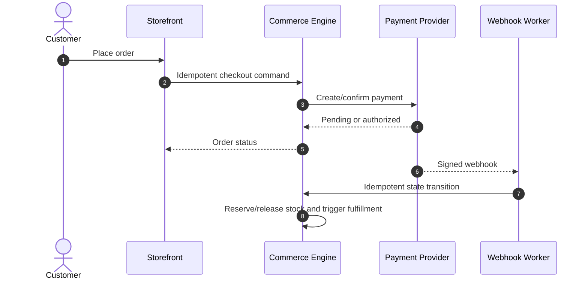

# Medusa and Magento/Adobe Commerce Standards

## Shared commerce rules

- Treat prices, tax, discounts, inventory, payment, fulfillment, returns, and order state as authoritative domain records with auditability.
- Store money as currency plus integer minor units or a proven decimal representation; never binary floating point.
- Make checkout, payment, refund, inventory reservation, and webhook processing idempotent.
- Verify webhook signatures against the raw body, enforce timestamp/replay windows, persist receipt, and process asynchronously.
- Never store card data unless explicitly in PCI scope; prefer hosted/tokenized provider surfaces.
- Reconcile orders, payments, refunds, inventory, tax, and fulfillment on schedules with alerting.
- Define guest/customer identity merge, data retention, fraud handling, and regional tax/consumer requirements.

## Medusa

- Extend through supported modules, workflows, events/subscribers, API routes, and links rather than patching core.
- Keep custom modules cohesive and own their persistence. Use workflows for multi-step operations with compensating actions.
- Validate storefront/admin authentication and authorization separately.
- Pin compatible package versions and verify upgrade guidance and migration behavior against current official documentation.

## Magento / Adobe Commerce

- Extend through modules, dependency injection, service contracts, events/observers, and narrowly scoped plugins; never edit vendor/core files.
- Prefer plugins only when extension points require interception; avoid broad `around` plugins.
- Use declarative schema/data patches and supported APIs. Keep indexers, cache invalidation, cron, queues, and deployment modes operationally visible.
- Escape output by context, validate uploads, use form keys/CSRF controls, ACL resources, and parameterized persistence APIs.
- Review extension quality, licensing, support, CVEs, performance, and upgrade compatibility before installation.

## Order flow

