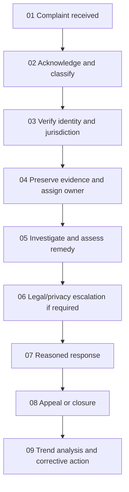

# Compliance, Privacy, and Legal Standards

This is engineering guidance, not legal advice. Engage qualified legal, privacy, security, accessibility, and records-management owners for applicable jurisdictions.

## GDPR and privacy by design

- Identify controller, processor, sub-processors, purposes, data subjects, categories, locations, transfers, retention, and lawful basis before collection.
- Collect only data necessary for a documented purpose. Do not silently reuse it for incompatible purposes.
- Provide clear notices at collection. Separate consent from contract where consent is the basis; make withdrawal as easy as giving consent.
- Complete a DPIA before high-risk processing, large-scale sensitive data use, systematic monitoring, or novel profiling.
- Support access, correction, deletion, restriction, objection, portability, consent withdrawal, and human review where applicable.
- Verify requesters without collecting excessive identity evidence. Track statutory deadlines and exceptions.
- Use approved transfer mechanisms and assess destination-country risk for international transfers.
- Define breach detection, evidence preservation, impact assessment, escalation, authority notification, and affected-person communication. GDPR supervisory-authority notification may be required within 72 hours of awareness.
- Build deletion and retention into primary stores, replicas, search indexes, caches, analytics, exports, and backup lifecycle.

## Records and evidence

- Maintain processing records, data inventory, retention schedule, consent evidence, DPIAs, vendor agreements, transfer assessments, audit logs, and deletion evidence.
- Apply legal holds that suspend normal deletion only to scoped records.
- Make policy and terms versions immutable and record which version a user accepted when acceptance is legally required.

## Complaints

1. Provide accessible intake channels and a case reference.
2. Record scope, identity verification, requested remedy, jurisdiction, deadlines, and conflicts.
3. Preserve relevant evidence and restrict case access.
4. Assign an independent owner; escalate safety, discrimination, fraud, privacy, and regulatory matters.
5. Acknowledge promptly, investigate impartially, communicate delays, and issue a reasoned outcome.
6. Provide appeal or external escalation routes where required.
7. Track themes and corrective actions without exposing complainant data.

## Release gate

- Confirm applicable laws, contracts, sector rules, accessibility obligations, age restrictions, tax/consumer rules, sanctions/export controls, data residency, retention, and licensing.
- Record control owner, evidence, review date, exception approval, and remediation deadline.
- Do not claim certification or compliance without current, scoped evidence.
