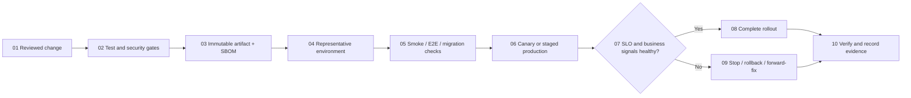

# Delivery and Operations Standards

- Use trunk-based development or short-lived branches, reviewed changes, conventional commits, and protected release branches.
- Run deterministic builds from lockfiles. Produce one immutable artifact, provenance, dependency inventory/SBOM, and checksums; promote the same artifact.
- Keep secrets outside source and artifacts. Use workload identity and environment-scoped secret stores.
- Gate releases on tests, contract compatibility, migrations, vulnerability policy, infrastructure plan, and operational readiness.
- Use rolling, blue/green, or canary deployment based on risk. Define automated health signals, rollback triggers, and ownership.
- Separate schema expansion from code switch and schema contraction. Backward compatibility must cover mixed-version deployment.
- Manage configuration independently from code, validate it at startup, and audit production changes.
- Instrument RED signals for services and USE signals for resources. Correlate logs, metrics, traces, and business events.
- Define actionable alerts tied to user impact or SLO burn; every page needs an owner and runbook.
- Maintain dashboards for availability, latency, errors, saturation, dependencies, queues, database, security, and business correctness.
- Practice incident command, timestamped decisions, stakeholder communication, containment, recovery, and blameless learning.
- Test rollback, restore, failover, key rotation, access revocation, and dependency outage procedures.

## Release flow

