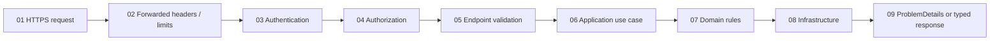

# C#, .NET, and ASP.NET Core Standards

- Enable nullable reference types and treat warnings seriously. Avoid null-forgiving operators without proof.
- Use async end-to-end for I/O and pass `CancellationToken`. Do not block on tasks.
- Prefer immutable records/value objects for values; validate invariants at boundaries and domain transitions.
- Use dependency injection with explicit lifetimes. Do not use service locator or capture scoped services in singletons.
- Keep controllers/endpoints thin. Separate transport, application use cases, domain rules, and infrastructure dependencies.
- Use CQRS when read/write models or workflows materially differ; do not add MediatR solely for indirection.
- Return consistent RFC 9457-style problem details. Do not expose exceptions or internals.
- Use policy/resource-based authorization. Validate tenant and object ownership server-side.
- Generate and validate OpenAPI. Use API versioning and compatibility tests for externally consumed APIs.
- Configure explicit timeouts, cancellation, retry policies for transient/idempotent operations, and bounded concurrency.
- Use `HttpClientFactory`; propagate trace context while filtering sensitive headers.
- Use EF Core projections for reads, no-tracking where appropriate, bounded result sets, compiled queries only after measurement, and explicit transactions when one unit of work requires them.
- Review generated migrations. Apply expand-and-contract for zero-downtime releases; never rely on automatic destructive production migration.
- Use structured logging, OpenTelemetry traces/metrics, health checks that distinguish liveness and readiness, and no sensitive payload logging.
- Test domain logic with unit tests and persistence/API behavior with integration tests using the actual database engine and `WebApplicationFactory`.

## API pipeline

