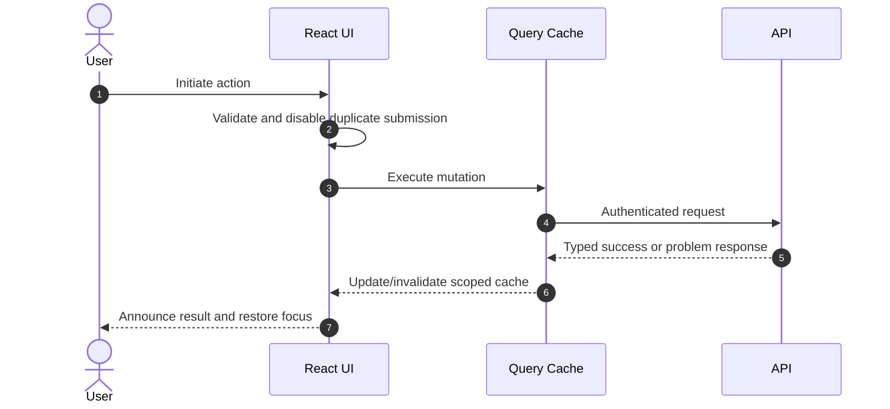

# React, TypeScript, and Next.js Standards

## TypeScript and React

- Use strict TypeScript. Never use `any`; use `unknown` plus narrowing at untrusted boundaries.
- Keep server state in a query/cache library and local UI state close to its owner. Do not duplicate derived state.
- Prefer composition and small focused components. Extract abstractions only after repeated, stable need.
- Keep effects for synchronization with external systems; do not use effects for derivable values.
- Preserve stable list identity and avoid index keys for reorderable data.
- Model forms and async operations with explicit idle/loading/success/error states.
- Validate all external data at runtime. Type declarations do not validate network input.
- Use semantic HTML first; ensure keyboard, focus, labels, announcements, contrast, reflow, and reduced-motion support.
- Measure before memoizing. Split bundles at meaningful route/feature boundaries.
- Never expose server secrets through public environment variables or client bundles.

## Next.js

- Prefer Server Components for server-owned data and non-interactive UI; add Client Components at the smallest interactive boundary.
- Keep authorization and sensitive fetching on the server. Treat Server Actions and route handlers as public endpoints requiring authentication, authorization, validation, and CSRF-aware design.
- Select static, dynamic, cached, and revalidated behavior deliberately. Never cache user-specific responses across users.
- Use framework metadata, image, font, script, and routing capabilities; monitor Core Web Vitals.
- Prevent sensitive data from entering serialized props, HTML, source maps, or build output.

## Client request flow

