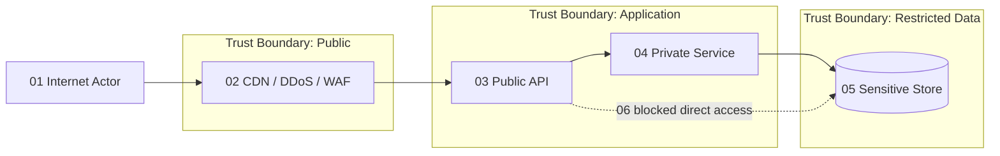

# Security Standards

## Contents

1. Baseline
2. Identity and authorization
3. API and headers
4. Browser storage
5. Secrets and leakage
6. DDoS and external exposure
7. Supply chain and operations
8. Threat model

## 1. Baseline

- Apply secure-by-default, deny-by-default, least privilege, defense in depth, separation of duties, and zero-trust verification.
- Classify data and systems. Map controls to risk using current OWASP, NIST, CIS, and applicable organizational standards.
- Threat-model trust boundaries and high-risk changes before implementation.
- Encrypt in transit and at rest with managed keys and documented rotation/ownership.
- Log security-relevant actions without secrets, tokens, payment data, or unnecessary personal data.

## 2. Identity and authorization

- Use established OIDC/OAuth 2.0 libraries and managed identity providers; never design custom authentication protocols.
- Prefer short-lived tokens. Validate issuer, audience, signature, algorithm, time claims, and authorized party where applicable.
- Enforce authorization server-side for every object and action. Prevent IDOR/BOLA with resource-level checks.
- Use phishing-resistant MFA for privileged access. Separate human and workload identities.
- Revoke sessions and rotate credentials after compromise or privilege changes.

## 3. API and headers

At ingress, validate:

- Allowed method, scheme, host, path, content type, accept type, content length, encoding, and API version.
- Required authorization, idempotency, conditional, correlation, and anti-CSRF headers.
- Header count and size. Reject ambiguous duplicate security-sensitive headers.
- Body schema, ranges, formats, nesting, unknown fields, and business invariants.

Return:

- Consistent problem details without stack traces or internal identifiers.
- `Content-Security-Policy`, `Strict-Transport-Security`, `X-Content-Type-Options: nosniff`, `Referrer-Policy`, and an explicit `Permissions-Policy`.
- Correct, narrow CORS origins, methods, and headers. Never combine wildcard origins with credentials.
- Cache directives that prevent shared caching of authenticated or sensitive responses.

Use frame protection through CSP `frame-ancestors`. Set cookies `Secure`, `HttpOnly`, and an appropriate `SameSite`; constrain domain, path, and lifetime.

## 4. Browser storage

- Do not store access tokens, refresh tokens, session secrets, passwords, payment data, or sensitive personal data in `localStorage` or `sessionStorage`.
- Prefer secure, HttpOnly cookies for browser sessions with CSRF defenses.
- Treat IndexedDB and web storage as attacker-readable after XSS. Store only non-sensitive, disposable state.
- Clear user-scoped caches on logout and account switching. Namespace cached data by user and tenant.
- Do not place secrets or personal data in URLs, browser history, analytics, client logs, source maps, or hydration payloads.

## 5. Secrets and leakage

- Store secrets in a managed secret service; inject at runtime. Never commit secrets or place them in images, code, client bundles, logs, test fixtures, or build artifacts.
- Scan commits, dependencies, containers, IaC, and artifacts in CI. Block confirmed high-severity findings.
- Rotate exposed credentials immediately, then remove them from history and investigate use.
- Redact logs centrally and test redaction. Restrict production data access and audit privileged reads.
- Use synthetic or irreversibly de-identified test data.

## 6. DDoS and external exposure

- Put public endpoints behind managed DDoS protection, CDN/WAF, TLS termination, bot controls, and rate limiting.
- Allow origin traffic only from trusted edge paths where feasible. Remove unused public IPs and ports.
- Rate-limit by layered signals: account, token, IP/network, tenant, route, and cost. Protect expensive operations separately.
- Bound payloads, connections, concurrency, execution time, pagination, fan-out, uploads, and queue depth.
- Cache safe content, absorb bursts with queues, autoscale within cost guardrails, shed load, and degrade non-critical features.
- Monitor saturation, rejected traffic, origin bypass attempts, unusual geography/ASN patterns, and spend anomalies.
- Maintain tested provider escalation, traffic diversion, incident communication, and recovery procedures.

## 7. Supply chain and operations

- Pin dependencies and actions; maintain lockfiles and an SBOM. Verify provenance/signatures where available.
- Patch by risk and exploitability, not CVSS alone. Remove unsupported runtimes.
- Separate environments and accounts/subscriptions. Require review and strong authentication for production.
- Use immutable deployments, restricted emergency access, audit trails, and tested incident response.
- Run SAST, SCA, secret, IaC, container, DAST, and penetration testing proportionate to risk.

## 8. Threat model

Document assets, actors, entry points, trust boundaries, abuse cases, mitigations, evidence, owner, and residual risk. Use STRIDE for coverage and business abuse cases for domain threats.

